# H5

> 2014年10月由万维网联盟（W3C）完成标准制定。HTML5目的在移动设备上支持多媒体。

**新特性：**

- 绘画canvas  svg
- 媒介video 和 audio 
- 语义标签article、footer、header、nav、section
- 表单标签calendar、date、time、email、url、search

**已移除的元素：**

| acronym  | applet   | basefont | big   |
| -------- | -------- | -------- | ----- |
| center   | dir      | font     | frame |
| frameset | noframes | strike   |       |


## 一、H5新元素

### canvas新元素

| 标签   | 描述                                       |
| :----- | :----------------------------------------- |
| canvas | 图表和其他图像。基于 JavaScript 的绘图 API |

### 多媒体元素

| 标签   | 描述                      |
| :----- | :------------------------ |
| audio  | 音频                      |
| video  | 视频（video 或者 movie）  |
| source | 多媒体资源 video 和 audio |

### 新表单元素

| 标签     | 描述                             |
| :------- | :------------------------------- |
| datalist | 选项列表。与 input 元素配合使用  |
| keygen   | 规定用于表单的密钥对生成器字段。 |
| output   | 定义不同类型的输出               |


## 二、新元素用法

### 1.Canvas

- 用于图形绘制，通过脚本JavaScript完成.


#### 画布大小

> 可通过width 和 height直接控制

```html
<canvas id="myCanvas" width="200" height="100"></canvas>
```

> 可使用多个 canvas 元素.使用 style 属性来添加边框:

```html
<canvas id="myCanvas" width="200" height="100"
style="border:1px solid #000000;"></canvas>
```

#### 画布坐标

> 一个二维网格，左上角坐标为 (0,0)

**坐标实例**

如下图所示，画布的 X 和 Y 坐标用于在画布上对绘画进行定位。鼠标移动的矩形框上，显示定位坐标。

<iframe src="https://www.runoob.com/try/demo_source/tryhtml5_canvas_coordinates.htm" frameborder="0" style="border: 0px; margin: 0px; padding: 0px; overflow: hidden; width: 100%; height: 120px;"></iframe>

#### 画布路径

- moveTo(*x,y*) 定义线条开始坐标
- lineTo(*x,y*) 定义线条结束坐标

```javascript
var c=document.getElementById("myCanvas");
var ctx=c.getContext("2d");
ctx.moveTo(0,0);
ctx.lineTo(200,100);
ctx.stroke();
```

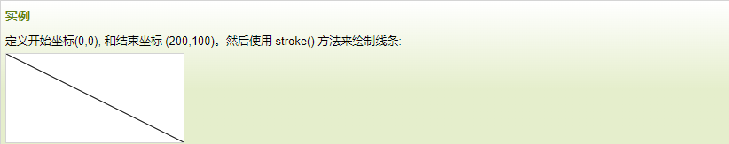

#### 画布文本

```javascript
var c=document.getElementById("myCanvas");
var ctx=c.getContext("2d");
ctx.font="30px Arial";
ctx.fillText("Hello World",10,50);
```

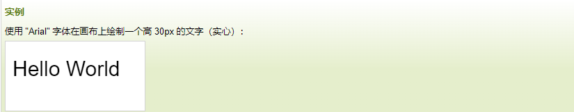

#### 画布图像

```javascript
var c=document.getElementById("myCanvas");
var ctx=c.getContext("2d");
var img=document.getElementById("scream");
ctx.drawImage(img,10,10);
```

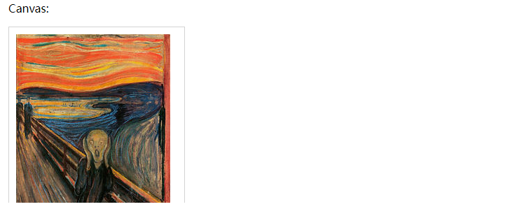

### 2、SVG

> 可伸缩矢量图形 (Scalable Vector Graphics)
> 放大缩小无损失

```html
<!DOCTYPE html>
<html>
<body>

<svg xmlns="http://www.w3.org/2000/svg" version="1.1">
   <circle cx="100" cy="50" r="40" stroke="black" stroke-width="2" fill="red" />
</svg> 
 
</body>
</html>
```

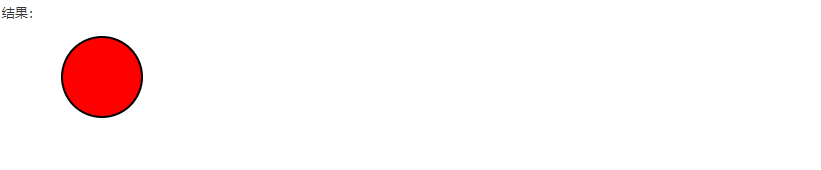

#### SVG & Canvas区别

| Canvas                                             | SVG                                                     |
| -------------------------------------------------- | ------------------------------------------------------- |
| 依赖分辨率                                         | 不依赖分辨率                                            |
| 不支持事件处理器                                   | 支持事件处理器                                          |
| 弱的文本渲染能力                                   | 适合带有大型渲染区域的应用程序（比如谷歌地图）          |
| 能够以 .png 或 .jpg 格式保存结果图像               | 复杂度高会减慢渲染速度（任何过度使用 DOM 的应用都不快） |
| 最适合图像密集型的游戏，其中的许多对象会被频繁重绘 | 不适合游戏应用                                          |


### 3、地理定位getCurrentPosition() 

> 返回对象，属性如下

| 属性                    | 描述                   |
| :---------------------- | :--------------------- |
| coords.latitude         | 十进制数的纬度         |
| coords.longitude        | 十进制数的经度         |
| coords.accuracy         | 位置精度               |
| coords.altitude         | 海拔，海平面以上以米计 |
| coords.altitudeAccuracy | 位置的海拔精度         |
| coords.heading          | 方向，从正北开始以度计 |
| coords.speed            | 速度，以米/每秒计      |
| timestamp               | 响应的日期/时间        |

```html
<!DOCTYPE html>
<html>
<head> 
<meta charset="utf-8"> 
<title>菜鸟教程(runoob.com)</title> 
</head>
<body>
<p id="demo">点击按钮获取您当前坐标（可能需要比较长的时间获取）：</p>
<button onclick="getLocation()">点我</button>
<script>
var x=document.getElementById("demo");
function getLocation()
{
	if (navigator.geolocation)
	{
		navigator.geolocation.watchPosition(showPosition);
	}
	else
	{
		x.innerHTML="该浏览器不支持获取地理位置。";
	}
}
function showPosition(position)
{
	x.innerHTML="纬度: " + position.coords.latitude + 
	"<br>经度: " + position.coords.longitude;	
}
</script>
</body>
</html>
```

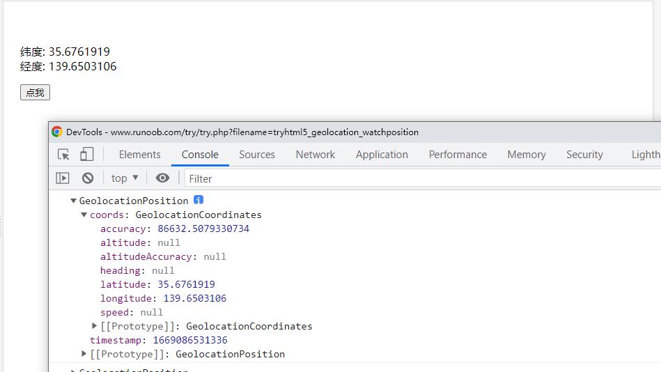


### 4、Video

> width  height 控制视频的尺寸
>
> video标签内插入的内容是 提供给不支持video标签的浏览器显示的

注意：设置视频自动播放，需要设置静音

```html
<div class="video">
   <video autoplay="" muted loop playsinline >
      Your browser does not support the video tag.
      <source src="/src/assets/home.mp4" type="video/mp4">
   </video>
</div>
```

补：gitee静态页面视频格式需要avi，mp4不支持


### 5、音频

> control属性供添加播放、暂停和音量控件
>

```html
<audio controls>
  <source src="horse.ogg" type="audio/ogg">
  <source src="horse.mp3" type="audio/mpeg">
您的浏览器不支持 audio 元素。
</audio>
```


### 6、Input新增类型

##### color类型

> 主要用于选取颜色

```html
<!DOCTYPE html>
<html>
<head> 
<meta charset="utf-8"> 
<title>菜鸟教程(runoob.com)</title> 
</head>
<body>

<form action="demo-form.php">
  选择你喜欢的颜色: <input type="color" name="favcolor"><br>
  <input type="submit">
</form>

</body>
</html>
```

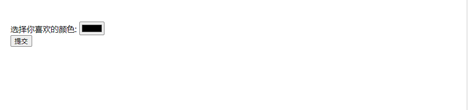

##### date类型

> 允许从日期选择器中选择日期

```html
<!DOCTYPE html>
<html>
<head> 
<meta charset="utf-8"> 
<title>菜鸟教程(runoob.com)</title> 
</head>
<body>

<form action="demo-form.php">
  生日: <input type="date" name="bday">
  <input type="submit">
</form>

</body>
</html>
```

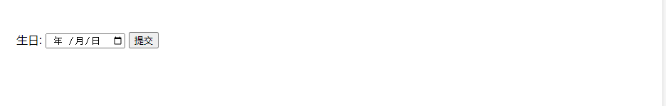

##### datetime-local类型

> 选择一个日期和对应的时间

```html
<!DOCTYPE html>
<html>
<head> 
<meta charset="utf-8"> 
<title>菜鸟教程(runoob.com)</title> 
</head>
<body>

<form action="demo-form.php">
  生日 (日期和时间): <input type="datetime-local" name="bdaytime">
  <input type="submit">
</form>

</body>
</html>
```

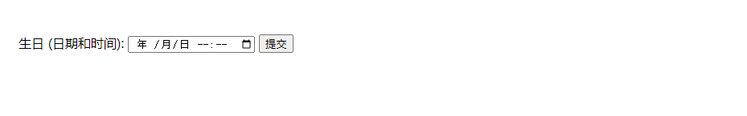

##### number类型

> 用于应该包含数值的输入域。

```html
<!DOCTYPE html>
<html>
<head> 
<meta charset="utf-8"> 
<title>菜鸟教程(runoob.com)</title> 
</head>
<body>

<form action="demo-form.php">
  数量 ( 1 到 5 之间): <input type="number" name="quantity" min="1" max="5">
  <input type="submit">
</form>

<p><b>注意:</b>Internet Explorer 9 及更早 IE 版本不支持 type="number" 。</p>

</body>
</html>
```

| disabled  | 规定输入字段是禁用的       |
| --------- | -------------------------- |
| max       | 规定允许的最大值           |
| maxlength | 规定输入字段的最大字符长度 |
| min       | 规定允许的最小值           |
| pattern   | 规定用于验证输入字段的模式 |
| readonly  | 规定输入字段的值无法修改   |
| required  | 规定输入字段的值是必需的   |
| size      | 规定输入字段中的可见字符数 |
| step      | 规定输入字段的合法数字间隔 |
| value     | 规定输入字段的默认值       |


##### range类型

> range类型用于应该包含一定范围内数字值的输入域，显示为滑动条。

```html
<!DOCTYPE html>
<html>
<head> 
<meta charset="utf-8"> 
<title>菜鸟教程(runoob.com)</title> 
</head>
<body>

<form action="demo-form.php" method="get">
Points: <input type="range" name="points" min="1" max="10">
<input type="submit">
</form>

<p><b>注意:</b> Internet Explorer 9 及更早 IE 版本不支持 type="range"。</p>

</body>
</html>
```

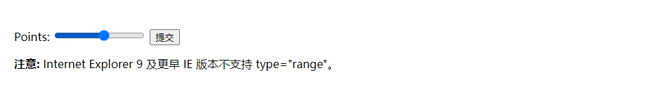

### 7、语义元素

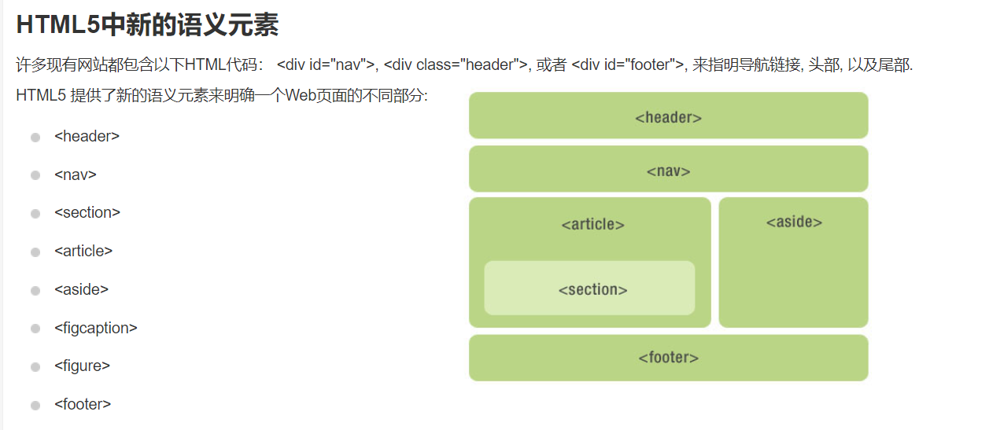

注：让这些块及元素在所有版本的浏览器中生效，需要在样式表文件中设置一下属性

```css
header, section, footer, aside, nav, article, figure
{
    display: block;
}
```

### 8、Web 存储

#### localStorage

> 用于长久保存整个网站的数据，保存的数据没有过期时间，直到手动去除。

```javascript
// 存储
localStorage.setItem("sitename", "菜鸟教程");
 
// 查找
document.getElementById("result").innerHTML = "网站名：" +  localStorage.getItem("sitename");

//移除
localStorage.removeItem("sitename");

```

| 常用操作          | API                              |
| ----------------- | -------------------------------- |
| 保存数据          | localStorage.setItem(key,value); |
| 读取数据          | localStorage.getItem(key);       |
| 删除单个数据      | localStorage.removeItem(key);    |
| 删除所有数据      | localStorage.clear();            |
| 得到某个索引的key | localStorage.key(index);         |

#### sessionStorage

> 临时保存同一窗口(或标签页)的数据，关闭网页或标签会删除这些数据

#### JSON.stringify & JSON.parse

> JSON.stringify 将对象转为字符串
>
> JSON.parse 将字符串转为对象

```html
<!DOCTYPE html>
<html>  
<head>  
    <meta charset="utf-8">  
    <title>HTML5本地存储之Web Storage篇</title>  
</head>  
<body>  
    <div style="border: 2px dashed #ccc;width:320px;text-align:center;">
        <label for="keyname">别名(key):</label>  
        <input type="text" id="keyname" name="keyname" class="text"/>  
        <br/>  
        <label for="sitename">网站名：</label>  
        <input type="text" id="sitename" name="sitename" class="text"/>  
        <br/>  
        <label for="siteurl">网 址：</label>  
        <input type="text" id="siteurl" name="siteurl"/>  
        <br/>  
        <input type="button" onclick="save()" value="新增记录"/>  
        <hr/>  
        <label for="search_phone">输入别名(key)：</label>  
        <input type="text" id="search_site" name="search_site"/>  
        <input type="button" onclick="find()" value="查找网站"/>  
        <p id="find_result"><br/></p>  
    </div>  
    <br/>  
    <div id="list">  
    </div>  
    <script>
    //保存数据  
    function save(){  
        var site = new Object;
        site.keyname = document.getElementById("keyname").value;
        site.sitename = document.getElementById("sitename").value;  
        site.siteurl = document.getElementById("siteurl").value;
        var str = JSON.stringify(site); // 将对象转换为字符串
        localStorage.setItem(site.keyname,str);  
        alert("保存成功");
    }  
    //查找数据  
    function find(){  
        var search_site = document.getElementById("search_site").value;  
        var str = localStorage.getItem(search_site);  
        var find_result = document.getElementById("find_result");
        var site = JSON.parse(str);  
		console.log(site)
        find_result.innerHTML = search_site + "的网站名是：" + site.sitename + "，网址是：" + site.siteurl;  
    	loadAll()
	}  
    
    //将所有存储在localStorage中的对象提取出来，并展现到界面上
	// 确保存储的 keyname 对应的值为转换对象，否则JSON.parse会报错
    function loadAll(){  
        var list = document.getElementById("list");  
        if(localStorage.length>0){  
            var result = "<table border='1'>";  
            result += "<tr><td>别名</td><td>网站名</td><td>网址</td></tr>";  
            for(var i=0;i<localStorage.length;i++){ 
                var keyname = localStorage.key(i);  
                var str = localStorage.getItem(keyname);  
                var site = JSON.parse(str);  
                result += "<tr><td>"+site.keyname+"</td><td>"+site.sitename+"</td><td>"+site.siteurl+"</td></tr>";  
            }  
            result += "</table>";  
            list.innerHTML = result;  
        }else{  
            list.innerHTML = "数据为空...";  
        }  
    }  
    </script>
</body>  
</html>
```

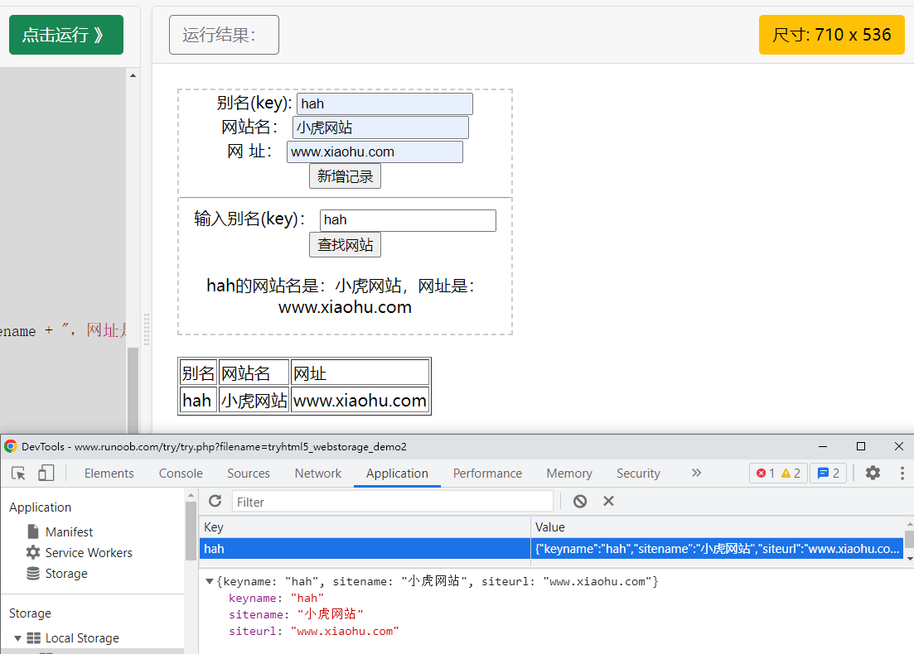
