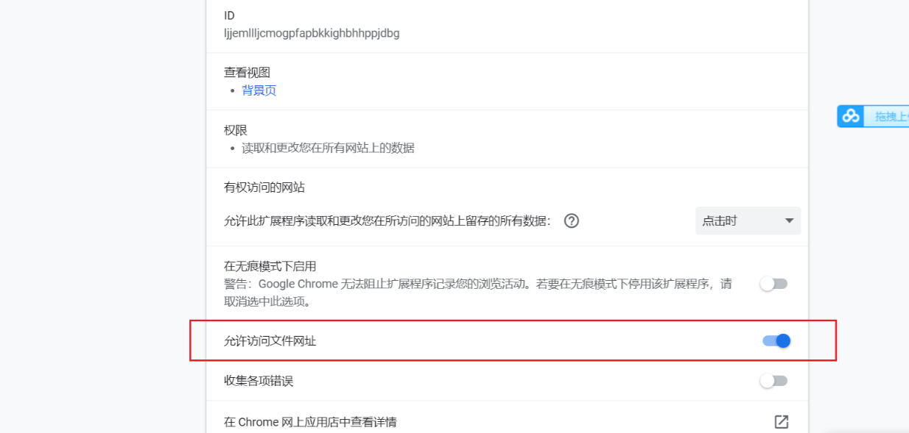
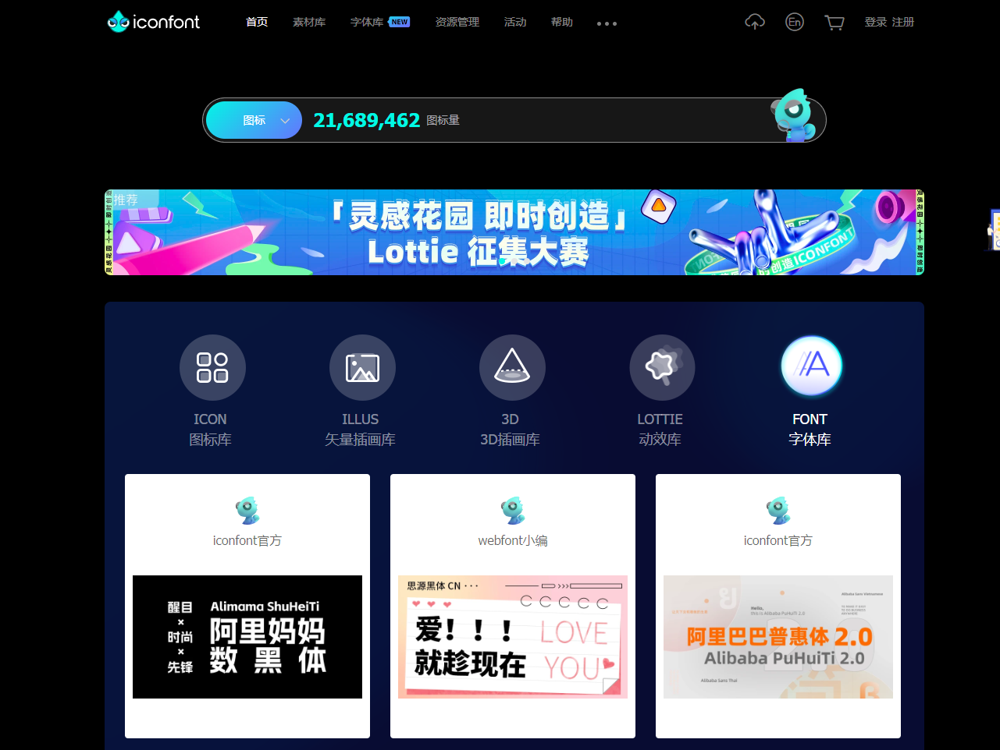

# Vite

```css
//APP组件填充整个页面
*{  margin: 0;  padding: 0;}html,body,#app {  height: 100%;  width: 100%;}
```


Vite + Vue3搭建的项目，如果无法显示Chrome插件devtools，可尝试将允许访问文件网址打开即可




## VUE3.0 + VITE + Svg(阿里云图标)

### 一、下载需要的阿里云图标 `svg文件类型`

https://www.iconfont.cn/home/index?spm=a313x.7781069.1998910419.3 



### 二、安装依赖并使用

#### 1、安装依赖

```
yarn add vite-plugin-svg-icons -D
```

#### 2、配置Vite.config.ts

```typescript
import { defineConfig } from 'vite'
import vue from '@vitejs/plugin-vue'
//主要配置以下这两行
import path from 'path'
import { createSvgIconsPlugin } from 'vite-plugin-svg-icons'

// https://vitejs.dev/config/
export default defineConfig({
  plugins: [
    //主要配置 createSvgIconsPlugin方法参数对象
    createSvgIconsPlugin({
      // Specify the icon folder to be cached
      iconDirs: [path.resolve(process.cwd(), 'src/assets')],
      // Specify symbolId format
      symbolId: 'icon-[dir]-[name]',
    }),
    vue(),
  ]
})

```

#### 3、配置main.ts

```typescript
import { createApp } from 'vue'
import App from './App.vue'
import ElementPlus from 'element-plus'
import 'element-plus/dist/index.css'
import * as ElementPlusIconsVue from '@element-plus/icons-vue'
//导入依赖ElementPlusIconsVue
import 'virtual:svg-icons-register'

const app = createApp(App)
//配置组件使用
for (const [key, component] of Object.entries(ElementPlusIconsVue)) {
  app.component(key, component)
}
app.use(ElementPlus)
app.mount('#app')

```

#### 4、配置svg使用模板

路径：`/src/components/svgIcon/SvgIcon.vue`

```vue
<template>
  <svg aria-hidden="true">
    <use :href="symbolId" :fill="color" />
  </svg>
</template>

<script>
import { defineComponent, computed } from 'vue'

export default defineComponent({
  name: 'SvgIcon',
  props: {
    prefix: {
      type: String,
      default: 'icon',
    },
    name: {
      type: String,
      required: true,
    },
    color: {
      type: String,
      default: '#333',
    },
  },
  setup(props) {
    const symbolId = computed(() => `#${props.prefix}-${props.name}`)
    return { symbolId }
  },
})
</script>

```

#### 5、icons 文件目录结构

```shell
# src/assets

- github.svg
- twitter.svg
- youtube.svg
```

#### 6、组件使用svg

```vue
<SvgIcon name="github" style="width: 20px;height: 20px;"></SvgIcon>
<SvgIcon name="twitter" style="width: 20px;height: 20px; margin-left: 15px;"></SvgIcon>
<SvgIcon name="youtube" style="width: 20px;height: 20px; margin-left: 15px;"></SvgIcon>
<script>
import SvgIcon from "../svgIcon/SvgIcon.vue";

export default {
  name: "AboutUsTwo",
  components:{
    SvgIcon
  }
}
</script>
```

#### 7、Svg文件更改颜色 (可选项)

```shell
#将对应形状的标签内添加fill属性参数即可  如下path 标签内部添加fill='#fff'即可

<?xml version="1.0" standalone="no"?><!DOCTYPE svg PUBLIC "-//W3C//DTD SVG 1.1//EN" "http://www.w3.org/Graphics/SVG/1.1/DTD/svg11.dtd"><svg t="1663988144591" class="icon" viewBox="0 0 1027 1024" version="1.1" xmlns="http://www.w3.org/2000/svg" p-id="2682" xmlns:xlink="http://www.w3.org/1999/xlink" width="200.5859375" height="200"><path fill="#fff" d="M1025.1264 98.7136C992.1536 145.5104 957.5424 181.9648 921.1904 207.872l0 26.0096c0 152.4736-54.1696 290.2016-162.4064 413.2864C650.4448 770.2528 505.344 831.6928 323.3792 831.6928c-117.8624 0-225.28-31.232-322.2528-93.5936 10.3424 1.7408 26.8288 2.56 49.3568 2.56 97.0752 0 184.5248-30.3104 262.4512-90.9312-45.056-1.6384-85.8112-15.9744-122.1632-42.9056C154.4192 579.9936 129.3312 545.792 115.5072 504.2176c17.3056 3.4816 30.3104 5.2224 39.0144 5.2224 19.0464 0 38.0928-2.56 57.1392-7.7824C163.1232 492.9536 122.88 469.0944 90.8288 430.08c-32.0512-39.0144-48.128-83.5584-48.128-133.8368L42.7008 291.1232C77.312 310.1696 108.544 319.6928 136.2944 319.6928 75.6736 278.1184 45.2608 219.2384 45.2608 142.9504c0-39.8336 8.704-74.4448 26.0096-103.936 112.64 136.9088 257.3312 209.6128 434.0736 218.3168C501.8624 236.544 500.1216 220.8768 500.1216 210.5344c0-58.88 20.3776-108.7488 61.0304-149.4016C601.9072 20.3776 651.776 0 710.656 0c62.3616 0 113.4592 21.7088 153.2928 64.9216C912.4864 54.5792 956.7232 38.0928 996.5568 15.5648 980.8896 65.8432 950.5792 103.936 905.5232 129.9456 945.4592 124.7232 985.2928 114.3808 1025.1264 98.7136z" p-id="2683"></path></svg>

```

