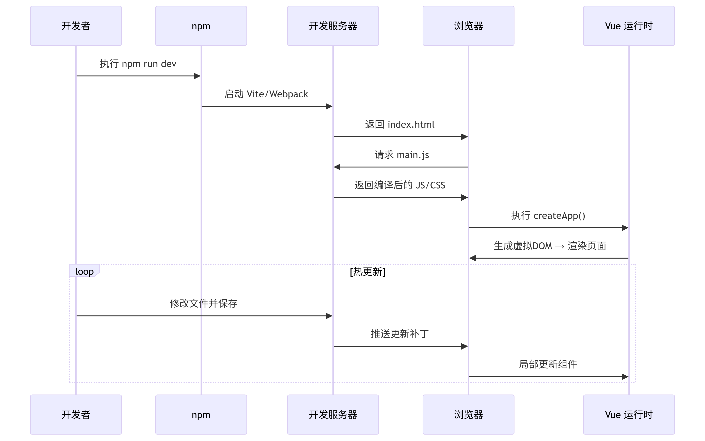

# Vite 项目启动

###  1、**命令解析与脚本触发**

- **`npm run dev` 的执行**

  - 查找 `package.json` 中的 `scripts.dev` 字段，通常指向 `vite` 或 `webpack-dev-server`。

    ```
    "scripts": {
      "dev": "vite",  // 或 "vue-cli-service serve"
    }
    ```


### 2、启动Vite开发服务器

初始化Vite：读取vite.config.ts，如配置 端口服务等

文件编译：实时编译入口vue文件编译为js 和 css


### 3、加载入口文件

开发服务器返回index.html文件，并注入模块脚本，请求main.ts文件

创建Vue实例并挂载到DOM节点（当然内部有子模块的解析 和 虚拟DOM生成过程）


