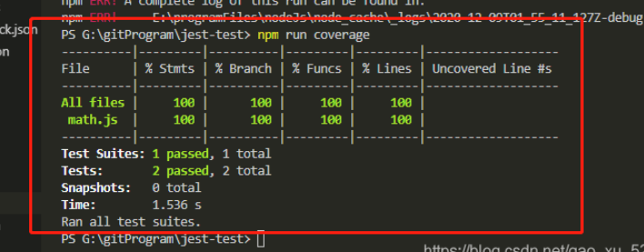

# 项目结构

## 一、.eslintrc & .eslintignore

### .eslintrc

> 该文件同package.json中添加eslintConfig属性相同

```shell
module.exports = {
    "root": true,
    "env": {
      "node": true
    },
    "extends": [
      "plugin:vue/essential",   #启用 vue 的基础规则
      "eslint:recommended"    #启用 eslint 的推荐规则
    ],
    "parserOptions": {
      "parser": "babel-eslint"  #可对全部有效的babel代码进行lint处理。
    },
    "rules": {}
  }

```

### .eslintignore

> `.eslintignore` 文件是个纯文本文件，其中的每一行都是一个 glob 模式表明哪些路径应该忽略检测。

```shell
/hello/*    // 开头有“/”，匹配相对于`.gitignore`文件本身的目录级别的。
hello/      // 结尾“/”， 匹配任意级别的hello目录下的所有目录（不包含文件）
hello.*     // 匹配以hello.开头的文件或者文件夹
hello/*     // 匹配hello目录下的所有目录和文件
!/foo/bar   // 排除目录 foo/bar 之外的所有内容
**/foo      // 前导 " `**`"，在所有目录中匹配， 与foo相同
foo/**      // 尾随的“ `/**`”匹配里面的所有内容。匹配目录“ `foo`”下的所有文件

例如：想忽略src下面的所有目录和文件，但除去src/views/hello目录。
 
 src/*              // 排除src目录下面所有的
 !src/views/        // src/views下面所有的目录重新被包含回来
 src/views/*        // 排除 src/views下面所有的目录
 !src/views/hello/  // src/views/hello下面所有的目录重新被包含回来
```

demo

```

*.sh
node_modules
*.md
*.woff
*.ttf
.vscode
.idea
dist
/public
/docs
.husky
.local
/bin
Dockerfile

```


## 二、prettier.config.js & .prettierignore

### prettier.config.js

> prettier依赖的文件格式化标准

```javascript
module.exports = {
  printWidth: 150,
  tabWidth: 2,
  useTabs: false,
  semi: true, //语句末尾使用分号
  vueIndentScriptAndStyle: true,
  singleQuote: true, // 使用单引号
  quoteProps: 'as-needed',
  bracketSpacing: true,
  trailingComma: 'es5',
  jsxBracketSameLine: false,
  jsxSingleQuote: false,
  arrowParens: 'always',
  insertPragma: false,
  requirePragma: false,
  proseWrap: 'never',
  htmlWhitespaceSensitivity: 'strict',
  endOfLine: 'auto',
  rangeStart: 0,
};

```

### .prettierignore

> 不需要被格式化的代码

```
/dist/*
.local
.output.js
/node_modules/**

**/*.svg
**/*.sh

/public/*

```

## 三、stylelint.config.js & .stylelintignore

### stylelint.config.js

> 样式校验

```javascript
module.exports = {
  root: true,
  plugins: ['stylelint-order'],
  // scss项目在extends中加入'stylelint-scss'插件
  extends: ['stylelint-config-standard', 'stylelint-config-rational-order'],
  overrides: [
    {
      files: ["**/*.{html,vue}"],
      customSyntax: "postcss-html"
    },
    {
      files: ["**/*.less"],
      customSyntax: "postcss-less"
    },
  ],
  rules: { // 覆盖stylelint-config-standard的配置 null为禁用规则
    'function-url-quotes': null, // 设置url(路径可不加引号)
    'selector-class-pattern': null, // 设置类名选择器不遵循 kebab-case
    'no-descending-specificity': null, //设置允许低优先级的选择器出现在高优先级的选择器之后
    'no-empty-source': null, // 允许文件内容为空
    'font-family-no-missing-generic-family-keyword': null // 设置允许定义非"generic-family"风格字体
      //  'order/properties-order': []    // 设置css属性书写顺序，会覆盖stylelint-config-rational-order
  }
}

```

### .stylelintignore

> 忽略不需要打包的样式库

```
/dist/*
/public/*
public/*

```

## 四、.yarnclean

> 用于自动（永久）清除不需要的依赖包

```shell
# test directories
__tests__
test
tests
powered-test

# asset directories
docs
doc
website
images
assets

# examples
example
examples

# code coverage directories
coverage
.nyc_output

# build scripts
Makefile
Gulpfile.js
Gruntfile.js

# configs
appveyor.yml
circle.yml
codeship-services.yml
codeship-steps.yml
wercker.yml
.tern-project
.gitattributes
.editorconfig
.*ignore
.eslintrc
.jshintrc
.flowconfig
.documentup.json
.yarn-metadata.json
.travis.yml

# misc
*.md

!istanbul-reports/lib/html/assets
!istanbul-api/node_modules/istanbul-reports/lib/html/assets

```

## 五、commitlint.config.js

> `husky`：简单认为一个在提交代码的时候进行格式校验的工具，git提交之前是提供了一些步骤供我们选择和拦截的,husky就是进行了gitcommit阶段进行拦截提交规范的一个工具,他结合`commitlint`可以对我们代码提交进行一个格式校验,保证我们代码提交的规范性和统一性,为后面的代码管理提供帮助!

```javascript
module.exports = {
  ignores: [(commit) => commit.includes('init')],
  extends: ['@commitlint/config-conventional'],
  rules: {
    'body-leading-blank': [2, 'always'],
    'footer-leading-blank': [1, 'always'],
    'header-max-length': [2, 'always', 108],
    'subject-empty': [2, 'never'],
    'type-empty': [2, 'never'],
    'type-enum': [
      2,
      'always',
      [
        'feat',
        'fix',
        'perf',
        'style',
        'docs',
        'test',
        'refactor',
        'build',
        'ci',
        'chore',
        'revert',
        'wip',
        'workflow',
        'types',
        'release',
      ],
    ],
  },
};

```

## 六、jest.config.mjs

> 自动化测试代码：上线之前对它进行测试，而这些测试不是人肉的去点击，而是通过已经写好的代码去运行

```javascript
export default {
  preset: 'ts-jest',
  roots: ['<rootDir>/tests/'],
  clearMocks: true,
  moduleDirectories: ['node_modules', 'src'],
  moduleFileExtensions: ['js', 'ts', 'vue', 'tsx', 'jsx', 'json', 'node'],
  modulePaths: ['<rootDir>/src', '<rootDir>/node_modules'],
  testMatch: [
    '**/tests/**/*.[jt]s?(x)',
    '**/?(*.)+(spec|test).[tj]s?(x)',
    '(/__tests__/.*|(\\.|/)(test|spec))\\.(js|ts)$',
  ],
  testPathIgnorePatterns: [
    '<rootDir>/tests/server/',
    '<rootDir>/tests/__mocks__/',
    '/node_modules/',
  ],
  transform: {
    '^.+\\.tsx?$': 'ts-jest',
  },
  transformIgnorePatterns: ['<rootDir>/tests/__mocks__/', '/node_modules/'],
  // A map from regular expressions to module names that allow to stub out resources with a single module
  moduleNameMapper: {
    '\\.(vs|fs|vert|frag|glsl|jpg|jpeg|png|gif|eot|otf|webp|svg|ttf|woff|woff2|mp4|webm|wav|mp3|m4a|aac|oga)$':
      '<rootDir>/tests/__mocks__/fileMock.ts',
    '\\.(sass|s?css|less)$': '<rootDir>/tests/__mocks__/styleMock.ts',
    '\\?worker$': '<rootDir>/tests/__mocks__/workerMock.ts',
    '^/@/(.*)$': '<rootDir>/src/$1',
  },
  testEnvironment: 'jsdom',
  verbose: true,
  collectCoverage: false,
  coverageDirectory: 'coverage',   //自动化测试结果的报告目录
  collectCoverageFrom: ['src/**/*.{js,ts,vue}'],
  coveragePathIgnorePatterns: ['^.+\\.d\\.ts$'],
};

```



## 七、windicss

> css处理 &  移动端适配

```javascript
import { defineConfig } from 'vite-plugin-windicss';
import { primaryColor } from './build/config/themeConfig';

export default defineConfig({
  darkMode: 'class',
  plugins: [createEnterPlugin()],
  theme: {
    extend: {
      zIndex: {
        '-1': '-1',
      },
      colors: {
        primary: primaryColor,
      },
      screens: {
        sm: '576px',
        md: '768px',
        lg: '992px',
        xl: '1200px',
        '2xl': '1600px',
      },
    },
  },
});

/**
 * Used for animation when the element is displayed
 * @param maxOutput The larger the maxOutput output, the larger the generated css volume
 */
function createEnterPlugin(maxOutput = 8) {
  const createCss = (index: number, d = 'x') => {
    const upd = d.toUpperCase();
    return {
      [`*> .enter-${d}:nth-child(${index})`]: {
        transform: `translate${upd}(50px)`,
      },
      [`*> .-enter-${d}:nth-child(${index})`]: {
        transform: `translate${upd}(-50px)`,
      },
      [`* > .enter-${d}:nth-child(${index}),* > .-enter-${d}:nth-child(${index})`]: {
        'z-index': `${10 - index}`,
        opacity: '0',
        animation: `enter-${d}-animation 0.4s ease-in-out 0.3s`,
        'animation-fill-mode': 'forwards',
        'animation-delay': `${(index * 1) / 10}s`,
      },
    };
  };
  const handler = ({ addBase }) => {
    const addRawCss = {};
    for (let index = 1; index < maxOutput; index++) {
      Object.assign(addRawCss, {
        ...createCss(index, 'x'),
        ...createCss(index, 'y'),
      });
    }
    addBase({
      ...addRawCss,
      [`@keyframes enter-x-animation`]: {
        to: {
          opacity: '1',
          transform: 'translateX(0)',
        },
      },
      [`@keyframes enter-y-animation`]: {
        to: {
          opacity: '1',
          transform: 'translateY(0)',
        },
      },
    });
  };
  return { handler };
}

```

## 八、vite.config.ts & tsconfig.json

### vite.config.ts

```typescript
//全局配置Vite的插件、服务及别名
import type { UserConfig, ConfigEnv } from 'vite';
import pkg from './package.json';
import dayjs from 'dayjs';
import { loadEnv } from 'vite';
import { resolve } from 'path';
//require('vue-jeecg-plugs/packages/utils')
import { generateModifyVars } from './build/generate/generateModifyVars';
import { createProxy } from './build/vite/proxy';
import { wrapperEnv } from './build/utils';
import { createVitePlugins } from './build/vite/plugin';
import { OUTPUT_DIR } from './build/constant';

function pathResolve(dir: string) {
  return resolve(process.cwd(), '.', dir);
}

const { dependencies, devDependencies, name, version } = pkg;
const __APP_INFO__ = {
  pkg: { dependencies, devDependencies, name, version },
  lastBuildTime: dayjs().format('YYYY-MM-DD HH:mm:ss'),
};

export default ({ command, mode }: ConfigEnv): UserConfig => {
  const root = process.cwd();

  const env = loadEnv(mode, root);

  // The boolean type read by loadEnv is a string. This function can be converted to boolean type
  const viteEnv = wrapperEnv(env);

  const { VITE_PORT, VITE_PUBLIC_PATH, VITE_PROXY, VITE_DROP_CONSOLE } = viteEnv;

  const isBuild = command === 'build';

  return {
    base: VITE_PUBLIC_PATH,
    root,
    resolve: {
      alias: [
        {
          find: 'vue-i18n',
          replacement: 'vue-i18n/dist/vue-i18n.cjs.js',
        },
        // /@/xxxx => src/xxxx
        {
          find: /\/@\//,
          replacement: pathResolve('src') + '/',
        },
        // /#/xxxx => types/xxxx
        {
          find: /\/#\//,
          replacement: pathResolve('types') + '/',
        },
      ],
    },
    server: {
      // Listening on all local IPs
      host: true,
      https: false,
      port: VITE_PORT,
      // Load proxy configuration from .env
      proxy: createProxy(VITE_PROXY),
    },
    build: {
      minify: 'terser',
      // 进行压缩计算
      brotliSize: false,
      target: 'es2015',
      // 【VUEN-872】css编译兼容低版本chrome内核（例如360浏览器）
      cssTarget: 'chrome80',
      outDir: OUTPUT_DIR,
      terserOptions: {
        compress: {
          keep_infinity: true,
          // Used to delete console in production environment
          // 打包自动删除console
          drop_console: VITE_DROP_CONSOLE,
          drop_debugger: true,
        },
      },
      // Turning off brotliSize display can slightly reduce packaging time
      chunkSizeWarningLimit: 5000,
    },
    define: {
      // setting vue-i18-next
      // Suppress warning
      __INTLIFY_PROD_DEVTOOLS__: false,
      __APP_INFO__: JSON.stringify(__APP_INFO__),
    },
    css: {
      preprocessorOptions: {
        less: {
          modifyVars: generateModifyVars(),
          javascriptEnabled: true,
        },
      },
    },

    // The vite plugin used by the project. The quantity is large, so it is separately extracted and managed
    plugins: createVitePlugins(viteEnv, isBuild),

    optimizeDeps: {
      esbuildOptions: {
        target: 'es2020',
      },
      // @iconify/iconify: The dependency is dynamically and virtually loaded by @purge-icons/generated, so it needs to be specified explicitly
      include: [
        '@vue/runtime-core',
        '@vue/shared',
        '@iconify/iconify',
        'ant-design-vue/es/locale/zh_CN',
        'ant-design-vue/es/locale/en_US',
      ],
    },
  };
};

```

### tsconfig.json

```json
//用于typescript配置，如识别别名路径
```

