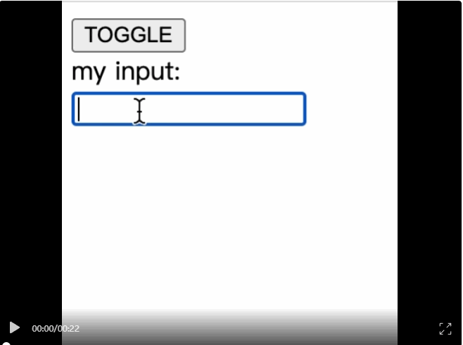
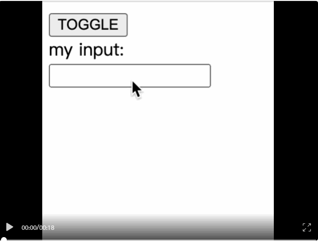

# KeepAlive

## 一、基本概念

Vue内置的抽象组件，缓存包裹的组件

- activated在组件被渲染到页面后调用
- deactivated在组件被从页面上移除后调用
- 符合include的会被缓存，exclude的不会被缓存
- max设置最大缓存实例数量

:bulb: 源码位置：src/core/components/keep-alive.js

## 二、使用场景

不使用keepalive，更新后重新创建新组件

```vue
<component :is="activeComponent" />
```



使用keepalive，使用缓存的组件

```vue
<KeepAlive>
  <component :is="activeComponent" />
</KeepAlive>
```




:bulb: include、exclude、max、activated、deactivated

符合include的会被缓存，exclude的不会被缓存

```vue
<KeepAlive include="MyInput,MyCounter">
  <component :is="activeComponent" />
</KeepAlive>

<keep-alive include="ComponentA, ComponentB" exclude="ComponentC">
  <router-view></router-view>
</keep-alive>

<KeepAlive :include="['MyInput', 'MyCounter']">
  <component :is="activeComponent" />
</KeepAlive>
```


max设置最大缓存实例数量

```vue
<KeepAlive :max="10">
  <component :is="activeComponent" />
</KeepAlive>
```


onActivated 和 onDeactivated

```typescript
import { onActivated, onDeactivated } from 'vue'

onActivated(() => { ... })
onDeactivated(() => { ... })
```

