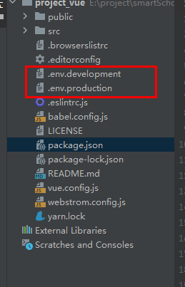

# service环境搭建

## 一、基本概念

- 可以根据不同模式加载不同的baseUrl地址，每一个模式可以创建一个与之对应的环境变量配置文件

  - 这三个文件在Vue根目录下创建

  


生产环境 `.env.production`

```
NODE_ENV = "development"
VUE_APP_BASE_URL = "http://192.168.3.161:8009"
#CDNURL CDN方式引入依赖包，本地部署一个静态资源CDN保障稳定性
VUE_APP_CDNURL = "http://192.168.3.230:7080"
#
VUE_APP_GEOURL = "http://192.168.3.161:8010"

```

开发环境`.env.development`

```
NODE_ENV = "production"
VUE_APP_BASE_URL = "http://124.70.78.39:8009"
VUE_APP_CDNURL = "http://124.70.78.39"
VUE_APP_GEOURL = "http://124.70.78.39:8010"

```

## 二、使用步骤

:bulb: 不同环境使用不同`VUE_APP_URL` ,将 axios封装文件 和 apiUrl文件单独存放

### 封装Axios

```javascript
import axios from 'axios'
import qs from 'qs'
import that from '@/main'   //相当于把Vue对象引过来,方便$message

//配置拦截器
axios.interceptors.request.use(config => {
  /*
  * 允许携带Token，解决跨域
  * */
  config.withCredentials = true
  return config
}, error => {
  return Promise.reject(error)
})

axios.interceptors.response.use(response => {
  return response.data
}, error => {
  return Promise.reject(error.response)
})

//配置axiosInterceptors对象类并导出（构造函数，对应axios封装）
export default class AxiosInterceptors {
  localhost = process.env.VUE_APP_BASE_URL

  constructor (url, params) {
    this.url = url
    this.params = params
  }

  /*
  * 处理后台返回的非200错误
  * */
  successfun (res) {
    if (res.code === 200) {
      return res.data
    } else {
      return res
    }
  }

  post () {
    return axios({
      method: 'post',
      baseURL: this.localhost,
      url: this.url,
      data: qs.stringify(this.params),
      withCredentials: true,
      timeout: 5000
    })
      .then(res => {
        if (res.code === 200) {
          return this.successfun(res)
        } else {
          that.$message('出错啦！')
          throw new Error(res.msg)
        }
      }, err => {
        that.$message('出错啦！')
        throw new Error(err.msg)
      })
  }

  get () {
    return axios({
      method: 'get',
      baseURL: this.localhost,
      url: this.url,
      params: this.params,
      withCredentials: true,
      timeout: 5000
    })
      .then(res => {
        if (res.code === 200) {
          return this.successfun(res)
        } else {
          that.$message('出错啦！')
          throw new Error(res.msg)
        }
      }, err => {
        that.$message('出错啦！')
        throw new Error(err.msg)
      })
  }

  getBIM () {
    return axios({
      method: 'get',
      baseURL: this.localhost,
      url: this.url,
      params: this.params,
      withCredentials: true,
      timeout: 5000
    })
      .then(res => {
        return this.successfun(res)
      }, err => {
        that.$message('出错啦！')
        throw new Error(err.msg)
      })
  }
}

```

AxiosApi.js

```javascript
export default {
  // 1、获取建筑物列表
  getBuildList: 'smartschool/build/getBuildList',
  // 2、获取建筑物geojson
  getBuildJSONList: 'smartschool/build/getBuildJSONList',
  // 3、获取单独建筑物geojson
  getBuildJSONListByOBJECTID: 'smartschool/build/getBuildJSONListByOBJECTID',
  // 4、导航
  getNavigationRoad: 'smartschool/build/getNavigationRoad',
  // 5、获取所有停车场
  getAllpark: 'smartschool/build/getAllpark',
  // 6、获取停车场详细信息
  getParkInfo: 'smartschool/build/getParkInfo',
  // 7、获取建筑物内部楼层房间
  getBuildFloor: 'smartschool/build/getBuildFloor',
  // 8、获取水面
  getWaterArea: 'smartschool/base/getWaterArea',
  // 9、获取飞行路线
  getFlightLine: 'smartschool/base/getFlightLine',
  // 10、获取教室列表
  getClassRoomList: 'smartschool/leftBar/getClassRoomList',
  // 11、获取教室课程表
  getCourseInformation: 'smartschool/leftBar/getCourseInformation',
  // 12、获取单独建筑物geojson，Cesium 点击
  getBuildJSONListByOBJECTIDCesium:'smartschool/cesium/getBuildJSONListByOBJECTIDCesium'
}

```

### 组件调用

```vue
<template>
  <div class="SideBar space-between">
   111
  </div>
</template>

<script>
import AxiosInterceptors from '@/config/AxiosInterceptors'
import AxiosAPI from '@/config/AxiosAPI'

let sideBarListCom = []

export default {
  name: 'SideBar',
  components: {
    vueScroll
  },
  data () {
    return {
      sideBarList: []
    }
  },
  created () {
  },
  mounted () {
  },
  methods: {
    methodOne(){
        new AxiosInterceptors(AxiosAPI.getBuildList).get().then(res => {
        	sideBarListCom = res
        	this.sideBarList = sideBarListCom
    	}
   }
    async methodTwo(BIMID){
          //加载本地文件  
          const result = await new 			    	                              AxiosInterceptors(`${process.env.VUE_APP_CDNURL}/smartschoolModule/bim/info/${BIMID}.json`).getBIM()
        }
  },
  computed: {
  }
}
</script>

<style lang="scss" scoped>
</style>

```

