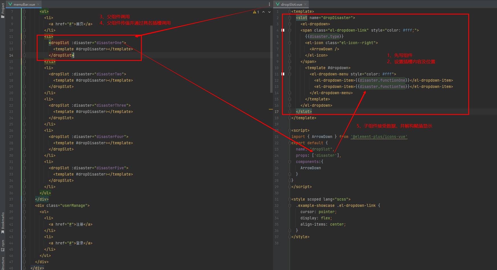

# VueSlot

> 创建`可替换内容` 的 `公共组件`
>

## 默认插槽

- 子组件用`<slot>`标签来确定渲染的位置
- 父组件在子组件的标签内写入内容即可

```html
<!-- Parent component -->
<child-component>
  <p>This is the content from the parent.</p>
</child-component>

<!-- Child component template -->
<div>
  <slot></slot>
</div>

```

父组件传递的p标签会替换子组件的slot标签

## 具名插槽

- 子组件用`name`属性来表示插槽的名字
- 父组件在插槽上`slot`属性，值为`name`

示例

```vue
<!-- Parent component -->
<child-component>
  <template v-slot:header>
    <h1>This is the header content.</h1>
  </template>
  <template v-slot:footer>
    <p>This is the footer content.</p>
  </template>
</child-component>

<!-- Child component template -->
<div>
  <header>
    <slot name="header"></slot>
  </header>
  <main>
    <slot></slot> <!-- 默认插槽 -->
  </main>
  <footer>
    <slot name="footer"></slot>
  </footer>
</div>

```

## 作用域插槽

父组件使用子组件提供的数据

- 子组件向外传递组件信息
- 父组件通过`v-slot:name = {xx}"`接收

```vue
<!-- Parent component -->
<template>
  <div>
    <ChildComponent>
      <template v-slot:header="{ title }">
        <h1>{{ title }}</h1>
      </template>
      <template v-slot:content="{ message }">
        <p>{{ message }}</p>
      </template>
    </ChildComponent>
  </div>
</template>

<!-- Child component template -->
<template>
  <div>
    <slot name="header" :title="title"></slot>
    <slot name="content" :message="message"></slot>
  </div>
</template>

```


其他示例



