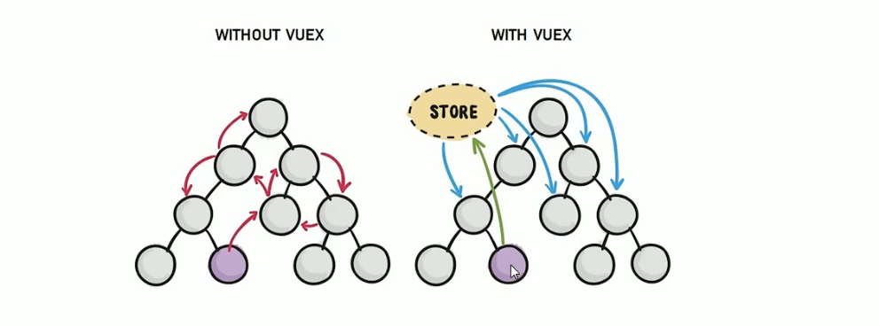

# 数据管理

## 一、父子组件及Bus

### 父子传值

#### v-bind & v-on

```javascript
<template>
  <div>
    我是子组件：
    <input type="text" :value="msg" @input="changeValFn" />
  </div>
</template>
<script>
export default {
  name: 'child',
  props: ['msg'],
  methods: {
    changeValFn(e) {
      this.$emit('changeMsg', e.target.value)
    },
  },
}
</script>
```

```javascript
<template>
  <div class="parent">
    <h1>我是父组件：{{ msg }}</h1>
    <child :msg="msg" @changeMsg="changeMsgFn"></child>
  </div>
</template>

<script>
import child from './child'
export default {
  name: 'parent',
  components: {
    child,
  },
  data() {
    return {
      msg: 'hello!',
    }
  },
  methods: {
    changeMsgFn(value) {
      this.msg = value
    },
  },
}
</script>
```

#### defineEmits

```javascript
//defineEmits 不需要引入
let emit = defineEmits(['renderGroupLayout','restoreDefaultLayout', 'showMaskBg'])

function xx(){emit('renderGroupLayout', localStorage.getItem('groupType') || 'courseType')}
```


### 祖孙

#### provide inject

```vue
<!-- 祖先组件 Parent.vue -->
<script setup>
import { ref, reactive, provide, readonly, computed } from 'vue'
import Child from './Child.vue'

// 1. 提供基本类型
const message = ref('Hello from Parent')
provide('message', message)

// 2. 提供响应式对象
const user = reactive({ name: 'John', age: 30 })
provide('user', readonly(user)) // 只读版本

// 3. 提供可修改的响应式对象
const config = reactive({ theme: 'dark', lang: 'zh-CN' })
provide('config', config)

// 4. 提供方法/函数
function updateUser(newName) {
  user.name = newName
}
provide('updateUser', updateUser)

// 5. 提供计算属性
const userInfo = computed(() => `${user.name} (${user.age})`)
provide('userInfo', userInfo)
</script>

<template>
  <div>
    <h2>父组件</h2>
    <p>消息: {{ message }}</p>
    <button @click="changeMessage">修改消息</button>
    <Child />
  </div>
</template>
```

```vue
<!-- 子孙组件 Child.vue -->
<script setup>
import { inject, onMounted } from 'vue'
import GrandChild from './GrandChild.vue'

// 1. 基本注入
const message = inject('message')
console.log('注入的消息:', message.value)

// 2. 注入对象
const user = inject('user')
const config = inject('config')

// 3. 注入函数
const updateUser = inject('updateUser')

// 4. 注入计算属性
const userInfo = inject('userInfo')

// 5. 带默认值
const notProvided = inject('notExist', '默认值')
</script>

<template>
  <div>
    <h3>子组件</h3>
    <p>消息: {{ message }}</p>
    <p>用户: {{ user?.name }}</p>
    <p>主题: {{ config?.theme }}</p>
    <p>计算属性: {{ userInfo }}</p>
    <button @click="updateUser?.('Alice')">更新用户</button>
    <button @click="changeConfig">切换主题</button>
    <GrandChild />
  </div>
</template>
```


### 事件总线传值

- 全局范围传递事件 和 数据，底层依赖发布/订阅者模式
- `bus.$emit`、  `bus.$on` 、`bus.$off`

```javascript
//创建事件总线
import Vue from 'vue';
export const EventBus = new Vue();

//子组件使用 ChildComponent.vue
<template>
  <button @click="sendData">Send Data</button>
</template>

<script>
import { EventBus } from './EventBus';

export default {
  methods: {
    sendData() {
      EventBus.$emit('customEvent', 'param1', 'param2', 'param3');
    }
  }
}
</script>

//父组件使用 ParentComponent.vue
<template>
  <div>Parent Component</div>
</template>

<script>
import { EventBus } from './EventBus';

export default {
  created() {
    EventBus.$on('customEvent', this.handleCustomEvent);
  },
  beforeDestroy() {
    EventBus.$off('customEvent', this.handleCustomEvent);
  },
  methods: {
    handleCustomEvent(param1, param2, param3) {
      console.log(param1, param2, param3);
    }
  }
}
</script>

```


## 二、Vuex使用步骤

> - Vuex是实现组件全局状态（数据）管理的一种机制，可以方便的实现组件之间数据的共享。
>   - 能够在vuex集中管理共享数据
>   - 能够实现组件间的数据共享
>   - 响应式，实时保证数据与页面的同步
> - 一般需要共享的数据存放到vuex中，不需要共享的存放到自身data
> - mutations专注修改State，actions异步请求再调用mutations修改State

### 1、安装依赖

```shell
npm install vuex@3.1.2
```

### 2、新建modules文件夹

- 根据不同需求创建不同的modules文件夹
  - 每个文件夹内部有对应这个modules的store存储

```javascript
//代码内容实例如下， 例如叫moduleA.js
export default {
    namespaced: true,  //带有命名空间的模块
    state: {
        count: 0
    },
    getters: {
        showNumber(state) {
            return '当前count值为' + state.count + ''
        }
    },
    mutations: {
        add(state) {
            state.count += 1
        },
        addN(state, step) {
            state.count += step
        },
        sub(state){
            state.count -= 1
        },
        subN(state, step) {
            state.count -= step
        }
    },
    actions: {
        addAsync(context,step) {
            setTimeout(() => {
                context.commit('addN', step)
            },1000)
        }
    }
}
```

### 3、新建store.js

```javascript
import Vue from 'vue'
import Vuex from 'vuex'

Vue.use(Vuex)

import moduleA from '路径地址'
import moduleB from '路径地址'

export default new Vuex.Store({
    modules: {
        moduleA,
        moduleB
    }
})
```

### 4、main.js挂载store对象

```javascript
import Vue from 'vue'
import store from 'store地址'

new Vue({
    el: '#app',
    render: h => h(app),
    router,
    store // 将共享数据对象挂载到Vue实例，所有组件就可从store获取全局数据了
})
```

### 5、Vue组件使用

#### 组件一

```vue
<template>
  <div id="app">
      <ComponentTwo></ComponentTwo>
      <hr/>
      <ComponentThree></ComponentThree>
  </div>
</template>

<script>
import ComponentTwo from './ComponentTwo'
import ComponentThree from './ComponentThree'
    
export default {
  name: 'ComponentOne',
  component: {
      ComponentTwo,
      ComponentThree
  }
}
</script>
```

#### 组件二

```vue
<template>
  <div>
      <h3>当前count值:{{count}}</h3>
      <h3>{{showNumber}}</h3>
      <button @click = "add()">+1</button>
      <button @click = "addN(3)">+N</button>
      <button @click = "addAsync(5)">+1</button>
  </div>
</template>

<script>
import { mapState, mapMutations, mapActions, mapGetters } from 'vuex'
    
export default {
  name: 'ComponentTwo',
  data () {
      selfVar: 'test',
      initNum: 1
  },
  computed: {
      //mapState('模块名称', ['模块变量']),因为模块有多个，所以mapState可写多个，mapGetters同样
      ...mapState('moduleA', ['count']),   
      ...mapGetters('moduleA',['showNumber']),
      selfCompu: function () {
          return initNum + 1
      }
  },
  methods: {
      //mapMutations('模块名称',['模块变量函数']),因为模块有多个，所以mapMutations可多个，mapActions同
      ...mapMutations('moduleA',['add', 'addN']),
      ...mapActions('moduleA',['addAsync']),
      selfFunc() {
          console.log("这里写组件自己的方法")
      }
  }
}
</script>
```

#### 组件三

```vue
<template>
  <div>
    <h3>当前count值: {{count}}</h3>
    <button @click = "btnSub">-1</button>
    <button @click = "btnSubN">-1</button>
  </div>
</template>

<script>
import { mapState, mapMutations } from 'vuex'
    
export default {
  name: 'ComponentThree',
  data () {
      selfVar: 'test'
  },
  computed: {
      ...mapState(['count'])
  },
  methods: {
      ...mapMutations(['sub', 'subN']),
      btnSub() {
          this.sub()
      },
      btnSubN() {
          this.subN(3)
      }
  }
}
</script>
```




## 三、pinia

> VueX的升级版，对接TS使用
>
> `依赖proxy实现对state的监听和修改`

### 1、安装依赖

yarn add pinia@2.0.23

### 2、main.ts

```typescript
import { createApp } from 'vue'
import './styles/base.css'
import './styles/index.css'
import App from './App.vue'
import { createPinia } from 'pinia'

createApp(App).use(createPinia()).mount('#app')
```


### 3、data.json & request.ts & 接口类型

#### data.json

```json
{
  "todos": [
    {
      "id": 0,
      "name": "吃饭",
      "done": false
    },
    {
      "id": 1,
      "name": "睡觉",
      "done": true
    },
    {
      "id": 2,
      "name": "写代码",
      "done": false
    }
  ]
}
```

#### request.ts

- 先安装依赖yarn add axios

```typescript
import axios from 'axios'
const request = axios.create({
  baseURL: 'http://localhost:8888/todos',
})

export default request
```

- 注：里面的baseURL可以根据开发环境 和 生产环境更换

.env.development

```
NODE_ENV = "development"
VUE_APP_BASE_URL = "http://192.168.3.161:8009"
VUE_APP_CDNURL = "http://192.168.3.230:7080"
VUE_APP_GEOURL = "http://192.168.3.161:8010"

```

.env.production

```
NODE_ENV = "production"
VUE_APP_BASE_URL = "http://124.70.78.39:8009"
VUE_APP_CDNURL = "http://124.70.78.39"
VUE_APP_GEOURL = "http://124.70.78.39:8010"

```

#### 接口类型

```typescript
export interface ITodoItem {
  id: number
  name: string
  done: boolean
}
```


### 4、store

#### 根store文件

```typescript
//根据不同的需求 写 不同的模块导入
import useMainStore from './modules/main'
import useFooterStore from './modules/footer'
/*
* o = {}是一个对象类型，然后通过:{} 来 指定该对象的内部键值对类型
* @[key: string] 表示索引键可有多个，每个索引键都是string类型
* @any 表示每个索引键对应的值类型可以是任何类型
*/
const o: { [key: string]: any } = {}
export default function useStore() {
  if (!o.main) o.main = useMainStore()
  if (!o.footer) o.footer = useFooterStore()
  return o
}
```

#### a模块

```typescript
import { defineStore } from 'pinia'
import { ITodoItem } from '../../types/data'   //引用接口类型
import request from '../../utils/request'
import footerStore from './footer'

const useMainStore = defineStore('main', {
  state: () => {
    return {
      list: [] as ITodoItem[],
    }
  },
  actions: {
    async getList() {
      const { data } = await request.get<ITodoItem[]>('/')
      this.list = data
    },
    async deleteTodo(id: number) {
      await request.delete(`/${id}`)
      this.getList()
    },
    async updateTodo(id: number, key: string, value: string | boolean) {
      await request.patch(`/${id}`, {
        [key]: value,
      })
      this.getList()
    },
    async addTodo(name: string) {
      await request.post('/', {
        name,
        done: false,
      })
      this.getList()
    },
    async updateAllDone(done: boolean) {
      //map 映射新数组
      const arrPromise = this.list.map((item) => {
        return request.patch(`/${item.id}`, {
          done,
        })
      })
      await Promise.all(arrPromise)
      this.getList()
    },
    // #2
    async clearCompleted() {
      const arrPromise = this.completed.map((item) => {
        return request.delete(`/${item.id}`)
      })
      await Promise.all(arrPromise)
      this.getList()
    },
  },
  getters: {
    mainRadioStatus(): boolean {
      return this.list.every((item) => item.done)
    },
    // #1
    completed(): ITodoItem[] {
      return this.list.filter((item) => item.done)
    },
    unCompleted(): ITodoItem[] {
      return this.list.filter((item) => !item.done)
    },
    renderList(): ITodoItem[] {
      const footer = footerStore()
      if (footer.active === 'Active') {
        return this.list.filter((item) => !item.done)
      } else if (footer.active === 'Completed') {
        return this.list.filter((item) => item.done)
      }
      return this.list
    },
  },
})

export default useMainStore
```

#### b模块

```typescript
import { defineStore } from 'pinia'

const useFooterStore = defineStore('footer', {
  state: () => {
    return {
      tabs: ['All', 'Active', 'Completed'],
      active: 'All',
    }
  },
  actions: {
    updateActive(active: string) {
      this.active = active
    },
  },
})

export default useFooterStore
```


### 5、组件使用

#### todoItem

```vue
<script setup lang="ts">
import useStore from '../store'
const { main } = useStore()
const { deleteTodo, updateTodo } = main
</script>
<template>
  <li
    :class="{
      completed: item.done,
      editing: isEditing,
    }"
  >
  </li>
</template>
```

