# ElementUI

## 一、安装

> https://element.eleme.cn/#/zh-CN/component/quickstart

## 二、使用

### 2.1 内置过渡动画

- fade

  - 用法：transition标签包裹需要显示隐藏的dom元素即可，过渡动画可设置name
  - el-fade-in-linear  &   el-fade-in

  ```vue
  <template>
    <div>
      <el-button @click="show = !show">Click Me</el-button>
  
      <div style="display: flex; margin-top: 20px; height: 100px;">
        <transition name="el-fade-in-linear">
          <div v-show="show" class="transition-box">.el-fade-in-linear</div>
        </transition>
        <transition name="el-fade-in">
          <div v-show="show" class="transition-box">.el-fade-in</div>
        </transition>
      </div>
    </div>
  </template>
  
  <script>
      export default {
      data: () => ({
        show: true
      })
    }
  </script>
  ```

- zoom

  - 用法：transition标签包裹需要显示隐藏的dom元素即可，过渡动画可设置name
  - el-zoom-in-center  &  el-zoom-in-top  &  el-zoom-in-bottom

  ```vue
  <template>
    <div>
      <el-button @click="show2 = !show2">Click Me</el-button>
  
      <div style="display: flex; margin-top: 20px; height: 100px;">
        <transition name="el-zoom-in-center">
          <div v-show="show2" class="transition-box">.el-zoom-in-center</div>
        </transition>
  
        <transition name="el-zoom-in-top">
          <div v-show="show2" class="transition-box">.el-zoom-in-top</div>
        </transition>
  
        <transition name="el-zoom-in-bottom">
          <div v-show="show2" class="transition-box">.el-zoom-in-bottom</div>
        </transition>
      </div>
    </div>
  </template>
  
  <script>
      export default {
      data: () => ({
        show2: true
      })
    }
  </script>
  ```

- collapse

  - 用法：el-collapse-transition标签包裹需要显示隐藏的dom元素即可
  - el-collapse-transition

  ```vue
  <template>
    <div>
      <el-button @click="show3 = !show3">Click Me</el-button>
  
      <div style="margin-top: 20px; height: 200px;">
        <el-collapse-transition>
          <div v-show="show3">
            <div class="transition-box">el-collapse-transition</div>
            <div class="transition-box">el-collapse-transition</div>
          </div>
        </el-collapse-transition>
      </div>
    </div>
  </template>
  
  <script>
      export default {
      data: () => ({
        show3: true
      })
    }
  </script>
  ```

### 2.2 基本组件

#### border 边框

- 圆角

```css
border-radius: 0px
```

#### icon

- 更改类名

```javascript
<i class="el-icon-delete"></i>
<el-button type="primary" icon="el-icon-search">搜索</el-button>
```

#### button

- 默认按钮 & 朴素按钮 & 圆角按钮

```vue
<el-button type="primary">主要按钮</el-button>
<el-button type="primary" plain>主要按钮</el-button>
<el-button type="primary" round>主要按钮</el-button>
```

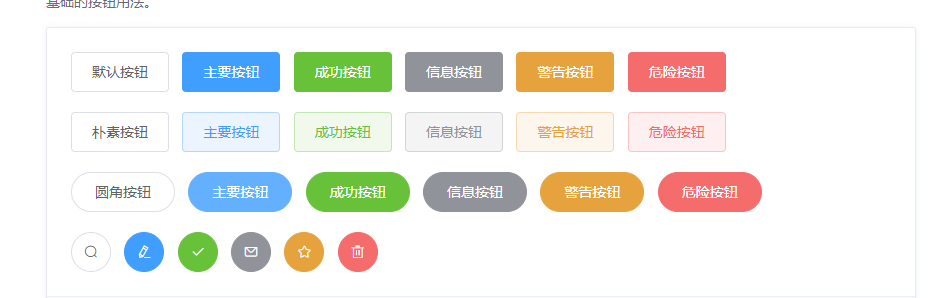

- 禁用按钮 、文字按钮、图标按钮、按钮组
  - size大小可自定义：medium / small / mini

```vue
//禁用按钮
<el-button type="primary" disabled>主要按钮</el-button>

//文字按钮
<el-button type="text">文字按钮</el-button>
<el-button type="text" disabled>文字按钮</el-button>

//图标按钮
<el-button type="primary" icon="el-icon-search">搜索</el-button>
<el-button type="primary">上传<i class="el-icon-upload el-icon--right"></i></el-button>

//按钮组   使用<el-button-group>标签来嵌套需要的按钮即可。
<el-button-group>
  <el-button type="primary" icon="el-icon-arrow-left">上一页</el-button>
  <el-button type="primary">下一页<i class="el-icon-arrow-right el-icon--right"></i></el-button>
</el-button-group>
```

- link文字链接

```vue
<el-link 
    type="success"
    href="https://element.eleme.io"
    icon="el-icon-edit"
>成功链接</el-link>
```

### 2.3 Form组件

#### Radio

- 单选框组（只能选择组中其一） 默认为el-radio

```vue
<template>
  <el-radio-group v-model="radio">
    <el-radio :label="3">备选项</el-radio>
    <el-radio :label="6">备选项</el-radio>
    <el-radio :label="9">备选项</el-radio>
  </el-radio-group>
</template>
```

- 方形按钮框单选  只需要把el-radio元素换成el-radio-button元素即可

```vue
<el-radio-group v-model="radio1">
    <el-radio-button label="上海"></el-radio-button>
    <el-radio-button label="北京"></el-radio-button>
    <el-radio-button label="广州"></el-radio-button>
    <el-radio-button label="深圳"></el-radio-button>
</el-radio-group>
```

- 带有边框的单选 设置border即可

```vue
<el-radio v-model="radio1" label="1" border>备选项1</el-radio>
```

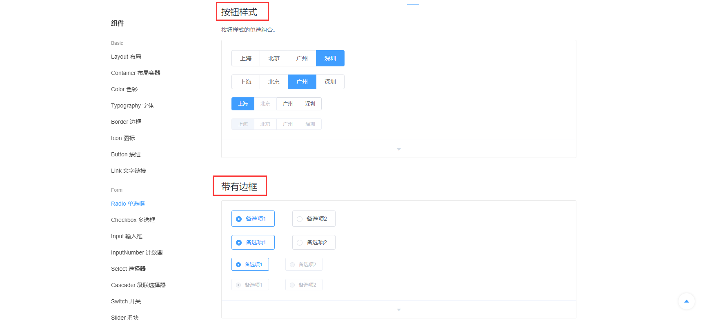

#### checkbox 多选框

#### inputNumber 计算器 

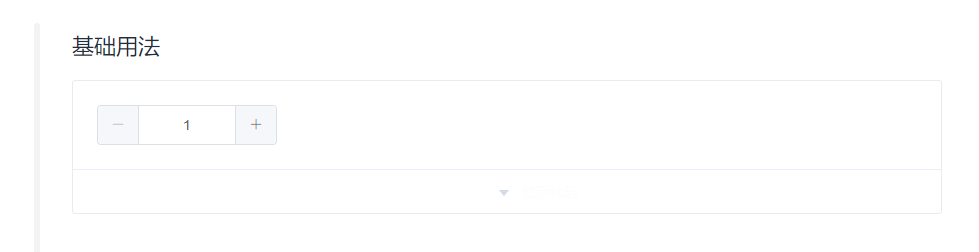

#### select选择器  

- 下拉按钮，疫情和毕设都用到了

#### cascader级联选择器 

- （数据集和有层级结构，通过级联选择器查看并选择）

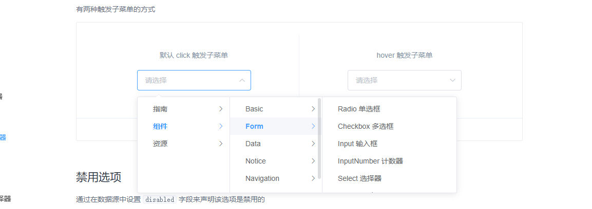

#### switch开关

- 表示状态间的切换

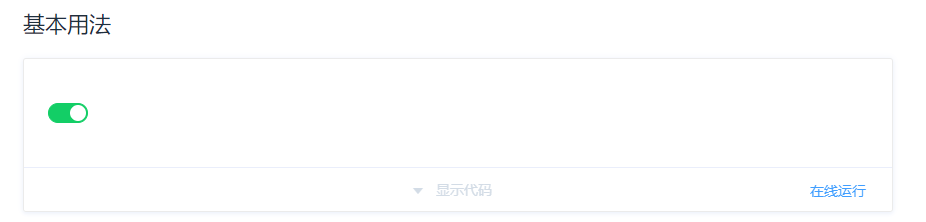

#### slider滑块

- 在一个区间内拖动滑块

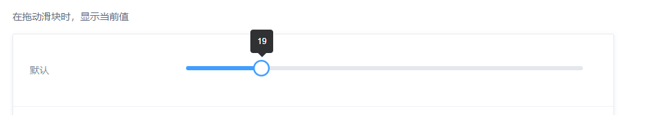

#### dataTimePicker 日期时间选择器

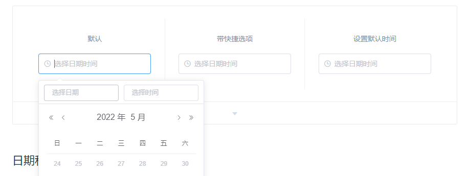

#### upload上传

- 通过点击或者拖拽上传

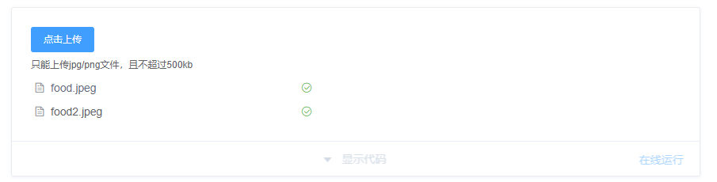

#### rate评分

- 评分组件

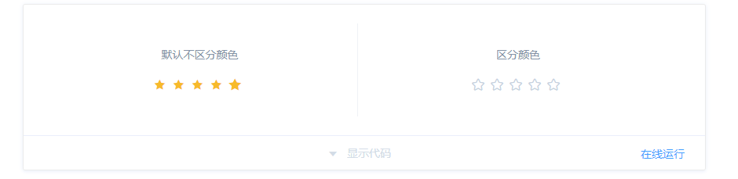

#### colorPicker颜色选择器

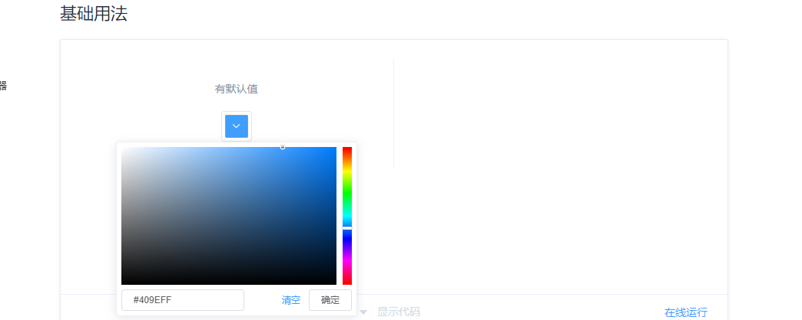

#### transfer穿梭框

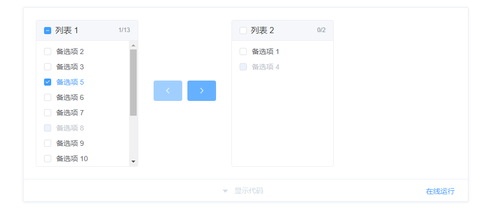

### 2.4 Data组件

#### tag标签

- 用于标记和选择

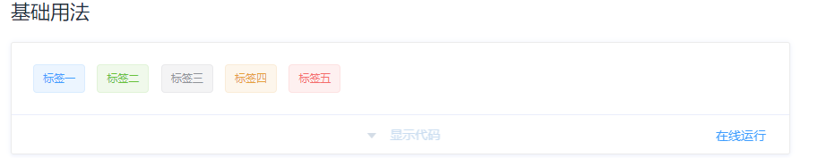

#### process进度条

- 用于展示操作进度，告知当前状态和预期

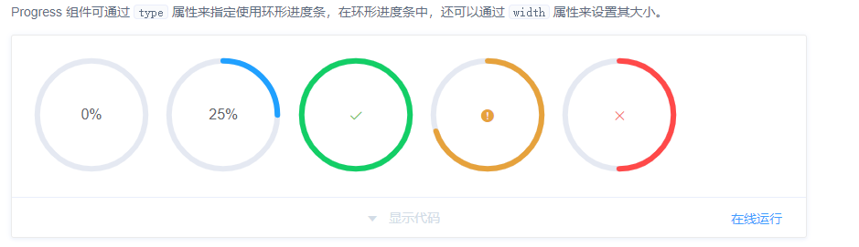

#### pagination分页

- 用于分页分解数据

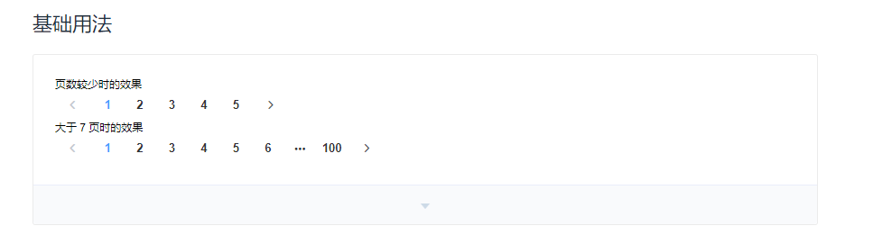

#### badge标记

- 出现在按钮或图标旁的数字、状态标记

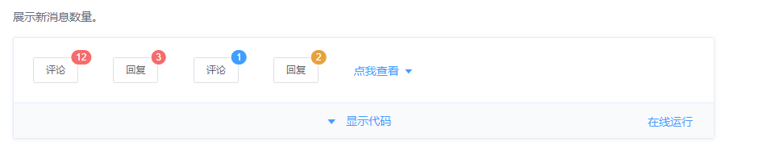

#### avatar头像

- 展示头像框

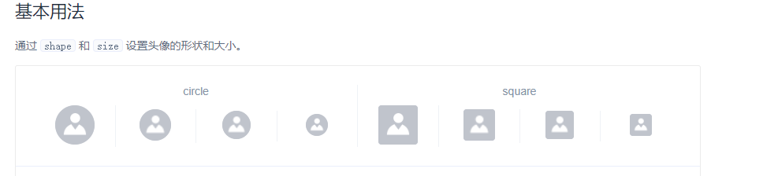

#### empty空状态

- 空状态的站位提示

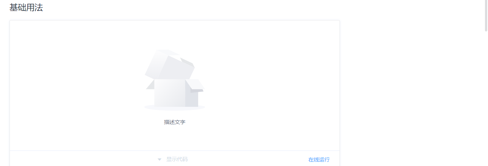

### 2.5 Notice组件

#### message消息提示

- 用于显示主动操作后的反馈提示

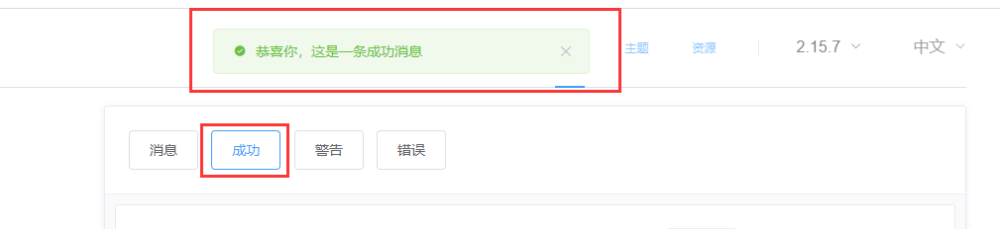

#### messagebox弹框

- 用于显示主动操作后的反馈提示（可输入内容）

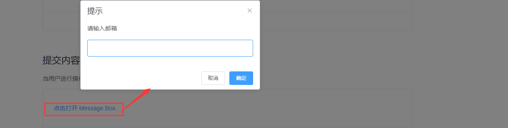

#### Notification通知

- 悬浮出现在页面角落，显示全局的通知提醒消息。

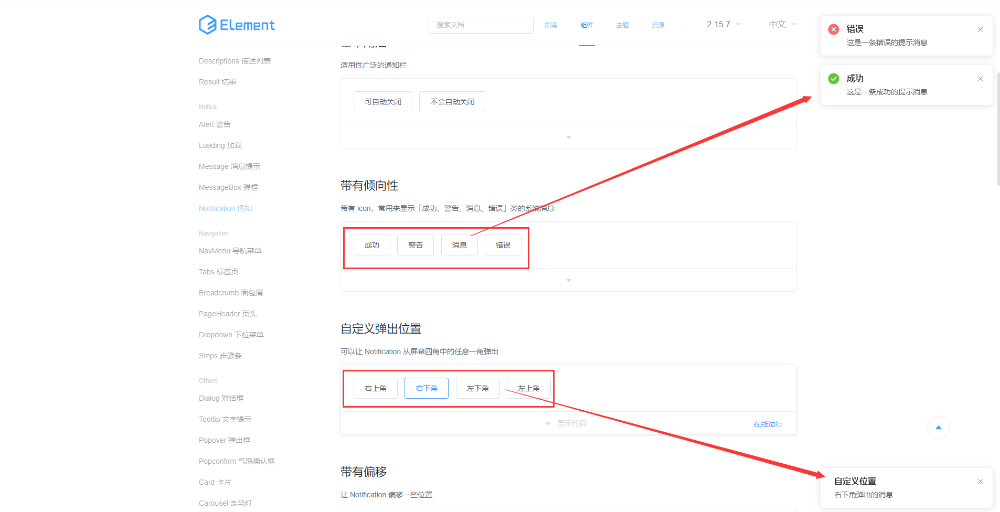

### 2.6 Navigation组件

#### tabs标签页

- 分隔内容上有关联但属于不同类别的数据集合。

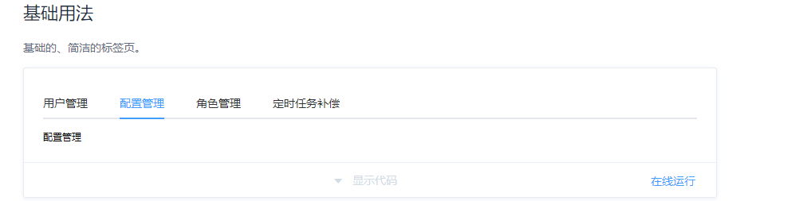

#### breadcrumb面包屑

- 显示当前页面的路径，快速返回之前的任意页面。

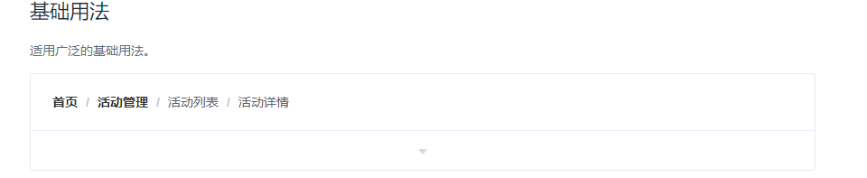

#### steps步骤条

- 引导用户按照流程完成任务的分步导航条，步骤不得少于 2 步

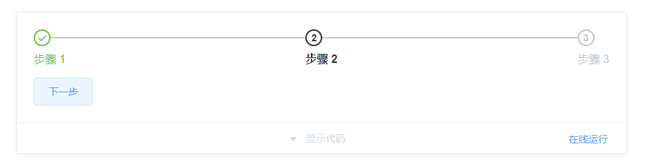

### 2.7 其他组件

#### dialog对话框

- 同messagebox类似

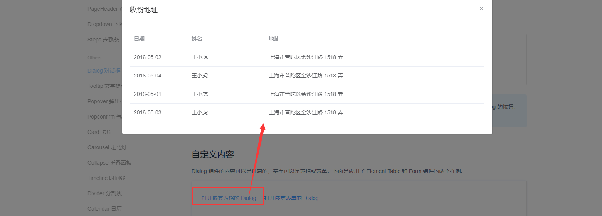

- tooltip文字提示

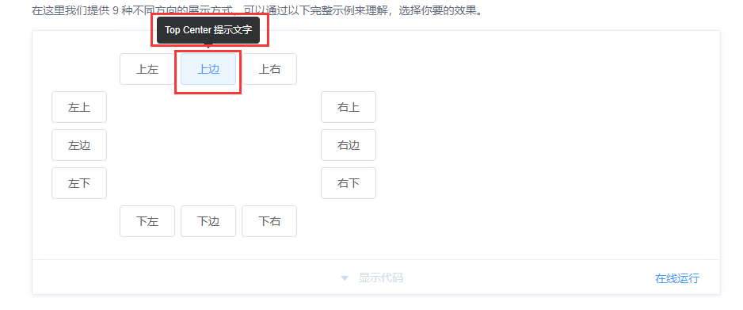

#### popConfirm确认框

- 一般用于确认是否删除


#### carousel轮播图

- 在有限空间内，循环播放同一类型的图片、文字等内容

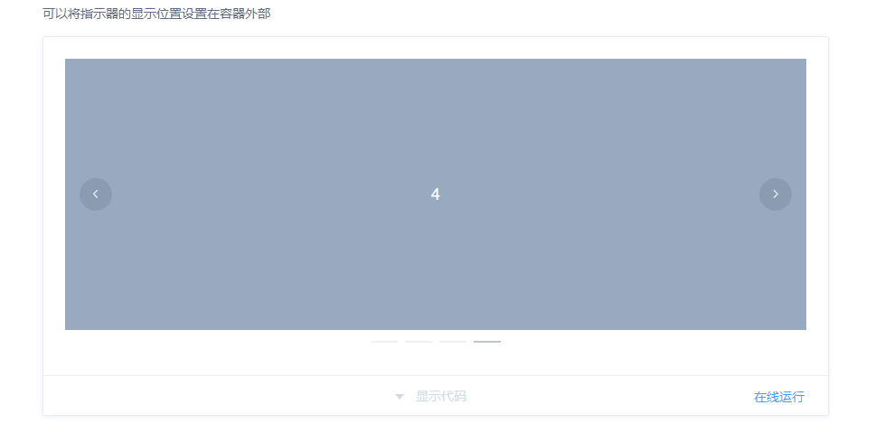

#### backtop回到顶部

- 返回页面顶部的操作按钮

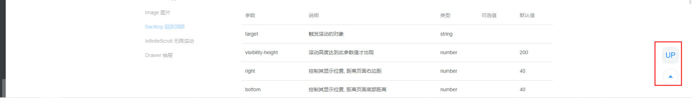

#### drawer抽屉

- 有些时候, `Dialog` 组件并不满足我们的需求, 比如你的表单很长, 亦或是你需要临时展示一些文档, `Drawer` 拥有和 `Dialog` 几乎相同的 API, 在 UI 上带来不一样的体验

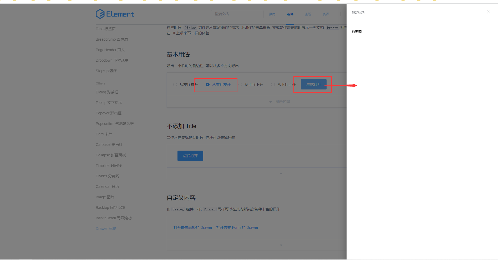