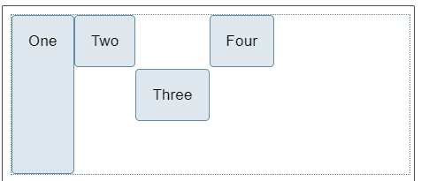

# Flex

## 一、Flex布局介绍

Flexible Box的缩写，表示布局可以弹性布局，能为盒状模型提供最大的灵活性


## 二、基本概念

1. 父容器：采用flex布局的元素被称为父容器
2. 项目：采用flex布局下的子元素标签被称为项目


## 三、常用属性

1. 父容器

   - ```css
     display: felx  //声明父元素是flex布局
     ```

   - flex-direction 声明父元素下的项目在容器主轴的方向

     - row  表示水平方向，由左到右
     - row-reverse  表示水平方向，由右到左
     - column  表示垂直方向，由上到下
     - column-reverse 表示垂直方向，由下到上

   - flex-wrap 声明项目在父元素一行无法完全显示的时候应该如何处理

     - nowrap 表示不换行
     - wrap 正常换行
     - wrap-reverse 向上换行

   - justify-content  声明项目在父元素`水平`方向的对齐方式

     - flex-start  左对齐
     - flex-end  右对齐
     - center  居中对齐
     - space-between  两端对齐
     - space-around  每个项目两侧的间距相等

   - align-items 声明项目在父元素`垂直`方向的对齐方式

     - stretch 默认为拉伸填满
     - flex-start  垂直方向的由上到下
     - flex-end   垂直方向由下到上
     - center  居中对齐
     - baseline  与项目的第一行文字的基线对齐
     - stretch  如果项目没有设置高度或者高度为auto，将沾满整个容器的高度

2. 项目

> 自定义项目内属性

- align-self

  - 拥有 `align-items` 的所有属性值

  - ```html
    <style>
    .box {
      display: flex;
      align-items: flex-start;
      height: 200px;
    }
    .box>*:first-child {
      align-self: stretch;
    }
    .box .selected {
      align-self: center;
    }
    </style>
    <div class="box">
      <div>One</div>
      <div>Two</div>
      <div class="selected">Three</div>
      <div>Four</div>
    </div>
    ```

    

- flex-basis

  - flex布局内子元素的尺寸，默认为auto, 元素内容的尺寸
  - 其他值如固定值 或者 0，则不会放大缩小

- flex-grow

  - 默认值0，即不放大
  - 一个项目为1，其他项目为固定值，只有该项目放大
  - 多个项目为1，同比例放大；多个项目不同值，如第一个元素 `flex-grow` 值为 2，其他元素值为 1，则第一个元素将占有 2/4（上例中，即为 200px 中的 100px）, 另外两个元素各占有 1/4（各 50px）

- flex-shrink

  - 默认值1，`前提是容器宽度 < 元素总宽度，且no-wrap`，会收缩
  - 与`flex-grow`属性一样，可以赋予不同的值来控制 flex 元素收缩的程度——给`flex-shrink`属性赋予更大的数值可以比赋予小数值的同级元素收缩程度更大。

- flex

  - flex-grow、flex-shrink、flex-basic的简写
    - flex: 1 = flex: 1 1 0%
    - flex: 2 = flex: 2 1 0%
    - flex: auto = flex: 1 1 auto
    - flex: none = flex: 0 0 auto，常用于固定尺寸不伸缩

  `flex:1` 和 `flex:auto` 的区别，可以归结于`flex-basis:0`和`flex-basis:auto`的区别

  当设置为0时（绝对弹性元素），此时相当于告诉`flex-grow`和`flex-shrink`在伸缩的时候不需要考虑我的尺寸

  当设置为`auto`时（相对弹性元素），此时则需要在伸缩时将元素尺寸纳入考虑

