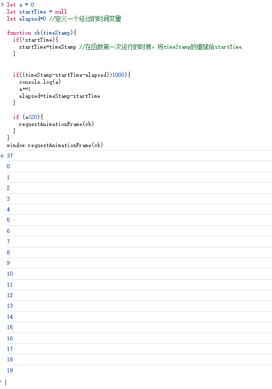
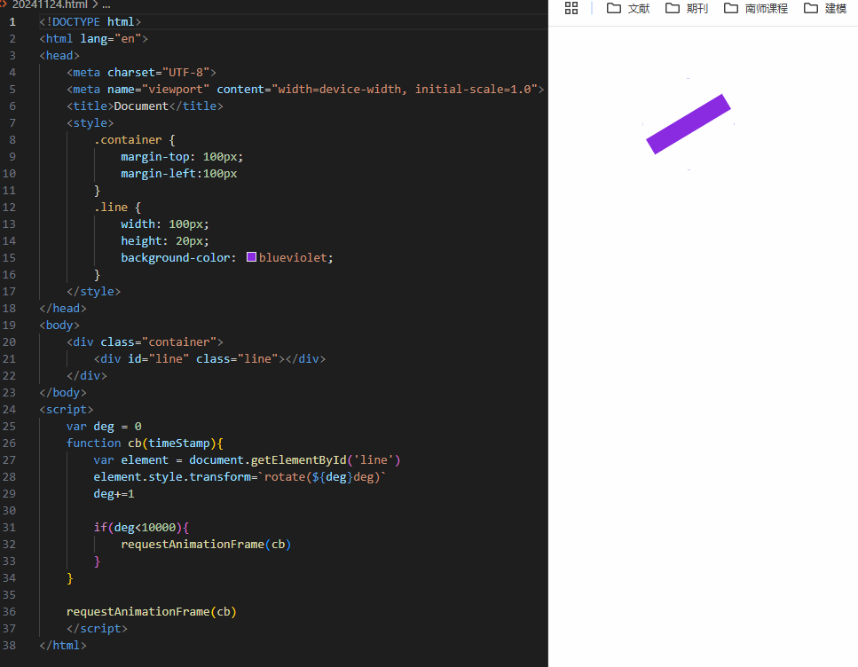

# Window

## 一、实例属性


## 二、实例方法

### 2.1 requestAnimationFrame（cb）

> - 前提知识：浏览器页面是一帧一帧绘制出来的，当每秒绘制的帧数（`FPS`）达到 `60`时，页面是流畅的，小于这个值时，用户会感觉到卡顿。
> - 每次重绘前，调用用户提供的cb
>   - 调用频率通常与显示器刷新率一致。 75hz、120hz 和 144hz 也被使用，但常见刷新率是 60hz

用法

```javascript
requestAnimationFrame(callback)
```


**案例1**

实现1秒钟输出一个变量a，运行逻辑就是：每次elapsed刚刚超过1000毫秒就输出a（因为无法确切捕捉到1ms）。

```javascript
let a = 0
let startTime = null
let elapsed=0 //定义一个经过的时间变量

function cb(timeStamp){
  if(!startTime){
    startTime=timeStamp //在函数第一次运行的时候，将timeStamp的值赋给startTime.
  }
  

  if((timeStamp-startTime-elapsed)>1000){
    console.log(a)
    a+=1
    elapsed=timeStamp-startTime
  }

  if (a<20){
    requestAnimationFrame(cb)
  }
}
```



**案例2**

每帧（即每秒执行60/75/144）执行让div旋转 1 deg

```html
<div class="container">
    <div id="line" class="line"></div>
</div>
<style>
    .container {
        margin-top: 100px;
        margin-left:100px
    }
    .line {
        width: 100px;
        height: 20px;
        background-color: blueviolet;
    }
</style>
<script>
var deg = 0
function cb(timeStamp){
    var element = document.getElementById('line')
    element.style.transform=`rotate(${deg}deg)`
    deg+=1

    if(deg<10000){
        requestAnimationFrame(cb)
    }
}

requestAnimationFrame(cb)
</script>
```




## 三、事件


## 四、继承