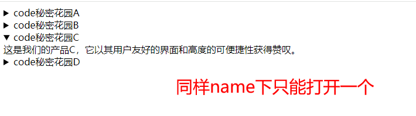

# chrome120版本新特性 

:bulb: 注意以下是chrome120版本才有的

## 1、details新增name属性

`<details>`元素新增了一个 `name`属性，可以为我们轻松的创建手风琴效果（`accordion pattern`）。

手风琴效果是 `GUI` 设计中常见的一种设计元素，通常用于在有限的空间内展示大量内容。当我们点击某个部分时，相关的内容就会展开，而其他部分则会保持收起状态。

`<details>`元素的 `name` 属性正是用来实现这样的效果。它支持将多个 `<details>` 元素通过相同的 `name` 属性值串联在一起形成一个组，使得在一个组内最多只能有一个元素处于打开的状态。换句话说，在一个组内，一旦一个 `<details>` 元素被打开，其他所有 `<details>` 元素都会被关闭。

```html
<!DOCTYPE html>
<html lang="en">
<head>
    <meta charset="UTF-8">
    <meta name="viewport" content="width=device-width, initial-scale=1.0">
    <title>Document</title>
</head>
<body>
    <details name="product">
        <summary>code秘密花园A</summary>
        这是我们的产品A，它具有高效的性能和优秀的设计。
        <summary>code秘密花园B</summary>
    </details>
    <details name="product">
        <summary>code秘密花园B</summary>
        这是我们的产品B，它具有强大的功能和一流的质量。
    </details>
    <details name="product">
        <summary>code秘密花园C</summary>
        这是我们的产品C，它以其用户友好的界面和高度的可便捷性获得赞叹。
    </details>
    <details name="product">
        <summary>code秘密花园D</summary>
        这是我们的产品D，它符合现代审美并且易于上手。
    </details>
</body>
</html>
```




