# 浏览器进程

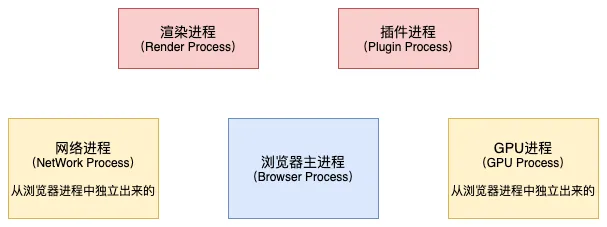

## 一、渲染进程(Render Process)

> `浏览器的渲染进程`，**将静态资源转化为可视化界面：**
>
> 1. **DOM树构建**：字节数据 > 字符串 > 词Token > Node节点 > Dom树
> 2. CSSOM树构建：CSS解析器解析转化为CSS对象，构建CSSOM树
> 3. 渲染树构建：根据DOM树 和 CSS规则树构建渲染树（只包含需要显示的节点）
> 4. 页面布局(回流)：计算各个元素大小 和 位置等布局信息
> 5. 页面绘制（重绘）：GPU绘制每个元素到单独层，后续层叠合成。当后续与用户交互（删除元素 改窗口大小等），会重新布局和绘制
>    1. 回流一定重绘，但重绘不一定回流（如只改一个字符值）

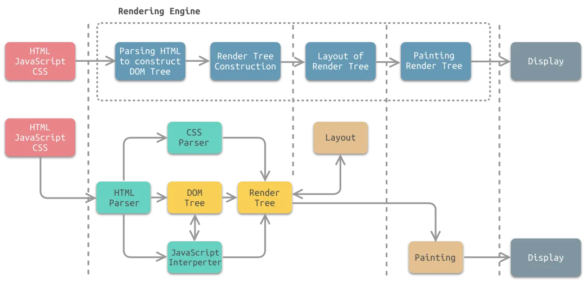

### 2.1 DOM树构建

HTML解析器将HTML字节流转为DOM结构，转化过程如下


#### 2.1.1 字符流 -> 词

```html
<body>
    <div>
        <p>hello world</p>
    </div>
</body>
```

如上代码，可拆成词

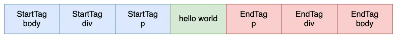

状态机：用作词法分析，将字节流拆分独立的状态


#### 2.1.2 词 -> DOM树

通过**栈结构**来实现

```html
<html>
    <body>
        <div>hello juejin</div>
        <p>hello world</p>
    </body>
</html>
```

1. 开始时，HTML解析器会创建一个根为 document 的空的 DOM 结构，同时将 StartTag document 的Token压入栈中，然后再将解析出来的第一个 StartTag html 压入栈中，并创建一个 html 的DOM节点，添加到 document 上，这时 Token 栈和 DOM树 如下：

   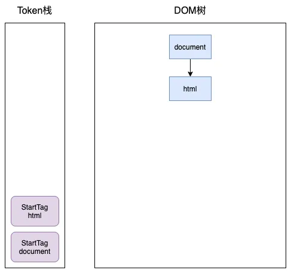

2. 接下来body和div标签也会和上面的过程一样，进行入栈操作（第二个html写错，应是body）

   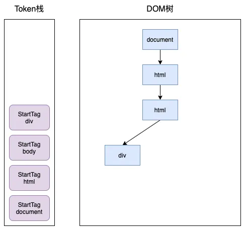

3. 随后就会解析到 div标签中的文本Token，渲染引擎会为该 Token 创建一个文本节点，并将该 Token 添加到 DOM 中，它的父节点就是当前 Token 栈顶元素对应的节点

   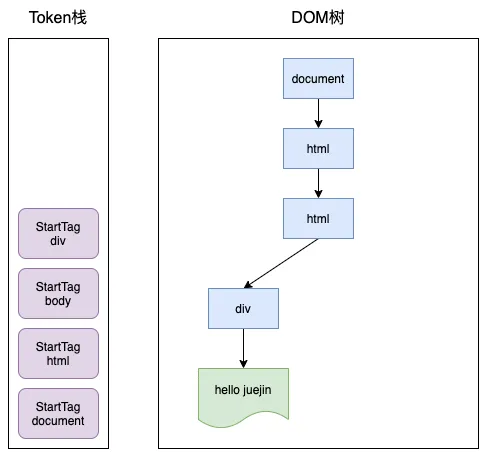

4. 接下来就是第一个EndTag div，这时 HTML 解析器会判断当前栈顶元素是否是 StartTag div，如果是，则从栈顶弹出 StartTag div，如下图所示：

   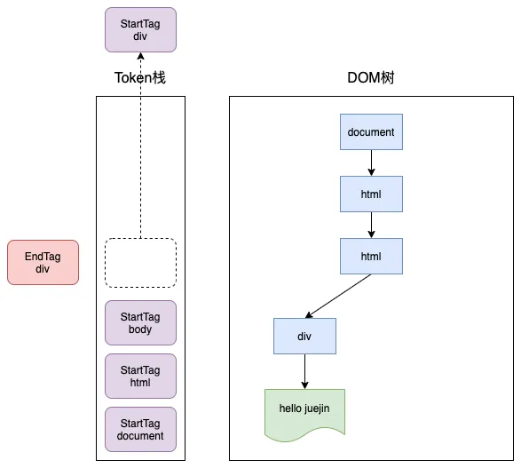

5. 再之后的过程就和上面类似了，最终的结果如下：

   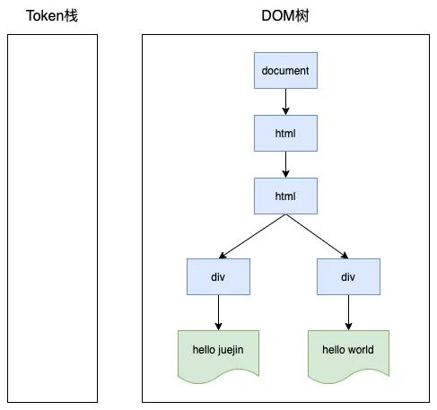

### 2.2 CSSOM树构建

- 需要将css代码转换为CSSOM树浏览器才能识别
- 通过`document.styleSheets`命令来查看CSSOM树

把内部样式、外部样式、内联样式、导入样式等全部加载完毕，根据优先级确定样式

CSS常见选择器的优先级如下：

| **选择器**     | **格式**      | **优先级权重** |
| :------------- | :------------ | :------------- |
| id选择器       | #id           | 100            |
| 类选择器       | .classname    | 10             |
| 属性选择器     | a[ref=“eee”]  | 10             |
| 伪类选择器     | li:last-child | 10             |
| 标签选择器     | div           | 1              |
| 伪元素选择器   | li:after      | 1              |
| 相邻兄弟选择器 | h1+p          |                |
| 子选择器       | ul>li         |                |
| 后代选择器     | li a          |                |
| 通配符选择器   | *             |                |


### 2.3 渲染树构建

> 是 DOM 树和 CSSOM 树的结合，会得到一个可以知道每个节点会应用什么样式的数据结构。
>
> - 在 Chrome 里会在每个节点上使用 attach() 方法，把 CSSOM 树的节点挂在 DOM 树上作为渲染树。
> - 在 Firefox 里会单独构造一个新的结构， 用来连接 DOM 树和 CSSOM 树的映射关系。
>
> 这个结合过程遍历DOM树中所有可见节点，并把这些节点加到布局中，而不可见的节点会被布局树忽略掉

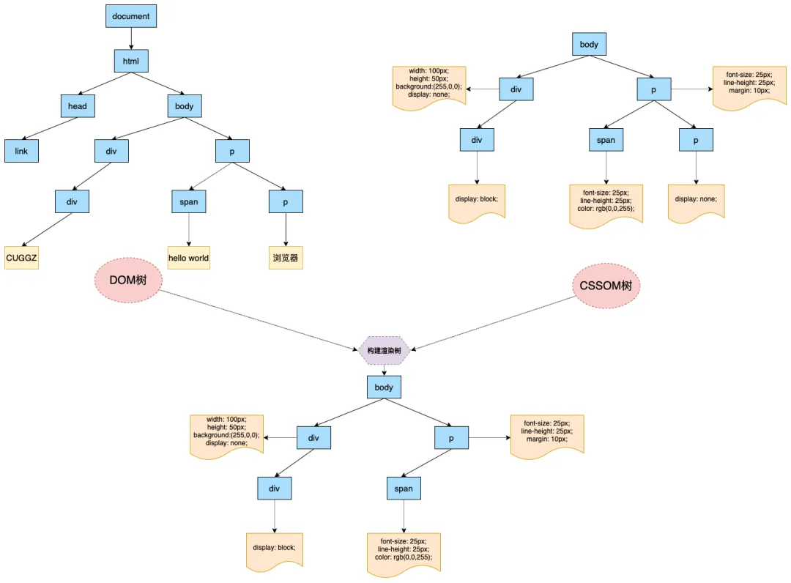


### 2.4 页面布局

遍历渲染树，计算渲染树上每个节点所占空间的大小和位置（得到元素间的盒模型），相应的信息被写回渲染树上，即布局渲染树

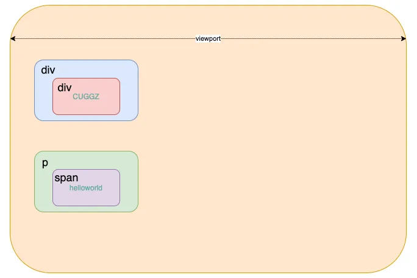


### 2.5 页面绘制

页面的图层信息可通过chrome的layers标签查看

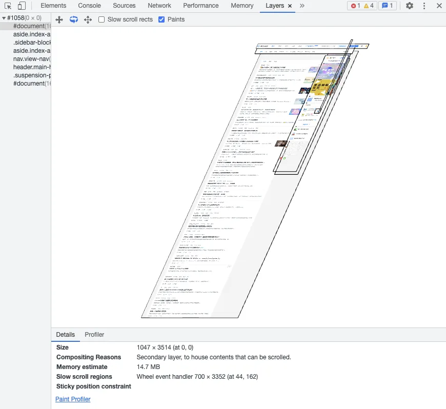

#### 2.5.1 构建图层

针对绘制信息的生成特定图层，一般会对如下进行分层处理

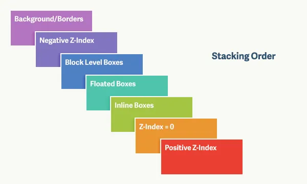

:bulb: 对于overflow超出的元素，出现scroll的也会被提升为单独的图层


#### 2.5.2 绘制图层

图层构建后，分为绘制列表制定 和 绘制操作。

绘制列表制定：**会把每个图层的绘制分成很多绘制指令，然后把这些指令按照顺序组成一个待绘制的列表：**

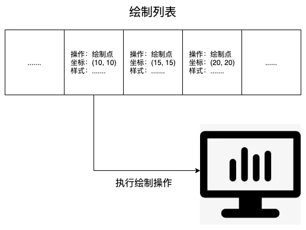

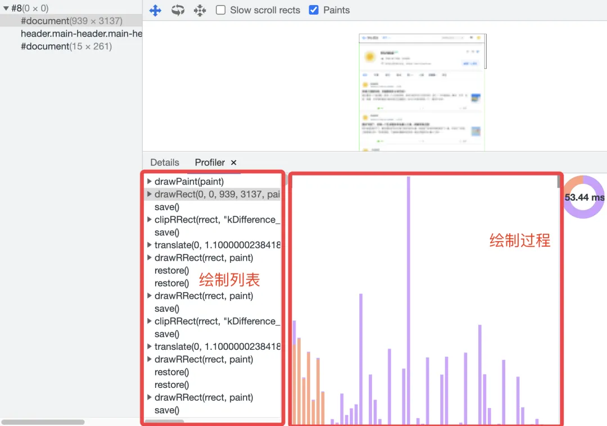

绘制操作：**由渲染引擎中合成线程完成，该线程不影响浏览器运行主进程**

- 针对长页面，会分块处理（类似GIS中的图层切片256*256 或 512 * 512），然后将这些图块`光栅化处理`（生成位图的过程），最后显示到屏幕上。


### 2.6 总结

1. 将HTML内容构建成DOM树；
2. 将CSS内容构建成CSSOM树；
3. 将DOM 树和 CSSOM 树合成渲染树；
4. 根据渲染树进行页面元素的布局；
5. 对渲染树进行分层操作，并生成分层树；
   1. 为每个图层生成绘制列表，并提交到合成线程
   2. 合成线程给浏览器进程发送绘制图块指令
      - 合成线程将图层分成不同的图块，栅格化转化位图；

   3. 浏览器进程会生成页面，并显示在屏幕上。


## 二、网络进程(NetWork Process)


## 三、浏览器主进程(Browser Process)


## 四、GPU进程(GPU Process)


## 五、插件进程(Plugin Process)

