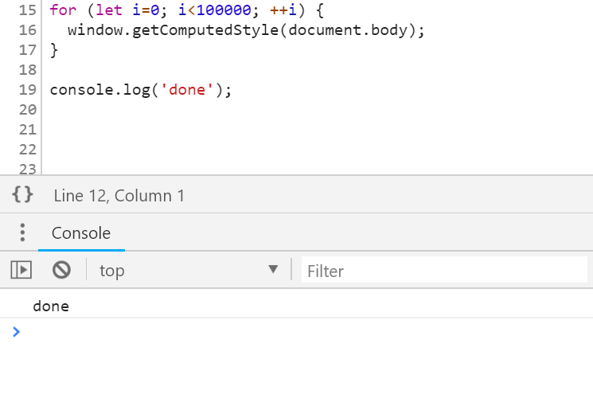
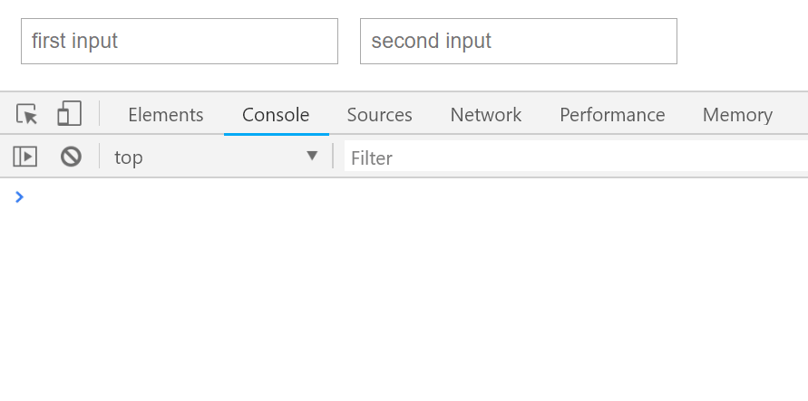

# 调试技巧 

## 一、时间性能分析

函数前后插入：`console.time` 和 `console.timeend`：




## 二、监控获得焦点元素

获取焦点元素 `document.activeElement`

```typescript
(function () {
  let last = document.activeElement;
  setInterval(() => {
    if (document.activeElement !== last) {
      la  st = document.activeElement;
      console.log("Focus changed to: ", last);
    }
  }, 1700);
})();
```




