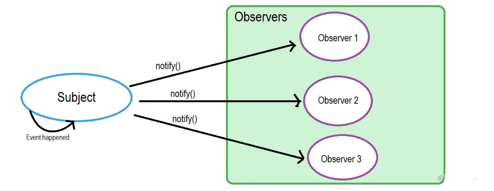
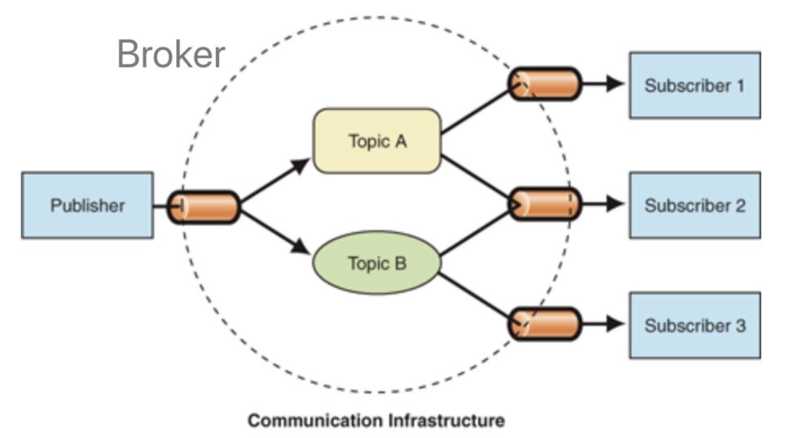

# 设计模式

##  一、基础

概念：一种通用的设计结构，用于构造可复用的面向对象设计。


分类：

- 创建型： 用于对象的创建;
- 结构型：用于处理类和对象的组合;
- 行为型：用于类和对象的交互;


## 二、创建型


## 三、结构型


## 四、行为型

### 4.1 观察者模式

`观察者 和 被观察者 之间的通讯`



被观察者

```javascript
class Subject {

  constructor() {
    this.observerList = [];
  }

  addObserver(observer) {
    this.observerList.push(observer);
  }

  removeObserver(observer) {
    const index = this.observerList.findIndex(o => o.name === observer.name);
    this.observerList.splice(index, 1);
  }

  notifyObservers(message) {
    const observers = this.observerList;
    observers.forEach(observer => observer.notified(message));
  }

}
```

观察者

```javascript
class Observer {

  constructor(name, subject) {
    this.name = name;
    if (subject) {
      subject.addObserver(this);
    }
  }

  notified(message) {
    console.log(this.name, 'got message', message);
  }
}
```

使用代码

```javascript
const subject = new Subject();
const observerA = new Observer('observerA', subject);
const observerB = new Observer('observerB');
subject.addObserver(observerB);
subject.notifyObservers('Hello from subject');
subject.removeObserver(observerA);
subject.notifyObservers('Hello again');
```


### 4.2 发布-订阅者模式

`发布者会向多个多向订阅者传递消息`，发布者 和 订阅者不知道对方是否存在，通过中介角色交换信息



订阅中心

```javascript
class PubSub {
  constructor() {
    this.messages = {};
    this.listeners = {};
  }
  // 添加发布者
  publish(type, content) {
    const existContent = this.messages[type];
    if (!existContent) {
      this.messages[type] = [];
    }
    this.messages[type].push(content);
  }
  // 添加订阅者
  subscribe(type, cb) {
    const existListener = this.listeners[type];
    if (!existListener) {
      this.listeners[type] = [];
    }
    this.listeners[type].push(cb);
  }
  // 通知
  notify(type) {
    const messages = this.messages[type];
    const subscribers = this.listeners[type] || [];
    subscribers.forEach(
    	cb => {
            messages.forEach(message => cb(message)); // 每个订阅者依次处理所有消息
        }
    )
  }
}
```


发布者类

```javascript
class Publisher {
  constructor(name, context) {
    this.name = name;
    this.context = context;
  }
  publish(type, content) {
    this.context.publish(type, content);
  }
}
```


订阅者类

```javascript
class Subscriber {
  constructor(name, context) {
    this.name = name;
    this.context = context;
  }
  subscribe(type, cb) {
    this.context.subscribe(type, cb);
  }
}
```


使用代码

```javascript
const TYPE_A = 'music';
const TYPE_B = 'movie';
const TYPE_C = 'novel';

const pubsub = new PubSub();

const publisherA = new Publisher('publisherA', pubsub);
publisherA.publish(TYPE_A, 'we are young');
publisherA.publish(TYPE_B, 'the silicon valley');
const publisherB = new Publisher('publisherB', pubsub);
publisherB.publish(TYPE_A, 'stronger');
const publisherC = new Publisher('publisherC', pubsub);
publisherC.publish(TYPE_C, 'a brief history of time');

const subscriberA = new Subscriber('subscriberA', pubsub);
subscriberA.subscribe(TYPE_A, res => {
  console.log('subscriberA received', res)
});
const subscriberB = new Subscriber('subscriberB', pubsub);
subscriberB.subscribe(TYPE_B, res => {
  console.log('subscriberB received', res)
});
const subscriberC = new Subscriber('subscriberC', pubsub);
subscriberC.subscribe(TYPE_C, res => {
  console.log('subscriberC received', res)
});

pubsub.notify(TYPE_A);  //subscriberA received we are young  subscriberA received stronger
pubsub.notify(TYPE_B);  //subscriberB received the silicon valley
pubsub.notify(TYPE_C);  //subscriberC received a brief history of time
```


### 4.3 观察者模式 和 发布订阅者模式的区别

观察者

- 知道彼此存在
- 类紧密耦合
- 大多是同步任务


发布订阅

- 不知道彼此是否存在
- 类松散耦合
- 大多是异步消息队列的方式

