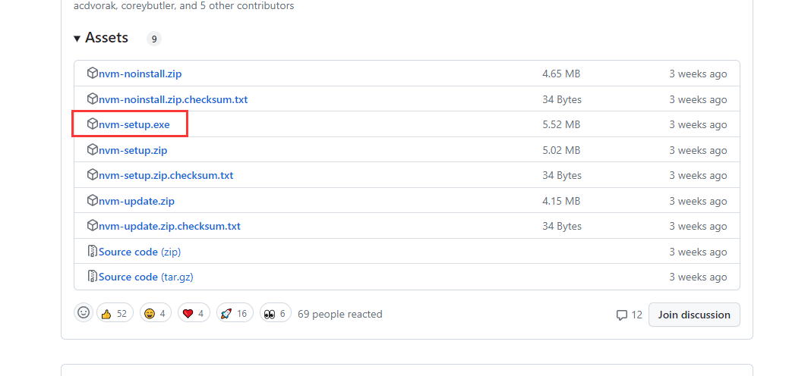
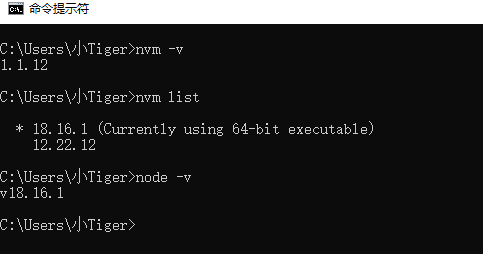

# NodeJS简介 

> Node.js 建立在 Google Chrome V8 JavaScript 引擎之上，主要用于创建网络服务器 - 但不仅限于此。

## 一、为什么使用NodeJS

1. Node.js 是一个开源和跨平台的 JavaScript 运行时环境。 它是几乎任何类型项目的流行工具！
2. Node.js 在浏览器之外运行 V8 JavaScript 引擎（Google Chrome 的内核）。 这使得 Node.js 非常高效。
3. Node.js 应用在`单个进程中`运行，`无需为每个请求创建新线程`。 Node.js 在其标准库中提供了一组`异步 I/O 原语，以防止 JavaScript 代码阻塞`，并且通常，Node.js 中的库是使用非阻塞范例编写的，这使得阻塞行为成为异常而不是常态。
   - 单个进程
     - 与传统的多线程服务器模型不同，Node.js 应用程序在单个进程中执行。
   - 无需创建新线程
     - Node.js 使用事件循环和回调函数的方式，不需要为每个请求创建新的线程，这使得处理高并发请求更加高效。
   - 异步I/O 原语
     - 提供了一组异步 I/O（输入/输出）原语，这意味着它允许执行诸如文件读写、网络请求等 I/O 操作时，能够在后台进行而不会阻塞代码的执行。这种方式使得即使在执行耗时的操作时，其他代码也能够继续执行，提高了程序的性能和响应能力。
4. Node.js 执行 I/O 操作时，如从网络读取、访问数据库或文件系统，Node.js 不会阻塞线程和浪费 CPU 周期等待，而是会在响应返回时恢复操作。这使得 Node.js 可以使用单个服务器处理数千个并发连接，而不会引入管理线程并发的负担（这可能是错误的重要来源）。
5. Node.js 具有独特的优势，因为数百万为浏览器编写 JavaScript 的前端开发者现在除了客户端代码之外，还能够编写服务器端代码，而无需学习完全不同的语言。
6. 在 Node.js 中，`可以毫无问题地使用新的 ECMAScript 标准，因为你不必等待所有用户更新他们的浏览器` - 你负责通过`更改 Node.js 版本来决定使用哪个 ECMAScript 版本`， 你还可以通过运行`带有标志的 Node.js `来启用特定的实验性特性。
   - 独立于用户浏览器更新：当想要使用新的 JavaScript 特性时，需要考虑用户的浏览器是否支持这些特性。然而，在 Node.js 中，不必等待所有用户更新他们的浏览器，因为 Node.js 运行在服务器端，与用户浏览器的 JavaScript 版本无关。
   - 控制ECMAScript版本：在 Node.js 中，可以通过更改 Node.js 的版本来决定使用哪个 ECMAScript 版本。Node.js 通常会在新的稳定版本中包含对最新 ECMAScript 特性的支持。
   - **启用实验性特性**：Node.js 也允许通过运行带有特定标志的 Node.js 版本来启用实验性特性。这意味着可以在开发环境中尝试并探索即将推出或正在开发中的 JavaScript 特性，即使它们还没有正式成为标准的一部分。


## 二、安装NodeJS & nvm

https://nodejs.cn/download/ 安装连接，根据自己的操作系统选择需要的版本即可，一般选择长期支持板


:bulb: 额外安装nvm：[Releases · coreybutler/nvm-windows](https://github.com/coreybutler/nvm-windows/releases)



nvm常见命令如下

```shell
nvm ls ：列出所有已安装的 node 版本
nvm ls-remote ：列出所有远程服务器的版本（官方node version list）
nvm list ：列出所有已安装的 node 版本
nvm list available ：显示所有可下载的版本
nvm install stable ：安装最新版 node
nvm install [node版本号] ：安装指定版本 node
nvm uninstall [node版本号] ：删除已安装的指定版本
nvm use [node版本号] ：切换到指定版本 node
nvm current ：当前 node 版本
nvm alias [别名] [node版本号] ：给不同的版本号添加别名
nvm unalias [别名] ：删除已定义的别名
nvm alias default [node版本号] ：设置默认版本
```



## 三、NodeJS前提知识 :star: 

详见章节 `前端 - > JS -> 基础 和 进阶`


## 四、NodeJS与浏览器之间的区别

- 在浏览器中，大部分时间你所做的是与 DOM 或其他 Web 平台 API（如 Cookie）进行交互。 当然，那些在 Node.js 中不存在。 你没有浏览器提供的 `document`、`window` 和所有其他对象。
- 有时在网络上你只能使用较旧的 JavaScript / ECMAScript 版本。 在将代码交付到浏览器之前，你可以使用 `Babel` 将代码转换为 ES5 兼容，但在 Node.js 中，你不需要这样做。
- 另一个区别是 Node.js 同时支持 CommonJS 和 ES 模块系统（自 Node.js v12 起），而在浏览器中我们开始看到正在实现的 ES 模块标准。实际上，这意味着你可以在 Node.js 中同时使用 `require()` 和 `import`，而在浏览器中只能使用 `import`。


## 五、V8 引擎

### 5.1 概述

- V8 是为 Google Chrome 提供支持的 JavaScript 引擎的名称。 即它解析和执行 JavaScript 代码。
- 很酷的是 JavaScript 引擎独立于托管它的浏览器。 这个关键特性促成了 Node.js 的兴起。 早在 2009 年，V8 就被选为支持 Node.js 的引擎，随着 Node.js 的爆炸式增长，V8 成为现在支持大量用 JavaScript 编写的服务器端代码的引擎。
- V8 是用 C++ 编写的，V8 一直在发展，就像周围的其他 JavaScript 引擎一样，以加速 Web 和 Node.js 生态系统。


## 六、NPM包管理器

### 6.1 npm简介

据报道，在 2022 年 9 月，npm 注册表中列出了超过 210 万个软件包，使其成为地球上最大的单一语言代码存储库，而且你可以确定（几乎）所有一切都有软件包。

它最初是作为一种下载和管理 Node.js 包依赖的方式，但后来成为前端 JavaScript 中也使用的工具。


### 6.2 包

`npm` 管理项目依赖的下载。


#### 6.1.1 安装所有依赖

如果一个项目有一个 `package.json` 文件，通过运行

```bash
npm install
```

它将在 `node_modules` 文件夹中安装项目所需的所有内容，如果它不存在则创建它。


#### 6.1.2 安装单个包

可以安装特定的包，通过运行

```bash
npm install <package-name>
```

:bulb: 此外，从 npm 5 开始，此命令将 `<package-name>` 添加到 `package.json` 文件依赖。 在版本 5 之前，你需要添加标志 `--save`。

通常可以看到更多的标志被添加到这个命令中：

- `--save-dev` 安装并添加条目到 `package.json` 文件开发依赖
- `--no-save` 安装但不添加条目到 `package.json` 文件依赖
- `--save-optional` 安装并添加条目到 `package.json` 文件可选依赖
- `--no-optional` 将阻止安装可选依赖

也可以使用标志的简写形式：

- -S：`--save`
- -D：`--save-dev`
- -O：`--save-optional`

:book: 补充： `-o` 或 `--optional` 用于安装可选依赖。可选依赖项是指在某些情况下，可能需要但不是必需的依赖。如果这些依赖项在安装失败时不会影响主要功能，可以将它们标记为可选依赖。


#### 6.1.3 更新包

`npm` 将检查所有包是否有满足你的版本控制约束的更新版本。

```bash
npm update
```

也可以指定要更新的单个包：

```bash
npm update <package-name>
```


### 6.3 版本控制

可以安装特定版本的软件包，通过运行

```bash
npm install <package-name>@<version>

npm install <package-name>@latest
```


### 6.4 运行任务

package.json 文件支持指定命令行任务的格式，可以使用

```bash
npm run <task-name>
```

例如：

```json
{
  "scripts": {
    "start-dev": "node lib/server-development",
    "start": "node lib/server-production"
  }
}
```


## 七、支持ECMAScript 2015 (ES6)及以上

> 所有 ECMAScript 2015 (ES6) 特性都分为三组，分别为**shipping**, **staged**, and **in progress**

- shipping：已发布，可放心使用
- staged：处于 TC39（ECMAScript 标准化组织）的预备阶段，测试中，使用`--harmony`标识
- progress：萌芽阶段，不推荐使用


## 八、开发和生产的区别

### 8.1 概述

- 生产环境 和 开发环境可有不同的配置

- 可通过将环境变量添加到应用初始化命令中来应用环境变量，但最好将它放在你的 shell 配置文件中（例如 Bash shell 的 `.bash_profile`），否则设置在系统重启时不会保留。

```bash
NODE_ENV=production node app.js
```


> :bulb: 例如，如果 `NODE_ENV` 未设置为 `production`，则 [Express](https://express.nodejs.cn/) 使用的模板库 [Pug](https://pug.nodejs.cn/) 将在调试模式下编译。 Express 视图在开发模式下的每个请求中编译，而在生产中它们被缓存。 还有更多的例子。
>
> - 当 `NODE_ENV` 设置为 `production` 时，代表应用正在生产环境中运行；而未设置或设置为其他值（如 `development`）则代表应用运行在开发模式下。
>   - 在开发模式下，Express 每次接收到请求时都会编译 Pug 模板，这样在开发阶段可以动态修改模板而不需要重启服务器。
>   - 相反，在生产环境中，这些视图（模板）将被缓存，以提高性能。这意味着模板编译只会发生一次，并在后续请求中重用，从而减少了服务器负载和提高了响应速度。


### 8.2 使用

可以使用条件语句在不同环境中执行代码：

```javascript
if (process.env.NODE_ENV === 'development') {
  // ...
}

if (process.env.NODE_ENV === 'production') {
  // ...
}

if (['production', 'staging'].includes(process.env.NODE_ENV)) {
  // ...
}
```

在 Express 应用中，可以使用它为每个环境设置不同的错误处理程序：

```javascript
if (process.env.NODE_ENV === 'development') {
  app.use(express.errorHandler({ dumpExceptions: true, showStack: true }));
}

if (process.env.NODE_ENV === 'production') {
  app.use(express.errorHandler());
}
```


## 九、使用TypeScript的NodeJS

### 9.1 案例

:bulb: 增加了类型校验

```typescript
type User = {
  name: string;
  age: number;
};

function isAdult(user: User): boolean {
  return user.age >= 18;
}

const justine: User = {
  name: 'Justine',
  age: 23,
};

const isJustineAnAdult: boolean = isAdult(justine);
```


### 9.2 使用

首先安装typeScript

```bash
npm i -D typescript
```


在终端中使用tsc命令变异javaScript，假如文件名为example.ts，如下命令：

```bash
npx tsc example.ts
```

> - npx是Node Package Execute 的缩写，可运行 TypeScript 的编译器而无需全局安装它
> -  TypeScript 编译器，将获取我们的 TypeScript 代码并将其编译为 JavaScript


:bulb: 补充支持typeScript的开源项目

- [NestJS](https://nest.nodejs.cn/) - 强大且功能齐全的框架，使创建可扩展且架构良好的系统变得轻松愉快
- [TypeORM](https://typeorm.nodejs.cn/#/) - 很棒的 ORM 受到来自其他语言（如 Hibernate、Doctrine 或 Entity Framework）的其他知名工具的影响
- [Prisma](https://prisma.nodejs.cn/) - 具有声明性数据模型、生成的迁移和完全类型安全的数据库查询的下一代 ORM
- [RxJS](https://rx.nodejs.cn/) - 广泛用于响应式编程的库
- [AdonisJS](https://adonisjs.com/) - 使用 Node.js 的功能齐全的 Web 框架
- [FoalTs](https://foalts.org/) - 优雅的 Nodejs 框架


## 十、使用WebAssembly

### 10.1 概念

一个高性能的类汇编语言。

- 模块 - 已编译的 WebAssembly 二进制文件，即 `.wasm` 文件。
- 内存 - 可调整大小的 ArrayBuffer。
- 表 - 不存储在内存中的可调整大小的类型化引用数组。
- 实例 - 模块及其内存、表和变量的实例化。


### 10.2 生成WebAssembly模块

为了使用 WebAssembly，需要一个 `.wasm` 二进制文件和一组 API 来与 WebAssembly 通信。 

生成方式有：

- 手写 WebAssembly（`.wat`）并使用 [wabt](https://github.com/webassembly/wabt) 等工具转为二进制格式
- 将 [emscripten](https://emscripten.org/) 与 C/C++ 应用一起使用
- 将 [wasm-pack](https://rustwasm.github.io/wasm-pack/book/) 与 Rust 应用一起使用
- 如果你更喜欢类似 TypeScript 的体验，请使用 [AssemblyScript](https://assemblyscript.nodejs.cn/)


### 10.3 使用方式

一旦有了一个 WebAssembly 模块，你就可以使用 Node.js `WebAssembly` 对象来实例化它。

```typescript
// Assume add.wasm file exists that contains a single function adding 2 provided arguments
const fs = require('fs');

const wasmBuffer = fs.readFileSync('/path/to/add.wasm');
WebAssembly.instantiate(wasmBuffer).then(wasmModule => {
  // Exported function live under instance.exports
  const { add } = wasmModule.instance.exports;
  const sum = add(5, 6);
  console.log(sum); // Outputs: 11
});
```

