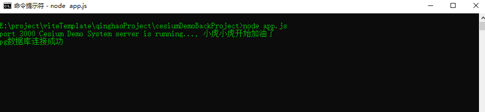
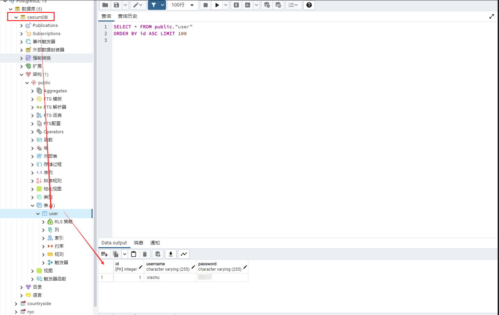

# 后端简单案例

## Node

#### package.json

```json
{
  "name": "cesiumDemoBackProject",
  "version": "1.0.0",
  "description": "",
  "main": "index.js",
  "scripts": {
    "test": "echo \"Error: no test specified\" && exit 1"
  },
  "keywords": [],
  "author": "",
  "license": "ISC",
  "dependencies": {
    "body-parser": "^1.19.0",
    "express": "^4.17.1",
    "pg": "^8.11.0"
  }
}

```

#### app.js

```javascript
//引用第三方模块和自定义模块，注意模块都是js文件
const express = require('express')
const bodyParser = require('body-parser')
const app = express();
const main = require('./router/main')

app.use(bodyParser.json());
app.use(bodyParser.urlencoded({extended:true}))

// 所有express框架得中间件 拦截所有的请求
app.use('*',function (req, res, next) {
  res.header('Access-Control-Allow-Origin','*')
  res.header('Access-Control-Allow-Headers','X-Requested-With, mytoken')
  res.header('Access-Control-Allow-Headers','X-Requested-With, Authorization')
  res.setHeader('Content-Type', 'application/json; charset=utf-8')
  res.header('Access-Control-Allow-Headers','Content-Type,Content-Length,Authorization,Accept,X-Requested-With')
  res.header('Access-Control-Allow-Methods','PUT,POST,GET,DELETE,OPTIONS')
  res.header('X-Powered-By','3.2.1')
  if(req.method == 'OPTIONS') res.send('')
  else next()
})

app.use('/api',main)

app.listen(3000,() => {
  console.log('port 3000 Cesium Demo System server is running..., 小虎小虎开始加油了')
})
```

#### main.js

```javascript
const express = require('express')
const main = express.Router()

main.post('/register',require('./user/register'))
main.post('/login',require('./user/login'))

module.exports = main
```

#### login.js

```javascript
const { myClient } = require('../../database/init')
const currentTime = new Date()

module.exports = async (req,res) => {
  const {username, password} = req.body
  let text = 'SELECT * FROM "user" WHERE username = ' + "'" + username + "'" + 'AND password = ' + "'"  + password + "'" 
  // console.log(text)  用于测试sql语句
  const result = await myClient.query(text)
  console.log(currentTime + '您的请求用户账号：' + username + '，登录密码：' + password)
  console.log(currentTime + '查询结果为:' + result.rows)
  if(result.rowCount === 1){
    return res.send({
      status: 200,
      resultCount: 1,
      tokenID: result.rows[0]
    })
  } else{
    return res.send({
      status: 401,
      resultCount: 0,
      tokenID: null
    })
  }
}

```

#### register.js

```javascript
const { myClient } = require('../../database/init')
const currentTime = new Date()

module.exports = async (req,res) => {
  const {username, password} = req.body
  let text = 'INSERT INTO "user" (username, password) VALUES ('+ "'" + username + "', '" + password + "')"
  // console.log(text)  用于测试sql语句
  const result = await myClient.query(text)
  console.log(currentTime + '您的注册账号为：' + username + '，注册密码：' + password)
  console.log(currentTime + '注册状态如下:')
  console.log(result)
  if(result.rowCount === 1){
    return res.send({
      status: 200,
      resultCount: 1
    })
  } else{
    return res.send({
      status: 401,
      resultCount: 0,
      errorValue: 'unknown'
    })
  }
}
```

#### init.js

```javascript
const { Client } = require('pg');

const myClient = new Client({
  host: 'localhost',
  port: 5432,
  database: 'cesiumDB',
  user: 'postgres',
  password: '399339'
})

myClient.connect().then( () => {
  console.log('pg数据库连接成功')
}).catch(err => {
  console.log('连接失败' + err)
})

module.exports = { myClient }
```




## Postgre

#### cesiumDB数据库及user表

> 后续其他系统表格将陆续建立

