## IDEA常见插件及快捷键

## 一、插件

#### jclasslib 

> 可视化的字节码查看器。


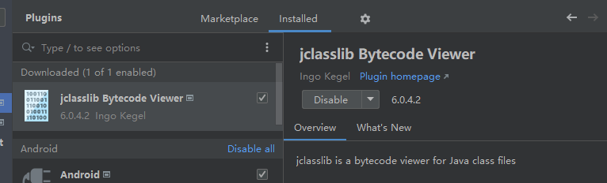

该插件可以通过`Build > build project`工具生成`out 文件夹下的字节码文件`

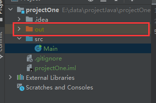


#### Alibaba Java Coding Guidelines


> 阿里巴巴Java编码规范检查插件，检测代码是否存在问题，以及是否符合规范。

使用：在类中，右键，选择编码规约扫描，在下方显示扫描规约和提示。根据提示规范代码，提高代码质量。


#### Rainbow Brackets


给括号添加彩虹色，使开发者通过颜色区分括号嵌套层级，便于阅读

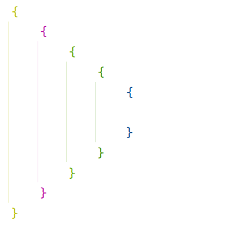


#### CodeGlance Pro


在编辑器右侧生成代码小地图，可以拖拽小地图光标快速定位代码，阅读行数很多的代码文件时非常实用。

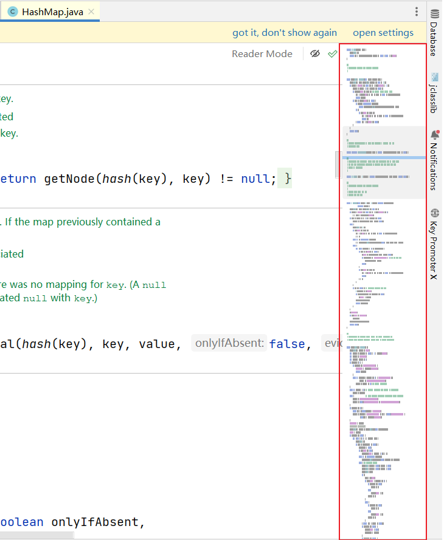


#### LeetCode Editor


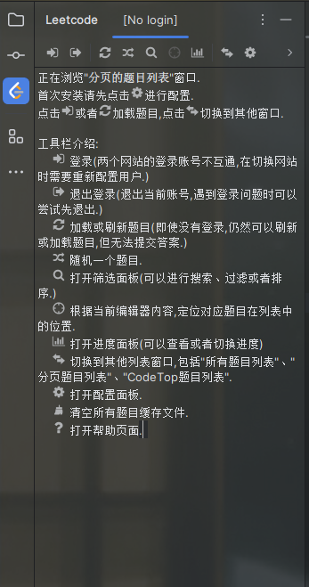


## 二、快捷键

find in files >  Alt + F

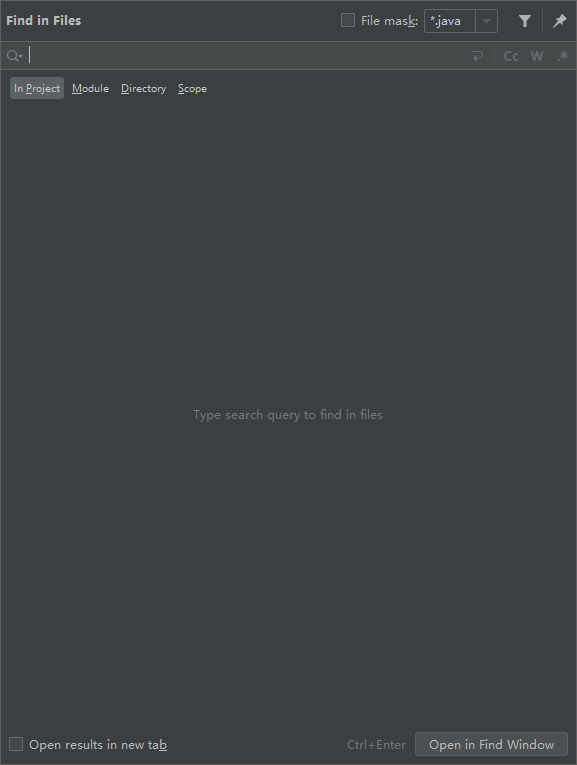


## 三、Debug步骤

#### 3.1 为什么需要Debug

编好的程序在执行过程中如果出现错误，该如何查找或定位错误呢？简单的代码直接就可以看出来，但如果代码比较复杂，就需要借助程序调试工具（Debug）来查找错误了。

```
运行编写好的程序时，可能出现的几种情况：
> 情况1：没有任何bug,程序执行正确！

====================如果出现如下的三种情况，都又必要使用debug=============================
> 情况2：运行以后，出现了错误或异常信息。但是通过日志文件或控制台，显示了异常信息的位置。
> 情况3：运行以后，得到了结果，但是结果不是我们想要的。
> 情况4：运行以后，得到了结果，结果大概率是我们想要的。但是多次运行的话，可能会出现不是我们想要的情况。
        比如：多线程情况下，处理线程安全问题。
        
```

#### 3.2 Debug的步骤

Debug(调试)程序步骤如下：

1、添加断点

2、启动调试

3、单步执行

4、观察变量和执行流程，找到并解决问题

##### 3.2.1、添加断点

在源代码文件中，在想要设置断点的代码行的前面的标记行处，单击鼠标左键就可以设置断点，在相同位置再次单击即可取消断点。

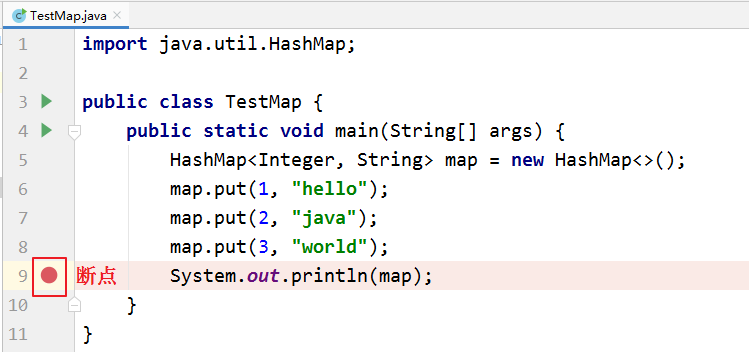

##### 3.2.2、启动调试

IDEA提供多种方式来启动程序(Launch)的调试，分别是通过菜单(Run –> Debug)、图标(“绿色臭虫”等等

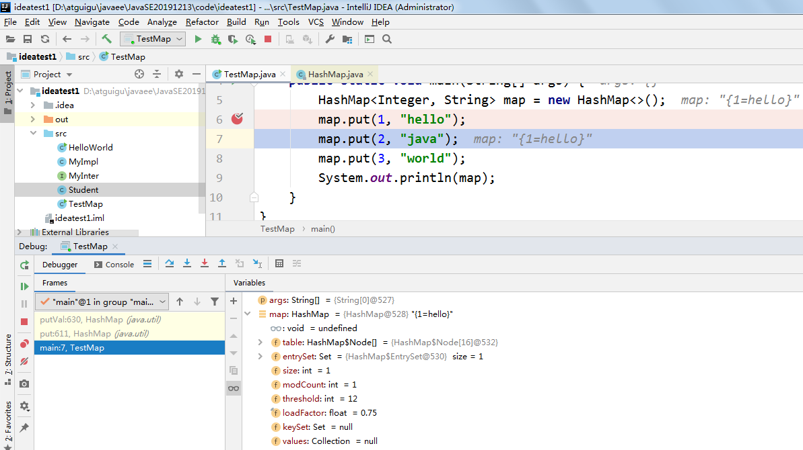

##### 3.3.3、单步调试工具介绍:happy:

：Step Over（F8）：进入下一步，如果当前行断点是调用一个方法，则不进入当前方法体内

：Step Into（F7）：进入下一步，如果当前行断点是调用一个自定义方法，则进入该方法体内

：Force Step Into（Alt +Shift  + F7）：进入下一步，如果当前行断点是调用一个核心类库方法，则进入该方法体内

：Step Out（Shift  + F8）：跳出当前方法体

：Run to Cursor（Alt + F9）：直接跳到光标处继续调试

：Resume Program（F9）：恢复程序运行，但如果该断点下面代码还有断点则停在下一个断点上

：Stop（Ctrl + F2）：结束调试

：View Breakpoints（Ctrl + Shift  + F8）：查看所有断点

：Mute Breakpoints：使得当前代码后面所有的断点失效， 一下执行到底 

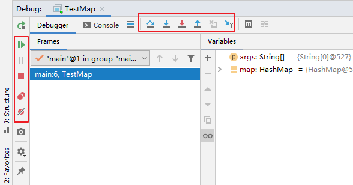

> 说明：在Debug过程中，可以动态的下断点。

#### 3.3 多种Debug情况介绍

##### 3.3.1 行断点

- 断点打在代码所在的行上。执行到此行时，会停下来。

##### 3.3.2 方法断点

- 断点设置在方法的签名上，默认当进入时，断点可以被唤醒。
- 也可以设置在方法退出时，断点也被唤醒

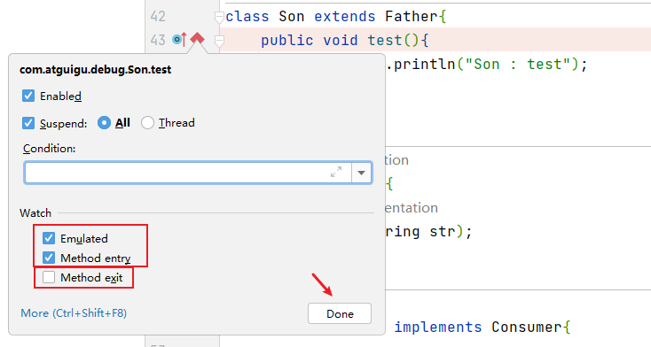

- 在多态的场景下，在父类或接口的方法上打断点，会自动调入到子类或实现类的方法

##### 3.3.3 字段断点

- 在类的属性声明上打断点，默认对属性的修改操作进行监控
- Field access 属性访问

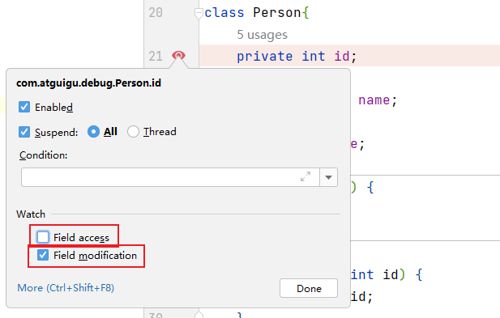

##### 3.3.4 条件断点

```java
package com.atguigu.debug;

public class Debug04 {
    public static void main(String[] args) {
        int[] arr = new int[]{1,2,3,4,5,6,7,8,9,10,11,12};

        for (int i = 0; i < arr.length; i++) {
            int target = arr[i];
            System.out.println(target);
        }
    }
}
```

针对上述代码，在满足arr[i] % 3 == 0的条件下，执行断点。

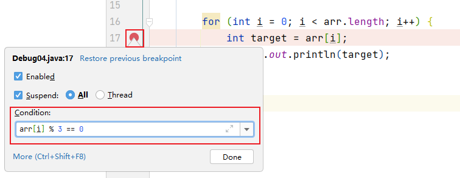

##### 3.3.5 强制结束

```java
package com.atguigu.debug;

public class Debug07 {
    public static void main(String[] args) {
        System.out.println("获取请求的数据");
        System.out.println("调用写入数据库的方法");
        insert();
        System.out.println("程序结束");
    }

    private static void insert() {
        System.out.println("进入insert()方法");
        System.out.println("获取数据库连接");
        System.out.println("将数据写入数据表中");
        System.out.println("写出操作完成");
        System.out.println("断开连接");
    }
}

```

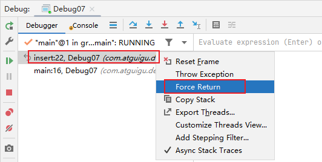
