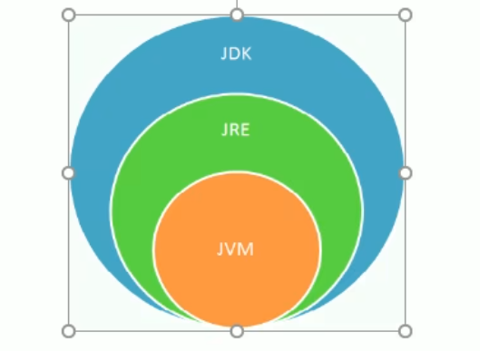
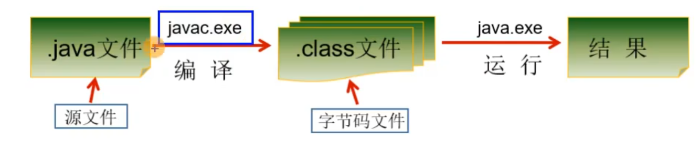
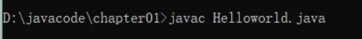
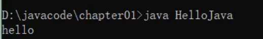
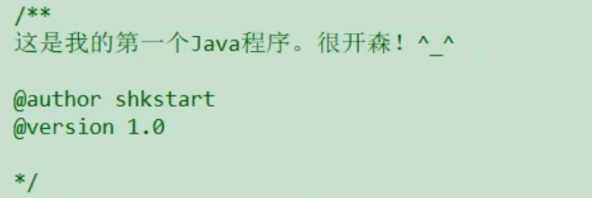
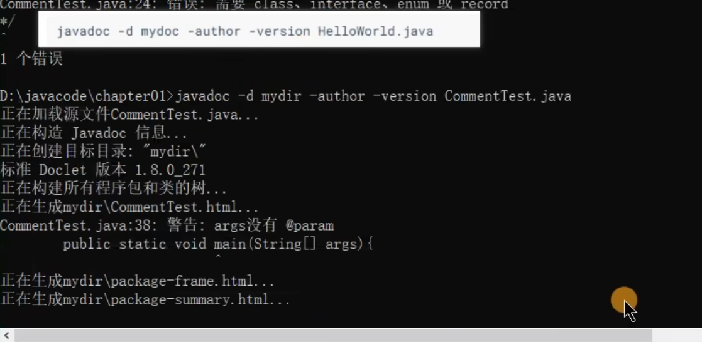

# 2023Java基础

## 一、概述

**Java技术体系**

| 名称                                    | 介绍                                                         |
| --------------------------------------- | ------------------------------------------------------------ |
| JavaSE （Java Standard Edition）标准版  | 支持面向桌面端应用的JAVA平台，旧版本叫做J2SE                 |
| JavaEE（Java Enterprise Edition）企业版 | 为开发企业环境下应用程序的一套及决方案，包含技术主要如Servlet、Jsp，主要针对Web应用程序开发，旧版本叫做J2EE |
| JavaME（Java Micro Editon）小型版       | 支持Java程序运行在移动终端上的平台，旧版本叫做J2ME           |

> 各类框架`Hadoop、Spark`等大数据开发平台也是Java编写成。

> 存储单位   1KB=1024B（byte）=1024 * 8bit

> JDK = JRE + 开发工具；JRE = JVM + JAVA核心类库； 开发工具 = 编译工具javac.exe + 打包工具jar.exe
>
> - JDK ：JAVA开发工具包
> - JRE： JAVA运行环境
> - JVM：JAVA虚拟机，通过JVM，实现同一个JAVA程序可在不同的操作系统执行
>
> 使用JDK的开发工具完成JAVA程序，交给JRE运行




## 二、安装

### 1.安装步骤

略

### 2.目录介绍

- bin : 存放开发工具
  - javac.exe 编译
  - java.exe 运行
  - javadoc.exe 生成网页文档
- include： java调用C
- jre：运行时环境
- lib：jar包
- src：常见开源代码

### 3.环境变量

path：Windows系统执行命令要搜寻的路径

`按照需求更换环境变量中的JAVA_HOME值`

### 4.开发三步骤

- 将Java代码编写到扩展名.java源文件中
- 通过javac.exe命令对java文件编译，生成一个或多个字节码文件
- 通过java.exe命令对生成的字节码class文件运行







### 5.Hello World

```java
public class Main {
    //main方法是程序的入口
    public static void main(String[] args) {
        /* 这里是多行注释*/
        System.out.println("Hello world!");
    }
}
```

### 6.注意事项

- 每行语句执行完毕 “；”结尾

### 7.文档注释






## 三、常用运算符

> 逻辑运算符针对的都是boolean类型的变量
>
> 逻辑运算符运算的结果也是boolen类型
>
> 逻辑运算符 常用在条件判断 和 循环结构中

### 1.& && | || ^ !

- ​	&  和 && 相同点 及 区别

  - 相同点

    - 两个符号表达的都是“且”的关系，当符号左右两边的类型值均为True，结果为True

  - 区别

    - 如果符号左边是True，则& 和 && 都会执行符号右边的操作

    - 如果符号左边是false，则 & 会继续执行符号右边的操作；&&符号不会执行右侧符号

      ```shell
      && ： 如果第一个条件都不满足，没有必要再看后续
      ```

- || 符号 与 | 相同


## 四、导包

> 除lang包下面的类，其他包的方法都要导入

- 用户输入：Scanner 
- 随机数：math.random
  - 获取指定范围内的随机数：(int)(Math.random() * (b - a + 1)) + a
- `switch只能判断常量，不能判断范围，如判断某一变量是否大于小于某值是不可以的`
  - defalut可选的，同时位置随意


## 五、基本类型-整型的范围

- byte的取值范围为-128~127，占用1个字节(-2的7次方到2的7次方-1)
- short的取值范围为-32768~32767，占用2个字节(-2的15次方到2的15次方-1)
- int的取值范围为(-2147483648~2147483647)，占用4个字节(-2的31次方到2的31次方-1)
- long的取值范围为(-9223372036854774808~9223372036854774807)，占用8个字节(-2的63次方到2的63次方-1)

