# 常用类和基础API

## 一、字符串相关类之不可变字符序列：String

### 1.1 String的特性

- `java.lang.String` 类代表字符串。Java程序中所有的字符串文字（例如`"hello"` ）都可以看作是实现此类的实例。

- 字符串是常量，用双引号引起来表示。它们的值在创建之后不能更改。

- 字符串String类型本身是final声明的，意味着我们不能继承String。

- String对象的字符内容是存储在一个字符数组value[]中的。`"abc"` 等效于 `char[] data={'h','e','l','l','o'}`。

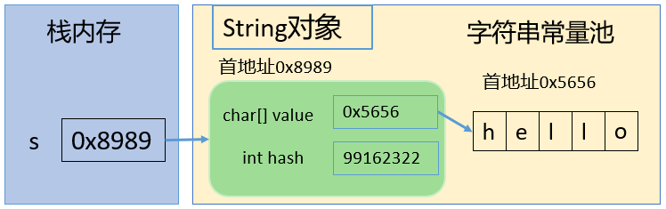

```java
//jdk8中的String源码：
public final class String
    implements java.io.Serializable, Comparable<String>, CharSequence {
    /** The value is used for character storage. */
    private final char value[]; //String对象的字符内容是存储在此数组中
 
    /** Cache the hash code for the string */
    private int hash; // Default to 0
```

- private意味着外面无法直接获取字符数组，而且String没有提供value的get和set方法。

- final意味着字符数组的引用不可改变，而且String也没有提供方法来修改value数组某个元素值

- 因此字符串的字符数组内容也不可变的，即String代表着不可变的字符序列。即，一旦对字符串进行修改，就会产生新对象。

- JDK9只有，底层使用byte[]数组。

```java
public final class String implements java.io.Serializable, Comparable<String>, CharSequence { 
    @Stable
    private final byte[] value;
}

//官方说明：... that most String objects contain only Latin-1 characters. Such characters require only one byte of storage, hence half of the space in the internal char arrays of such String objects is going unused.

//细节：... The new String class will store characters encoded either as ISO-8859-1/Latin-1 (one byte per character), or as UTF-16 (two bytes per character), based upon the contents of the string. The encoding flag will indicate which encoding is used.
```

### 1.2 String的内存结构

#### 1.2.1 概述

因为字符串对象设计为不可变，那么所以字符串有常量池来保存很多常量对象。

`JDK6中，字符串常量池在方法区；JDK7开始，就移到堆空间，直到目前JDK17版本`。

#### 1.2.2 练习1

```java
String s1 = "hello";
String s2 = "hello";
System.out.println(s1 == s2);
// 内存中只有一个"hello"对象被创建，同时被s1和s2共享。
```

对应内存结构为：（以下内存结构以`JDK6为例`绘制）：

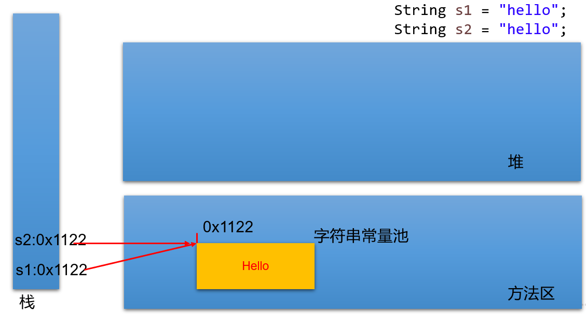

字符串内容更改 -> 创建新的对象

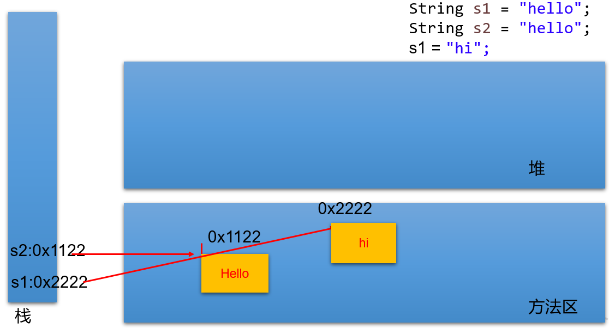

```java
package stringClass;

/**
 * @author smallTiger
 */
public class stringClass {
    public static void main(String[] args) {
        Person p1 = new Person();
        p1.name = "Tom";

        Person p2 = new Person();
        p2.name = "Tom";

        System.out.println(p1.name.equals( p2.name)); //true
        System.out.println(p1.name == p2.name); //true
        System.out.println(p1.name == "Tom"); //true
    }
}
class Person{
    public String name;

    public Person() {
    }
}
```

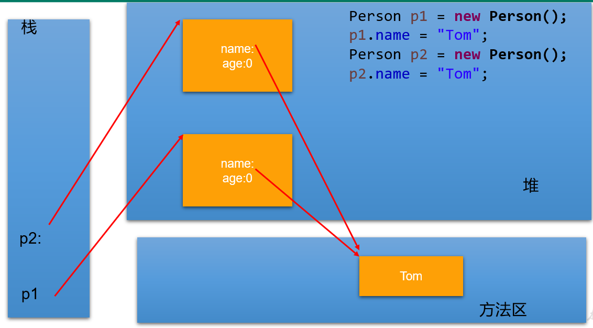

#### 1.2.2 练习2

> :question:  String str1 = “abc”; 与 String str2 = new String(“abc”);的区别？

str2 首先指向堆中的一个字符串对象，然后堆中字符串的value数组指向常量池中常量对象的value数组。

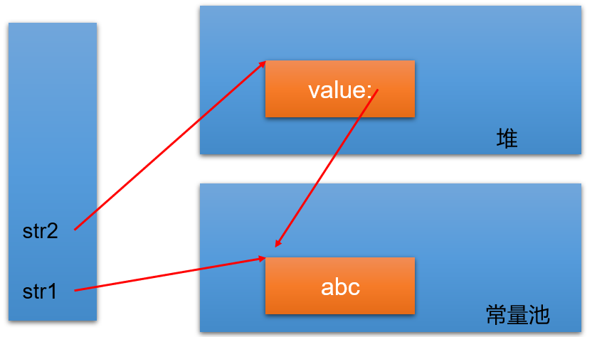

:bulb: 字符串常量存储在字符串常量池，目的是共享。

:bulb:  字符串非常量对象存储在堆中。

练习：

```java
String s1 = "javaEE";
String s2 = "javaEE";
String s3 = new String("javaEE");
String s4 = new String("javaEE");

System.out.println(s1 == s2);//true
System.out.println(s1 == s3);//false
System.out.println(s1 == s4);//false
System.out.println(s3 == s4);//false
```

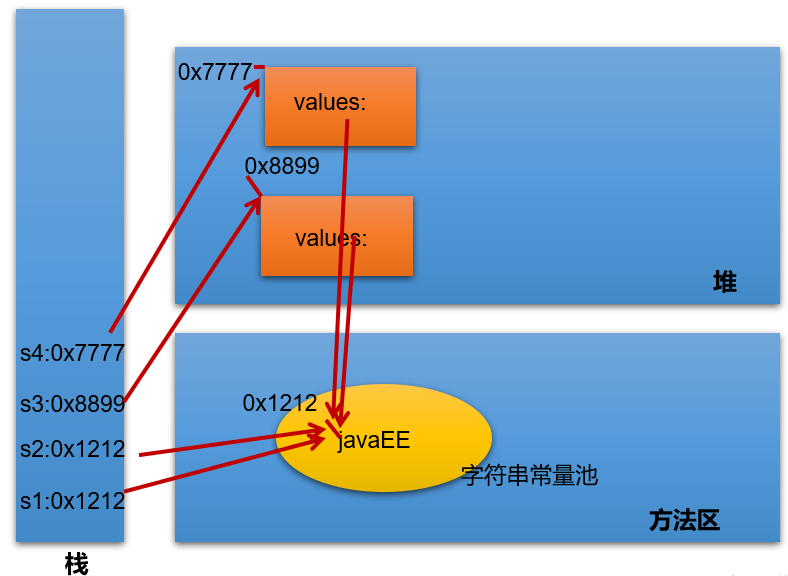

练习：String str2 = new String("hello"); 在内存中创建了几个对象？

```
两个
```

#### 1.2.2 练习3

- **String s1 = "a";** 

说明：在字符串常量池中创建了一个字面量为"a"的字符串。

- **s1 = s1 + "b";** 

说明：`实际上原来的“a”字符串对象已经丢弃了，现在在堆空间中产生了一个字符串s1+"b"（也就是"ab")`。如果多次执行这些改变串内容的操作，会导致大量副本字符串对象存留在内存中，降低效率。如果这样的操作放到循环中，会极大影响程序的性能。

- **String s2 = "ab";**

说明：直接在字符串常量池中创建一个字面量为"ab"的字符串。

- **String s3 = "a" + "b";**

说明：s3指向字符串常量池中已经创建的"ab"的字符串。

- **String s4 = s1.intern();**

说明：堆空间的s1对象在调用intern()之后，会将常量池中已经存在的"ab"字符串赋值给s4。

练习：

```java
String s1 = "hello";
String s2 = "world";
String s3 = "hello" + "world";
String s4 = s1 + "world";
String s5 = s1 + s2;
String s6 = (s1 + s2).intern();

System.out.println(s3 == s4);//false
System.out.println(s3 == s5);//false
System.out.println(s4 == s5);//false
System.out.println(s3 == s6);//true
```

> **结论：**
>
> （1）常量+常量：结果是常量池。且常量池中不会存在相同内容的常量。
>
> （2）常量与变量 或 变量与变量：结果在堆中
>
> （3）拼接后调用intern方法：返回值在常量池中

练习：

```java
@Test
public void test01(){
	String s1 = "hello";
	String s2 = "world";
	String s3 = "helloworld";
		
	String s4 = s1 + "world";//s4字符串内容也helloworld，s1是变量，"world"常量，变量 + 常量的结果在堆中
	String s5 = s1 + s2;//s5字符串内容也helloworld，s1和s2都是变量，变量 + 变量的结果在堆中
	String s6 = "hello" + "world";//常量+ 常量 结果在常量池中，因为编译期间就可以确定结果
		
	System.out.println(s3 == s4);//false
	System.out.println(s3 == s5);//false
	System.out.println(s3 == s6);//true
}

@Test
public void test02(){
	final String s1 = "hello";
	final String s2 = "world";
	String s3 = "helloworld";
	
	String s4 = s1 + "world";//s4字符串内容也helloworld，s1是常量，"world"常量，常量+常量结果在常量池中
	String s5 = s1 + s2;//s5字符串内容也helloworld，s1和s2都是常量，常量+ 常量 结果在常量池中
	String s6 = "hello" + "world";//常量+ 常量 结果在常量池中，因为编译期间就可以确定结果
		
	System.out.println(s3 == s4);//true
	System.out.println(s3 == s5);//true
	System.out.println(s3 == s6);//true
}

@Test
public void test01(){
	String s1 = "hello";
	String s2 = "world";
	String s3 = "helloworld";
		
	String s4 = (s1 + "world").intern();//把拼接的结果放到常量池中
	String s5 = (s1 + s2).intern();
		
	System.out.println(s3 == s4);//true
	System.out.println(s3 == s5);//true
}
```

练习：下列程序运行的结果：

```java
public class TestString {
	public static void main(String[] args) {
		String str = "hello";
		String str2 = "world";
		String str3 ="helloworld";
		
		String str4 = "hello".concat("world");
		String str5 = "hello"+"world";
		
		System.out.println(str3 == str4);//false
		System.out.println(str3 == str5);//true
	}
}
```

> concat方法拼接，哪怕是两个常量对象拼接，结果也是在堆。

练习：下列程序运行的结果：

```java
public class StringTest {

    String str = new String("good");
    char[] ch = { 't', 'e', 's', 't' };

    public void change(String str, char ch[]) {
        str = "test ok";
        ch[0] = 'b';
    }
    public static void main(String[] args) {
        StringTest ex = new StringTest();
        ex.change(ex.str, ex.ch);
        System.out.print(ex.str + " and ");//
        System.out.println(ex.ch);
    }
}

```

1. 首先，在`main`方法中创建了一个`StringTest`对象 `ex`。

2. 在`StringTest`类的构造方法中，创建了一个字符串对象 `str`，并将其初始化为 `"good"`。同时，创建了一个字符数组 `ch`，并初始化为 `['t', 'e', 's', 't']`

   ```
   ex.str -> "good"
   ex.ch  -> ['t', 'e', 's', 't']
   ```

3. 调用`change`方法，并传入 `ex.str` 和 `ex.ch` 作为参数。

   - 在`change`方法中，接收到 `str` 和 `ch` 的引用。

   - > :star: 此时虽然 str 和 ex.str都指向 字面量常量池中的一片区域，应该说str更改对应区域的地址值后，外部ex.str同样指向该片区域，值也应该同时变化。但是因为String类型的字面量的不可变性，此片区域字面量值不变（因为字符串对象设计为不可变，那么字符串有常量池来保存很多常量对象），**所以结果是外部ex.str的指针仍然指向该片区域，值不变为good；而str指向另一片字面量区域**。

   - > 同上面的ex.str 和 str类似，ex.ch 和 ch的指针同样指向堆中的一片区域，**但是这是堆中对象的内部值，可以改变，所以当 `ch[0]` 被修改为 `'b'`，外部的ex.ch[0]同样指向该区域，所以最终的结果改为了best**

   ```
   ex.str -> "good"
   ex.ch  -> ['b', 'e', 's', 't']
   ```

4. 返回到`main`方法，输出 `ex.str + " and "`。这里的`ex.str`仍然是之前构造方法中的值 `"good"`，因为`change`方法内的`str`重新分配了一个新的字符串，但不会影响类的成员变量 `str`。

5. 输出 `ex.ch`。由于`ch` 是字符数组，它在`change`方法中被修改为 `['b', 'e', 's', 't']`。

最终的输出为 `"good and best"`

### 1.3 String的常用API-1

#### 1.3.1 构造器

> :bulb: 补充：包装类 和 基本数据类型的区别
>
> 1. **类型**：
>    - 基本数据类型是Java语言内置的数据类型，如int、char、double、boolean等。它们是语言的基本构建块，存储简单的数据值。
>    - 包装类是用来包装基本数据类型的对象，如Integer、Character、Double、Boolean等。它们提供了一种将基本数据类型转换为对象的方式，以便在需要时可以进行对象操作。
> 2. **存储方式**：
>    - 基本数据类型在内存中以值的形式存储，不具有对象的属性和方法。
>    - 包装类是对象，它们在内存中具有对象的特征，包括方法和属性。
> 3. **空值（null）**：
>    - 基本数据类型不能存储空值，例如，int不能为null。
>    - 包装类可以存储空值，即可以将其设置为null。

* `public String() ` ：初始化新创建的 String对象，以使其表示空字符序列。
* ` String(String original)`： 初始化一个新创建的 `String` 对象，使其表示一个与参数相同的字符序列；换句话说，新创建的字符串是该参数字符串的副本。
* `public String(char[] value) ` ：通过当前参数中的字符数组来构造新的String。
* `public String(char[] value,int offset, int count) ` ：通过字符数组的一部分来构造新的String。
* `public String(byte[] bytes) ` ：通过使用平台的**默认字符集**解码当前参数中的字节数组来构造新的String。
* `public String(byte[] bytes,String charsetName) ` ：通过使用指定的字符集解码当前参数中的字节数组来构造新的String。

举例：

```java
//字面量定义方式：字符串常量对象
String str = "hello";

//构造器定义方式：无参构造
String str1 = new String();

//构造器定义方式：创建"hello"字符串常量的副本
String str2 = new String("hello");

//构造器定义方式：通过字符数组构造
char chars[] = {'a', 'b', 'c','d','e'};     
String str3 = new String(chars);
String str4 = new String(chars,0,3);

//构造器定义方式：通过字节数组构造
byte bytes[] = {97, 98, 99 };     
String str5 = new String(bytes);
String str6 = new String(bytes,"GBK");
```

```java
public static void main(String[] args) {
	char[] data = {'h','e','l','l','o','j','a','v','a'};
	String s1 = String.copyValueOf(data);
	String s2 = String.copyValueOf(data,0,5);
	int num = 123456;
	String s3 = String.valueOf(num);
	
    System.out.println(s1);
	System.out.println(s2);
	System.out.println(s3);
}
```

#### 1.3.2 String 与其他结构间的转换

**字符串 --> 基本数据类型、包装类：**

- Integer包装类的public static int parseInt(String s)：可以将由“数字”字符组成的字符串转换为整型。
- 类似地，使用java.lang包中的Byte、Short、Long、Float、Double类调相应的类方法可以将由“数字”字符组成的字符串，转化为相应的基本数据类型。

**基本数据类型、包装类 --> 字符串：**

- 调用String类的public String valueOf(int n)可将int型转换为字符串
- 相应的valueOf(byte b)、valueOf(long l)、valueOf(float f)、valueOf(double d)、valueOf(boolean b)可由参数的相应类型到字符串的转换。

 **字符数组 -->  字符串：**

- String 类的构造器：String(char[]) 和 String(char[]，int offset，int length) 分别用字符数组中的全部字符和部分字符创建字符串对象。 

 **字符串 -->  字符数组：**

- public char[] toCharArray()：将字符串中的全部字符存放在一个字符数组中的方法。

- public void getChars(int srcBegin, int srcEnd, char[] dst, int dstBegin)：提供了将指定索引范围内的字符串存放到数组中的方法。

**字符串 --> 字节数组：（编码）**

- public byte[] getBytes() ：使用平台的默认字符集将此 String 编码为 byte 序列，并将结果存储到一个新的 byte 数组中。
- public byte[] getBytes(String charsetName) ：使用指定的字符集将此 String 编码到 byte 序列，并将结果存储到新的 byte 数组。

 **字节数组 --> 字符串：（解码）**

- String(byte[])：通过使用平台的默认字符集解码指定的 byte 数组，构造一个新的 String。
- String(byte[]，int offset，int length) ：用指定的字节数组的一部分，即从数组起始位置offset开始取length个字节构造一个字符串对象。
- String(byte[], String charsetName ) 或 new String(byte[], int, int,String charsetName )：解码，按照指定的编码方式进行解码。

代码示例：

```java
@Test
public void test01() throws Exception {
    String str = "中国";
    System.out.println(str.getBytes("ISO8859-1").length);// 2
    // ISO8859-1把所有的字符都当做一个byte处理，处理不了多个字节
    System.out.println(str.getBytes("GBK").length);// 4 每一个中文都是对应2个字节
    System.out.println(str.getBytes("UTF-8").length);// 6 常规的中文都是3个字节

    /*
     * 不乱码：（1）保证编码与解码的字符集名称一样（2）不缺字节
     */
    System.out.println(new String(str.getBytes("ISO8859-1"), "ISO8859-1"));// 乱码
    System.out.println(new String(str.getBytes("GBK"), "GBK"));// 中国
    System.out.println(new String(str.getBytes("UTF-8"), "UTF-8"));// 中国
}
```

### 1.4 String的常用API-2

#### 1.4.1 系列1：常用方法

`String` 类包括的方法可用于检查序列的`单个字符、比较字符串、搜索字符串、提取子字符串、创建字符串副本并将所有字符全部转换为大写或小写`。 

（1）boolean isEmpty()：字符串是否为空
（2）int length()：返回字符串的长度
（3）String concat(xx)：拼接
（4）boolean equals(Object obj)：比较字符串是否相等，区分大小写
（5）boolean equalsIgnoreCase(Object obj)：比较字符串是否相等，不区分大小写
（6）int compareTo(String other)：比较字符串大小，区分大小写，按照Unicode编码值比较大小
（7）int compareToIgnoreCase(String other)：比较字符串大小，不区分大小写
（8）String toLowerCase()：将字符串中大写字母转为小写
（9）String toUpperCase()：将字符串中小写字母转为大写
（10）String trim()：去掉字符串前后空白符
（11）public String intern()：结果在常量池中共享

```java
	@Test
	public void test01(){
		//将用户输入的单词全部转为小写，如果用户没有输入单词，重新输入
		Scanner input = new Scanner(System.in);
		String word;
		while(true){
			System.out.print("请输入单词：");
			word = input.nextLine();
			if(word.trim().length()!=0){
				word = word.toLowerCase();
				break;
			}
		}
		System.out.println(word);
	}

	@Test
	public void test02(){
        //随机生成验证码，验证码由0-9，A-Z,a-z的字符组成
		char[] array = new char[26*2+10];
		for (int i = 0; i < 10; i++) {
			array[i] = (char)('0' + i);
		}
		for (int i = 10,j=0; i < 10+26; i++,j++) {
			array[i] = (char)('A' + j);
		}
		for (int i = 10+26,j=0; i < array.length; i++,j++) {
			array[i] = (char)('a' + j);
		}
		String code = "";
		Random rand = new Random();
		for (int i = 0; i < 4; i++) {
			code += array[rand.nextInt(array.length)];
		}
		System.out.println("验证码：" + code);
		//将用户输入的单词全部转为小写，如果用户没有输入单词，重新输入
		Scanner input = new Scanner(System.in);
		System.out.print("请输入验证码：");
		String inputCode = input.nextLine();
		
		if(!code.equalsIgnoreCase(inputCode)){
			System.out.println("验证码输入不正确");
		}
	}
```

#### 1.4.2 系列2：查找

（11）boolean contains(xx)：是否包含xx
（12）int indexOf(xx)：从前往后找当前字符串中xx，即如果有返回第一次出现的下标，要是没有返回-1
（13）int indexOf(String str, int fromIndex)：返回指定子字符串在此字符串中第一次出现处的索引，从指定的索引开始
（14）int lastIndexOf(xx)：从后往前找当前字符串中xx，即如果有返回最后一次出现的下标，要是没有返回-1
（15）int lastIndexOf(String str, int fromIndex)：返回指定子字符串在此字符串中最后一次出现处的索引，从指定的索引开始反向搜索。

```java
	@Test
	public void test01(){
		String str = "尚硅谷是一家靠谱的培训机构，尚硅谷可以说是IT培训的小清华，JavaEE是尚硅谷的当家学科，尚硅谷的大数据培训是行业独角兽。尚硅谷的前端和UI专业一样独领风骚。";
		System.out.println("是否包含清华：" + str.contains("清华"));
		System.out.println("培训出现的第一次下标：" + str.indexOf("培训"));
		System.out.println("培训出现的最后一次下标：" + str.lastIndexOf("培训"));
	}
```

#### 1.4.3 系列3：字符串截取

（16）String substring(int beginIndex) ：返回一个新的字符串，它是此字符串的从beginIndex开始截取到最后的一个子字符串。 
（17）String substring(int beginIndex, int endIndex) ：返回一个新字符串，它是此字符串从beginIndex开始截取到endIndex(不包含)的一个子字符串。 

```java
@Test
public void test01(){
    String str = "helloworldjavaatguigu";
    String sub1 = str.substring(5);
    String sub2 = str.substring(5,10);
    System.out.println(sub1);
    System.out.println(sub2);
}

@Test
public void test02(){
    String fileName = "快速学习Java的秘诀.dat";
    //截取文件名
    System.out.println("文件名：" + fileName.substring(0,fileName.lastIndexOf(".")));
    //截取后缀名
    System.out.println("后缀名：" + fileName.substring(fileName.lastIndexOf(".")));
}
```

#### 1.4.4 系列4：和字符/字符数组相关

（18）char charAt(index)：返回[index]位置的字符
（19）char[] toCharArray()： 将此字符串转换为一个新的字符数组返回
（20）static String valueOf(char[] data)  ：返回指定数组中表示该字符序列的 String
（21）static String valueOf(char[] data, int offset, int count) ： 返回指定数组中表示该字符序列的 String
（22）static String copyValueOf(char[] data)： 返回指定数组中表示该字符序列的 String
（23）static String copyValueOf(char[] data, int offset, int count)：返回指定数组中表示该字符序列的 String

```java
	@Test
	public void test01(){
		//将字符串中的字符按照大小顺序排列
		String str = "helloworldjavaatguigu";
		char[] array = str.toCharArray();
		Arrays.sort(array);
		str = new String(array);
		System.out.println(str);
	}
	
	@Test
	public void test02(){
		//将首字母转为大写
		String str = "jack";
		str = Character.toUpperCase(str.charAt(0))+str.substring(1);
		System.out.println(str);
	}
	@Test
	public void test03(){
		char[] data = {'h','e','l','l','o','j','a','v','a'};
		String s1 = String.copyValueOf(data);
		String s2 = String.copyValueOf(data,0,5);
		int num = 123456;
		String s3 = String.valueOf(num);
	
    	System.out.println(s1);
		System.out.println(s2);
		System.out.println(s3);
	}
```

#### 1.4.5 系列5：开头与结尾

（24）boolean startsWith(xx)：测试此字符串是否以指定的前缀开始 
（25）boolean startsWith(String prefix, int toffset)：测试此字符串从指定索引开始的子字符串是否以指定前缀开始
（26）boolean endsWith(xx)：测试此字符串是否以指定的后缀结束 

```java
	@Test
	public void test1(){
		String name = "张三";
		System.out.println(name.startsWith("张"));
	}
	
	@Test
	public void test2(){
		String file = "Hello.txt";
		if(file.endsWith(".java")){
			System.out.println("Java源文件");
		}else if(file.endsWith(".class")){
			System.out.println("Java字节码文件");
		}else{
			System.out.println("其他文件");
		}
	}
```

#### 1.4.6 系列6：替换

（27）String replace(char oldChar, char newChar)：返回一个新的字符串，它是通过用 newChar 替换此字符串中出现的所有 oldChar 得到的。 不支持正则。
（28）String replace(CharSequence target, CharSequence replacement)：使用指定的字面值替换序列替换此字符串所有匹配字面值目标序列的子字符串。 
（29）String replaceAll(String regex, String replacement)：使用给定的 replacement 替换此字符串所有匹配给定的正则表达式的子字符串。 
（30）String replaceFirst(String regex, String replacement)：使用给定的 replacement 替换此字符串匹配给定的正则表达式的第一个子字符串。 

```java
@Test
public void test1(){
    String str1 = "hello244world.java;887";
    //把其中的非字母去掉
    str1 = str1.replaceAll("[^a-zA-Z]", "");
    System.out.println(str1);

    String str2 = "12hello34world5java7891mysql456";
    //把字符串中的数字替换成,，如果结果中开头和结尾有，的话去掉
    String string = str2.replaceAll("\\d+", ",").replaceAll("^,|,$", "");
    System.out.println(string);

}
```

## 二、 字符串相关类之可变字符序列：StringBuffer、StringBuilder

因为String对象是不可变对象，虽然可以共享常量对象，但是对于频繁字符串的修改和拼接操作，效率极低，空间消耗也比较高。因此，JDK又在java.lang包提供了可变字符序列StringBuffer和StringBuilder类型。

### 2.1 StringBuffer与StringBuilder的理解

- java.lang.StringBuffer代表`可变的字符序列`，JDK1.0中声明，可以对字符串内容进行增删，此时不会产生新的对象。比如：

```java
//情况1:
String s = new String("我喜欢学习"); 
//情况2：
StringBuffer buffer = new StringBuffer("我喜欢学习"); 
buffer.append("数学"); 
```

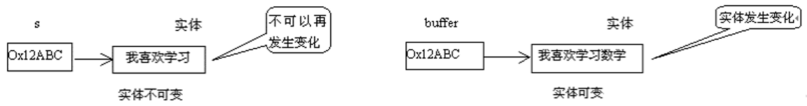

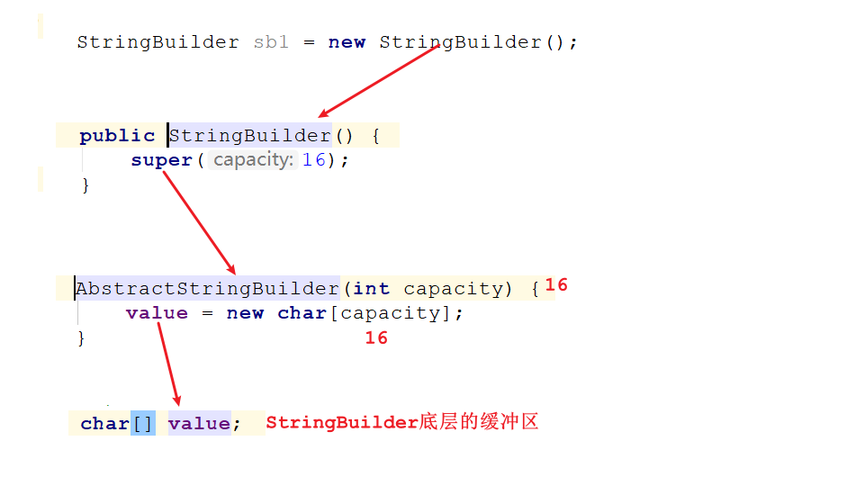

继承结构：

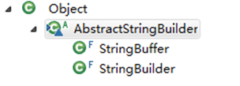

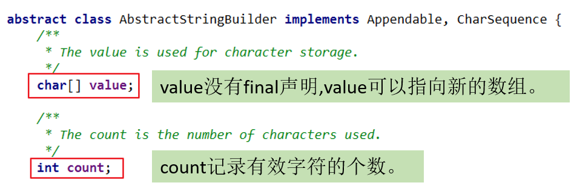

- StringBuilder 和 StringBuffer 非常类似，均代表可变的字符序列，而且提供相关功能的方法也一样。
- 区分String、StringBuffer、StringBuilder
  - String:不可变的字符序列； 底层使用char[]数组存储(JDK8.0中)
  - StringBuffer:可变的字符序列；线程安全（方法有synchronized修饰），效率低；底层使用char[]数组存储 (JDK8.0中)
  - StringBuilder:可变的字符序列； jdk1.5引入，线程不安全的，效率高；底层使用char[]数组存储(JDK8.0中)

:bulb: 在多线程环境下需要修改字符串，应该使用 `StringBuffer`;在单线程环境下或者能够保证线程安全的情况下，应该使用 `StringBuilder`，以获得更好的性能。

### 2.2 StringBuilder、StringBuffer的API

StringBuilder、StringBuffer的API是完全一致的，并且很多方法与String相同。

**1、常用API**

（1）StringBuffer append(xx)：提供了很多的append()方法，用于进行字符串追加的方式拼接
（2）StringBuffer delete(int start, int end)：删除[start,end)之间字符
（3）StringBuffer deleteCharAt(int index)：删除[index]位置字符
（4）StringBuffer replace(int start, int end, String str)：替换[start,end)范围的字符序列为str
（5）void setCharAt(int index, char c)：替换[index]位置字符
（6）char charAt(int index)：查找指定index位置上的字符
（7）StringBuffer insert(int index, xx)：在[index]位置插入xx
（8）int length()：返回存储的字符数据的长度
（9）StringBuffer reverse()：反转

**2、其它API**

（1）int indexOf(String str)：在当前字符序列中查询str的第一次出现下标
（2）int indexOf(String str, int fromIndex)：在当前字符序列[fromIndex,最后]中查询str的第一次出现下标
（3）int lastIndexOf(String str)：在当前字符序列中查询str的最后一次出现下标
（4）int lastIndexOf(String str, int fromIndex)：在当前字符序列[fromIndex,最后]中查询str的最后一次出现下标
（5）String substring(int start)：截取当前字符序列[start,最后]
（6）String substring(int start, int end)：截取当前字符序列[start,end)
（7）String toString()：返回此序列中数据的字符串表示形式
（8）void setLength(int newLength) ：设置当前字符序列长度为newLength

```java
@Test
public void test1(){
    StringBuilder s = new StringBuilder();
    s.append("hello").append(true).append('a').append(12).append("atguigu");
    System.out.println(s);
    System.out.println(s.length());
}

@Test
public void test2(){
    StringBuilder s = new StringBuilder("helloworld");
    s.insert(5, "java");
    s.insert(5, "chailinyan");
    System.out.println(s);
}

@Test
public void test3(){
    StringBuilder s = new StringBuilder("helloworld");
    s.delete(1, 3);
    s.deleteCharAt(4);
    System.out.println(s);
}
@Test
public void test4(){
    StringBuilder s = new StringBuilder("helloworld");
    s.reverse();
    System.out.println(s);
}

@Test
public void test5(){
    StringBuilder s = new StringBuilder("helloworld");
    s.setCharAt(2, 'a');
    System.out.println(s);
}

@Test
public void test6(){
    StringBuilder s = new StringBuilder("helloworld");
    s.setLength(30);
    System.out.println(s);
}
```

### 2.3 效率测试

```java
//初始设置
long startTime = 0L;
long endTime = 0L;
String text = "";
StringBuffer buffer = new StringBuffer("");
StringBuilder builder = new StringBuilder("");

//开始对比
startTime = System.currentTimeMillis();
for (int i = 0; i < 20000; i++) {
    buffer.append(String.valueOf(i));
}
endTime = System.currentTimeMillis();
System.out.println("StringBuffer的执行时间：" + (endTime - startTime));

startTime = System.currentTimeMillis();
for (int i = 0; i < 20000; i++) {
    builder.append(String.valueOf(i));
}
endTime = System.currentTimeMillis();
System.out.println("StringBuilder的执行时间：" + (endTime - startTime));

startTime = System.currentTimeMillis();
for (int i = 0; i < 20000; i++) {
    text = text + i;
}
endTime = System.currentTimeMillis();
System.out.println("String的执行时间：" + (endTime - startTime));

```

## 三、 JDK8之前：日期时间API

### 3.1 java.lang.System类的方法

- System类提供的public static long currentTimeMillis()：用来返回当前时间与1970年1月1日0时0分0秒之间以毫秒为单位的时间差。

  - 此方法适于计算时间差。

### 3.2 java.util.Date

表示特定的瞬间，精确到毫秒。

- 构造器：
  - Date()：使用无参构造器创建的对象可以获取本地当前时间。
  - Date(long 毫秒数)：把该毫秒值换算成日期时间对象
- 常用方法
  - getTime(): 返回自 1970 年 1 月 1 日 00:00:00 GMT 以来此 Date 对象表示的毫秒数。
  - toString(): 把此 Date 对象转换为以下形式的 String： dow mon dd hh:mm:ss zzz yyyy 其中： dow 是一周中的某一天 (Sun, Mon, Tue, Wed, Thu, Fri, Sat)，zzz是时间标准。
  - 其它很多方法都过时了。
- 举例：

```java
@Test
public void test1(){
    Date d = new Date();
    System.out.println(d);
}

@Test
public void test2(){
    long time = System.currentTimeMillis();
    System.out.println(time);//1559806982971
    //当前系统时间距离1970-1-1 0:0:0 0毫秒的时间差，毫秒为单位
}

@Test
public void test3(){
    Date d = new Date();
    long time = d.getTime();
    System.out.println(time);//1559807047979
}

@Test
public void test4(){
    long time = 1559807047979L;
    Date d = new Date(time);
    System.out.println(d);
}

@Test
public void test5(){
    long time = Long.MAX_VALUE;
    Date d = new Date(time);
    System.out.println(d);
}
```

### 3.3 java.text.SimpleDateFormat

- java.text.SimpleDateFormat类是一个不与语言环境有关的方式来格式化和解析日期的具体类。
- 可以进行格式化：日期 --> 文本
- 可以进行解析：文本 --> 日期
- **构造器：**
  - SimpleDateFormat() ：默认的模式和语言环境创建对象
  - public SimpleDateFormat(String pattern)：该构造方法可以用参数pattern指定的格式创建一个对象
- **格式化：**
  - public String format(Date date)：方法格式化时间对象date
- **解析：**
  - public Date parse(String source)：从给定字符串的开始解析文本，以生成一个日期。

```java
//格式化
@Test
public void test1(){
    Date d = new Date();

    SimpleDateFormat sf = new SimpleDateFormat("yyyy年MM月dd日 HH时mm分ss秒 SSS毫秒  E Z");
    //把Date日期转成字符串，按照指定的格式转
    String str = sf.format(d);
    System.out.println(str);
}
//解析
@Test
public void test2() throws ParseException{
    String str = "2022年06月06日 16时03分14秒 545毫秒  星期四 +0800";
    SimpleDateFormat sf = new SimpleDateFormat("yyyy年MM月dd日 HH时mm分ss秒 SSS毫秒  E Z");
    Date d = sf.parse(str);
    System.out.println(d);
}
```

### 3.4 java.util.Calendar(日历)

- Date类的API大部分被废弃了，替换为Calendar。

- `Calendar` 类是一个抽象类，主用用于完成日期字段之间相互操作的功能。

- 获取Calendar实例的方法

  - 使用`Calendar.getInstance()`方法

    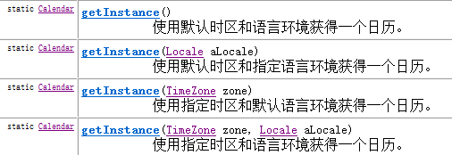

- 一个Calendar的实例是系统时间的抽象表示，可以修改或获取 YEAR、MONTH、DAY_OF_WEEK、HOUR_OF_DAY 、MINUTE、SECOND等 `日历字段`对应的时间值。

  - public int get(int field)：返回给定日历字段的值

  - public void set(int field,int value) ：将给定的日历字段设置为指定的值

  - public void add(int field,int amount)：根据日历的规则，为给定的日历字段添加或者减去指定的时间量

  - public final Date getTime()：将Calendar转成Date对象

  - public final void setTime(Date date)：使用指定的Date对象重置Calendar的时间

示例代码：

```java
import org.junit.Test;

import java.util.Calendar;
import java.util.TimeZone;

public class TestCalendar {
    @Test
    public void test1(){
        Calendar c = Calendar.getInstance();
        System.out.println(c);

        int year = c.get(Calendar.YEAR);
        int month = c.get(Calendar.MONTH)+1;
        int day = c.get(Calendar.DATE);
        int hour = c.get(Calendar.HOUR_OF_DAY);
        int minute = c.get(Calendar.MINUTE);

        System.out.println(year + "-" + month + "-" + day + " " + hour + ":" + minute);
    }

    @Test
    public void test2(){
        TimeZone t = TimeZone.getTimeZone("America/Los_Angeles");
        Calendar c = Calendar.getInstance(t);
        int year = c.get(Calendar.YEAR);
        int month = c.get(Calendar.MONTH)+1;
        int day = c.get(Calendar.DATE);
        int hour = c.get(Calendar.HOUR_OF_DAY);
        int minute = c.get(Calendar.MINUTE);

        System.out.println(year + "-" + month + "-" + day + " " + hour + ":" + minute);
    }
    
    @Test
    public void test3(){
        Calendar calendar = Calendar.getInstance();
		// 从一个 Calendar 对象中获取 Date 对象
		Date date = calendar.getTime();
        
		// 使用给定的 Date 设置此 Calendar 的时间
		date = new Date(234234235235L);
		calendar.setTime(date);
		calendar.set(Calendar.DAY_OF_MONTH, 8);
		System.out.println("当前时间日设置为8后,时间是:" + calendar.getTime());
        
		calendar.add(Calendar.HOUR, 2);
		System.out.println("当前时间加2小时后,时间是:" + calendar.getTime());
        
		calendar.add(Calendar.MONTH, -2);
		System.out.println("当前日期减2个月后,时间是:" + calendar.getTime());  
    }
}
```

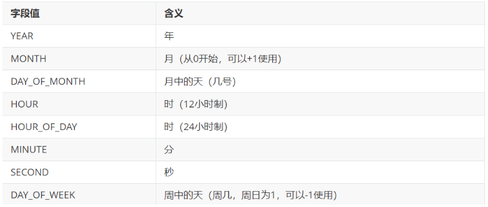

:bulb: 注意：

- 获取月份时：一月是0，二月是1，以此类推，12月是11
- 获取星期时：周日是1，周二是2 ， 。。。。周六是7

## 四、 JDK8：新的日期时间API

### 4.1 本地日期时间：LocalDate、LocalTime、LocalDateTime

| 方法                                                         | **描述**                                                     |
| ------------------------------------------------------------ | ------------------------------------------------------------ |
| `now()`/ now(ZoneId zone)                                    | 静态方法，根据当前时间创建对象/指定时区的对象                |
| `of(xx,xx,xx,xx,xx,xxx)`                                     | 静态方法，根据指定日期/时间创建对象                          |
| getDayOfMonth()/getDayOfYear()                               | 获得月份天数(1-31) /获得年份天数(1-366)                      |
| getDayOfWeek()                                               | 获得星期几(返回一个 DayOfWeek 枚举值)                        |
| getMonth()                                                   | 获得月份, 返回一个 Month 枚举值                              |
| getMonthValue() / getYear()                                  | 获得月份(1-12) /获得年份                                     |
| getHours()/getMinute()/getSecond()                           | 获得当前对象对应的小时、分钟、秒                             |
| withDayOfMonth()/withDayOfYear()/withMonth()/withYear()      | 将月份天数、年份天数、月份、年份修改为指定的值并返回新的对象 |
| with(TemporalAdjuster  t)                                    | 将当前日期时间设置为校对器指定的日期时间                     |
| plusDays(), plusWeeks(), plusMonths(), plusYears(),plusHours() | 向当前对象添加几天、几周、几个月、几年、几小时               |
| minusMonths() / minusWeeks()/minusDays()/minusYears()/minusHours() | 从当前对象减去几月、几周、几天、几年、几小时                 |
| plus(TemporalAmount t)/minus(TemporalAmount t)               | 添加或减少一个 Duration 或 Period                            |
| isBefore()/isAfter()                                         | 比较两个 LocalDate                                           |
| isLeapYear()                                                 | 判断是否是闰年（在LocalDate类中声明）                        |
| format(DateTimeFormatter  t)                                 | 格式化本地日期、时间，返回一个字符串                         |
| parse(Charsequence text)                                     | 将指定格式的字符串解析为日期、时间                           |

```java
import org.junit.Test;

import java.time.LocalDate;
import java.time.LocalDateTime;
import java.time.LocalTime;

public class TestLocalDateTime {
    @Test
    public void test01(){
        LocalDate now = LocalDate.now();
        System.out.println(now);
    }
    @Test
    public void test02(){
        LocalTime now = LocalTime.now();
        System.out.println(now);
    }
    @Test
    public void test03(){
        LocalDateTime now = LocalDateTime.now();
        System.out.println(now);
    }
    @Test
    public void test04(){
        LocalDate lai = LocalDate.of(2019, 5, 13);
        System.out.println(lai);
    }
	@Test
    public void test05(){
        LocalDate lai = LocalDate.of(2019, 5, 13);
        System.out.println(lai.getDayOfYear());
    }
	@Test
    public void test06(){
        LocalDate lai = LocalDate.of(2019, 5, 13);
        LocalDate go = lai.plusDays(160);
        System.out.println(go);//2019-10-20
    }
    @Test
    public void test7(){
        LocalDate now = LocalDate.now();
        LocalDate before = now.minusDays(100);
        System.out.println(before);//2019-02-26
    }   
}
```

### 4.2 瞬时：Instant

-  Instant：时间线上的一个瞬时点。 这可能被用来记录应用程序中的事件时间戳。
   -  时间戳是指格林威治时间1970年01月01日00时00分00秒(北京时间1970年01月01日08时00分00秒)起至现在的总秒数。
-  `java.time.Instant`表示时间线上的一点，而不需要任何上下文信息，例如，时区。概念上讲，`它只是简单的表示自1970年1月1日0时0分0秒（UTC）开始的秒数。`

| **方法**                        | **描述**                                                     |
| ------------------------------- | ------------------------------------------------------------ |
| `now()`                         | 静态方法，返回默认UTC时区的Instant类的对象                   |
| `ofEpochMilli(long epochMilli)` | 静态方法，返回在1970-01-01 00:00:00基础上加上指定毫秒数之后的Instant类的对象 |
| atOffset(ZoneOffset offset)     | 结合即时的偏移来创建一个 OffsetDateTime                      |
| `toEpochMilli()`                | 返回1970-01-01 00:00:00到当前时间的毫秒数，即为时间戳        |

> 中国大陆、中国香港、中国澳门、中国台湾、蒙古国、新加坡、马来西亚、菲律宾、西澳大利亚州的时间与UTC的时差均为+8，也就是UTC+8。
>
> instant.atOffset(ZoneOffset.ofHours(8));


> 整个地球分为二十四时区，每个时区都有自己的本地时间。北京时区是东八区，领先UTC八个小时，在电子邮件信头的Date域记为+0800。如果在电子邮件的信头中有这么一行： 
>
> Date: Fri, 08 Nov 2002 09:42:22 +0800 
>
> 说明信件的发送地的地方时间是二○○二年十一月八号，星期五，早上九点四十二分（二十二秒），这个地方的本地时领先UTC八个小时(+0800， 就是东八区时间)。电子邮件信头的Date域使用二十四小时的时钟，而不使用AM和PM来标记上下午。 

### 4.3 其它API

**1、指定时区日期时间：ZondId和ZonedDateTime**

- ZoneId：该类中包含了所有的时区信息，一个时区的ID，如 Europe/Paris

- ZonedDateTime：一个在ISO-8601日历系统时区的日期时间，如 2007-12-03T10:15:30+01:00 Europe/Paris。
  - 其中每个时区都对应着ID，地区ID都为“{区域}/{城市}”的格式，例如：Asia/Shanghai等

- 常见时区ID：

```shell
Asia/Shanghai
UTC
America/New_York
```

- 可以通过ZondId获取所有可用的时区ID：

```java
import java.time.ZoneId;
import java.time.ZonedDateTime;
import java.util.Set;

public class TestZone {
    @Test
    public void test01() {
        //需要知道一些时区的id
        //Set<String>是一个集合，容器
        Set<String> availableZoneIds = ZoneId.getAvailableZoneIds();
        //快捷模板iter
        for (String availableZoneId : availableZoneIds) {
            System.out.println(availableZoneId);
        }
    }

    @Test
    public void test02(){
        ZonedDateTime t1 = ZonedDateTime.now();
        System.out.println(t1);

        ZonedDateTime t2 = ZonedDateTime.now(ZoneId.of("America/New_York"));
        System.out.println(t2);
    }
}

```

**2、持续日期/时间：Period和Duration**

- 持续时间：Duration，用于计算两个“时间”间隔
- 日期间隔：Period，用于计算两个“日期”间隔

```java
import org.junit.Test;

import java.time.Duration;
import java.time.LocalDate;
import java.time.LocalDateTime;
import java.time.Period;

public class TestPeriodDuration {
    @Test
    public void test01(){
        LocalDate t1 = LocalDate.now();
        LocalDate t2 = LocalDate.of(2018, 12, 31);
        Period between = Period.between(t1, t2);
        System.out.println(between);

        System.out.println("相差的年数："+between.getYears());
        System.out.println("相差的月数："+between.getMonths());
        System.out.println("相差的天数："+between.getDays());
        System.out.println("相差的总数："+between.toTotalMonths());
    }

    @Test
    public void test02(){
        LocalDateTime t1 = LocalDateTime.now();
        LocalDateTime t2 = LocalDateTime.of(2017, 8, 29, 0, 0, 0, 0);
        Duration between = Duration.between(t1, t2);
        System.out.println(between);

        System.out.println("相差的总天数："+between.toDays());
        System.out.println("相差的总小时数："+between.toHours());
        System.out.println("相差的总分钟数："+between.toMinutes());
        System.out.println("相差的总秒数："+between.getSeconds());
        System.out.println("相差的总毫秒数："+between.toMillis());
        System.out.println("相差的总纳秒数："+between.toNanos());
        System.out.println("不够一秒的纳秒数："+between.getNano());
    }
    @Test
    public void test03(){
        //Duration:用于计算两个“时间”间隔，以秒和纳秒为基准
		LocalTime localTime = LocalTime.now();
		LocalTime localTime1 = LocalTime.of(15, 23, 32);
		//between():静态方法，返回Duration对象，表示两个时间的间隔
		Duration duration = Duration.between(localTime1, localTime);
		System.out.println(duration);

		System.out.println(duration.getSeconds());
		System.out.println(duration.getNano());

		LocalDateTime localDateTime = LocalDateTime.of(2016, 6, 12, 15, 23, 32);
		LocalDateTime localDateTime1 = LocalDateTime.of(2017, 6, 12, 15, 23, 32);

		Duration duration1 = Duration.between(localDateTime1, localDateTime);
		System.out.println(duration1.toDays());
    }
    
    @Test
    public void test4(){
        //Period:用于计算两个“日期”间隔，以年、月、日衡量
		LocalDate localDate = LocalDate.now();
		LocalDate localDate1 = LocalDate.of(2028, 3, 18);

		Period period = Period.between(localDate, localDate1);
		System.out.println(period);

		System.out.println(period.getYears());
		System.out.println(period.getMonths());
		System.out.println(period.getDays());

		Period period1 = period.withYears(2);
		System.out.println(period1);

    }
}

```

## 五、 Java比较器

我们知道基本数据类型的数据（除boolean类型外）需要比较大小的话，之间使用比较运算符即可，但是引用数据类型是不能直接使用比较运算符来比较大小的。那么，如何解决这个问题呢？


- 在Java中经常会涉及到对象数组的排序问题，那么就涉及到对象之间的比较问题。


- Java实现对象排序的方式有两种：
  - 自然排序：java.lang.Comparable
  - 定制排序：java.util.Comparator

### 5.1 自然排序：java.lang.Comparable

- Comparable接口强行对实现它的每个类的对象进行整体排序。这种排序被称为类的自然排序。
- 实现 Comparable 的类必须实现 `compareTo(Object obj) `方法，两个对象即通过 compareTo(Object obj) 方法的返回值来比较大小。如果当前对象this大于形参对象obj，则返回正整数，如果当前对象this小于形参对象obj，则返回负整数，如果当前对象this等于形参对象obj，则返回零。

```java
package java.lang;

public interface Comparable{
    int compareTo(Object obj);
}
```

- 实现Comparable接口的对象列表（和数组）可以通过 Collections.sort 或 Arrays.sort进行自动排序。实现此接口的对象可以用作有序映射中的键或有序集合中的元素，无需指定比较器。
- 对于类 C 的每一个 e1 和 e2 来说，当且仅当 e1.compareTo(e2) == 0 与 e1.equals(e2) 具有相同的 boolean 值时，类 C 的自然排序才叫做与 equals 一致。建议（虽然不是必需的）`最好使自然排序与 equals 一致`。

- Comparable 的典型实现：(`默认都是从小到大排列的`)
  - String：按照字符串中字符的Unicode值进行比较
  - Character：按照字符的Unicode值来进行比较
  - 数值类型对应的包装类以及BigInteger、BigDecimal：按照它们对应的数值大小进行比较
  - Boolean：true 对应的包装类实例大于 false 对应的包装类实例
  - Date、Time等：后面的日期时间比前面的日期时间大

- 代码示例：

```java
package com.atguigu.api;

public class Student implements Comparable {
    private int id;
    private String name;
    private int score;
    private int age;

    public Student(int id, String name, int score, int age) {
        this.id = id;
        this.name = name;
        this.score = score;
        this.age = age;
    }

    public int getId() {
        return id;
    }

    public void setId(int id) {
        this.id = id;
    }

    public String getName() {
        return name;
    }

    public void setName(String name) {
        this.name = name;
    }

    public int getScore() {
        return score;
    }

    public void setScore(int score) {
        this.score = score;
    }

    public int getAge() {
        return age;
    }

    public void setAge(int age) {
        this.age = age;
    }

    @Override
    public String toString() {
        return "Student{" +
                "id=" + id +
                ", name='" + name + '\'' +
                ", score=" + score +
                ", age=" + age +
                '}';
    }

    @Override
    public int compareTo(Object o) {
        //这些需要强制，将o对象向下转型为Student类型的变量，才能调用Student类中的属性
        //默认按照学号比较大小
        Student stu = (Student) o;
        return this.id - stu.id;
    }
}
```

测试类

```java
package com.atguigu.api;

public class TestStudent {
    public static void main(String[] args) {
        Student[] arr = new Student[5];
        arr[0] = new Student(3,"张三",90,23);
        arr[1] = new Student(1,"熊大",100,22);
        arr[2] = new Student(5,"王五",75,25);
        arr[3] = new Student(4,"李四",85,24);
        arr[4] = new Student(2,"熊二",85,18);

        //单独比较两个对象
        System.out.println(arr[0].compareTo(arr[1]));
        System.out.println(arr[1].compareTo(arr[2]));
        System.out.println(arr[2].compareTo(arr[2]));

        System.out.println("所有学生：");
        for (int i = 0; i < arr.length; i++) {
            System.out.println(arr[i]);
        }
        System.out.println("按照学号排序：");
        for (int i = 1; i < arr.length; i++) {
            for (int j = 0; j < arr.length-i; j++) {
                if(arr[j].compareTo(arr[j+1])>0){
                    Student temp = arr[j];
                    arr[j] = arr[j+1];
                    arr[j+1] = temp;
                }
            }
        }
        for (int i = 0; i < arr.length; i++) {
            System.out.println(arr[i]);
        }
    }
}

```

### 5.2 定制排序：java.util.Comparator

- 思考
  - 当元素的类型没有实现java.lang.Comparable接口而又不方便修改代码（例如：一些第三方的类，你只有.class文件，没有源文件）
  - 如果一个类，实现了Comparable接口，也指定了两个对象的比较大小的规则，但是此时此刻我不想按照它预定义的方法比较大小，但是我又不能随意修改，因为会影响其他地方的使用，怎么办？
- JDK在设计类库之初，也考虑到这种情况，所以又增加了一个java.util.Comparator接口。强行对多个对象进行整体排序的比较。
  - 重写compare(Object o1,Object o2)方法，比较o1和o2的大小：如果方法返回正整数，则表示o1大于o2；如果返回0，表示相等；返回负整数，表示o1小于o2。
  - 可以将 Comparator 传递给 sort 方法（如 Collections.sort 或 Arrays.sort），从而允许在排序顺序上实现精确控制。

```java
package java.util;

public interface Comparator{
    int compare(Object o1,Object o2);
}
```

举例：

```java
package com.atguigu.api;

import java.util.Comparator;
//定义定制比较器类
public class StudentScoreComparator implements Comparator { 
    @Override
    public int compare(Object o1, Object o2) {
        Student s1 = (Student) o1;
        Student s2 = (Student) o2;
        int result = s1.getScore() - s2.getScore();
        return result != 0 ? result : s1.getId() - s2.getId();
    }
}
```

测试类

```java
package com.atguigu.api;

public class TestStudent {
    public static void main(String[] args) {
        Student[] arr = new Student[5];
        arr[0] = new Student(3, "张三", 90, 23);
        arr[1] = new Student(1, "熊大", 100, 22);
        arr[2] = new Student(5, "王五", 75, 25);
        arr[3] = new Student(4, "李四", 85, 24);
        arr[4] = new Student(2, "熊二", 85, 18);


        System.out.println("所有学生：");
        for (int i = 0; i < arr.length; i++) {
            System.out.println(arr[i]);
        }

        System.out.println("按照成绩排序");
        StudentScoreComparator sc = new StudentScoreComparator();
        for (int i = 1; i < arr.length; i++) {
            for (int j = 0; j < arr.length - i; j++) {
                if (sc.compare(arr[j], arr[j + 1]) > 0) {
                    Student temp = arr[j];
                    arr[j] = arr[j + 1];
                    arr[j + 1] = temp;
                }
            }
        }
        for (int i = 0; i < arr.length; i++) {
            System.out.println(arr[i]);
        }
    }
}
```

## 六、系统相关类

### 6.1 java.lang.System类

- System类代表系统，系统级的很多属性和控制方法都放置在该类的内部。该类位于`java.lang包`。

- 由于该类的构造器是private的，所以无法创建该类的对象。其内部的成员变量和成员方法都是`static的`，所以也可以很方便的进行调用。

- 成员变量   Scanner scan = new Scanner(System.in);

  - System类内部包含`in`、`out`和`err`三个成员变量，分别代表标准输入流(键盘输入)，标准输出流(显示器)和标准错误输出流(显示器)。

- 成员方法

  - `native long currentTimeMillis()`：
    该方法的作用是返回当前的计算机时间，时间的表达格式为当前计算机时间和GMT时间(格林威治时间)1970年1月1号0时0分0秒所差的毫秒数。

  - `void exit(int status)`：
    该方法的作用是退出程序。其中status的值为0代表正常退出，非零代表异常退出。使用该方法可以在图形界面编程中实现程序的退出功能等。

  - `void gc()`：
    该方法的作用是请求系统进行垃圾回收。至于系统是否立刻回收，则取决于系统中垃圾回收算法的实现以及系统执行时的情况。

  - `String getProperty(String key)`：
    该方法的作用是获得系统中属性名为key的属性对应的值。系统中常见的属性名以及属性的作用如下表所示：

    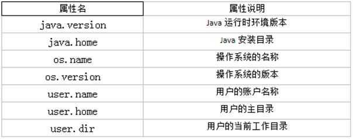

- 举例

```java
import org.junit.Test;

public class TestSystem {
    @Test
    public void test01(){
        long time = System.currentTimeMillis();
        System.out.println("现在的系统时间距离1970年1月1日凌晨：" + time + "毫秒");

        System.exit(0);

        System.out.println("over");//不会执行
    }

    @Test
    public void test02(){
        String javaVersion = System.getProperty("java.version");
		System.out.println("java的version:" + javaVersion);

		String javaHome = System.getProperty("java.home");
		System.out.println("java的home:" + javaHome);

		String osName = System.getProperty("os.name");
		System.out.println("os的name:" + osName);

		String osVersion = System.getProperty("os.version");
		System.out.println("os的version:" + osVersion);

		String userName = System.getProperty("user.name");
		System.out.println("user的name:" + userName);

		String userHome = System.getProperty("user.home");
		System.out.println("user的home:" + userHome);

		String userDir = System.getProperty("user.dir");
		System.out.println("user的dir:" + userDir);
    }

    @Test
    public void test03() throws InterruptedException {
        for (int i=1; i <=10; i++){
            MyDemo my = new MyDemo(i);
            //每一次循环my就会指向新的对象，那么上次的对象就没有变量引用它了，就成垃圾对象
        }

        //为了看到垃圾回收器工作，我要加下面的代码，让main方法不那么快结束，因为main结束就会导致JVM退出，GC也会跟着结束。
        System.gc();//如果不调用这句代码，GC可能不工作，因为当前内存很充足，GC就觉得不着急回收垃圾对象。
        			//调用这句代码，会让GC尽快来工作。
        Thread.sleep(5000);
    }
}

class MyDemo{
    private int value;

    public MyDemo(int value) {
        this.value = value;
    }

    @Override
    public String toString() {
        return "MyDemo{" + "value=" + value + '}';
    }

    //重写finalize方法，让大家看一下它的调用效果
    @Override
    protected void finalize() throws Throwable {
//        正常重写，这里是编写清理系统内存的代码
//        这里写输出语句是为了看到finalize()方法被调用的效果
        System.out.println(this+ "轻轻的我走了，不带走一段代码....");
    }
}
```

- `static void arraycopy(Object src, int srcPos, Object dest, int destPos, int length)`： 

从指定源数组中复制一个数组，复制从指定的位置开始，到目标数组的指定位置结束。常用于数组的插入和删除

```java
import org.junit.Test;

import java.util.Arrays;

public class TestSystemArrayCopy {
    @Test
    public void test01(){
        int[] arr1 = {1,2,3,4,5};
        int[] arr2 = new int[10];
        System.arraycopy(arr1,0,arr2,3,arr1.length);
        System.out.println(Arrays.toString(arr1));
        System.out.println(Arrays.toString(arr2));
    }

    @Test
    public void test02(){
        int[] arr = {1,2,3,4,5};
        System.arraycopy(arr,0,arr,1,arr.length-1);
        System.out.println(Arrays.toString(arr));
    }

    @Test
    public void test03(){
        int[] arr = {1,2,3,4,5};
        System.arraycopy(arr,1,arr,0,arr.length-1);
        System.out.println(Arrays.toString(arr));
    }
}
```

### 6.2 java.lang.Runtime类

每个 Java 应用程序都有一个 `Runtime` 类实例，使应用程序能够与其运行的环境相连接。

`public static Runtime getRuntime()`： 返回与当前 Java 应用程序相关的运行时对象。应用程序不能创建自己的 Runtime 类实例。

`public long totalMemory()`：返回 Java 虚拟机中初始化时的内存总量。此方法返回的值可能随时间的推移而变化，这取决于主机环境。默认为物理电脑内存的1/64。

`public long maxMemory()`：返回 Java 虚拟机中最大程度能使用的内存总量。默认为物理电脑内存的1/4。

`public long freeMemory()`：返回 Java 虚拟机中的空闲内存量。调用 gc 方法可能导致 freeMemory 返回值的增加。

```java
package com.atguigu.system;

public class TestRuntime {
    public static void main(String[] args) {
        Runtime runtime = Runtime.getRuntime();
        long initialMemory = runtime.totalMemory(); //获取虚拟机初始化时堆内存总量
        long maxMemory = runtime.maxMemory(); //获取虚拟机最大堆内存总量
        String str = "";
        //模拟占用内存
        for (int i = 0; i < 10000; i++) {
            str += i;
        }
        long freeMemory = runtime.freeMemory(); //获取空闲堆内存总量
        System.out.println("总内存：" + initialMemory / 1024 / 1024 * 64 + "MB");
        System.out.println("总内存：" + maxMemory / 1024 / 1024 * 4 + "MB");
        System.out.println("空闲内存：" + freeMemory / 1024 / 1024 + "MB") ;
        System.out.println("已用内存：" + (initialMemory-freeMemory) / 1024 / 1024 + "MB");
    }
}
```

```
E:\JAVA17\bin\java.exe -ea -Didea.test.cyclic.buffer.size=1048576 -javaagent:C:\Users\小Tiger\AppData\Local\JetBrains\Toolbox\apps\IDEA-U\ch-0\232.9921.47\lib\idea_rt.jar=2136:C:\Users\小Tiger\AppData\Local\JetBrains\Toolbox\apps\IDEA-U\ch-0\232.9921.47\bin -Dfile.encoding=UTF-8 -classpath C:\Users\小Tiger\AppData\Local\JetBrains\Toolbox\apps\IDEA-U\ch-0\232.9921.47\lib\idea_rt.jar;C:\Users\小Tiger\AppData\Local\JetBrains\Toolbox\apps\IDEA-U\ch-0\232.9921.47\plugins\junit\lib\junit5-rt.jar;C:\Users\小Tiger\AppData\Local\JetBrains\Toolbox\apps\IDEA-U\ch-0\232.9921.47\plugins\junit\lib\junit-rt.jar;E:\data\projectJava\projectOne\out\production\projectOne;F:\Lecture\Java资料\06_软件与资料\06_软件与资料\05-资料\junit-libs\hamcrest-core-1.3.jar;F:\Lecture\Java资料\06_软件与资料\06_软件与资料\05-资料\junit-libs\junit-4.12.jar com.intellij.rt.junit.JUnitStarter -ideVersion5 -junit4 stringClass.StringTest,runtime
总内存：16384MB
总内存：16328MB
空闲内存：125MB
已用内存：130MB

Process finished with exit code 0

```

## 七、 和数学相关的类

### 7.1 java.lang.Math

`java.lang.Math` 类包含用于执行基本数学运算的方法，如初等指数、对数、平方根和三角函数。类似这样的工具类，其所有方法均为静态方法，并且不会创建对象，调用起来非常简单。

* `public static double abs(double a) ` ：返回 double 值的绝对值。 

```java
double d1 = Math.abs(-5); //d1的值为5
double d2 = Math.abs(5); //d2的值为5
```

* `public static double ceil(double a)` ：返回大于等于参数的最小的整数。

```java
double d1 = Math.ceil(3.3); //d1的值为 4.0
double d2 = Math.ceil(-3.3); //d2的值为 -3.0
double d3 = Math.ceil(5.1); //d3的值为 6.0
```

* `public static double floor(double a) ` ：返回小于等于参数最大的整数。

```java
double d1 = Math.floor(3.3); //d1的值为3.0
double d2 = Math.floor(-3.3); //d2的值为-4.0
double d3 = Math.floor(5.1); //d3的值为 5.0
```

* `public static long round(double a)` ：返回最接近参数的 long。(相当于四舍五入方法)  

```java
long d1 = Math.round(5.5); //d1的值为6
long d2 = Math.round(5.4); //d2的值为5
long d3 = Math.round(-3.3); //d3的值为-3
long d4 = Math.round(-3.8); //d4的值为-4
```

* public static double pow(double a,double b)：返回a的b幂次方法
* public static double sqrt(double a)：返回a的平方根
* `public static double random()`：返回[0,1)的随机值
* public static final double PI：返回圆周率
* public static double max(double x, double y)：返回x,y中的最大值
* public static double min(double x, double y)：返回x,y中的最小值
* 其它：acos,asin,atan,cos,sin,tan 三角函数

```java
double result = Math.pow(2,31);
double sqrt = Math.sqrt(256);
double rand = Math.random();
double pi = Math.PI;
```

### 7.2 java.util.Random

用于产生随机数

* `boolean nextBoolean()`:返回下一个伪随机数，它是取自此随机数生成器序列的均匀分布的 boolean 值。 

* `void nextBytes(byte[] bytes)`:生成随机字节并将其置于用户提供的 byte 数组中。 

* `double nextDouble()`:返回下一个伪随机数，它是取自此随机数生成器序列的、在 0.0 和 1.0 之间均匀分布的 double 值。 

* `float nextFloat()`:返回下一个伪随机数，它是取自此随机数生成器序列的、在 0.0 和 1.0 之间均匀分布的 float 值。 

* `double nextGaussian()`:返回下一个伪随机数，它是取自此随机数生成器序列的、呈高斯（“正态”）分布的 double 值，其平均值是 0.0，标准差是 1.0。 

* `int nextInt()`:返回下一个伪随机数，它是此随机数生成器的序列中均匀分布的 int 值。 

* `int nextInt(int n)`:返回一个伪随机数，它是取自此随机数生成器序列的、在 0（包括）和指定值（不包括）之间均匀分布的 int 值。 

* `long nextLong()`:返回下一个伪随机数，它是取自此随机数生成器序列的均匀分布的 long 值。 

```java
@Test
public void test04(){
    Random r = new Random();
    System.out.println("随机整数：" + r.nextInt());
    System.out.println("随机小数：" + r.nextDouble());
    System.out.println("随机布尔值：" + r.nextBoolean());
}
```

