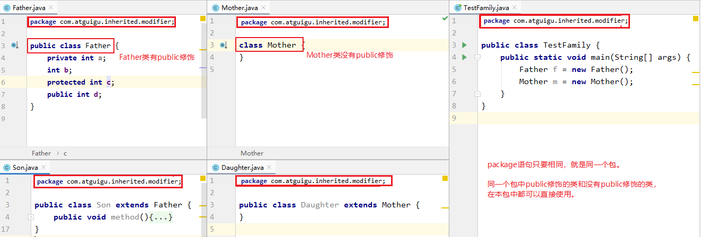
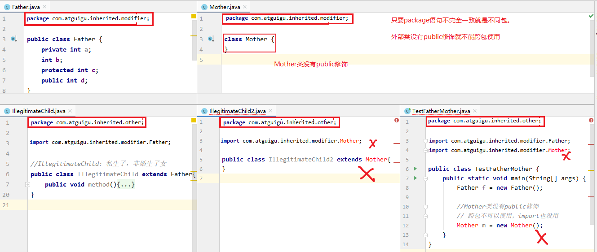
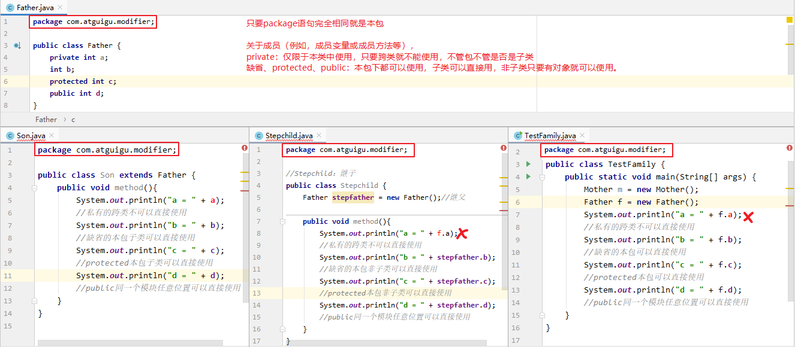
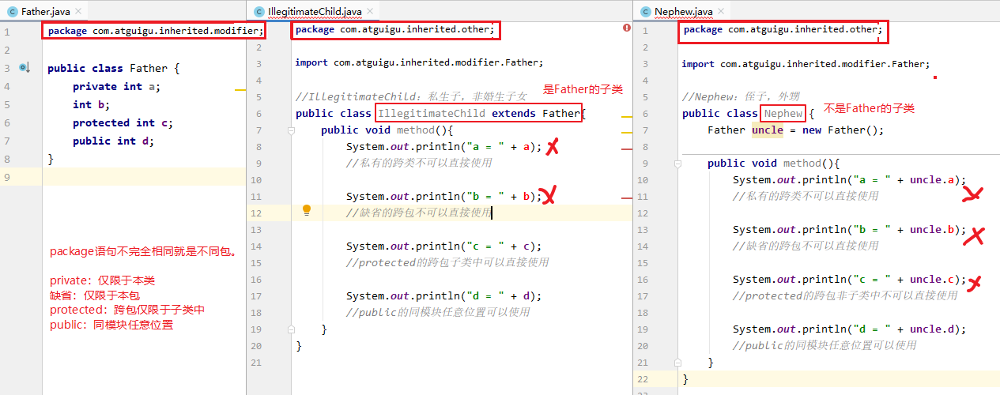
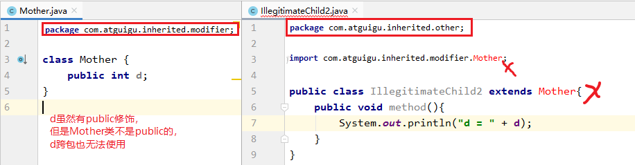
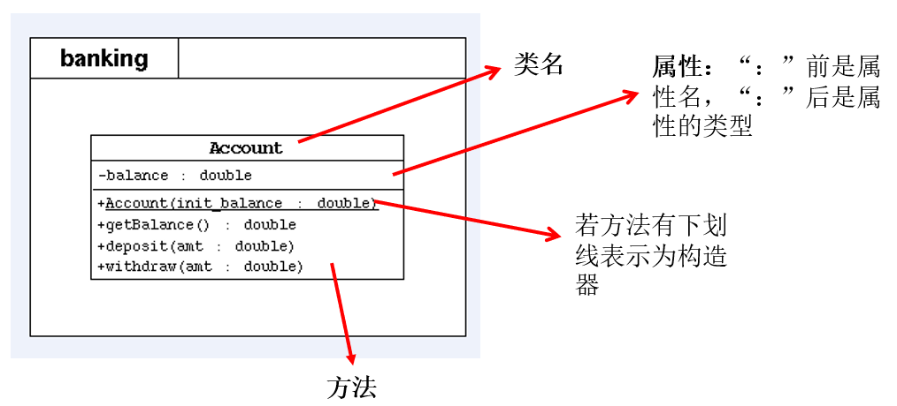
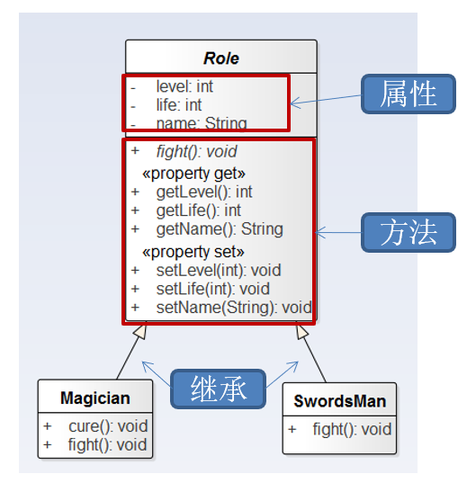

# Java面向对象编程

`三个关键点`

1. Java类及成员：属性、方法、构造器、代码块 和 内部类
2. 面向对象的特征：封装、继承、多态
3. 关键字的使用：this、super、package、import、static、final、interface、abstract


> 补充
>
> 1. 面向过程的程序设计思想：
>    1. 关注焦点是`过程`：代码重复出现的部分，把这个过程抽取为一个函数
>    2. 典型语言：C
>    3. 代码结构：以 函数 为组织单位
> 2. 面向对象的程序设计思想：
>    1. 关注的焦点是`类`：参照现实事物，将事物的属性特征、行为特征抽象出来
>    2. 典型语言：Java、C#、C++、Python、Ruby、Php
>    3. 代码结构：以类为组织单位，每个事物有自己的属性 和 行为


## 一、类与对象概述

#### 1、类

具有相同特征的事物的抽象描述， 是`抽象的`、概念上的定义


#### 2、对象

实际存在的该类事物的`每个个体，是具体的`，俗称`实例`


#### 3、类的声明与使用

```java
//类的声明
public class Phone{
    
}
//类的使用
public class PhoneTest{
    public static void main(String[] args){
        Phone p1 = new Phone()
    }
}
```


## 二、类的实例化剖析 和 内存解析

堆：方法定义的变量

栈：new 出来的结构，如数组实体 和 对象实体

方法区：存放类的模板


## 三、类的成员

#### 1、属性

##### 分类

- 按数据类型

  - 基本类型（8）
    - byte
    - short
    - int
    - long
    - float
    - double
    - boolean
    - char
  - 引用数据类型（数组、类、接口、枚举、注解 和 记录）

- 按变量声明的位置 

  - 成员变量

    - ```java
      public class student{
          Stromg mame; //成员变量
      }
      ```

  - 局部变量

    - 方法内的变量
    - 方法形参
    - 构造器内
    - 构造器形参
    - 代码块内

  - 两者区别

    - 1、声明位置和方式
      （1）实例变量：在类中方法外
      （2）局部变量：在方法体{}中或方法的形参列表、代码块中
    - 2、在内存中存储的位置不同
      （1）实例变量：堆
      （2）局部变量：栈
    - 3、生命周期
      （1）实例变量：和对象的生命周期一样，随着对象的创建而存在，随着对象被GC回收而消亡，
      			而且每一个对象的实例变量是独立的。
      （2）局部变量：和方法调用的生命周期一样，每一次方法被调用而在存在，随着方法执行的结束而消亡，而且每一次方法调用都是独立。
    - 4、作用域
      （1）实例变量：通过对象就可以使用，本类中直接调用，其他类中“对象.实例变量”
      （2）局部变量：出了作用域就不能使用
    - 5、修饰符（后面来讲）
      （1）实例变量：public,protected,private,final,volatile,transient等
      （2）局部变量：final
    - 6、默认值
      （1）实例变量：有默认值
      （2）局部变量：没有，必须手动初始化。其中的形参比较特殊，靠实参给它初始化。


#### 2、方法

##### 1、声明方法的语法格式

```java
[修饰符] 返回值类型 方法名([形参列表])[throws 异常列表]{
        方法体的功能代码
}
```

（1）一个完整的方法 = 方法头 + 方法体。

- 方法头就是`[修饰符] 返回值类型 方法名([形参列表])[throws 异常列表]`，也称为`方法签名`。通常调用方法时只需要关注方法头就可以，从方法头可以看出这个方法的功能和调用格式。
- 方法体就是方法被调用后要执行的代码。对于调用者来说，不了解方法体如何实现的，并不影响方法的使用。

**（2）方法头可能包含5个部分**

- **修饰符**：可选的。方法的修饰符也有很多，例如：public、protected、private、static、abstract、native、final、synchronized等，后面会一一学习。
  - 其中，权限修饰符有public、protected、private。在讲封装性之前，我们先默认使用pulbic修饰方法。
  - 其中，根据是否有static，可以将方法分为静态方法和非静态方法。其中静态方法又称为类方法，非静态方法又称为实例方法。咱们在讲static前先学习实例方法。

- **返回值类型**： 表示方法运行的结果的数据类型，方法执行后将结果返回到调用者。
  - 无返回值，则声明：void
  - 有返回值，则声明出返回值类型（可以是任意类型）。与方法体中“`return 返回值`”搭配使用

- **方法名**：属于标识符，命名时遵循标识符命名规则和规范，“见名知意”

- **形参列表**：表示完成方法体功能时需要外部提供的数据列表。可以包含零个，一个或多个参数。
  - 无论是否有参数，()不能省略
  - 如果有参数，每一个参数都要指定数据类型和参数名，多个参数之间使用逗号分隔，例如：
    - 一个参数： (数据类型  参数名)
    - 二个参数： (数据类型1  参数1,  数据类型2  参数2) 
  - 参数的类型可以是基本数据类型、引用数据类型

- **throws 异常列表**：可选，在【第09章-异常处理】章节再讲

**（3）方法体**：方法体必须有{}括起来，在{}中编写完成方法功能的代码

**（4）关于方法体中return语句的说明：**

- return语句的作用是结束方法的执行，并将方法的结果返回去

- 如果返回值类型不是void，方法体中必须保证一定有 return 返回值; 语句，并且要求该返回值结果的类型与声明的返回值类型一致或兼容。
- 如果返回值类型为void时，方法体中可以没有return语句，如果要用return语句提前结束方法的执行，那么return后面不能跟返回值，直接写return ; 就可以。
- return语句后面就不能再写其他代码了，否则会报错：Unreachable code

补充：方法的分类：按照是否有形参及返回值


##### 2、代码示例

```java
package com.atguigu04.example.exer4;

public class MyArrays {

    /**
     * 获取int[]数组的最大值
     * @param arr 要获取最大值的数组
     * @return 数组的最大值
     */
    public int getMax(int[] arr){
        int max = arr[0];
        for (int i = 1; i < arr.length; i++) {
            if(max < arr[i]){
                max = arr[i];
            }
        }
        return max;
    }

    /**
     * 获取int[]数组的最小值
     * @param arr 要获取最小值的数组
     * @return  数组的最小值
     */
    public int getMin(int[] arr){
        int min = arr[0];
        for (int i = 1; i < arr.length; i++) {
            if(min > arr[i]){
                min = arr[i];
            }
        }
        return min;
    }

    public int getSum(int[] arr){
        int sum = 0;
        for (int i = 0; i < arr.length; i++) {
            sum += arr[i];
        }
        return sum;
    }

    public int getAvg(int[] arr){

        return getSum(arr) / arr.length;
    }

    public void print(int[] arr){ //[12,231,34]
        System.out.print("[");

        for (int i = 0; i < arr.length; i++) {
            if(i == 0){
                System.out.print(arr[i]);
            }else{
                System.out.print("," + arr[i]);
            }
        }

        System.out.println("]");
    }

    public int[] copy(int[] arr){
        int[] newArr = new int[arr.length];
        for (int i = 0; i < arr.length; i++) {
            newArr[i] = arr[i];
        }
        return newArr;
    }

    public void reverse(int[] arr){
        for(int i = 0,j = arr.length - 1;i < j;i++,j--){
            //交互arr[i] 与 arr[j]位置的元素
            int temp = arr[i];
            arr[i] = arr[j];
            arr[j] = temp;
        }
    }

    public void sort(int[] arr){
        for(int j = 0;j < arr.length - 1;j++){
            for (int i = 0; i < arr.length - 1 - j; i++) {
                if(arr[i] > arr[i + 1]){
                    //交互arr[i] 和 arr[i + 1]
                    int temp = arr[i];
                    arr[i] = arr[i + 1];
                    arr[i + 1] = temp;
                }

            }
        }
    }

    /**
     * 使用线性查找的算法，查找指定的元素
     * @param arr 待查找的数组
     * @param target 要查找的元素
     * @return target元素在arr数组中的索引位置。若未找到，则返回-1
     */
    public int linearSearch(int[] arr,int target){

        for(int i = 0;i < arr.length;i++){
            if(target == arr[i]){
                return i;
            }

        }

        //只要代码执行到此位置，一定是没找到
        return -1;

    }

}
```

##### 3、方法重载

- **方法重载**：在同一个类中，允许存在一个以上的同名方法，只要它们的参数列表不同即可。
  - 参数列表不同，意味着参数个数或参数类型的不同
- **重载的特点**：与修饰符、返回值类型无关，只看参数列表，且参数列表必须不同。(参数个数或参数类型)。调用时，根据方法参数列表的不同来区别。
- **重载方法调用**：JVM通过方法的参数列表，调用匹配的方法。
  - 先找个数、类型最匹配的
  - 再找个数和类型可以兼容的，如果同时多个方法可以兼容将会报错

举例1：

```java
//System.out.println()方法就是典型的重载方法，其内部的声明形式如下：
public class PrintStream {
    public void println(byte x)
	public void println(short x)
	public void println(int x)
	public void println(long x)
	public void println(float x)
	public void println(double x)
	public void println(char x)
	public void println(double x)
	public void println()

}

public class HelloWorld{
    public static void main(String[] args) {
        System.out.println(3);
        System.out.println(1.2f);
        System.out.println("hello!");
    }
}

```

​	举例2：

```java
//返回两个整数的和
public int add(int x,int y){
    return x+y;
}

//返回三个整数的和
public int add(int x,int y,int z){
    return x+y+z;
}
//返回两个小数的和
public double add(double x,double y){
    return x+y;
}

```

:bulb: 规避空指针小技巧

"asc".equals(sortMethod)  ，否则可能导致null.equals(),空指针情况

```java
public void sort(int[] arr,String sortMethod){
    if("asc".equals(sortMethod)){//if(sortMethod.equals("asc")){ //ascend:升序
        for(int j = 0;j < arr.length - 1;j++){
            for (int i = 0; i < arr.length - 1 - j; i++) {
                if(arr[i] > arr[i + 1]){
                    swap(arr,i,i+1);
                }
            }
        }
    }else if("desc".equals(sortMethod)){
        for(int j = 0;j < arr.length - 1;j++){
            for (int i = 0; i < arr.length - 1 - j; i++) {
                if(arr[i] < arr[i + 1]){
                    swap(arr,i,i+1);
                }
            }
        }
    }else{
        System.out.println("你输入的排序方式有误");
    } 
}  
private void swap(int[] arr,int i,int j){
    int temp = arr[i];
    arr[i] = arr[j];
    arr[j] = temp;
}
```

:bulb: 系统终止命令 

```java
System.exit(0)
```


#### 3、构造器

new对象，并在new对象的时候为实例变量赋值。举例：Person p = new `Person(“Peter”,15)`;

##### 举例

:bulb: 使用说明

1. 构造器名必须与它所在的类名必须相同。
2. 它没有返回值，所以不需要返回值类型，也不需要void。
3. 构造器的修饰符只能是权限修饰符，不能被其他任何修饰。比如，不能被static、final、synchronized、abstract、native修饰，不能有return语句返回值。

```java
public class Student {
    private String name;
    private int age;

    // 无参构造
    public Student() {}

    // 有参构造
    public Student(String n,int a) {
        name = n;
        age = a;
    }

    public String getName() {
        return name;
    }
    public void setName(String n) {
        name = n;
    }
    public int getAge() {
        return age;
    }
    public void setAge(int a) {
        age = a;
    }

    public String getInfo(){
        return "姓名：" + name +"，年龄：" + age;
    }
}

```

```java
public class TestStudent {
    public static void main(String[] args) {
        //调用无参构造创建学生对象
        Student s1 = new Student();

        //调用有参构造创建学生对象
        Student s2 = new Student("张三",23);

        System.out.println(s1.getInfo());
        System.out.println(s2.getInfo());
    }
}
```

> 补充：
>
> 1. 当我们显式的定义类的构造器以后，系统就不再提供默认的无参的构造器了。
>
> 2. 在类中，至少会存在一个构造器。
>
> 3. 构造器是可以重载的。


#### 4、关键词使用

##### package

```java
//语法格式
package 顶层包名.子包名 ;
```

###### 举例

pack1\pack2\PackageTest.java

```java
package pack1.pack2;    //指定类PackageTest属于包pack1.pack2

public class PackageTest{
	public void display(){
		System.out.println("in  method display()");
	}
}
```

###### 说明

- 一个源文件只能有一个声明包的package语句
- package语句作为Java源文件的第一条语句出现。若缺省该语句，则指定为无名包。
- 包名，属于标识符，满足标识符命名的规则和规范（全部小写）、见名知意
  - 包通常使用所在公司域名的倒置：com.XXX.xxx。
  - 大家取包名时不要使用"`java.xx`"包
- 包对应于文件系统的目录，package语句中用 “.” 来指明包(目录)的层次，每.一次就表示一层文件目录。
- 同一个包下可以声明多个结构（类、接口），但是不能定义同名的结构（类、接口）。不同的包下可以定义同名的结构（类、接口）

###### JDK常见包介绍

`java.lang`----包含一些Java语言的核心类，如String、Math、Integer、 System和Thread，提供常用功能（默认不需要）
`java.net`----包含执行与网络相关的操作的类和接口。
`java.io`   ----包含能提供多种输入/输出功能的类。
`java.util`----包含一些实用工具类，如定义系统特性、接口的集合框架类、使用与日期日历相关的函数。
`java.text`----包含了一些java格式化相关的类
`java.sql`----包含了java进行JDBC数据库编程的相关类/接口
`java.awt`----包含了构成抽象窗口工具集（abstract window toolkits）的多个类，这些类被用来构建和管理应用程序的图形用户界面(GUI)。  

##### package进阶补充（4种权限修饰符）

权限修饰符：public,protected,缺省,private

| 修饰符    | 本类 | 本包                      | 其他包子类                  | 其他包非子类 |
| --------- | ---- | ------------------------- | --------------------------- | ------------ |
| private   | √    | ×                         | ×                           | ×            |
| 缺省      | √    | √（本包子类非子类都可见） | ×                           | ×            |
| protected | √    | √（本包子类非子类都可见） | √（其他包仅限于子类中可见） | ×            |
| public    | √    | √                         | √                           | √            |

外部类：public和缺省

成员变量、成员方法等：public,protected,缺省,private

###### **1、外部类要跨包使用必须是public，否则仅限于本包使用**

（1）外部类的权限修饰符如果缺省，本包使用没问题



（2）外部类的权限修饰符如果缺省，跨包使用有问题



###### **2、成员的权限修饰符问题**

（1）本包下使用：成员的权限修饰符可以是public、protected、缺省



（2）跨包下使用：要求严格



（3）跨包使用时，如果类的权限修饰符缺省，成员权限修饰符>类的权限修饰符也没有意义




##### import

```java
import 包名.类名;
```

###### 举例

```java
import pack1.pack2.Test;   //import pack1.pack2.*;表示引入pack1.pack2包中的所有结构

public class PackTest{
	public static void main(String args[]){
		Test t = new Test();          //Test类在pack1.pack2包中定义
		t.display();
	}
}
```

###### 注意事项

- import语句，声明在包的声明和类的声明之间。

- 如果需要导入多个类或接口，那么就并列显式多个import语句即可

- 如果使用`a.*`导入结构，表示可以导入a包下的所有的结构。举例：可以使用java.util.*的方式，一次性导入util包下所有的类或接口。

- 如果导入的类或接口是java.lang包下的，或者是当前包下的，则可以省略此import语句。

- 如果已经导入java.a包下的类，那么如果需要使用a包的子包下的类的话，仍然需要导入。

- 如果在代码中使用不同包下的同名的类，那么就需要使用类的全类名的方式指明调用的是哪个类。

- （了解）`import static`组合的使用：调用指定类或接口下的静态的属性或方法


## 四、面向对象特征一（封装 继承 多态）

##### 封装性

- 实现封装就是控制类或成员的可见性范围。这就需要依赖访问控制修饰符，也称为权限修饰符来控制。


- 权限修饰符：`public`、`protected`、`缺省`、`private`。具体访问范围如下：


| 修饰符    | 本类内部 | 本包内 | 其他包的子类 | 其他包非子类 |
| --------- | -------- | ------ | ------------ | ------------ |
| private   | √        | ×      | ×            | ×            |
| 缺省      | √        | √      | ×            | ×            |
| protected | √        | √      | √            | ×            |
| public    | √        | √      | √            | √            |

> 注意：
>
> 开发中，一般成员实例变量都习惯使用private修饰，再提供相应的public权限的get/set方法访问。
>
> 对于final的实例变量，不提供set()方法。（后面final关键字的时候讲）
>
> 对于static final的成员变量，习惯上使用public修饰。

**概述：私有化类的成员变量，提供公共的get和set方法，对外暴露获取和修改属性的功能。**

实现步骤：

**①** 使用 `private` 修饰成员变量

```java
private 数据类型 变量名 ；
```

代码如下：

```java
public class Person {
    private String name;
  	private int age;
    private boolean marry;
}
```

**②** 提供 `getXxx`方法 / `setXxx` 方法，可以访问成员变量，代码如下：

```java
public class Person {
    private String name;
  	private int age;
    private boolean marry;

	public void setName(String n) {
		name = n;
    }

    public String getName() {
        return name;
	}

    public void setAge(int a) {
        age = a;
    }

    public int getAge() {
        return age;
    }
    
    public void setMarry(boolean m){
        marry = m;
    }
    
    public boolean isMarry(){
        return marry;
    }
}
```

**③** 测试：

```java
public class PersonTest {
    public static void main(String[] args) {
        Person p = new Person();

        //实例变量私有化，跨类是无法直接使用的
		/* p.name = "张三";
        p.age = 23;
        p.marry = true;*/

        p.setName("张三");
        System.out.println("p.name = " + p.getName());

        p.setAge(23);
        System.out.println("p.age = " + p.getAge());

        p.setMarry(true);
        System.out.println("p.marry = " + p.isMarry());
    }
}
```

**成员变量封装的好处：**

* 让使用者只能通过事先预定的方法来`访问数据`，从而可以在该方法里面加入控制逻辑，限制对成员变量的不合理访问。还可以进行数据检查，从而有利于保证对象信息的完整性。
* `便于修改`，提高代码的可维护性。主要说的是隐藏的部分，在内部修改了，如果其对外可以的访问方式不变的话，外部根本感觉不到它的修改。例如：Java8->Java9，String从char[]转为byte[]内部实现，而对外的方法不变，我们使用者根本感觉不到它内部的修改。


## 五、UML类图

- UML（Unified Modeling Language，统一建模语言），用来描述`软件模型`和`架构`的图形化语言。
- UML工具软件不仅可以绘制软件开发中所需的各种图表，还可以生成对应的源代码。
- 在软件开发中，使用`UML类图`可以更加直观地描述类内部结构（类的属性和操作）以及类之间的关系（如关联、依赖、聚合等）
  - +表示 public 类型， - 表示 private 类型，#表示protected类型
  - 方法的写法: 
    方法的类型(+、-)  方法名(参数名： 参数类型)：返回值类型
  - 斜体表示抽象方法或类。





