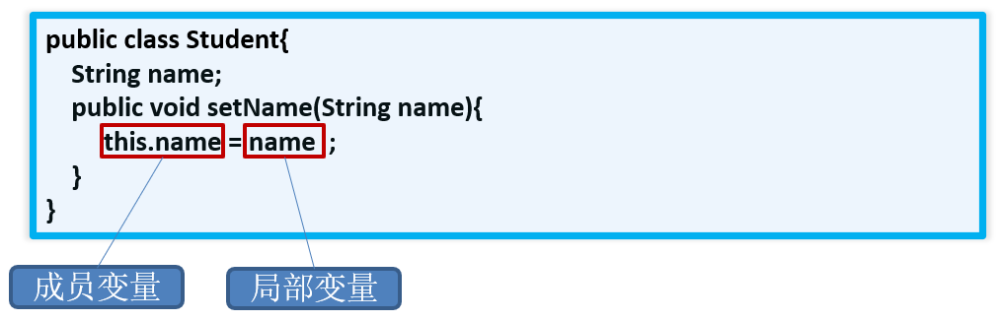
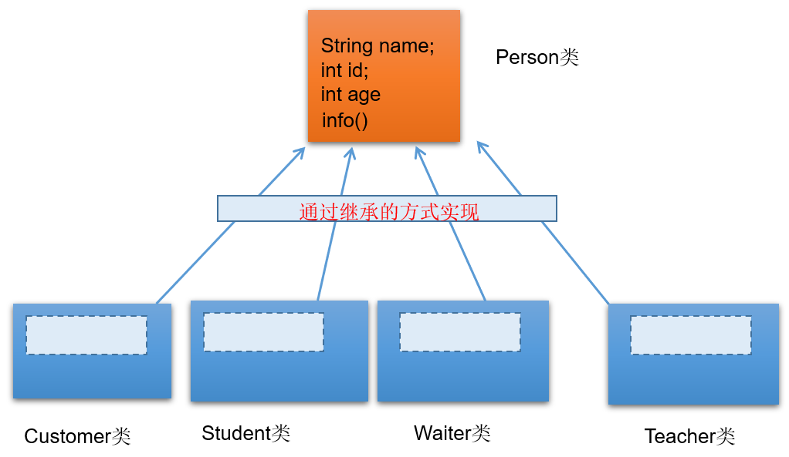
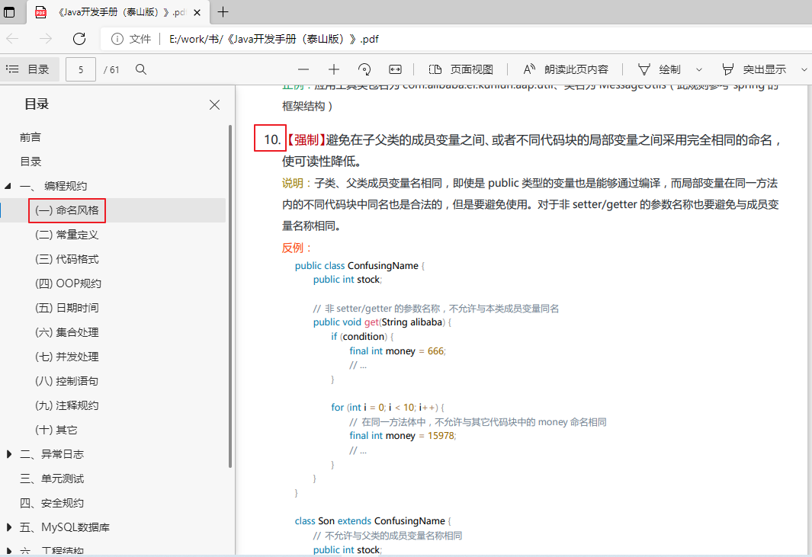
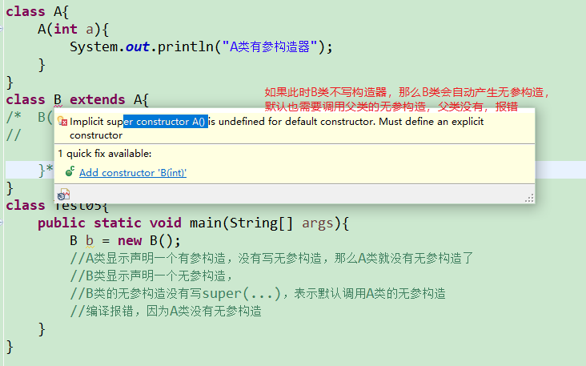
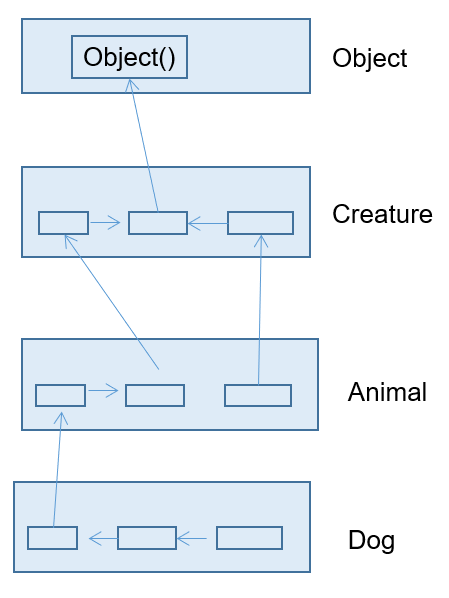
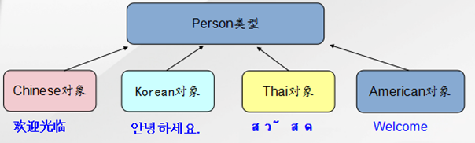
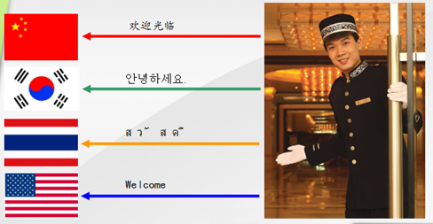
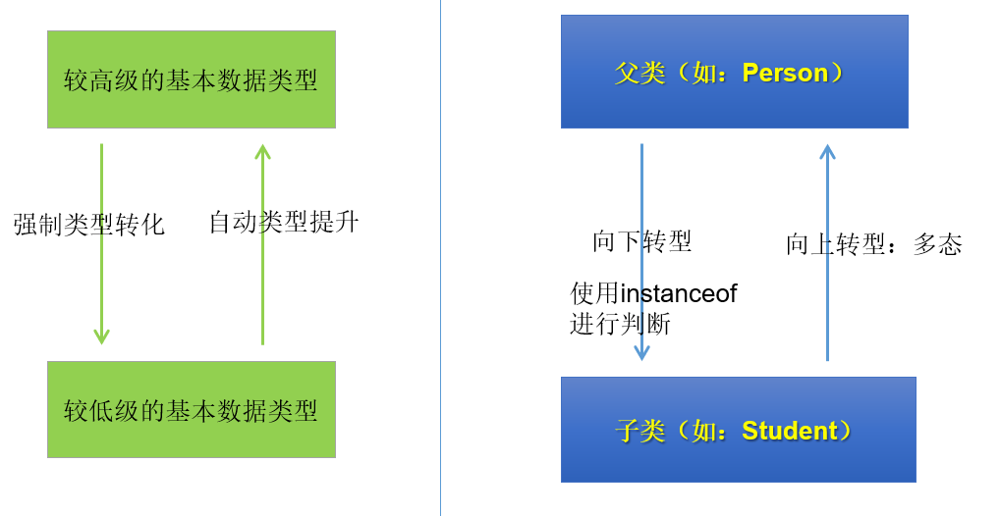
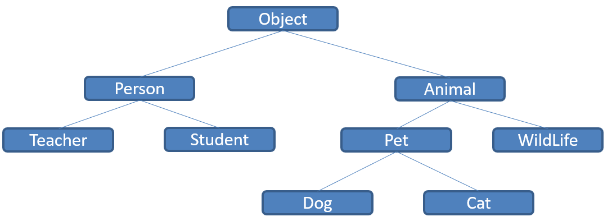
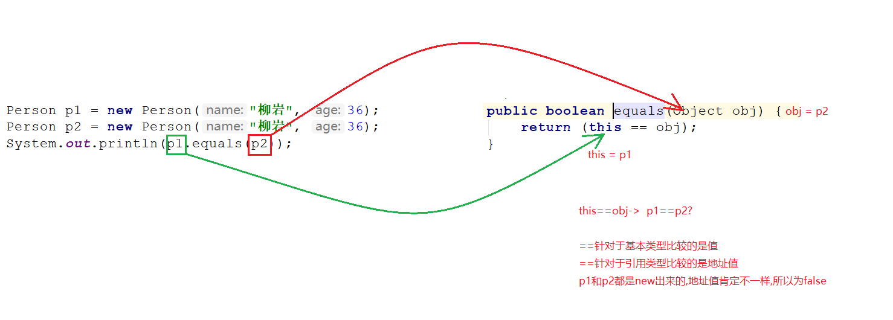

# Java面向对象进阶

## 一、关键字this

#### 1.1 概念

- 在Java中，this关键字不算难理解，它的作用和其词义很接近。
  - 它在方法（准确的说是实例方法或非static的方法）内部使用，表示`调用该方法的对象`
  - 它在构造器内部使用，表示该构造器`正在初始化的对象。`

- this可以调用的结构：`成员变量、方法和构造器`


#### 1.2 使用

在实例方法或构造器中，如果使用当前类的成员变量或成员方法可以在其前面添加this，增强程序的可读性。不过，通常我们都习惯省略this。

但是，当形参与成员变量同名时，如果在方法内或构造器内需要使用成员变量，必须添加this来表明该变量是类的成员变量。即：我们可以用this来区分`成员变量`和`局部变量`。比如：



:bulb: 使用this访问属性和方法时，如果在本类中未找到，会从父类中查找。这个在继承中会讲到。

##### 举例

```java
class Person{		// 定义Person类
	private String name ;	
	private int age ;			
	public Person(String name,int age){	
		this.name = name ;   
		this.age = age ;  
    }
    public void setName(String name){
        this.name = name;
    }
    public void setAge(int age){
        this.age = age;
    }
	public void getInfo(){	
		System.out.println("姓名：" + name) ;
		this.speak();
	}
	public void speak(){
		System.out.println(“年龄：” + this.age);	
	}
}

```

##### 同一个类中构造器互相调用 :star:

this可以作为一个类中构造器相互调用的特殊格式。

- this()：调用本类的无参构造器
- this(实参列表)：调用本类的有参构造器

```java
public class Student {
    private String name;
    private int age;

    // 无参构造
    public Student() {
//        this("",18);//调用本类有参构造器
    }

    // 有参构造
    public Student(String name) {
        this();//调用本类无参构造器
        this.name = name;
    }
    // 有参构造
    public Student(String name,int age){
        this(name);//调用本类中有一个String参数的构造器
        this.age = age;
    }

    public String getName() {
        return name;
    }
    public void setName(String name) {
        this.name = name;
    }
    public int getAge() {
        return age;
    }
    public void setAge(int age) {
        this.age = age;
    }

    public String getInfo(){
        return "姓名：" + name +"，年龄：" + age;
    }
}
```

注意：

- 不能出现递归调用。比如，调用自身构造器。
  - 推论：如果一个类中声明了n个构造器，则最多有 n - 1个构造器中使用了"this(形参列表)"
- this()和this(实参列表)只能声明在构造器首行。
  - 推论：在类的一个构造器中，最多只能声明一个"this(参数列表)"


## 二、面向对象特征二（封装 继承 多态）



#### 继承作用

- 继承的出现减少了代码冗余，提高了代码的复用性。

- 继承的出现，更有利于功能的扩展。

- 继承的出现让类与类之间产生了`is-a`的关系，为多态的使用提供了前提。
  - 继承描述事物之间的所属关系，这种关系是：`is-a` 的关系。可见，父类更通用、更一般，子类更具体。

> 注意：不要仅为了获取其他类中某个功能而去继承！


#### 继承语法

类B，称为子类、派生类(derived class)、SubClass

类A，称为父类、超类、基类(base class)、SuperClass


通过 `extends` 关键字，可以声明一个类B继承另外一个类A，定义格式如下：

```java
[修饰符] class 类A {
	...
}

[修饰符] class 类B extends 类A {
	...
}
```

#### 继承案例

**1、父类**

```java
package com.atguigu.inherited.grammar;

/*
 * 定义动物类Animal，做为父类
 */
public class Animal {
    // 定义name属性
    String name;
    // 定义age属性
    int age;

    // 定义动物的吃东西方法
    public void eat() {
        System.out.println(age + "岁的"
                + name + "在吃东西");
    }
}

```

**2、子类**

```java
package com.atguigu.inherited.grammar;

/*
 * 定义猫类Cat 继承 动物类Animal
 */
public class Cat extends Animal {
    int count;//记录每只猫抓的老鼠数量

    // 定义一个猫抓老鼠的方法catchMouse
    public void catchMouse() {
        count++;
        System.out.println("抓老鼠，已经抓了"
                + count + "只老鼠");
    }
}
```

**3、测试类**

```java
package com.atguigu.inherited.grammar;

public class TestCat {
    public static void main(String[] args) {
        // 创建一个猫类对象
        Cat cat = new Cat();
        // 为该猫类对象的name属性进行赋值
        cat.name = "Tom";
        // 为该猫类对象的age属性进行赋值
        cat.age = 2;
        // 调用该猫继承来的eat()方法 
        cat.eat();
        // 调用该猫的catchMouse()方法
        cat.catchMouse();
        cat.catchMouse();
        cat.catchMouse();
    }
}
```


## 三、方法重写

#### 重写作用

父类的所有方法子类都会继承，但是当某个方法被继承到子类之后，子类觉得父类原来的实现不适合于自己当前的类，该怎么办呢？子类可以对从父类中继承来的方法进行改造，我们称为方法的`重写 (override、overwrite)`。也称为方法的`重置`、`覆盖`。

#### 重写语法

1. 子类重写的方法`必须`和父类被重写的方法具有相同的`方法名称`、`参数列表`。

2. 子类重写的方法的返回值类型`不能大于`父类被重写的方法的返回值类型。（例如：Student < Person）。

> 注意：如果返回值类型是基本数据类型和void，那么必须是相同

3. 子类重写的方法使用的访问权限`不能小于`父类被重写的方法的访问权限。（public > protected > 缺省 > private）

> 注意：① 父类私有方法不能重写   ② 跨包的父类缺省的方法也不能重写

4. 子类方法抛出的异常不能大于父类被重写方法的异常


此外，子类与父类中同名同参数的方法必须同时声明为非static的(即为重写)，或者同时声明为static的（不是重写）。因为static方法是属于类的，子类无法覆盖父类的方法。


#### 重写案例

比如新的手机增加来电显示头像的功能，代码如下：

```java
package com.atguigu.inherited.method;

public class Phone {
    public void sendMessage(){
        System.out.println("发短信");
    }
    public void call(){
        System.out.println("打电话");
    }
    public void showNum(){
        System.out.println("来电显示号码");
    }
}

```

```java
package com.atguigu.inherited.method;

//SmartPhone：智能手机
public class SmartPhone extends Phone{
    //重写父类的来电显示功能的方法
	@Override
    public void showNum(){
        //来电显示姓名和图片功能
        System.out.println("显示来电姓名");
        System.out.println("显示头像");
    }
    //重写父类的通话功能的方法
    @Override
    public void call() {
        System.out.println("语音通话 或 视频通话");
    }
}
```

```java
package com.atguigu.inherited.method;

public class TestOverride {
    public static void main(String[] args) {
        // 创建子类对象
        SmartPhone sp = new SmartPhone();

        // 调用父类继承而来的方法
        sp.call();

        // 调用子类重写的方法
        sp.showNum();
    }
}
```

> @Override使用说明：
>
> 写在方法上面，用来检测是不是满足重写方法的要求。这个注解就算不写，只要满足要求，也是正确的方法覆盖重写。建议保留，这样编译器可以帮助我们检查格式，另外也可以让阅读源代码的程序员清晰的知道这是一个重写的方法。


## 四、关键字super

#### super作用

在Java类中使用super来调用父类中的指定操作：

- super可用于访问父类中定义的属性
- super可用于调用父类中定义的成员方法
- super可用于在子类构造器中调用父类的构造器

注意：

- 尤其当子父类出现同名成员时，可以用super表明调用的是父类中的成员
- super的追溯不仅限于直接父类
- super和this的用法相像，this代表本类对象的引用，super代表父类的内存空间的标识


#### super案例--父子同名方法

> - 如果子类没有重写父类的方法，只要权限修饰符允许，在子类中完全可以直接调用父类的方法；
> - 如果子类重写了父类的方法，在子类中需要通过`super.`才能调用父类被重写的方法，否则默认调用的子类重写的方法

```java
package com.atguigu.inherited.method;

public class Phone {
    public void sendMessage(){
        System.out.println("发短信");
    }
    public void call(){
        System.out.println("打电话");
    }
    public void showNum(){
        System.out.println("来电显示号码");
    }
}

//smartphone：智能手机
public class SmartPhone extends Phone{
    //重写父类的来电显示功能的方法
    public void showNum(){
        //来电显示姓名和图片功能
        System.out.println("显示来电姓名");
        System.out.println("显示头像");

        //保留父类来电显示号码的功能
        super.showNum();//此处必须加super.，否则就是无限递归，那么就会栈内存溢出
    }
}
```

总结：

* **方法前面没有super.和this.**
  * 先从子类找匹配方法，如果没有，再从直接父类找，再没有，继续往上追溯

* **方法前面有this.**
  * 先从子类找匹配方法，如果没有，再从直接父类找，再没有，继续往上追溯

* **方法前面有super.**
  * 从当前子类的直接父类找，如果没有，继续往上追溯


#### super案例--父子同名属性

- 如果实例变量与局部变量重名，可以在实例变量前面加this.进行区别
- 如果子类实例变量和父类实例变量重名，并且父类的该实例变量在子类仍然可见，在子类中要访问父类声明的实例变量需要在父类实例变量前加super.，否则默认访问的是子类自己声明的实例变量
- 如果父子类实例变量没有重名，只要权限修饰符允许，在子类中完全可以直接访问父类中声明的实例变量，也可以用this.实例访问，也可以用super.实例变量访问

```java
class Father{
	int a = 10;
	int b = 11;
}
class Son extends Father{
	int a = 20;
    
    public void test(){
		//子类与父类的属性同名，子类对象中就有两个a
		System.out.println("子类的a：" + a);//20  先找局部变量找，没有再从本类成员变量找
        System.out.println("子类的a：" + this.a);//20   先从本类成员变量找
        System.out.println("父类的a：" + super.a);//10    直接从父类成员变量找
		
		//子类与父类的属性不同名，是同一个b
		System.out.println("b = " + b);//11  先找局部变量找，没有再从本类成员变量找，没有再从父类找
		System.out.println("b = " + this.b);//11   先从本类成员变量找，没有再从父类找
		System.out.println("b = " + super.b);//11  直接从父类局部变量找
	}
	
	public void method(int a, int b){
		//子类与父类的属性同名，子类对象中就有两个成员变量a，此时方法中还有一个局部变量a		
		System.out.println("局部变量的a：" + a);//30  先找局部变量
        System.out.println("子类的a：" + this.a);//20  先从本类成员变量找
        System.out.println("父类的a：" + super.a);//10  直接从父类成员变量找

        System.out.println("b = " + b);//13  先找局部变量
		System.out.println("b = " + this.b);//11  先从本类成员变量找
		System.out.println("b = " + super.b);//11  直接从父类局部变量找
    }
}
class Test{
    public static void main(String[] args){
        Son son = new Son();
		son.test();
		son.method(30,13);  
    }
}
```

总结：起点不同（就近原则）

* **变量前面没有super.和this.**
  * 在构造器、代码块、方法中如果出现使用某个变量，先查看是否是当前块声明的`局部变量`，
  * 如果不是局部变量，先从当前执行代码的`本类去找成员变量`
  * 如果从当前执行代码的本类中没有找到，会往上找`父类声明的成员变量`（权限修饰符允许在子类中访问的）

* **变量前面有this.** 
  * 通过this找成员变量时，先从当前执行代码的==本类去找成员变量==
  * 如果从当前执行代码的本类中没有找到，会往上找==父类声明的成员变量（==权限修饰符允许在子类中访问的）

* **变量前面super.** 
  * 通过super找成员变量，直接从当前执行代码的直接父类去找成员变量（权限修饰符允许在子类中访问的）
  * 如果直接父类没有，就去父类的父类中找（权限修饰符允许在子类中访问的）

`特别说明：应该避免子类声明和父类重名的成员变量`

在阿里的开发规范等文档中都做出明确说明：




#### super案例--父子同名构造器

① 子类继承父类时，不会继承父类的构造器。只能通过“super(形参列表)”的方式调用父类指定的构造器。

② 规定：“super(形参列表)”，必须声明在构造器的首行。

③ 我们前面讲过，在构造器的首行可以使用"this(形参列表)"，调用本类中重载的构造器，
     结合②，结论：在构造器的首行，"this(形参列表)" 和 "super(形参列表)"只能二选一。

④ 如果在子类构造器的首行既没有显示调用"this(形参列表)"，也没有显式调用"super(形参列表)"，
​     则子类此构造器默认调用"super()"，即调用父类中空参的构造器。

⑤ 由③和④得到结论：子类的任何一个构造器中，要么会调用本类中重载的构造器，要么会调用父类的构造器。
     只能是这两种情况之一。

⑥ 由⑤得到：一个类中声明有n个构造器，最多有n-1个构造器中使用了"this(形参列表)"，则剩下的那个一定使用"super(形参列表)"。

情景举例1：

```java
class A{

}
class B extends A{

}

class Test{
    public static void main(String[] args){
        B b = new B();
        //A类和B类都是默认有一个无参构造，B类的默认无参构造中还会默认调用A类的默认无参构造
        //但是因为都是默认的，没有打印语句，看不出来
    }
}
```

情景举例2：

```java
class A{
	A(){
		System.out.println("A类无参构造器");
	}
}
class B extends A{

}
class Test{
    public static void main(String[] args){
        B b = new B();
        //A类显示声明一个无参构造，
		//B类默认有一个无参构造，
		//B类的默认无参构造中会默认调用A类的无参构造
        //可以看到会输出“A类无参构造器"
    }
}
```

情景举例3：

```java
class A{
	A(){
		System.out.println("A类无参构造器");
	}
}
class B extends A{
	B(){
		System.out.println("B类无参构造器");
	}
}
class Test{
    public static void main(String[] args){
        B b = new B();
        //A类显示声明一个无参构造，
		//B类显示声明一个无参构造，        
		//B类的无参构造中虽然没有写super()，但是仍然会默认调用A类的无参构造
        //可以看到会输出“A类无参构造器"和"B类无参构造器")
    }
}
```

情景举例4：

```java
class A{
	A(){
		System.out.println("A类无参构造器");
	}
}
class B extends A{
	B(){
        super();
		System.out.println("B类无参构造器");
	}
}
class Test{
    public static void main(String[] args){
        B b = new B();
        //A类显示声明一个无参构造，
		//B类显示声明一个无参构造，        
		//B类的无参构造中明确写了super()，表示调用A类的无参构造
        //可以看到会输出“A类无参构造器"和"B类无参构造器")
    }
}
```

情景举例5：

```java
class A{
	A(int a){
		System.out.println("A类有参构造器");
	}
}
class B extends A{
	B(){
		System.out.println("B类无参构造器");
	}
}
class Test05{
    public static void main(String[] args){
        B b = new B();
        //A类显示声明一个有参构造，没有写无参构造，那么A类就没有无参构造了
		//B类显示声明一个无参构造，        
		//B类的无参构造没有写super(...)，表示默认调用A类的无参构造
        //编译报错，因为A类没有无参构造
    }
}
```



情景举例6：

```java
class A{
	A(int a){
		System.out.println("A类有参构造器");
	}
}
class B extends A{
	B(){
		super();
		System.out.println("B类无参构造器");
	}
}
class Test06{
    public static void main(String[] args){
        B b = new B();
        //A类显示声明一个有参构造，没有写无参构造，那么A类就没有无参构造了
		//B类显示声明一个无参构造，        
		//B类的无参构造明确写super()，表示调用A类的无参构造
        //编译报错，因为A类没有无参构造
    }
}
```

情景举例7：

```java
class A{
	A(int a){
		System.out.println("A类有参构造器");
	}
}
class B extends A{
	B(int a){
		super(a);
		System.out.println("B类有参构造器");
	}
}
class Test07{
    public static void main(String[] args){
        B b = new B(10);
        //A类显示声明一个有参构造，没有写无参构造，那么A类就没有无参构造了
		//B类显示声明一个有参构造，        
		//B类的有参构造明确写super(a)，表示调用A类的有参构造
        //会打印“A类有参构造器"和"B类有参构造器"
    }
}
```

情景举例8：

```java
class A{
    A(){
        System.out.println("A类无参构造器");
    }
	A(int a){
		System.out.println("A类有参构造器");
	}
}
class B extends A{
    B(){
        super();//可以省略，调用父类的无参构造
        System.out.println("B类无参构造器");
    }
	B(int a){
		super(a);//调用父类有参构造
		System.out.println("B类有参构造器");
	}
}
class Test8{
    public static void main(String[] args){
        B b1 = new B();
        B b2 = new B(10);
    }
}
```

## 五、子类对象实例化的全过程

:star: 主要是this() 和 super()的使用



## 六、面向对象特征三（封装 继承 多态）

>  世界因个人不同而不同

#### 6.1 多态的形式和体现

##### 6.1.1 对象的多态性

多态性，是面向对象中最重要的概念，在Java中的体现：**对象的多态性：父类的引用指向子类的对象**

格式：（父类类型：指子类继承的父类类型，或者实现的接口类型）

```java
父类类型 变量名 = 子类对象；
```

举例：

```java
Person p = new Student();

Object o = new Person(); //Object类型的变量o，指向Person类型的对象
```

对象的多态：在Java中，子类的对象可以替代父类的对象使用。所以，一个引用类型变量可能指向(引用)多种不同类型的对象

##### 6.1.2 多态的理解

Java引用变量有两个类型：`编译时类型`和`运行时类型`。编译时类型由`声明`该变量时使用的类型决定，运行时类型由`实际赋给该变量的对象`决定。简称：**编译时，看左边；运行时，看右边。**

- 若编译时类型和运行时类型不一致，就出现了对象的多态性(Polymorphism)
- 多态情况下，“看左边”：看的是父类的引用（父类中不具备子类特有的方法）
      “看右边”：看的是子类的对象（实际运行的是子类重写父类的方法）

多态的使用前提：① 类的继承关系  ② 方法的重写

##### 6.1.3 举例

```java
package com.atguigu.polymorphism.grammar;

public class Pet {
    private String nickname; //昵称

    public String getNickname() {
        return nickname;
    }

    public void setNickname(String nickname) {
        this.nickname = nickname;
    }

    public void eat(){
        System.out.println(nickname + "吃东西");
    }
}
```

```java
package com.atguigu.polymorphism.grammar;

public class Cat extends Pet {
    //子类重写父类的方法
    @Override
    public void eat() {
        System.out.println("猫咪" + getNickname() + "吃鱼仔");
    }

    //子类扩展的方法
    public void catchMouse() {
        System.out.println("抓老鼠");
    }
}
```

```java
package com.atguigu.polymorphism.grammar;

public class Dog extends Pet {
    //子类重写父类的方法
    @Override
    public void eat() {
        System.out.println("狗子" + getNickname() + "啃骨头");
    }

    //子类扩展的方法
    public void watchHouse() {
        System.out.println("看家");
    }
}
```

**1、方法内局部变量的赋值体现多态**

```java
package com.atguigu.polymorphism.grammar;

public class TestPet {
    public static void main(String[] args) {
        //多态引用
        Pet pet = new Dog();
        pet.setNickname("小白");

        //多态的表现形式
        /*
        编译时看父类：只能调用父类声明的方法，不能调用子类扩展的方法；
        运行时，看“子类”，如果子类重写了方法，一定是执行子类重写的方法体；
         */
        pet.eat();//运行时执行子类Dog重写的方法
//      pet.watchHouse();//不能调用Dog子类扩展的方法

        pet = new Cat();
        pet.setNickname("雪球");
        pet.eat();//运行时执行子类Cat重写的方法
    }
}
```

**2、方法的形参声明体现多态**

```java
package com.atguigu.polymorphism.grammar;

public class Person{
    private Pet pet;
    public void adopt(Pet pet) {//形参是父类类型，实参是子类对象
        this.pet = pet;
    }
    public void feed(){
        pet.eat();//pet实际引用的对象类型不同，执行的eat方法也不同
    }
}
```

```java
package com.atguigu.polymorphism.grammar;

public class TestPerson {
    public static void main(String[] args) {
        Person person = new Person();

        Dog dog = new Dog();
        dog.setNickname("小白");
        person.adopt(dog);//实参是dog子类对象，形参是父类Pet类型
        person.feed();  //狗子小白啃骨头

        Cat cat = new Cat();
        cat.setNickname("雪球");
        person.adopt(cat);//实参是cat子类对象，形参是父类Pet类型
        person.feed();  //猫咪雪球吃鱼仔
    }
}
```

#### 6.2 为什么需要多态性(polymorphism)？

开发中，有时我们在设计一个数组、或一个成员变量、或一个方法的形参、返回值类型时，无法确定它具体的类型，只能确定它是某个系列的类型。

案例：

（1）声明一个Dog类，包含public void eat()方法，输出“狗啃骨头”

（2）声明一个Cat类，包含public void eat()方法，输出“猫吃鱼仔”

（3）声明一个Person类，功能如下：

- 包含宠物属性
- 包含领养宠物方法 public void adopt(宠物类型Pet)
- 包含喂宠物吃东西的方法 public void feed()，实现为调用宠物对象.eat()方法

```java
public class Dog {
    public void eat(){
        System.out.println("狗啃骨头");
    }
}
```

```java
public class Cat {
    public void eat(){
        System.out.println("猫吃鱼仔");
    }
}
```

```java
public class Person {
    private Dog dog;

    //adopt：领养
    public void adopt(Dog dog){
        this.dog = dog;
    }

    //feed：喂食
    public void feed(){
        if(dog != null){
            dog.eat();
        }
    }
    /*
    问题：
    1、从养狗切换到养猫怎么办？   
    	修改代码把Dog修改为养猫？
    2、或者有的人养狗，有的人养猫怎么办？  
    3、要是还有更多其他宠物类型怎么办？
    如果Java不支持多态，那么上面的问题将会非常麻烦，代码维护起来很难，扩展性很差。
    */
}
```

#### 6.3 多态的好处和弊端

**好处**：变量引用的子类对象不同，执行的方法就不同，实现动态绑定。代码编写更灵活、功能更强大，可维护性和扩展性更好了。

**弊端**：一个引用类型变量如果声明为父类的类型，但实际引用的是子类对象，那么该变量就不能再访问子类中添加的属性和方法。

```java
Student m = new Student();
m.school = "pku"; 	//合法,Student类有school成员变量
Person e = new Student(); 
e.school = "pku";	//非法,Person类没有school成员变量

// 属性是在编译时确定的，编译时e为Person类型，没有school成员变量，因而编译错误。
```

> 开发中：
>
> 使用父类做方法的形参，是多态使用最多的场合。即使增加了新的子类，方法也无需改变，提高了扩展性，符合开闭原则。
>
> 【开闭原则OCP】
>
> - 对扩展开放，对修改关闭
> - 通俗解释：软件系统中的各种组件，如模块（Modules）、类（Classes）以及功能（Functions）等，应该在不修改现有代码的基础上，引入新功能

#### 6.4 虚方法调用(Virtual Method Invocation)

在Java中虚方法是指在编译阶段不能确定方法的调用入口地址，在运行阶段才能确定的方法，即可能被重写的方法。

```java
Person e = new Student();
e.getInfo();	//调用Student类的getInfo()方法
```

子类中定义了与父类同名同参数的方法，在多态情况下，将此时父类的方法称为虚方法，父类根据赋给它的不同子类对象，动态调用属于子类的该方法。这样的方法调用在编译期是无法确定的。

举例：



前提：Person类中定义了welcome()方法，各个子类重写了welcome()。



执行：多态的情况下，调用对象的welcome()方法，实际执行的是子类重写的方法。

> 拓展：
>
> `静态链接（或早起绑定）`：当一个字节码文件被装载进JVM内部时，如果被调用的目标方法在编译期可知，且运行期保持不变时。这种情况下将调用方法的符号引用转换为直接引用的过程称之为静态链接。那么调用这样的方法，就称为非虚方法调用。比如调用静态方法、私有方法、final方法、父类构造器、本类重载构造器等。
>
> `动态链接（或晚期绑定）`：如果被调用的方法在编译期无法被确定下来，也就是说，只能够在程序运行期将调用方法的符号引用转换为直接引用，由于这种引用转换过程具备动态性，因此也就被称之为动态链接。调用这样的方法，就称为虚方法调用。比如调用重写的方法（针对父类）、实现的方法（针对接口）。

#### 6.5 成员变量没有多态性

- 若子类重写了父类方法，就意味着子类里定义的方法彻底覆盖了父类里的同名方法，系统将不可能把父类里的方法转移到子类中。

- 对于实例变量则不存在这样的现象，即使子类里定义了与父类完全相同的实例变量，这个实例变量依然不可能覆盖父类中定义的实例变量

```java
package com.atguigu.polymorphism.grammar;

public class TestVariable {
    public static void main(String[] args) {
        Base b = new Sub();
        System.out.println(b.a);  //1
        System.out.println(((Sub)b).a); //2

        Sub s = new Sub();
        System.out.println(s.a);  //2
        System.out.println(((Base)s).a);  //1
    }
}
class Base{
    int a = 1;
}
class Sub extends Base{
    int a = 2;
}
```

#### 6.6 向上转型与向下转型

首先，一个对象在new的时候创建是哪个类型的对象，它从头至尾都不会变。即这个对象的运行时类型，本质的类型用于不会变。但是，把这个对象赋值给不同类型的变量时，这些变量的编译时类型却不同。

##### 6.6.1 为什么要类型转换

因为多态，就一定会有把子类对象赋值给父类变量的时候，这个时候，在`编译期间`，就会出现类型转换的现象。

但是，使用父类变量接收了子类对象之后，我们就`不能调用`子类拥有，而父类没有的方法了。这也是多态给我们带来的一点"小麻烦"。所以，想要调用子类特有的方法，必须做类型转换，使得`编译通过`。



* **向上转型**：当左边的变量的类型（父类） > 右边对象/变量的类型（子类），我们就称为向上转型
  * 此时，编译时按照左边变量的类型处理，就只能调用父类中有的变量和方法，不能调用子类特有的变量和方法了
  * 但是，**运行时，仍然是对象本身的类型**，所以执行的方法是子类重写的方法体。
  * 此时，一定是安全的，而且也是自动完成的

* **向下转型**：当左边的变量的类型（子类）<右边对象/变量的编译时类型（父类），我们就称为向下转型
  * 此时，编译时按照左边变量的类型处理，就可以调用子类特有的变量和方法了
  * 但是，**运行时，仍然是对象本身的类型**
  * 不是所有通过编译的向下转型都是正确的，可能会发生ClassCastException，为了安全，可以通过isInstanceof关键字进行判断

##### 6.6.2 如何向上或向下转型

向上转型：自动完成

向下转型：（子类类型）父类变量

```java
package com.atguigu.polymorphism.grammar;

public class ClassCastTest {
    public static void main(String[] args) {
        //没有类型转换
        Dog dog = new Dog();//dog的编译时类型和运行时类型都是Dog

        //向上转型
        Pet pet = new Dog();//pet的编译时类型是Pet，运行时类型是Dog
        pet.setNickname("小白");
        pet.eat();//可以调用父类Pet有声明的方法eat，但执行的是子类重写的eat方法体
//        pet.watchHouse();//不能调用父类没有的方法watchHouse

        Dog d = (Dog) pet;
        System.out.println("d.nickname = " + d.getNickname());
        d.eat();//可以调用eat方法
        d.watchHouse();//可以调用子类扩展的方法watchHouse

        Cat c = (Cat) pet;//编译通过，因为从语法检查来说，pet的编译时类型是Pet，Cat是Pet的子类，所以向下转型语法正确
        //这句代码运行报错ClassCastException，因为pet变量的运行时类型是Dog，Dog和Cat之间是没有继承关系的
    }
}
```

##### 6.6.3 instanceof关键字

为了避免ClassCastException的发生，Java提供了 `instanceof` 关键字，给引用变量做类型的校验。如下代码格式：

```java
//检验对象a是否是数据类型A的对象，返回值为boolean型
对象a instanceof 数据类型A 
```

- 说明：
  - 只要用instanceof判断返回true的，那么强转为该类型就一定是安全的，不会报ClassCastException异常。
  - 如果对象a属于类A的子类B，a instanceof A值也为true。
  - 要求对象a所属的类与类A必须是子类和父类的关系，否则编译错误。

代码：

```java
package com.atguigu.polymorphism.grammar;

public class TestInstanceof {
    public static void main(String[] args) {
        Pet[] pets = new Pet[2];
        pets[0] = new Dog();//多态引用
        pets[0].setNickname("小白");
        pets[1] = new Cat();//多态引用
        pets[1].setNickname("雪球");

        for (int i = 0; i < pets.length; i++) {
            pets[i].eat();

            if(pets[i] instanceof Dog){
                Dog dog = (Dog) pets[i];
                dog.watchHouse();
            }else if(pets[i] instanceof Cat){
                Cat cat = (Cat) pets[i];
                cat.catchMouse();
            }
        }
    }
}
```

## 七、Object类的使用

#### 7.1 如何理解根父类

类 `java.lang.Object`是类层次结构的根类，即所有其它类的父类。每个类都使用 `Object` 作为超类。



- Object类型的变量与除Object以外的任意引用数据类型的对象都存在多态引用

```java
method(Object obj){…} //可以接收任何类作为其参数

Person o = new Person();  
method(o);
```

- 所有对象（包括数组）都实现这个类的方法。
- 如果一个类没有特别指定父类，那么默认则继承自Object类。例如：

```java
public class Person {
	...
}
//等价于：
public class Person extends Object {
	...
}
```

#### 7.2 Object类的方法

##### 1、(重点)equals()

**= =：** 

- 基本类型比较值:只要两个变量的值相等，即为true。

  ```java
  int a=5; 
  if(a==6){…}
  ```

- 引用类型比较引用(是否指向同一个对象)：只有指向同一个对象时，==才返回true。

  ```java
  Person p1=new Person();  	    
  Person p2=new Person();
  if (p1==p2){…}
  ```

  - 用“==”进行比较时，符号两边的`数据类型必须兼容`(可自动转换的基本数据类型除外)，否则编译出错

**equals()：**所有类都继承了Object，也就获得了equals()方法。还可以重写。

- 只能比较引用类型，Object类源码中equals()的作用与“==”相同：比较是否指向同一个对象。	 



- 格式:   obj1.equals(obj2)

- 特例：当用equals()方法进行比较时，对类File、String、Date及包装类（Wrapper Class）来说，是比较类型及内容而不考虑引用的是否是同一个对象；

  - 原因：在这些类中重写了Object类的equals()方法。

- 当自定义使用equals()时，可以重写。用于比较两个对象的“内容”是否都相等

- 重写举例：

```java
class User{
	private String host;
	private String username;
	private String password;
	public User(String host, String username, String password) {
		super();
		this.host = host;
		this.username = username;
		this.password = password;
	}
	public User() {
		super();
	}
	public String getHost() {
		return host;
	}
	public void setHost(String host) {
		this.host = host;
	}
	public String getUsername() {
		return username;
	}
	public void setUsername(String username) {
		this.username = username;
	}
	public String getPassword() {
		return password;
	}
	public void setPassword(String password) {
		this.password = password;
	}
	@Override
	public String toString() {
		return "User [host=" + host + ", username=" + username + ", password=" + password + "]";
	}
	@Override
	public boolean equals(Object obj) {
		if (this == obj)
			return true;
		if (obj == null)
			return false;
		if (getClass() != obj.getClass())
			return false;
		User other = (User) obj;
		if (host == null) {
			if (other.host != null)
				return false;
		} else if (!host.equals(other.host))
			return false;
		if (password == null) {
			if (other.password != null)
				return false;
		} else if (!password.equals(other.password))
			return false;
		if (username == null) {
			if (other.username != null)
				return false;
		} else if (!username.equals(other.username))
			return false;
		return true;
	}
	
}
```

:bulb: **面试题：**==和equals的区别

- == 既可以比较基本类型也可以比较引用类型。对于基本类型就是比较值，对于引用类型就是比较内存地址

- equals的话，它是属于java.lang.Object类里面的方法，如果该方法没有被重写过默认也是==;我们可以看到String等类的equals方法是被重写过的，而且String类在日常开发中用的比较多，久而久之，形成了equals是比较值的错误观点。

- 具体要看自定义类里有没有重写Object的equals方法来判断。

- 通常情况下，重写equals方法，会比较类中的相应属性是否都相等。

##### 2、(重点)toString()

方法签名：public String toString()

① 默认情况下，toString()返回的是“对象的运行时类型 @ 对象的hashCode值的十六进制形式"

② 在进行String与其它类型数据的连接操作时，自动调用toString()方法

```java
Date now=new Date();
System.out.println(“now=”+now);  //相当于
System.out.println(“now=”+now.toString()); 
```

③ 如果我们直接System.out.println(对象)，默认会自动调用这个对象的toString()

> 因为Java的引用数据类型的变量中存储的实际上时对象的内存地址，但是Java对程序员隐藏内存地址信息，所以不能直接将内存地址显示出来，所以当你打印对象时，JVM帮你调用了对象的toString()。

④ 可以根据需要在用户自定义类型中重写toString()方法
	如String 类重写了toString()方法，返回字符串的值。

```java
s1="hello";
System.out.println(s1);//相当于System.out.println(s1.toString());
```

例如自定义的Person类：

```java
public class Person {  
    private String name;
    private int age;

    @Override
    public String toString() {
        return "Person{" + "name='" + name + '\'' + ", age=" + age + '}';
    }
}
```

##### 3、clone()

```java
//Object类的clone()的使用
public class CloneTest {
	public static void main(String[] args) {
		Animal a1 = new Animal("花花");
		try {
			Animal a2 = (Animal) a1.clone();
			System.out.println("原始对象：" + a1);
			a2.setName("毛毛");
			System.out.println("clone之后的对象：" + a2);
		} catch (CloneNotSupportedException e) {
			e.printStackTrace();
		}
	}
}

class Animal implements Cloneable{
	private String name;

	public Animal() {
		super();
	}

	public Animal(String name) {
		super();
		this.name = name;
	}

	public String getName() {
		return name;
	}

	public void setName(String name) {
		this.name = name;
	}

	@Override
	public String toString() {
		return "Animal [name=" + name + "]";
	}
	
	@Override
	protected Object clone() throws CloneNotSupportedException {
		// TODO Auto-generated method stub
		return super.clone();
	}
	
}
```


##### 4、finalize()

- 当对象被回收时，系统自动调用该对象的 finalize() 方法。（不是垃圾回收器调用的，是本类对象调用的）
  - 永远不要主动调用某个对象的finalize方法，应该交给垃圾回收机制调用。
- 什么时候被回收：当某个对象没有任何引用时，JVM就认为这个对象是垃圾对象，就会在之后不确定的时间使用垃圾回收机制来销毁该对象，在销毁该对象前，会先调用 finalize()方法。 
- 子类可以重写该方法，目的是在对象被清理之前执行必要的清理操作。比如，在方法内断开相关连接资源。
  - 如果重写该方法，让一个新的引用变量重新引用该对象，则会重新激活对象。
- 在JDK 9中此方法已经被`标记为过时`的。

```java
public class FinalizeTest {
	public static void main(String[] args) {
		Person p = new Person("Peter", 12);
		System.out.println(p);
		p = null;//此时对象实体就是垃圾对象，等待被回收。但时间不确定。
		System.gc();//强制性释放空间
	}
}

class Person{
	private String name;
	private int age;

	public Person(String name, int age) {
		super();
		this.name = name;
		this.age = age;
	}
	public String getName() {
		return name;
	}
	public void setName(String name) {
		this.name = name;
	}
	public int getAge() {
		return age;
	}
	public void setAge(int age) {
		this.age = age;
	}
	//子类重写此方法，可在释放对象前进行某些操作
	@Override
	protected void finalize() throws Throwable {
		System.out.println("对象被释放--->" + this);
	}
	@Override
	public String toString() {
		return "Person [name=" + name + ", age=" + age + "]";
	}
	
}
```


##### 5、getClass()

`public final Class<?> getClass()`：获取对象的运行时类型

> 因为Java有多态现象，所以一个引用数据类型的变量的编译时类型与运行时类型可能不一致，因此如果需要查看这个变量实际指向的对象的类型，需要用getClass()方法

```java
public static void main(String[] args) {
	Object obj = new Person();
	System.out.println(obj.getClass());//运行时类型
}
```

结果：

```java
class com.atguigu.java.Person
```


##### 6、hashCode()

public int hashCode()：返回每个对象的hash值。(后续在集合框架章节重点讲解)

```java
public static void main(String[] args) {
	System.out.println("AA".hashCode());//2080
    System.out.println("BB".hashCode());//2112
}
```

