# Typora常见数学公式

> - 上部分为公式输入区
> - 下部分为效果展示区

## 一、使用快捷键

```shell
#文件 -> 高级配置 ->conf.user.json自行配置快捷键
Ctrl + R
```

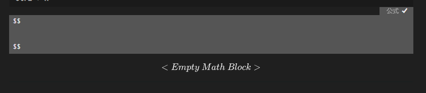

:bulb: （行内公式是需要先设置一下）

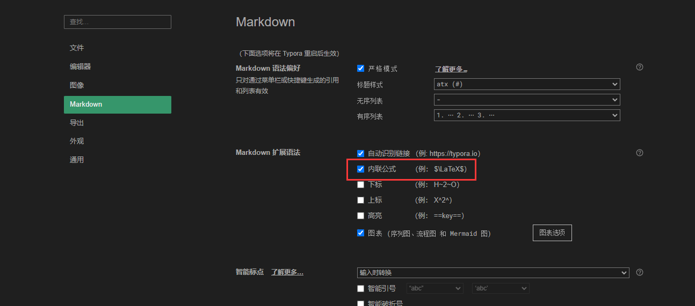

## 二、常用符号的代码

> 更全的数学公式查找地方
>
> https://support.typora.io/Math/

### **1.上下标，正负无穷**

补充：LaTeX（发音为"lay-tech"或"lah-tech"）是一种用于排版文档的排版系统，它通常用于创建学术论文、书籍、报告、演示文稿等。LaTeX 的代码是一种类似于编程的标记语言，用于描述文档的结构、格式和内容，然后由 LaTeX 编译器将代码转换为美观的印刷品。

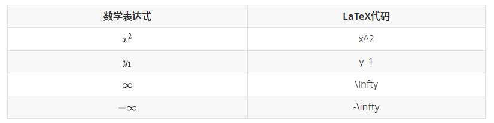

### **2.加减乘，分式，根号，省略号**

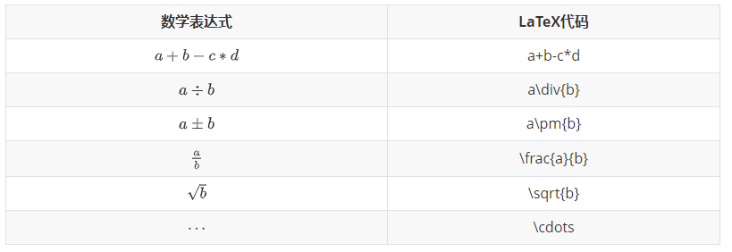

### **3.三角函数**

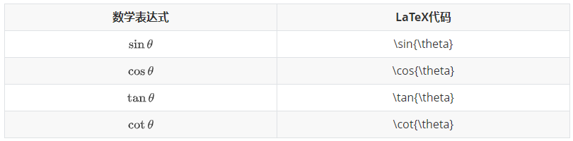

### **4.矢量，累加累乘，极限**

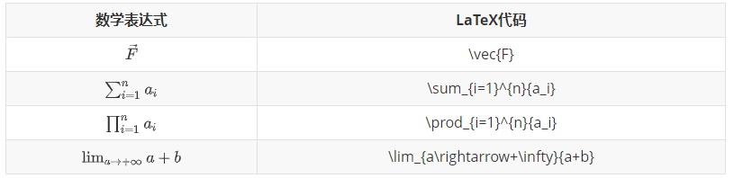

### **5.希腊字母**

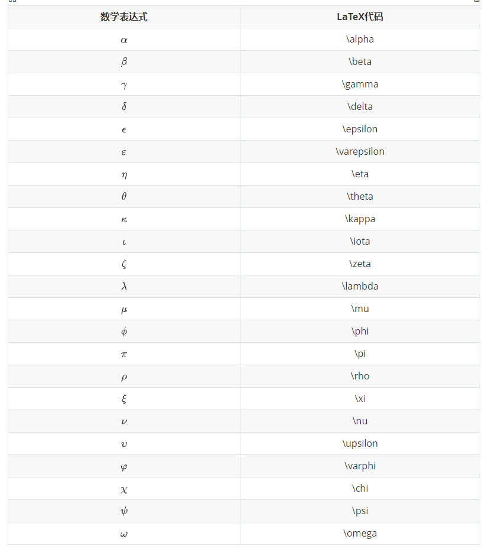

### **6.关系运算符**


## 三、矩阵

### **1.简单矩阵**

使用`\begin{matrix}…\end{matrix}`生成， 每一行以`\\`结尾表示换行，元素间以`&`间隔，式子的表示序号`\tag{1}`（右边的序号）。


$$
\begin{matrix}
 1 & 2 & 3 \\
 4 & 5 & 6 \\
 7 & 8 & 9 
\end{matrix} \tag{1}
$$

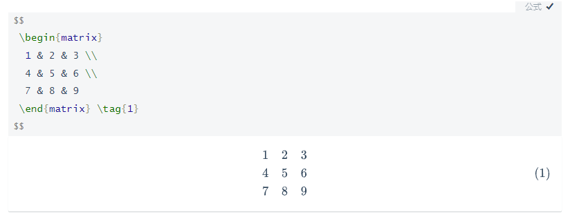

### **2.带左右括号的矩阵(大中小括号)**

:bulb:**方法一**：在`\begin{}`之前和`\end{}`之后添加左右括号的代码。

大括号：
$$
\left\{
 \begin{matrix}
   1 & 2 & 3 \\
   4 & 5 & 6 \\
   7 & 8 & 9
  \end{matrix}
  \right\} \tag{2}
$$


中括号：
$$
\left[
 \begin{matrix}
   1 & 2 & 3 \\
   4 & 5 & 6 \\
   7 & 8 & 9
  \end{matrix}
  \right] \tag{3}
$$
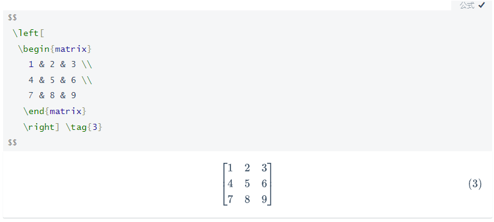

小括号：
$$
\left(
 \begin{matrix}
   1 & 2 & 3 \\
   4 & 5 & 6 \\
   7 & 8 & 9
  \end{matrix}
  \right) \tag{4}
$$
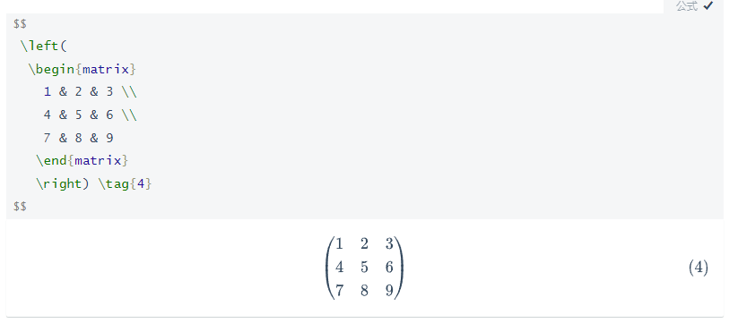

:bulb:**方法二**：改变`\begin{matrix}`和`\end{matrix}`中`{matrix}`

大括号：
$$
\begin{Bmatrix}
   1 & 2 & 3 \\
   4 & 5 & 6 \\
   7 & 8 & 9
  \end{Bmatrix} \tag{6}
$$
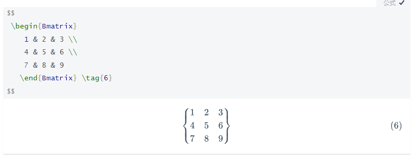

中括号：
$$
\begin{bmatrix}
   1 & 2 & 3 \\
   4 & 5 & 6 \\
   7 & 8 & 9
  \end{bmatrix} \tag{6}
$$

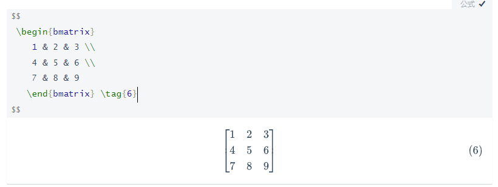

### **3.包含希腊字母与省略号**

行省略号`\cdots`，列省略号`\vdots`，斜向省略号（左上至右下）`\ddots`。
$$
\left\{
 \begin{matrix}
 1      & 2        & \cdots & 5        \\
 6      & 7        & \cdots & 10       \\
 \vdots & \vdots   & \ddots & \vdots   \\
 \alpha & \alpha+1 & \cdots & \alpha+4 
 \end{matrix}
 \right\}
$$

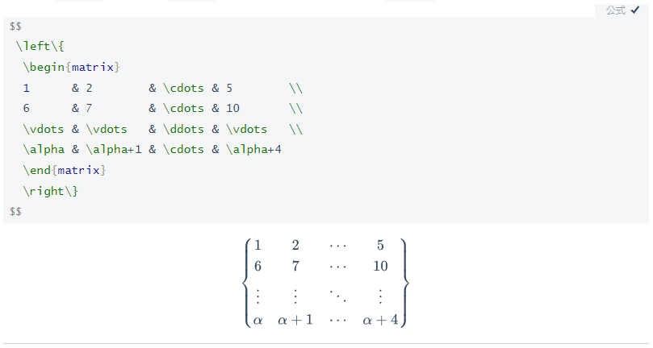

## 四、行列式

行列式相关语法与矩阵类似
$$
\begin{vmatrix}
   1 & 2 & 3 \\
   4 & 5 & 6 \\
   7 & 8 & 9
  \end{vmatrix}
\tag{7}
$$

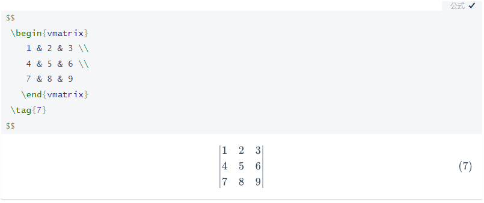

## 五、表格

### **1.简易表格**

$$
\begin{array}{|c|c|c|}
	\hline 2&9&4\\
	\hline 7&5&3\\
	\hline 6&1&8\\
	\hline
\end{array}
$$

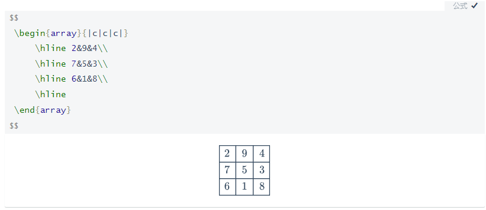

**开头结尾**： `\begin{array}` ， `\end{array}`

**定义式**：例：`{|c|c|c|}`，其中`c` `l` `r` 分别代表居中、左对齐及右对齐。

**分割线**：①**竖直分割线**：在定义式中插入 `|`， （`||`表示两条竖直分割线）。

②**水平分割线**：在下一行输入前插入 `\hline`，以下图真值表为例。

其他：每行元素间均须要插入 `&` ，每行元素以 `\\` 结尾。

### **2..真值表**

$$
\begin{array}{cc|c}
	       A&B&F\\
	\hline 0&0&0\\
	       0&1&1\\
	       1&0&1\\
	       1&1&1\\
\end{array}
$$

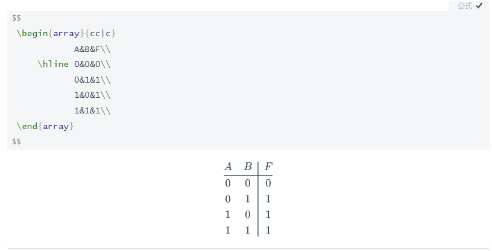

## 六、多行等式对齐


$$
\begin{aligned}
a &= b + c \\
  &= d + e + f
\end{aligned}
$$

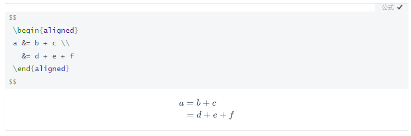

## 七、方程组、条件表达式

方程组：

$$
\begin{cases}
3x + 5y +  z \\
7x - 2y + 4z \\
-6x + 3y + 2z
\end{cases}
$$
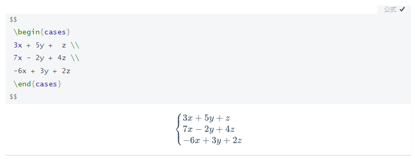

同理，条件表达式：
$$
f(n) =
\begin{cases} 
n/2,  & \text{if }n\text{ is even} \\
3n+1, & \text{if }n\text{ is odd}
\end{cases}
$$
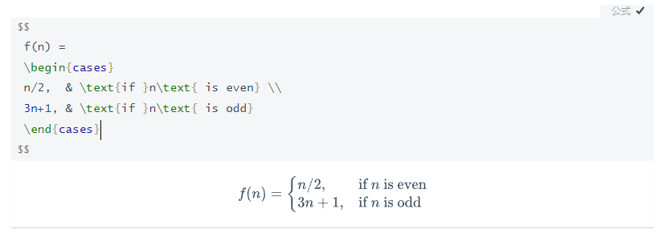
