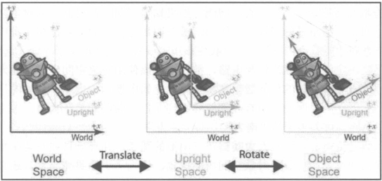
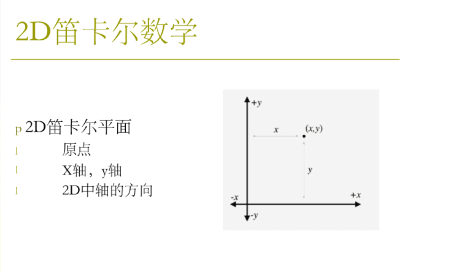
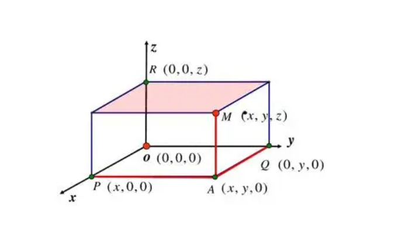
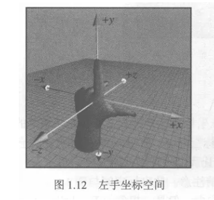
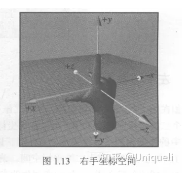

# 常见坐标系

## 一、为什么需要多个坐标空间

##### 原因

- 某些信息仅在特定坐标系中是已知的;
- 例如一个点 a, 我们可能不知道其在世界坐标系中的位置;
- 但我们或许表达 a 相对于其他坐标系的位置;

## 二、常见坐标空间

##### 世界空间(全局坐标空间/通用坐标空间)

- 坐标: 球面坐标;
- 原点: [0, 0];

##### 对象空间(体空间)

- 与特定对象关联的坐标空间;
- 每个对象都有自己独立的对象空间;

##### 相机空间

- 与用于渲染的视点相关联的对象空间;
- 使用左手坐标系;
- 原点为相机;

##### 直立空间

- 世界空间和对象空间转换的中间坐标空间;
- `直立空间轴线与世界空间平行;`
- `直立空间原点和对象空间原点重合;`

##### 直立空间的转换

- 对象空间 - 直立空间: 旋转;
- 直立空间 - 世界空间: 平移;

## 三、基向量

##### 基向量

- p, q, r 是三维空间的基向量;
- v 为基向量的线性组合;
- 世界空间的基向量一般为 [1, 0, 0], [0, 1, 0], [0, 0, 1]

$$v=xp+yq+zr$$

##### 良好的基向量

- 一般选择相互垂直的基向量;
- Span(p, q, r) 线性无关;

> 补充
>
> 1. Span(p, q, r) 表示由向量 p、q、r 线性组合生成的子空间。这个子空间包括了所有可以通过对 p、q、r 进行线性组合（加法和标量乘法）得到的向量
> 2. **线性相关（Linear Dependence）**： 如果一组向量中的某个向量可以表示为其他向量的线性组合，或者说存在一组不全为零的标量（系数），使得这些向量的线性组合等于零向量，那么这组向量被称为线性相关的。
> 3. **线性无关（Linear Independence）** ： 如果一组向量中的每个向量不能表示为其他向量的线性组合，并且不存在一组非零标量，使得这些向量的线性组合等于零向量，那么这组向量被称为线性无关的。

##### 正交基

- 相互垂直的基向量;

##### 标准正交基

- 单位长度的正交基;

## 四、2维笛卡尔坐标系

> Cesium中类名为 “Cartesian2”

### 1.1 概念

一种用于表示平面上点位置的数学坐标系统。

:bulb: 与常见的直角坐标系相比，二维笛卡尔坐标系没有明显的区别，因为它们实际上是同一概念的不同名称。

:bulb: 笛卡尔坐标系 与 仿射坐标系的区别

- 仿射坐标系是一种更一般化的坐标系统，用于描述平面或多维空间中的点位置
  - 在仿射坐标系中，不仅可以使用直角坐标系的x和y坐标来表示点的位置，还可以使用其他坐标系统来描述点的位置，例如极坐标、球坐标等
- 仿射坐标系还可以包括平移、旋转和缩放等仿射变换，这些变换可以改变点在坐标系中的位置和方向，而笛卡尔坐标系通常不包括这些变换。

## 五、3维笛卡尔坐标系

> Cesium中类名为 “Cartesian3”

### 2.1 概念

三维笛卡尔坐标系是一种用于表示三维空间中点位置的数学坐标系统。它是二维笛卡尔坐标系的扩展，通过引入第三个坐标轴，通常称为z轴，来描述三维空间中的点。在三维笛卡尔坐标系中，一个点的位置由三个坐标值 (x, y, z) 来确定，其中x表示点在水平方向的位置，y表示点在垂直方向的位置，z表示点在竖直方向的位置。

:book: 左手坐标系 和 右手坐标系

让拇指和食指成“L”形，大拇指向右，食指向上。其余的手指指向前方，拇指、食指和其余三个手指分别代表x、y、z轴的正方向。

同样，伸出右手，使食指向上，其余三指向前，拇指这时指向左，这就是一个右手坐标系，拇指、食指和其余三个手指分别代表x,y,z轴的正方向。

