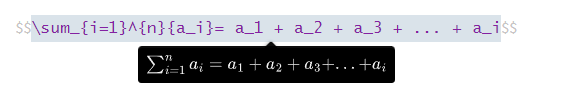
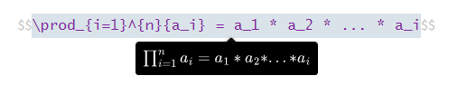
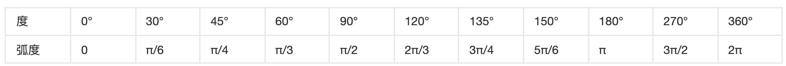
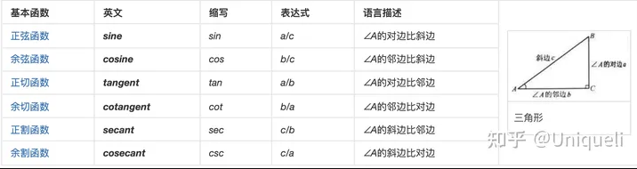
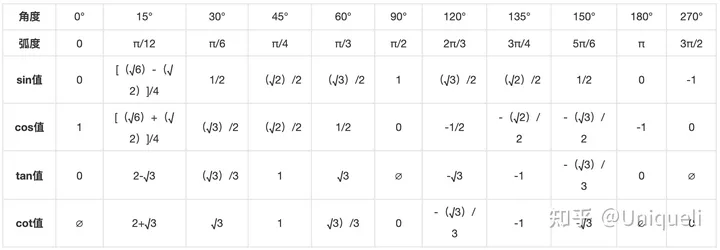

# 常见数学符号及计算

## 求和

$$\sum_{i=1}^{n}{a_i}= a_1 + a_2 + a_3 + ... + a_i$$

## 求积

$$\prod_{i=1}^{n}{a_i} = a_1 * a_2 * ... * a_i$$

## 区间表示法

[a,b] 闭区间，表示为a<= x <=b

(a,b) 开区间，表示 a < x < b

## 角度 和 弧度

1. 角度，可以测量平面的旋转量。描述角的大小，即两条相交直线中的任何一条与另一条相叠合时必须转动的量。
2. 弧度，弧度是角的度量单位，单位缩写是rad。弧长等于半径的弧，其所对的圆心角为1弧度。根据定义，一周的弧度数为2πr/r=2π，360°角=2π弧度，因此，1弧度约为57.3°，即57°17'44.806''，1°为π/180弧度，近似值为0.01745弧度，周角为2π弧度，平角（即180°角）为π弧度，直角为π/2弧度。

## 三角函数

