# 矩阵

## 一、矩阵的数学定义

### 1.1 矩阵维度

- 具有 r 行 c 列的矩阵;
- 称作 $r \times c$;

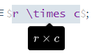

### 1.2 表示法

- 下标表示法;

$$
\begin{bmatrix}
m_{11} & m_{12} & m_{13} \\
m_{21} & m_{22} & m_{23} \\
m_{31} & m_{32} & m_{33}
\end{bmatrix}
$$

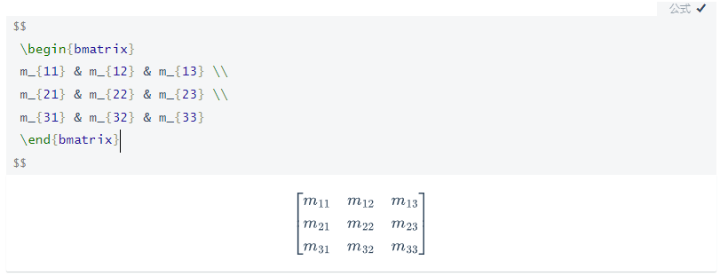

### 1.3 方形矩阵

#### 方形矩阵

- 具有相同行数和列数的矩阵;

对角元素

- 行和列索引相同的元素;

对角矩阵D

- 非对角元素均为 0;

$$
\begin{bmatrix}
1 & 0 & 0 \\
0 & 0 & 0 \\
0 & 0 & 3
\end{bmatrix}
$$

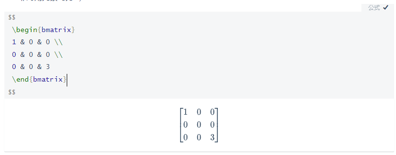

#### 单位矩阵

- 对角元素为 1, 其余元素为 0, 称作 I;

$$
\begin{bmatrix}
1 & 0 & 0 \\
0 & 1 & 0 \\
0 & 0 & 1
\end{bmatrix}
$$

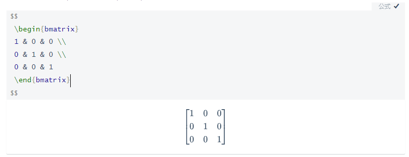

### 1.4 作为矩阵的向量

#### 行向量和列向量

- 行向量: $1 \times n$;

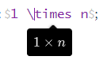

- 列向量: $n \times 1$;

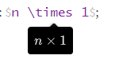

### 1.5 矩阵转置

#### 矩阵转置

- $r \times c$ 矩阵 M;

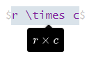

- 其转置矩阵 $c \times r, \quad M^T$ 即 M 行列翻转;

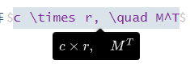

#### 性质

- $(M^T)^T=M$;

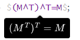

- 对角矩阵 D, $D^T=D$;

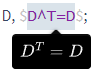

### 1.6 矩阵和标量相乘

#### 矩阵和标量相乘

### 1.7 矩阵相乘

#### 矩阵相乘

- $r \times n$ 矩阵 A 可与 $n \times c$ 矩阵 B 相乘;

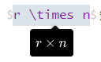

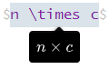

- 结果为 $r \times c$ 矩阵 C;

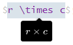

#### 计算公式

- 对于 C 中的第 i 行, 第 j 列的元素;
- 对应 A 中的第 i 行, B 中的第 j 列;
- A 和 B 的行和列的对应元素相乘求和;

$$c_{ij} = \sum^n_{k=1}a_{ik}b_{kj}$$

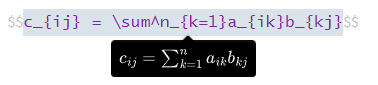

#### 性质

- MI = IM = M;
- $AB \neq BA$;

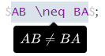

- (AB)C = A(BC);
- (kA)B = k(AB) = A(kB);
- $(AB)^T = B^TA^T$

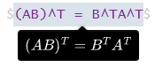

### 1.8 向量和矩阵相乘

#### 向量和矩阵相乘

## 二、矩阵的几何解释

- 矩阵表示空间坐标变换;
- 矩阵的行可解释为坐标空间的基向量;
- 向量乘矩阵从一个坐标空间变换为另一个坐标空间;
  - 对于标准基向量, 标准基向量乘矩阵即经过矩阵变换后的坐标空间的基向量;
- p, q, r 表示一组基向量;

## 三、矩阵变换

### 旋转

