# 向量

## 一、基本下标表示法

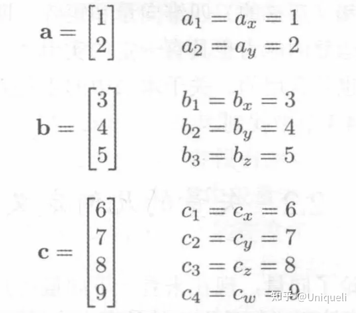

- 矢量的大小是指矢量的长度，矢量可以具有任何非负长度。
- 矢量的方向描述矢量在空间中指向的方向。

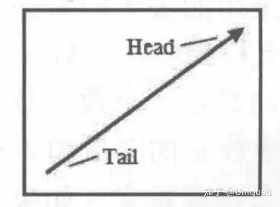

## 二、使用笛卡尔坐标系指定矢量

##### 二维向量

- [x, y];

##### 三维向量

- [x, y, z];

##### 向量分解

- 向量可以分解为按轴向对齐的分量, 分量大小即 x, y, z;

##### 零向量

- 没有大小和方向;

- $$[0,...,0]$$

## 三、负矢量

负矢量会产生大小相同，方向相反的矢量。

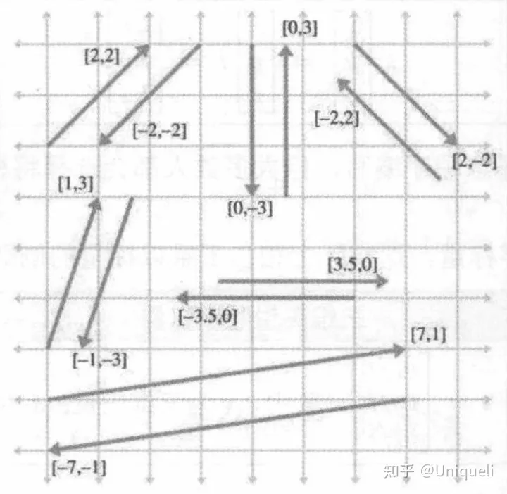

## 四、标量和矢量的乘法

矢量乘以标量

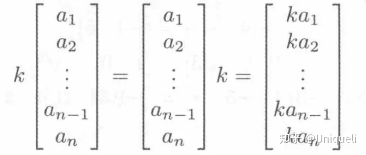

矢量除以非零标量，相当于乘以标量的倒数。

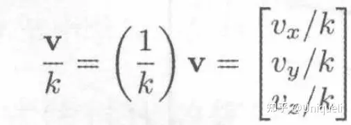

## 五、矢量的加减法

矢量加法的线性代数：

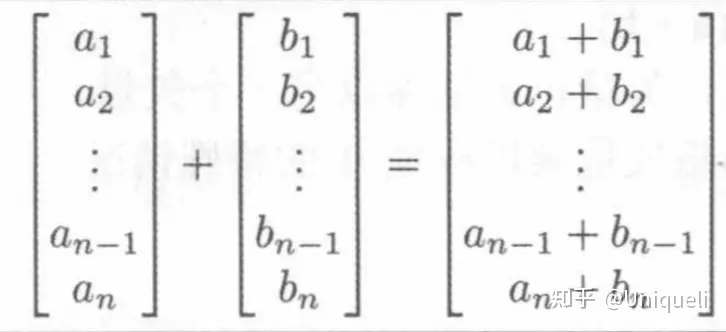

矢量减法的线性代数：

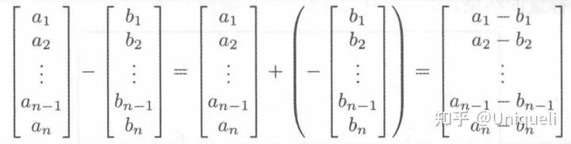

几何解释

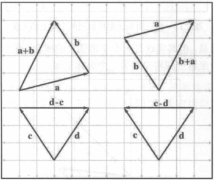

## 六、矢量大小

任意维度的矢量大小：`矢量分量的平方和的平方根`。

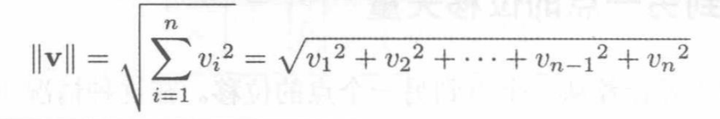

## 七、单位矢量

单位矢量是大小为1的矢量。一个非零向量除以它的模，可得所需单位向量。

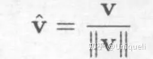

## 八、距离公式

假设计算向量a到b的矢量d。
可以分步计算，先计算出向量d，再求出向量d的大小。

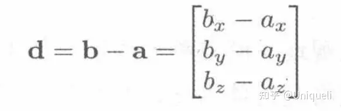

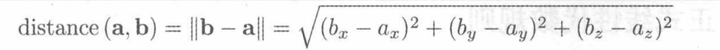

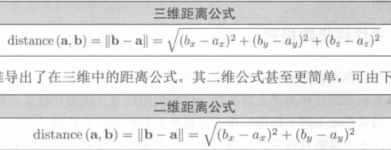

## 九、矢量点积

### 乘积结果

:bulb: 结果为标量

$$a \cdot b = \sum^n_{i=1}a_ib_i$$

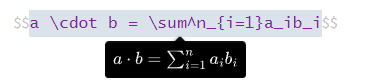

### 交换律

- 向量点积是可交换的;

$$a \cdot b = b \cdot a$$

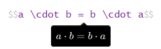

### 结合律

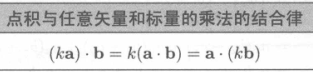

### 分配律

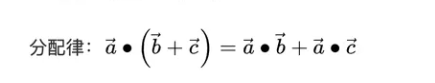

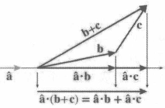

### 三角函数解释

- a 和 b 的点积是 a 到 b 的角度的余弦;

$$a \cdot b = |a||b|cos\theta$$

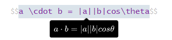

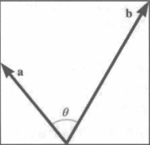

## 十、向量叉积

向量积，数学中又称外积、叉积，物理中称矢积、叉乘，是一种在向量空间中向量的二元运算。与点积不同，`它的运算结果是一个向量而不是一个标量`。`并且两个向量的叉积与这两个向量和垂直`。
向量积可以被定义为：

- 模长：（在这里θ表示两向量之间的夹角（共起点的前提下）（0°≤θ≤180°），它位于这两个矢量所定义的平面上。）

$$|a \times b| = |a||b|\sin\theta$$

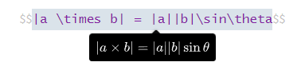

- 方向：a向量与b向量的向量积的方向与这两个向量所在平面垂直，且遵守右手定则。（一个简单的确定满足“右手定则”的结果向量的方向的方法是这样的：若坐标系是满足右手定则的，当右手的四指从**a**以不超过180度的转角转向**b**时，竖起的大拇指指向是**c**的方向。）

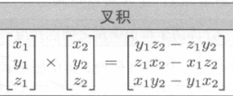

## 十一、线性代数恒等式

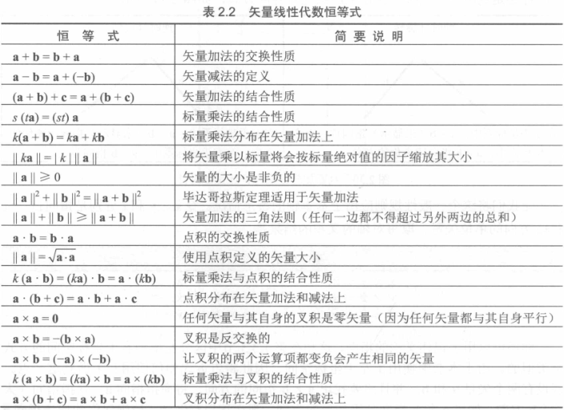