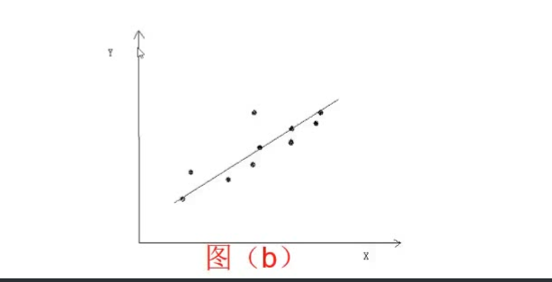
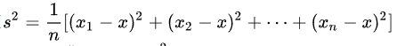
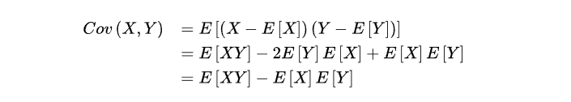
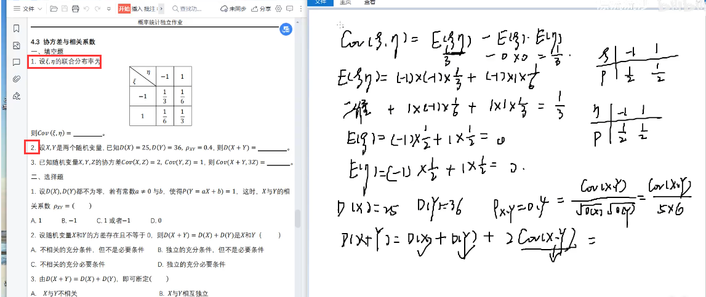
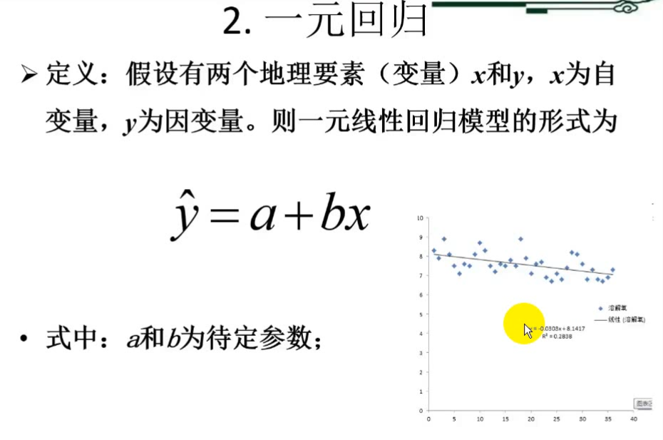
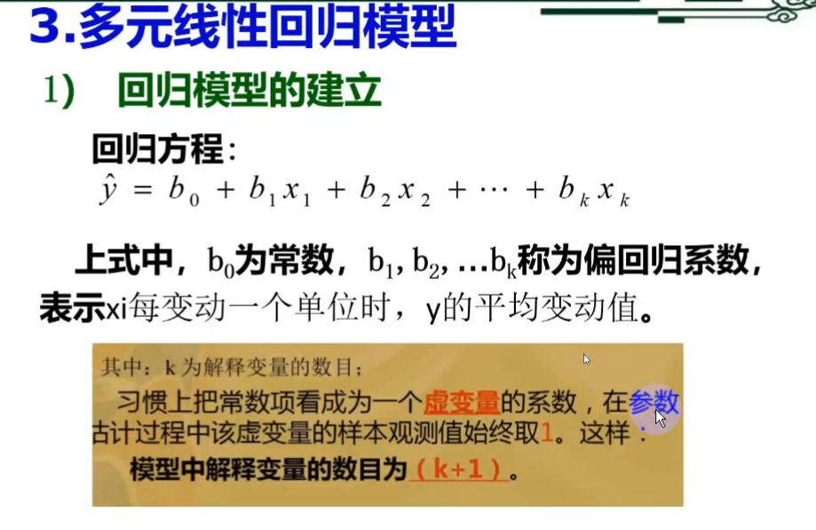
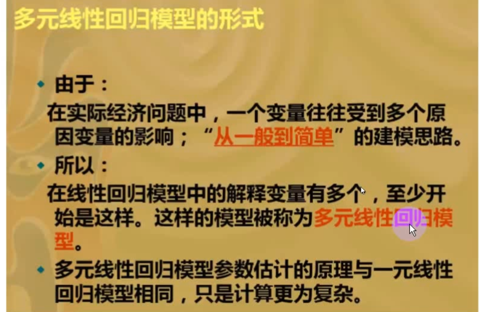
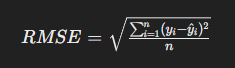
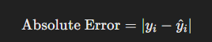

# 地学建模

## 一、相关分析

- 定义：一个或者几个相互联系的变量取一定数值，与之相对应的另一个变量值虽不确定，但该值仍按按某种规律在一定范围内变化，称为相关关系。

- 常见的相关关系

  - 线性相关：正线性相关、负线性相关
  - 非线性相关

- 相关程度的度量  --》`相关系数`

  

  `Cov(X,Y)`：X与Y的协方差，`Var[X]`：X的方差，`Var[Y]`：Y的方差

> 补充数学知识：:sweat:
>
> ∑：*sigma*，求和
>
> 数学期望：试验中每次**可能结果的概率**乘以其**结果**的总和，一般写作EX
>
> 方差：一组数据X1,X2...Xn,用如下公式来衡量这组数据的波动大小，并将该值称为这组数据的方差,写作DX
>
> 
>
> 协方差：用来描述两个不同变量之间的相关性，计算公式如下
>
> 

计算例子如下：

## 二、回归分析

概述：回归分析：侧重考察变量之间的数量变化规律，并通过一定的数学表达式来描述这种关系，进而确定一个或几个变量的变化对另一个变量的影响程度。

- 作用

  - 描述因果性关系
  - 用来预测
  - 用来认识和描述数据

- 常见回归模型

  - 一元回归模型

  

  - 多元回归模型

  

  

## 三、模拟预测

### 一、**均方根误差（Root Mean Square Error，RMSE）：**

**
均方根误差（Root Mean Square Error，RMSE）：**

均方根误差是一种用于评估预测模型精度的统计指标。它是预测值与实际值之间差异的平方和的平均值的平方根。RMSE的计算公式如下：

其中：

- *n* 是样本数量。
- *y**i* 是实际观测值。
- *y*^*i* 是对应的预测值。

RMSE的值越小，表示模型的预测越接近实际值，模型的精度越高。

### 二、**绝对误差（Absolute Error）：**

绝对误差是指每个数据点的预测值与实际值之间的差异的绝对值。绝对误差的计算公式如下：

其中：

- *y**i* 是实际观测值。
- y*^*i* 是对应的预测值。

绝对误差的平均值或总和可用于评估模型的整体预测误差。和均方根误差一样，绝对误差的值越小，表示模型的预测越接近实际值。

