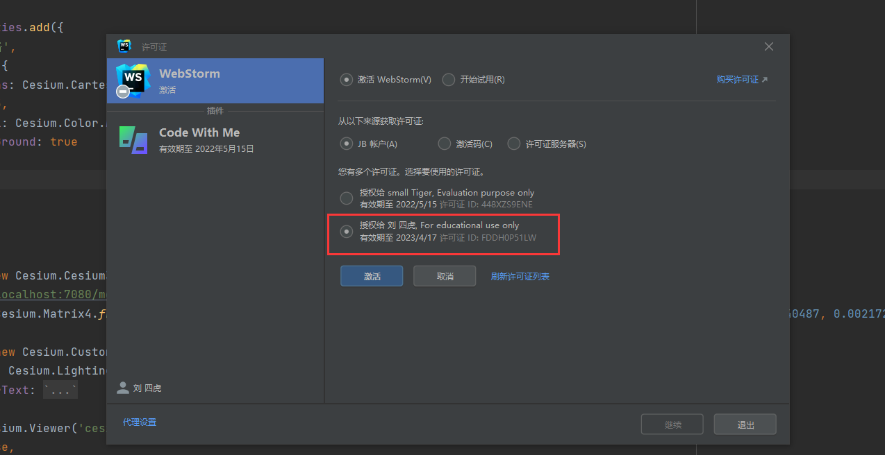
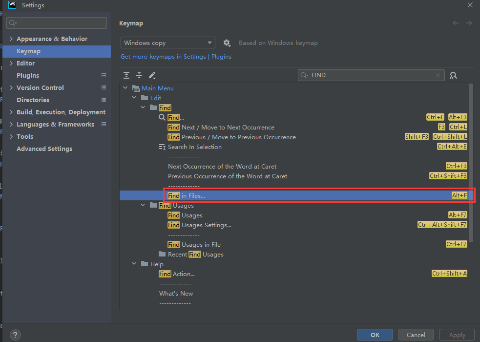
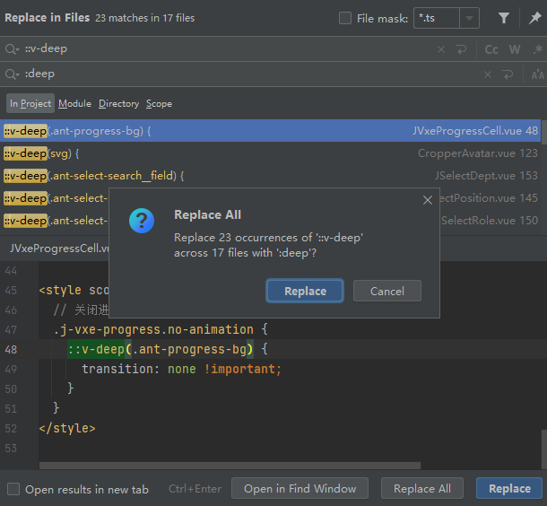

# WebStorm

## 学生认证

https://www.jetbrains.com/shop/eform/students/github?code=052132d27debf8749a9a&state=QGm8oFebJeRSd0_mdRdXeHuk7jpjEQrWT2V5DNQ1NL7pw1mpgBJ2gCr6i74CyGQH

学生许可更新

- 打开webstorm

- 点击帮助

  - 注册
  - 如果在官网已经申请了新的学生许可，就可以授权新的许可，如下图

  

## 热键配置

ALT + F => 通过代码内容 从全局各文件中查找指定代码块

double shift =>通过名称 从全局查找指定文件所在地址

快捷键：Ctrl + Shift + R，全局替换指定文本内容

