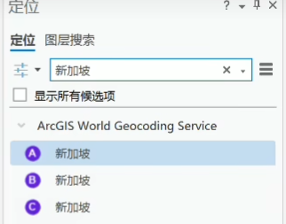
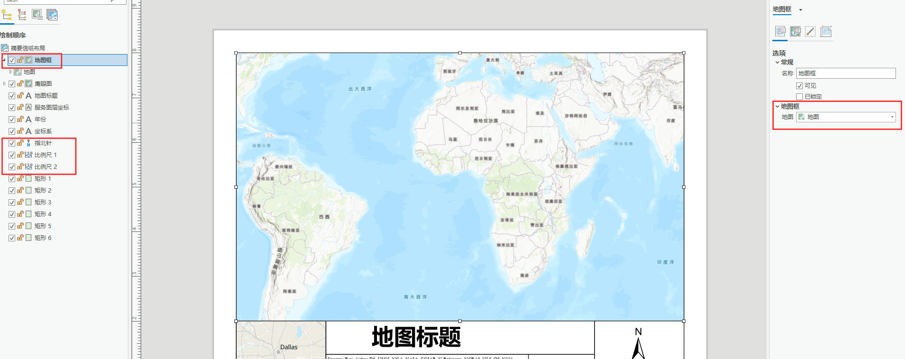

# ArcgisPro

## 一、安装

1. 压缩包
   - 百度网盘 ArcgisPro 2.5
   - 解压密码：竹山数据2021
2. 安装教程
   - 个人百度网盘 图片有安装教程

## 二、常用

1. 新建工程

   - 为此工程创建新文件夹  //在当前文件夹下再创建一个新的文件夹来存放项目，`一般不需要勾选`

2. 工程结构

   - 一个`地理数据库gdb`，存放工程数据
   - 一个`工具箱tbx`，存放工程新脚本文件
   - 一个`aprx`，Pro的工程文件，相当于mxd文件

3. 通过`底图`按钮，可以切换对应在线底图

   - `可移除不需要的底图子图层`

4. 对于项目需要的背景底图，可以通过`定位功能`定位到对应的`底图背景区域`

   

   

5. `比例尺` `经纬度`  `显示单位`  `捕捉`   等在主视图下方

6. 透明度小工具在`外观--效果`

7. 要素的符号：`符号系统` 或者 `双击该要素`

8. 布局视图

   - 需要的地图显示范围及时做`书签`

   - 插入--新建/导入布局

   - 将对应的`地图框、比例尺、指北针`等等更改对应的`内容及样式位`置即可

     - 可以对某些图层内容设置`缩小、放大不能超过的比例尺限制`

     

9. `按编辑列出`--`将其中任何一个可编辑图层作为唯一`——`编辑注记`，即可对视图内的任何一个注记做修改

10. ArcgisPro最大优势之一，与ArcgisOnline集成更紧密

    - `添加在线数据`，可通过`右侧目录--online--输入对应的名称搜索`即可

11. 裁剪

    - 使用`地图属性`中的`裁剪图层`时，将仅限制显示数据的范围，`不会更改原始数据文件`
    - 使用`地理处理裁剪工具`时，将移除裁剪范围之外的数据，`不会改变原始数据文件`

12. `右侧目录--工程--数据库文件夹--创建新的数据库--数据集及要素类`等

    - 添加新建的要素类，根据需要可适当修改元数据
      - 图层属性--元数据--`更改只读状态`即可
    - 默认是灰色的，因为初始化是`没有记录`

13. 

    