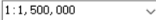
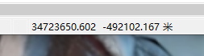

# GIS基本知识

## 一、Shape文件格式

1. .shp
   - 存储几何要素的空间信息，即XY的坐标信息
2. .dbf
   - 存储几何要素的属性信息
3. .pri
   - 记录shp定义了的空间参考信息
4. .shx
   - 存储有关索引信息
5. .sbn 和 .sbx
   - 存储shp的空间索引，能加速空间数据的读取。这两个文件对数据操作、浏览或者连接后产生
6. .shp.xml
   - 对shp进行元数据浏览后生成的临时xml元数据文件


## 二、数据

- 矢量数据
- 地理数据库
- 栅格数据
- CAD数据（Arcmap能读取CAD创建的数据集，不能`编辑` 或 `分析`）
- 其他数据
  - X字段：经度
  - Y字段：纬度


## 三、工具栏 和 菜单栏

- 上一视图 和 下一视图
- 缩放到指定比例尺，可以下拉选择，可输入 
- 查找具有特定属性的要素
- 设置书签  --  顶部菜单栏到指定范围区域后即可设置书签，后续单击书签即可返回记录的对应视图范围
- 显示关闭图层
  - 图层可能被其他图层遮挡
  - 补充：有的图层需要到特定的比例尺才能显示
- 图层属性设置
  - Source： 可查看图层的数据源、坐标系信息 和 符号
  - General： 常规选项卡可以设置图层显示的比例尺范围
  - Display：显示选项卡 可以 设置透明度值，以百分比数值设置透明度值
  - Symbology：可以设置图层要素的符号形状、颜色和大小等
- 导出图层时，`记得是否要选中某些要素`


## 四、地图要素

1. 图体
   1. 图体：主要的制图区域
   2. 定位地图：比例尺更小的地图，帮助读者了解感兴趣区域的位置
   3. 插页地图：提供地图中某一区域的更详细信息
2. 标题
   - 文本形式
   - `使用：`布局视图下，插入 --  标题，设置内容  和  对应标题格式
3. 图例
   - 地图中使用的符号 以及 这些符号缩代表内容的列表
   - `使用：`布局视图下，插入 -- 图例，选择要显示的图
     - 补充：双击图例，可以设置图例属性 和 拆合分图形组合
4. 比例尺
   - 图上一条线段的长度与地面相应线段的实际长度之比
   - `使用：`布局视图下，插入 -- 比例尺，选择比例尺样式 和 自定义属性
5. 投影
   - 将地理要素的空间位置从地球的曲面转换到地图平面上的数学公式
6. 方向
   - 指北针表示
   - `使用：`布局视图下，插入 -- 指北针，选择样式 和 设置自定义属性
7. 数据源
   - 生产地图数据的文献信息


## 五、分带及坐标系

> **我国规定1:1 - 1:50万比例尺地形图均采用高斯克吕格投影**

- 其中1：2.5 - 1:50万是 6度分带
- 1:1万是3度分带


例子：以下`CGCS2000_3_Degree_GK_CM_102E` 和 `CGCS2000_3_Degree_GK_Zone_34`是同一个坐标系，只不过横坐标前有没有加带号的区别

- CGCS2000_3_Degree_GK_CM_102E
  - 横坐标前不加带号（共6位）

```shell
CGCS2000_3_Degree_GK_CM_102E
WKID: 4543 权限: EPSG

Projection: Gauss_Kruger
False_Easting: 500000.0
False_Northing: 0.0
Central_Meridian: 102.0
Scale_Factor: 1.0
Latitude_Of_Origin: 0.0
Linear Unit: Meter (1.0)

Geographic Coordinate System: GCS_China_Geodetic_Coordinate_System_2000
Angular Unit: Degree (0.0174532925199433)
Prime Meridian: Greenwich (0.0)
Datum: D_China_2000
  Spheroid: CGCS2000
    Semimajor Axis: 6378137.0
    Semiminor Axis: 6356752.314140356
    Inverse Flattening: 298.257222101
```


- CGCS2000_3_Degree_GK_Zone_34
  - 横坐标前加（共8位）

```shell
CGCS2000_3_Degree_GK_Zone_34
WKID: 4522 权限: EPSG

Projection: Gauss_Kruger
False_Easting: 34500000.0
False_Northing: 0.0
Central_Meridian: 102.0
Scale_Factor: 1.0
Latitude_Of_Origin: 0.0
Linear Unit: Meter (1.0)

Geographic Coordinate System: GCS_China_Geodetic_Coordinate_System_2000
Angular Unit: Degree (0.0174532925199433)
Prime Meridian: Greenwich (0.0)
Datum: D_China_2000
  Spheroid: CGCS2000
    Semimajor Axis: 6378137.0
    Semiminor Axis: 6356752.314140356
    Inverse Flattening: 298.257222101

```



