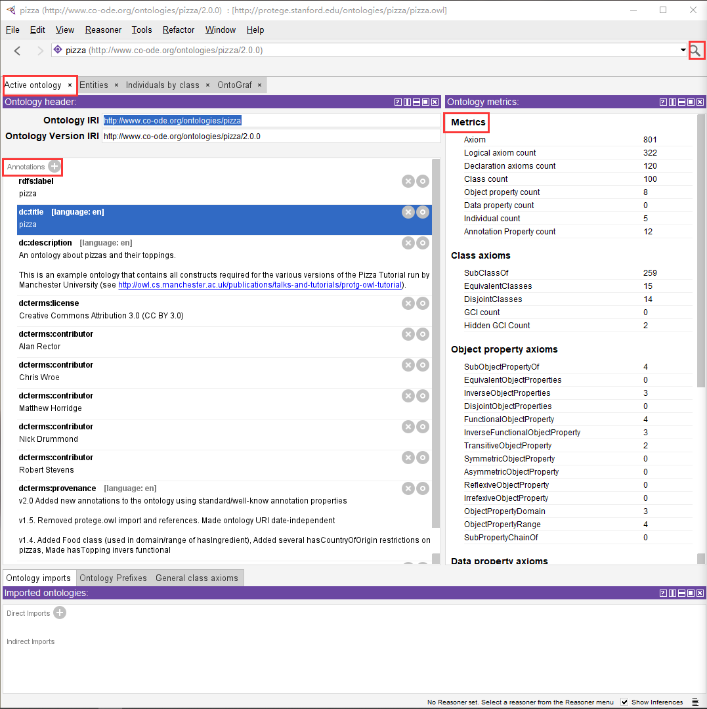
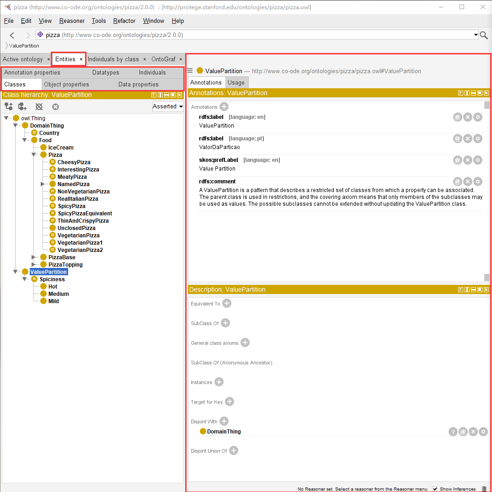

# protege

> 教程：[开始 (protegeproject.github.io)](http://protegeproject.github.io/protege/getting-started/)
>
> https://www.bilibili.com/video/BV1QW4y1T7yd/?spm_id_from=333.999.0.0&vd_source=c3aed98126d5ffa7b2c72cf011d9383c

## 一、Active ontology

:bulb: 该界面显示当前激活本体的信息--本体注释和相关度量值。

:bulb: 右上角的:mag: 用于搜索任意内容（类、属性等），或按Ctrl + F

## 二、Entities

可以探索所有的类、属性 和 个体信息。

子选项卡可调整大小，同步更新对应内容，有跟踪链接

工具栏中的左右箭头按钮可以进行向后和向前导航， 类似 Web 浏览器

> 文本导入protege
>
> 1、txt文本中\n去掉
>
> 2、同名称节点存在问题
>
> 3、不能出现< > 等，用中文“小于”

