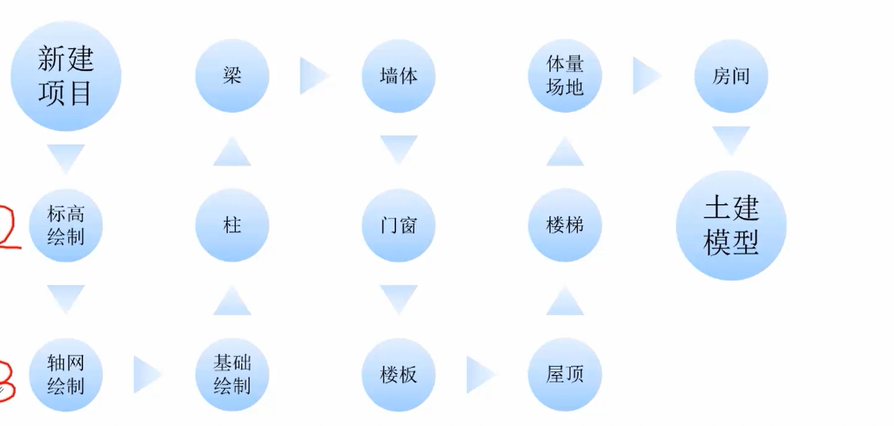

# Revit

## 一、Revit软件特点

- 是一块三维信息化、参数化的设计软件
  - 信息化：多个组别都可从revit提取，如业主、设计院、承包商、供应商等
  - 参数化：可通过参数更改大小
- 数据关联性
  - 多个视图保持同步
- 协同设计
  - 类似多人协同刺点
  - 可多人共同工作，只关注自己的就行，当然也可看到他人的
- 数据统计
  - 根据最终模型可导出对应的所有面积、体积等信息
- 渲染出图

## 二、Revit相关术语

主要术语：项目 > 类别 > 族 > 图元(类型) > 实例 > 属性

### 项目

- 工程中所有模型信息和其他工程信息
  - 模型信息：所有的图元
  - 其他信息：如项目名称、项目结束时间等

### 类别

- 对不同种类的族进行归档

### 族

- 项目的组成构件，是信息的载体，是参数化的具体表现
- 族：系统族、内建族和可载入族
  - 系统族：项目元原有的基本建筑图元
  - 内建族：项目内自己创建的族
  - 可载入族：独立的族文件

### 图元

- 实例是放置在项目中的具体图元
- 图元是项目中基本的单位，是信息的载体
  - 模型图元：建筑的实体几何图元
  - 基准图元：为模型图元的放置和定位提供了框架，如`标高或轴网、参照平面`
  - 视图专有图元：对模型进行描述的图元，如`注释、标记、符号`

### 属性

- 类型属性：族中某一类图元的公共属性
- 实例属性：选定图元的特有属性

## 三、软件操作

### 界面介绍

- 界面上部是软件基本设置
- 中上部是各种可用类别的图元
- 中间左侧是属性列表 + 当前项目目录树
- 中间右侧是视图（可同时显示多个视图，自定义）
- 底部是视图的一些小工具，如渲染效果，隐藏显示等等

### 修改工具的使用

- 底部的命令提示教使用
- 或者移动到工具上边有示例

## 四、搭建流程

项目模板  》 项目浏览器 和 属性界面 》 `管理--项目信息（作者信息） 项目参数可以设置属性 项目单位，设置长度面积体积等单位`  》 基准（测量点和项目基点）

- 测量点：经度纬度高程，绝对坐标
- 项目基点：项目的基点，000，相对坐标

P11了