# 3DCityDB用户手册

## 1、First Step

### 1.1 系统需求

#### 1.1.1 3D City DB

> 需要提前安装 Postgre 、 Oracle 或者 Polar DB，其中每个数据库 和 安装的 City DB 有各自的版本需求。本次为Postgre

City DB 4.3.0 需要版本 `PostGre11之上，以及PostGIS2.5之上`； 本机版本如下：

> PostGre：13.8； PostGis：3.0.3


#### 1.1.2 Importer / Exporter tool

> 导入器/导出器工具可以在任何支持Java 8及以上版本的平台上运行。

本机JAVA 版本 有 8 和 17，可自行切换。


### 1.2 安装 Importer/Exporter

> 这里默认勾选了`所有扩展和插件`，安装后的目录介绍如下

| **Folder/File**             | **Optional** | **Explanation**                                              |
| --------------------------- | ------------ | ------------------------------------------------------------ |
| 3dcitydb                    | **x**        | 包含所有用于操作3DCityDB的shell和SQL脚本以及存储程序。       |
| 3d-web-map-client           | **x**        | 包含一个ZIP档案，其中包含在网络服务器上安装3D网络地图客户端所需的所有文件。 |
| ade-extensions              |              | 包含支持CityGML ADE的扩展包。ADE扩展必须被复制到这个目录中，以使它们在程序中可用。 |
| bin                         |              | 包含特定平台的脚本**impexp**，允许你从命令行运行导入器/导出器。 |
| contribs                    |              | 导入器/导出器所需的第三方工具（例如**collada2gltf**转换器二进制文件）。 |
| lib                         |              | 包含进口商/出口商所需的所有库                                |
| licence                     |              | 许可证文件                                                   |
| plugins                     |              | 包含进口器/出口器的插件。插件只需被复制到这个目录中，使它们在程序中可用。 |
| samples                     | **x**        | 包含CityGML和KML/COLLADA/glTF测试数据集                      |
| templates                   |              | 包含用于KML/COLLADA/glTF导出的信息气球的HTML模板、XML文件形式的坐标参考系统的选择，以及用于导入和导出的XSLT样式表示例。 |
| uninstaller                 |              | 包含一个卸载进口商/出口商的JAR可执行文件。                   |
| 3DCityDB-Importer- Exporter |              | 特定平台的启动脚本，用图形用户界面启动导入器/导出器。例如，在Windows下，只需双击该脚本即可运行该程序 |
| README.txt                  |              | 软件的相关介绍                                               |


### 1.3 设置3DCity DB schema

> - 设置CityDB数据库的脚本可从`3dcitydb/postgresql/和3dcitydb/oracle/子文件夹中的导入器/导出器的安装目录`中找到
> - 支持windows/linux/macos


#### 1.3.1 Shell 脚本

关于City DB数据库的相关脚本bat文件，具体解释如下表

| **文件名**         | **PgSQL** | **Oracle** | **解释**                                                     |
| ------------------ | --------- | ---------- | ------------------------------------------------------------ |
| CONNECTION_DETAILS | **x**     | **x**      | 设置数据库连接细节                                           |
| CREATE_DB          | **x**     | **x**      | 运行所有用于创建3DCityDB的关系模式的脚本，包括数据库类型和功能。 |
| CREATE_SCHEMA      | **x**     |            | 在同一个数据库中的一个独立模式中创建一个额外的3DCityDB实例   |
| DROP_DB            | **x**     | **x**      | 删除3DCityDB的所有元素。                                     |
| DROP_SCHEMA        | **x**     |            | 移除一个包含3DCityDB实例的给定数据库模式                     |
| GRANT_ACCESS       | **x**     | **x**      | 为一个给定的用户授予3DCityDB的只读或读写权限                 |
| REVOKE_ACCESS      | **x**     | **x**      | 撤销一个特定用户的访问权限                                   |
| MIGRATE_DB         | **x**     | **x**      | 将3DCityDB的一个实例从v2或v3迁移到v4                         |
| UPGRADE_DB         | **x**     | **x**      | 将3DCityDB v4的一个实例升级到最新版本                        |

> 补充DB中的schema：
>
> - **看作是数据库的蓝图或模板，描述了数据库中表、列、关系和约束的结构和定义**
> - 在CityDB中，使用schema来组织和管理不同类型的城市模型数据。每个schema代表了一个特定的数据集或数据领域，用于存储和管理相关的城市模型实体、属性和关系。例如，可以使用一个schema存储建筑物模型数据，另一个schema存储地形数据，以及其他schema用于存储交通网络、绿地等数据。
> - 通过使用不同的schema，可以将城市模型数据进行逻辑上的分组和隔离，使其更具组织性和可管理性。每个schema可以具有自己的表、视图、索引和约束，可以根据特定的需求和数据类型进行定制。这样，用户可以根据需要在不同的schema中进行数据操作和查询，而不会混淆或影响其他schema中的数据。

:warning: 执行shell脚本前，必须在 `CONNECTION_DETAILS`中设置连接细节


#### 1.3.2 SQL 脚本

> 对应的SQL脚本文件均存放在`SQLScripts`文件夹中

##### schema

包括用于创建3D城市数据库模式的SQL文件，包括表、约束、数据类型和索引。模式脚本是由模式建模工具pgModeler（PostgreSQL）和JDeveloper（Oracle）自动生成的（需要少量手动编辑）。


##### CITYDB_PKG

包含创建数据库对象和存储程序的脚本，主要由Importer/Exporter工具使用。


##### UTIL

集合了不同的数据库管理实用程序，略


##### MIGRATION

提供迁移脚本，用于将以前主要版本的3DCityDB实例更新到最新的3DCityDB版本（例如，从3.x版本到4.x），以及升级脚本，用于更新同一主要版本的3DCityDB实例（例如，从4.0版本到4.1版本）。


#### 1.3.3 在PostgreSQL上的安装步骤


##### （1）Create an empty PostgreSQL database

选择一个超级用户或具有CREATEDB权限的用户，在PostgreSQL服务器上创建一个新的数据库（例如`citydb_v4`）。选择或创建一个用户作为这个新数据库的所有者`citydb_user`

```shell
CREATE DATABASE citydb_v4 OWNER citydb_user;
#注意本机为postgres
```

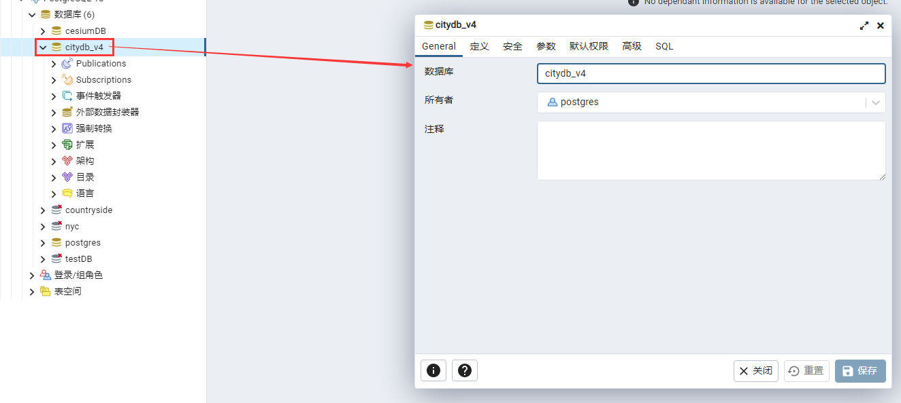


##### （2）Add the PostGIS extension

> 3D城市数据库需要将PostGIS扩展添加到数据库中。这只能以超级用户的身份进行。该扩展是通过以下命令添加的（或者使用pgAdmin也可以）：

```shell
#针对具体实例数据库执行查询脚本如下即可
CREATE EXTENSION postgis;
```

:notebook: 一些三维操作，如挤压或体积计算，只能通过PostGIS SFCGAL扩展来实现。这个扩展是可选的

```shell
CREATE EXTENSION postgis_sfcgal;
```

:notebook: 从PostGIS v3开始，所有的栅格功能都被转移到一个单独的扩展postgis_raster。由于3DCityDB需要光栅功能，如果使用PostGIS 3或更高版本，必须安装这个扩展。

```shell
CREATE EXTENSION postgis_raster;
```

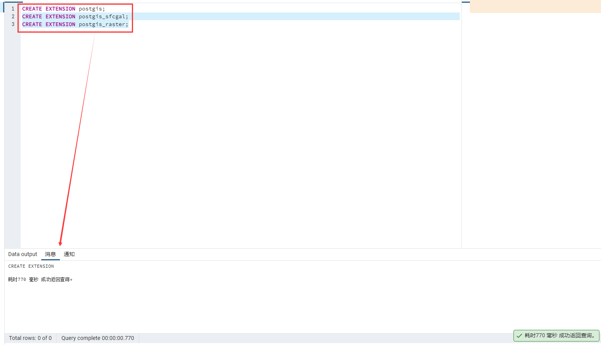

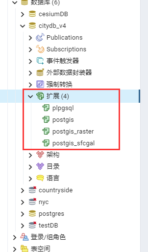


##### （3）Edit the CONNECTION_DETAILS[.sh | .bat] script

进入3dcitydb/postgresql/ShellScripts目录，选择对应的操作系统文件夹，`修改对应CONNECTION_DETAILS内部参数信息，本机如下`

```shell
:: Provide your database details here -----------------------------------------
set PGBIN=D:\PostGre\install\bin
set PGHOST=localhost
set PGPORT=5432
set CITYDB=citydb_v4
set PGUSER=postgres
::-----------------------------------------------------------------------------
```


##### （4）Execute the CREATE_DB script

一旦定义了数据库凭证，运行CREATE_DB脚本，它与CONNECTION_DETAILS位于同一文件夹中。


##### （5）Specify the coordinate reference system

执行CREATE_DB脚本后，会提示在三维城市数据库中使用的坐标参考系统（CRS）,须输入CRS的`PostGIS特定SRID（空间参考ID），类似CRS的EPSG代码`。共有三个提示来定义空间参考：

- 首先，指定数据库的几何列所使用的SRID。与以前版本的三维城市数据库不同，没有定义默认的CRS。
- 第二，如果没有为数据使用真正的三维CRS，则指定高度系统的SRID。这可以被视为元数据，对数据库中的几何列没有影响。默认值是0--这意味着 "未设置"。
- 第三，提供符合GML的CRS统一资源名称（URN）编码。默认值使用OGC名称空间，包括前两个用户输入：这里可选择直接**enter跳过**

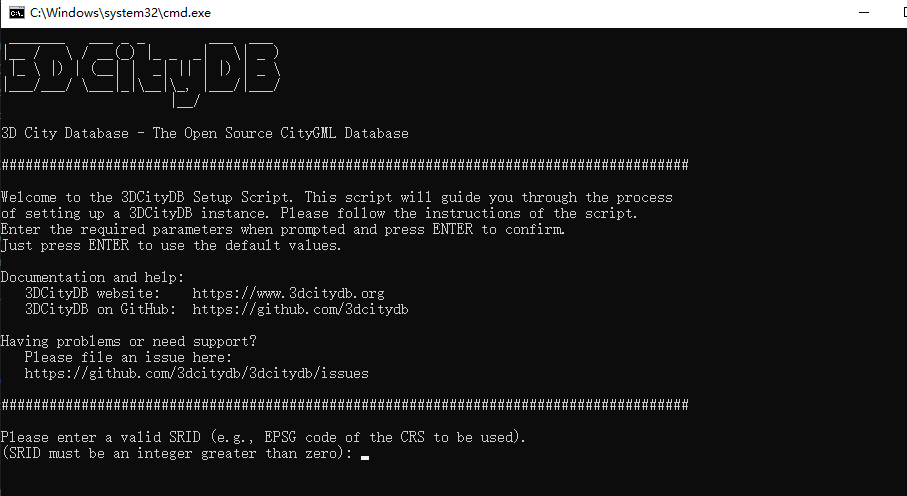

当 "Done "被打印到控制台时，设置过程就成功完成了。

:notebook: 过程中，需要输入用户的口令（`即连接数据库的密码`）

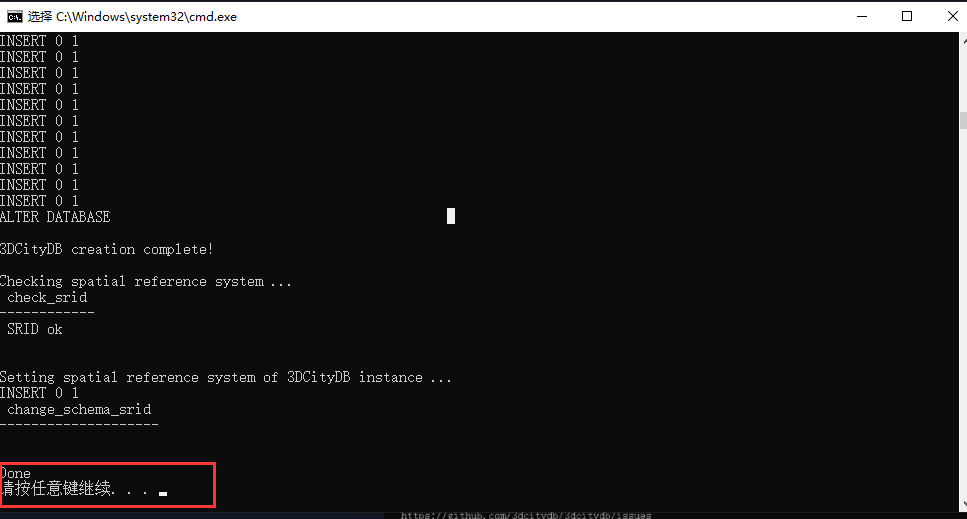


##### （6）Check if the setup is correct

3D城市数据库存储在一个单独的PostgreSQL模式中，称为`citydb`。存储过程被写入一个单独的PostgreSQL模式，称为`citydb_pkg`。通常情况下，不同的模式必须在每个查询中通过点符号来处理，例如

```shell
SELECT * FROM citydb.building;
```

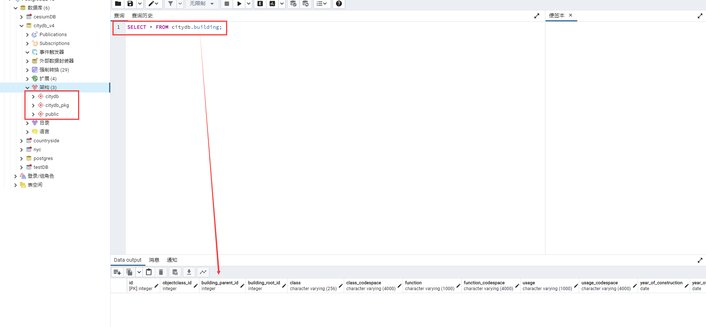


要删除3D城市数据库的所有数据，可按照与CREATE_DB相同的方式执行DROP_DB脚本。简单地以级联的方式删除模式 "citydb "和 "citydb_pkg "也可以完成工作。


#### 1.3.4 PolarDB for PostgreSQL的安装步骤

> 略，本次使用PostGIS

如需要，参照链接如 https://3dcitydb-docs.readthedocs.io/en/latest/first-steps/setup-3dcitydb.html#installation-steps-on-polardb-for-postgresql


#### 1.3.5 在Oracle上的安装步骤

> 略，本次使用Postgre

如需要，参照链接如 https://3dcitydb-docs.readthedocs.io/en/latest/first-steps/setup-3dcitydb.html#installation-steps-on-polardb-for-postgresql


### 1.4 版本迁移

> 略，本机直接安装4.3.0

如需要，参照链接如 https://3dcitydb-docs.readthedocs.io/en/latest/first-steps/migration.html


### 1.5 Docker Images

> 补充
>
> - Docker是一种广泛使用的虚拟化技术，它可以将一个应用程序及其所有需要的资源打包成一个标准化的单元 - Docker容器
> - 与模拟整个操作系统的传统虚拟化环境相比，Docker容器是轻量级的，因为它们只包含应用程序和它所需的所有工具、程序库和文件

**因为自己目前没有使用过Docker，而且现在本地配置好3DCityDB即可，所以Docker部分暂时略，后期需要再添加**


## 2、Overviews

> 该数据库模式实现并完全符合OGC标准CityGML 2.0的概念数据模型，可用来存储、管理、分析甚至可视化三维地理数据
>
> - 可用于开源数据库PostgreSQL/PostGIS和商业Oracle空间数据库解决方案
> - `遵循OGC和GIS的共同标准`，因此三维城市数据库中的数据可以很容易地被开源和商业GIS工具访问和使用，如**QGIS、ESRI ArcGIS**


### 2.1 简介

> 以下内容可能有些冗余，但`对当下整个实景三维发展的理解有帮助，帮助建设个人知识体系`
>
> - 三维城市模型被用作综合信息骨干，代表相关城市**实体**及其**空间、语义和视觉属性**。它们通常在创建和维护时完全覆盖整个城市甚至国家，也就是说，**所有特定类型的现实世界物体，如建筑物、道路、树木、水体和地形都被明确表示**。在大多数情况下，**三维城市模型对象都有明确的标识符，这些标识符在现实世界对象及其虚拟对应物的生命周期内保持稳定**。这种完整的三维模型是在智能城市项目中组织不同类型的数据和传感器的良好基础，因为它们为信息的连接和丰富建立了一个稳定的平台。
> - 为了建立对城市对象的共同理解和解释，并实现包括几何学、地形学、视觉和语义数据在内的完整三维模型的互操作访问和交换，**开放地理空间联盟（OGC）发布了CityGML标准[Kolb2009]**。CityGML为建筑、桥梁、隧道、道路、铁路、植被、水体等最相关的**三维地形元素定义了一个特征目录和数据模型**。该数据模型通过OGC的**地理标记语言（GML）被映射到基于XML的交换格式中**。
> - 3DCityDB 是一个免费的开源软件包，包括一个数据库模式和一套软件工具
>   - 用于根据CityGML标准导入、管理、分析、可视化和导出虚拟三维城市模型[YNKH2018]
>     - 将CityGML 2.0的面向对象的数据模型映射到空间增强型关系数据库管理系统（SRDBMS）的关系结构中
>     - 可以处理非常大的多层次的模型，包括数以百万计的三维物体，以及数以亿计的几何形状和纹理图像
>   - 输入/输出工具
>     - 可直接输出KML、COLLADA和glTF格式的三维可视化模型
>     - 插件
>       - Spreadsheet Generator Plugin
>         - 用于将三维对象的主题数据导出为CSV和Microsoft Excel格式的表格，可以很容易地作为在线电子表格发布
>       - ADE Manager Plugin
>         - 用于动态扩展3DCityDB核心模式的表格和对象，以储存和管理CityGML ADEs
>   - 3DCityDB-Web-Map-Client
>     - 从3.3.0后，3DCityDB包含了基于CesiumJS的3D浏览器，有助于通过互联网在桌面和移动电脑的网络浏览器中对3D城市模型进行交互式可视化和探索
>     - 4.0.0版本后，支持CityGML应用域扩展（ADE），允许通过领域特定的对象类型、属性和关系来扩展CityGML的数据模型，如下文章
>       - [基于CityGML的明清古建筑三维语义模型扩展及转换研究](https://kns.cnki.net/kcms2/article/abstract?v=3uoqIhG8C44YLTlOAiTRKibYlV5Vjs7iJTKGjg9uTdeTsOI_ra5_Xa4zj10_86416bVtnXHh0aZr6NgDUici5VYa6vhLto48&uniplatform=NZKPT)


### 2.2 3DCityDB的主要特征

#### 2.2.1 导入和导出CityJSON数据

除了CityGML格式外，导入/导出器还支持CityJSON格式的数据集。CityJSON是一种基于JSON的编码，用于存储三维城市模型，因此提供了一种替代CityGML的GML/XML编码的方法。它实现了CityGML 2.0数据模型的一个子集。CityGML兼容性页面提供了CityJSON中支持或省略的那些CityGML 2.0功能的列表。

CityJSON是成为OGC社区标准的一个候选项目。


#### 2.2.2 Spreadsheet 导出

> Spreadsheet Generator Plugin 支持三维物体的主题数据导出为CSV和微软Excel格式的表格
>
> - 对于每一个选定的地理对象，都有一行被导出
> - 第一列总是包含各自对象的GMLID值。其他的列可以由用户选择
>   - 可以用来导出建筑物的属性数据，例如类别、功能、用途、屋顶类型、地址，以及其他
> - 电子表格的行可以与KML/COLLADA/glTF导出器生成的可视化模型相连接


#### **2.2.3** **3DCityDB-Web-Map-Client**

> 基于WebGL的三维网络浏览器，它扩展了Cesium Virtual Globe，以**KML/COLLADA/glTF** Exporter生成的平铺KML/glTF数据集的形式，支持对任意大的预设风格的三维可视化模型进行有效**显示、缓存、预取、动态加载和卸载**。
>
> - 单体化
>   - 鼠标移动和鼠标点击时突出感兴趣的对象，以及隐藏、显示和阴影它们。
> - 数据连接
>   - 能够将**三维可视化模型**与谷歌云中的**在线电子表格**（Google Fusion Table）连接起来，并允许根据每个城市对象的**GMLID**查看和查询其专题数据。


#### 2.2.4 Features inherited from CityGML

补充不同的LOD模型等级，如下图

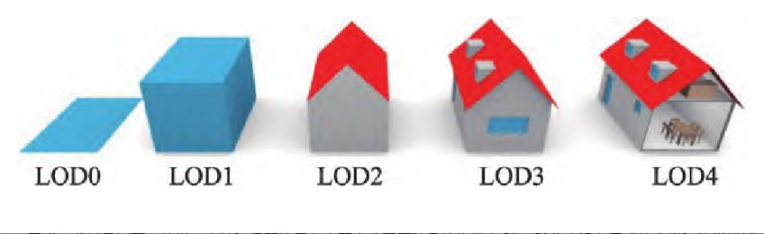


### 2.3 Development history

> 是对3DCityDB软件的开发历史做介绍，共5个时间段，但不是重点，略


### 2.4 Acknowledgements

> 软件致谢单位，不是重点，略


### 2.5 License information

> 3DCityDB软件的许可信息，具体可详见随软件安装的`LICENSE.txt`文件，不是重点，略


## 3、3D City DB

> 本部分对三维城市数据库的关系模式做深入的介绍和解释。
>
> - 3.1节中，讨论了沿着CityGML的UML数据模型的数据库设计，以及它与三维城市数据库的平台无关的概念模型的映射和适应。这个数据库设计也是以`UML`图的形式实现的，并形成了特定数据库系统的关系数据库模式的推导基础。
>
>   - UML是一种标准化的图形化建模语言，用于描述软件系统的结构、行为和交互。
>
>     在CityGML中，UML数据模型被用于定义城市和城市环境的三维地理信息数据的结构和关系。它提供了一种可视化的方式来描述CityGML规范中定义的**概念、对象和属性**。
>
>     CityGML的UML数据模型包含了一系列的**类**（Class）和**关联关系**（Association），以及它们之间的继承、组合和聚合关系等。
>
>     以下是CityGML的UML数据模型中的一些重要概念和关系的解释：
>
>     1. 类（Class）：在UML中，类表示一种对象的定义，用于描述对象的属性和方法。在CityGML的UML数据模型中，每个类代表CityGML规范中定义的特定概念，如建筑物（Building）、道路（Road）、土地利用（LandUse）等。
>     2. 继承（Inheritance）：继承关系表示一个类从另一个类派生而来，继承了父类的属性和方法。在CityGML的UML数据模型中，继承关系用于表示不同类之间的层次结构，例如，建筑物（Building）类可以继承自建筑物用途（BuildingUse）类。
>     3. 关联关系（Association）：关联关系表示类之间的连接或关联，用于描述对象之间的关系。在CityGML的UML数据模型中，关联关系用于表示不同类之间的关联，例如，道路（Road）类可以与交通设施（Transportation）类之间存在关联关系。
>     4. 组合（Composition）和聚合（Aggregation）：组合和聚合是关联关系的特殊形式，表示类之间的整体与部分的关系。在CityGML的UML数据模型中，组合关系用于表示一个类由其他类的实例组成，聚合关系表示一个类包含其他类的实例。
>
> - 3.2节中讨论了所产生的关系模式，以及在映射过程中应用的规则和惯例。关系模式本身是用实体关系图来说明的。
>
> - 其余部分专门讨论了数据库方面的实施和三维城市数据库的工作的不同方面。


### 3.1 UML数据库设计

> 本章讨论使用UML图在概念层面上将CityGML数据模型映射到3D城市数据库的通用数据库设计
>
> - CityGML是三维城市对象的通用信息模型，提供了对象的全面和可扩展的表示
> - 显式建模的目的是实现不同应用程序之间的高度语义**互操作性**。**通过指定主题概念及其语义以及它们到UML和GML3的映射，不同的应用程序可以依赖于一组定义良好的具有标准化含义或解释的特征类型、属性和数据类型。**为了允许在CityGML中未明确建模的对象和/或属性的交换，引入了`GenericCityObjects`和`GenericAttributes`的概念。


#### 3.1.1 CityGML 2.0 Simplifications

数据库的简化存储规则，如具有可变出现次数（*）的属性由能够存储任意值的数据类型

本节不是重点，略


#### 3.1.2 Core model

> 主要介绍GML类到CityObject的继承等

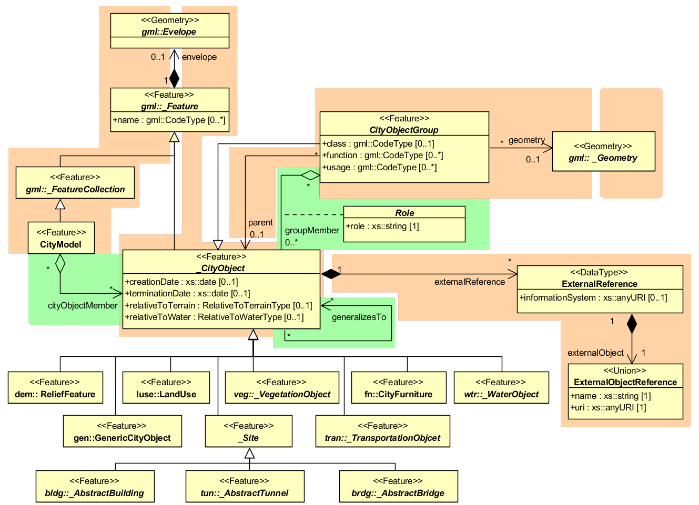

- CityGML数据模型中所有主题类的基类是抽象类`_CityObject`
  - 该类提供创建和终止日期，用于管理要素的历史记录以及其他数据集中相应对象的通用属性和外部引用
  - 是GML类Feature的一个子类，因此它可以从Feature继承多个名称
- CityObject是一个具有可选元数据的`Feature`集合
  - 每个Feature具有class、function 和 usage
    - class用于描述对象的分类，例如道路road、轨道track、铁路railway或广场square
    - function包括对象的用途，如国道national highway和县道county road
    - usage如定义对象是否可导航或可供行人使用
    - `这些属性的值可以在代码列表中枚举。此外，对于每个特征，可以使用包络元素来定义地理范围。最小和最大坐标值必须指定给特征边界框的相对角。`
  - 每个Feature的class只能出现一次，function 和 usage可以出现多次
- _CityObject子类的领域（这些子模型的分离与CityGML的扩展模块密切相关，每个扩展模块都定义了虚拟3D城市模型的相应部分。）
  - 建筑模型（_AbstractBuilding）_
  - 隧道模型（_AabstractTunnel）
  - 桥梁模型（_AbstractBridge）_
  - 城市家具模型（CiyFurniture
  - 数字地形模型（ReliefFeature）
  - 土地利用模型（LandUse）
  - 交通模型（TransportationObject）
  - 植被模型（_VegetationObject）
  - 水体模型（_WaterObject）
  - 和通用城市对象模型（GenericCityObject）
    - 该模型允许对其他模型中没有明确涵盖的特征进行建模
- 每个_CityObject可以具有对外部数据集中相应对象的外部引用。这种引用表示外部信息系统和该系统中对象的唯一标识符


#### 3.1.3 Geometry model

> Feature的空间属性通过GML3的geometry model表达，GML3的显示边界是由隐式几何表示扩展的，它允许定义和重用模板几何。

##### 3.1.3.1 Geometric-topological model

> CityGML的geometry model由基元组成，基元可以组合形成复合体、复合几何体或聚集体。零维对象建模为点，一维对象建模为曲线。曲线被限制为直线，因此只使用GML3类LineString。

- 在聚集体中，组件之间的空间关系不受限制。它们可能是不相交的、重叠的、接触的或断开的。GML3为每个维度、多点、多曲线、多曲面或多实体提供了一个特殊的聚合。与聚集体相反，复合体是拓扑结构的：其部分必须不相交，不得重叠，并且最多可以在其边界处接触或共享其边界的部分

- 复合物是由GML3提供的一种特殊复合体。它只能包含相同维度的元素。它的元素也必须是不相交的，但它们必须沿着边界拓扑连接。Composite可以是CompositeSolid、CompositeSurface或CompositeCurve，并且必须与相应的基本体几何体同胚

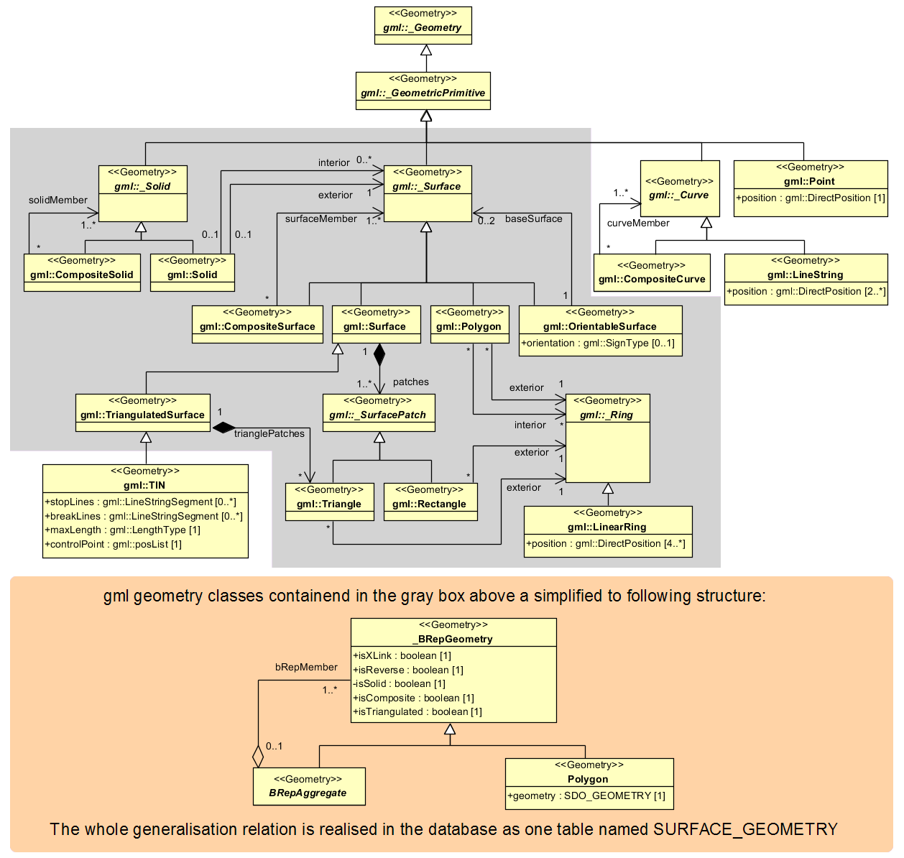

具体图解释见链接https://3dcitydb-docs.readthedocs.io/en/latest/3dcitydb/uml/geometry.html 


##### 3.1.3.2 Implicit geometry


#### 3.1.4 Appearance model

> 表面外观的信息，即表面的可观察特性，除了语义和几何结构外，还被认为是虚拟3D城市模型的组成部分

可以用纹理和地理参考纹理等来表示。每个城市模型支持任意数量的主题的外观

- Feature的每个LoD都可以具有单独的外观
- 每个城市对象或城市模型可以分别存储其自己的外观数据
- `CityGML基类_CityObject和CityModel分别包含关系外观和外观成员`

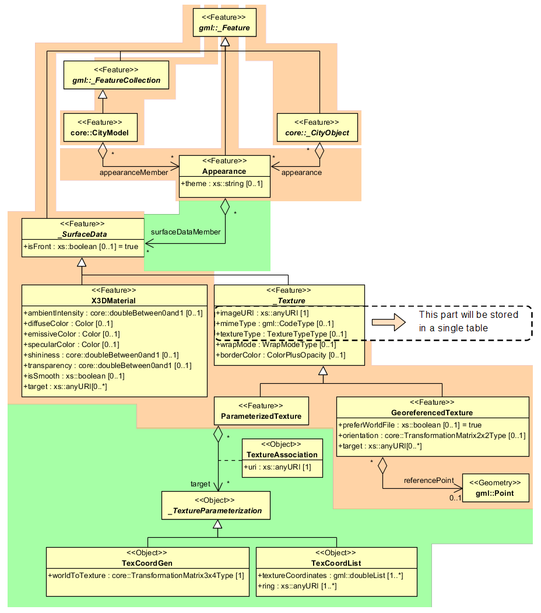

更为细节的表面纹理存储方式详见如下链接，这里不做详细赘述

https://3dcitydb-docs.readthedocs.io/en/latest/3dcitydb/uml/appearance.html


#### 3.1.5 Building model

> 建筑物可以用五个细节级别来表示（LoD0到LoD4）

简单的整体式房屋的情况下，只有一个建筑继承了AbstractBuilding的所有属性和关系，然而，这样的建筑也可以包括同样继承 _AbstractBuilding的所有属性

- 建筑类别
- 功能（如住宅、公共或工业）
- 建造年份
- 拆除年份
- 屋顶类型
- 测量高度
- 地上和地下所有楼层的数量
- 单个高度

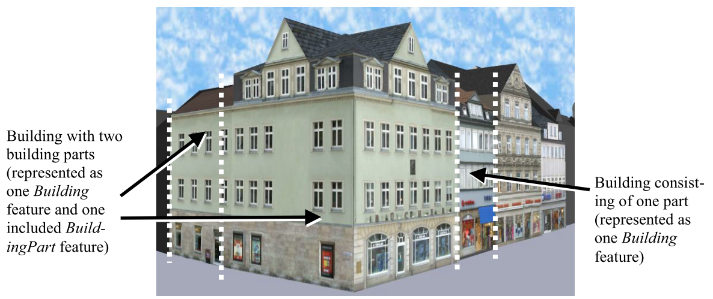

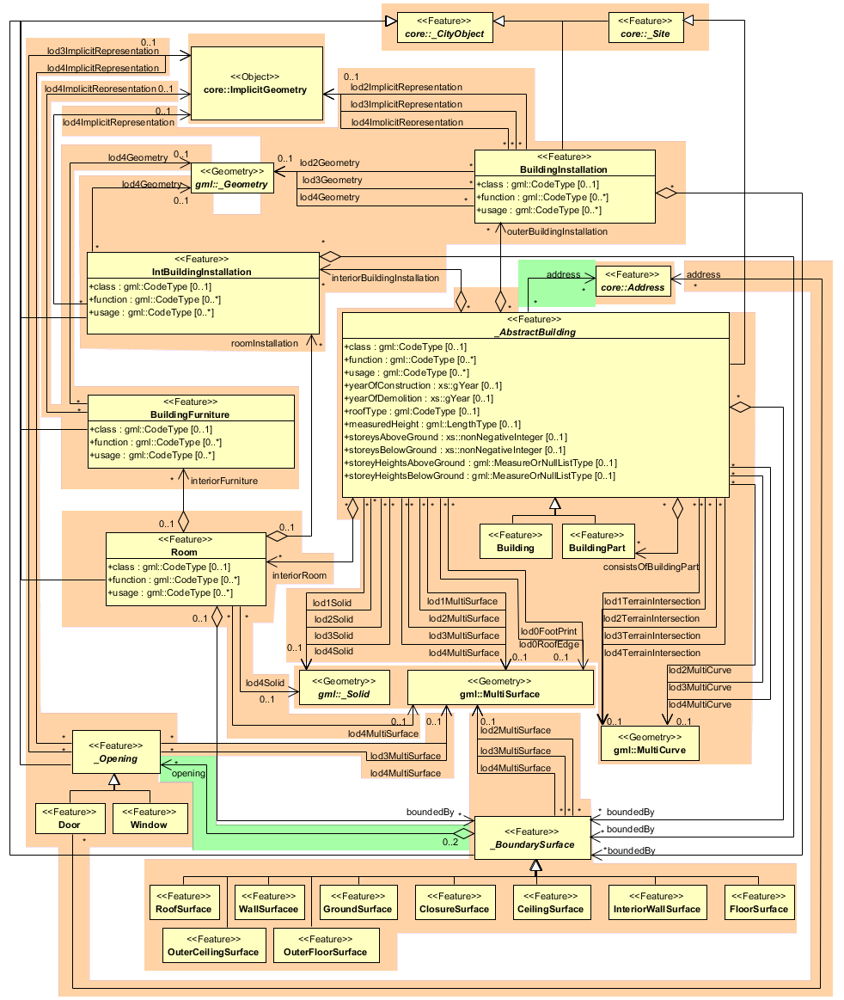

- 在LoD0中，建筑可以由描述占地面积和屋顶图案的水平三维曲面表示。
- 在LoD1中，建筑模型由建筑体积的几何表示组成。
- 在LoD2和更高的LoD中，建筑物的外立面也可以通过类_BoundarySurface和BuildingInstallation在语义上进行区分。边界表面是建筑物外壳的一部分，具有特殊功能，如墙（墙表面）、屋顶（屋顶表面）、接地板（地面表面）或闭合表面（闭合表面）
  - 封闭表面可用于对开放式建筑进行虚拟密封，例如机库，允许进行体积计算

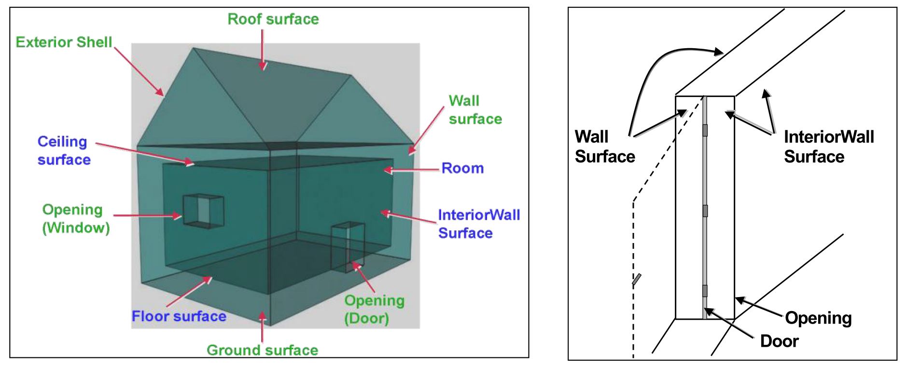

- 在LoD3中，_BoundarySurface对象（门和窗）中的洞口可以表示为专题对象
- 在LoD4中，最高级别的分辨率，也是由几个房间组成的建筑内部，在建筑模型中由类Room表示。


#### 3.1.6 Bridge model

> 桥梁模型允许以四个细节级别（LOD 1-4）表示桥梁和桥梁部件
>
> BridgePart是_AbstractBridge的子类，因此具有相同的属性和关系,语义属性包括类、函数、用法和is_move
>
> - class类:用于对桥梁进行分类，例如区分不同的施工类型
> - function函数
> - usage用法
> - is_move

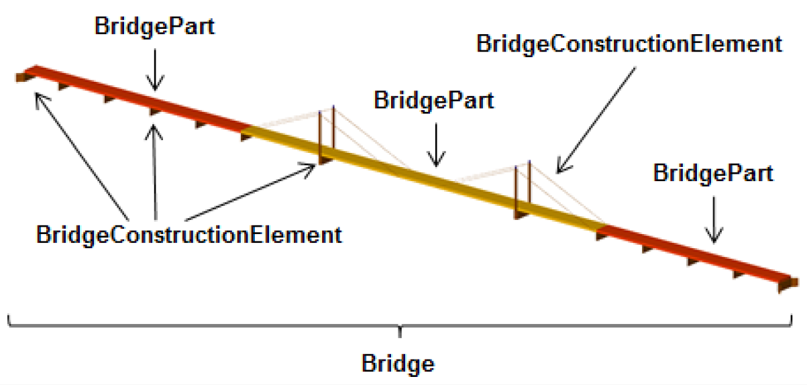

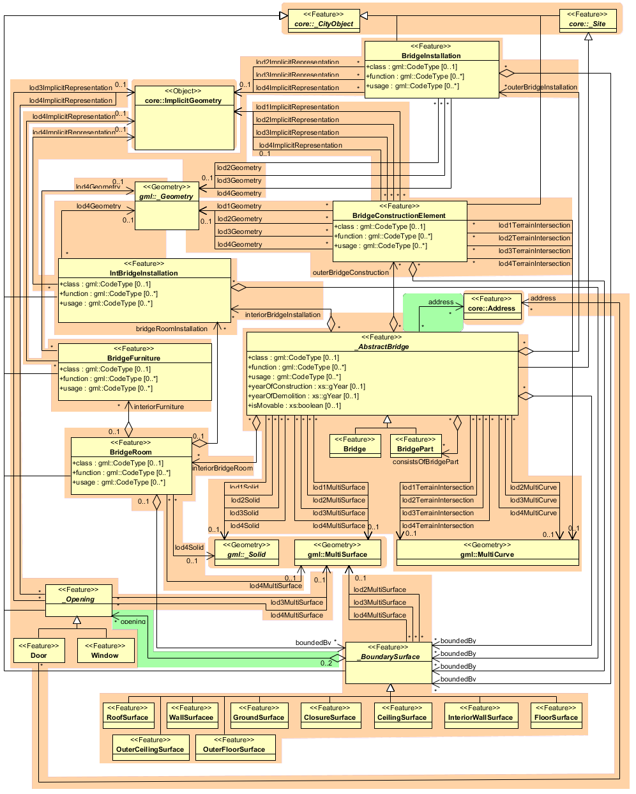


#### 3.1.7 City Furniture model

> 城市家具是不可移动的物体，如灯笼、红绿灯、交通标志、花桶、广告柱、长椅、界桩或公共汽车站
>
> CityFurniture类可能具有属性class、function和usage
>
> - **class**：属性允许对象分类，如红绿灯、交通标志、定界桩或垃圾桶，并且只能出现一次
> - **function**：描述了城市家具对象属于哪个主题区域（如交通、交通管制、建筑等），可出现多次
> - **usage**：表示城市对象的真实目的，可出现多次

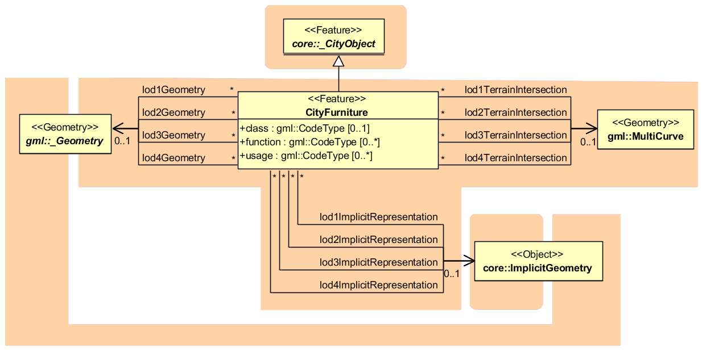


#### 3.1.8 Generics model（通用模型）

> 为便于存储和交换3D对象，CityGML中引入了**通用对象和属性的概念**。这些对象不在CityGML中明确建模的类中，或者需要额外的属性。这些**通用扩展由类GenericCityObject和数据类型genericAttribute实现**。

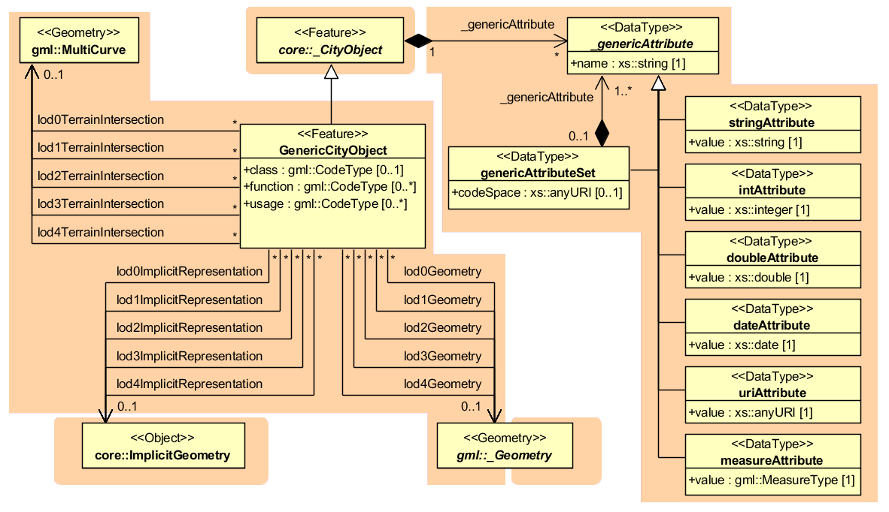


#### 3.1.9 land Use model

> 描述地球表面专门用于特定土地利用的区域。它们可以用于在三维中表示地块。

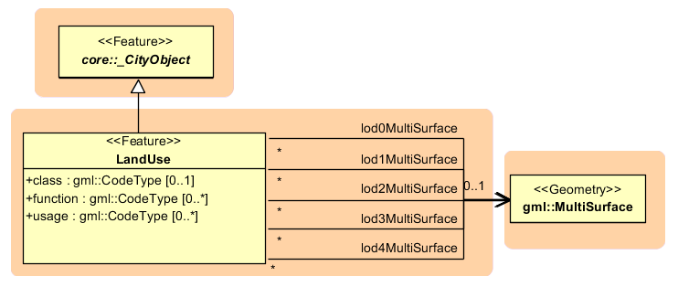


#### 3.1.10 Digital terrain model

> CityGML包括一个适应性很强的数字地形模型（DTM），它允许不同细节级别的异构DTM类型（网格、三角网、折线、质量点）的组合。

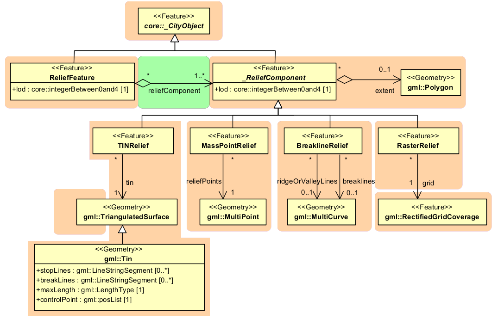


#### 3.1.11 Transportation model

> CityGML的交通模型是一个多功能、多尺度的模型，侧重于主题和功能以及几何/地形方面。

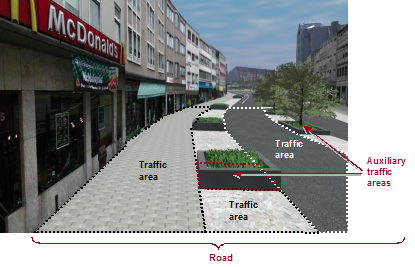

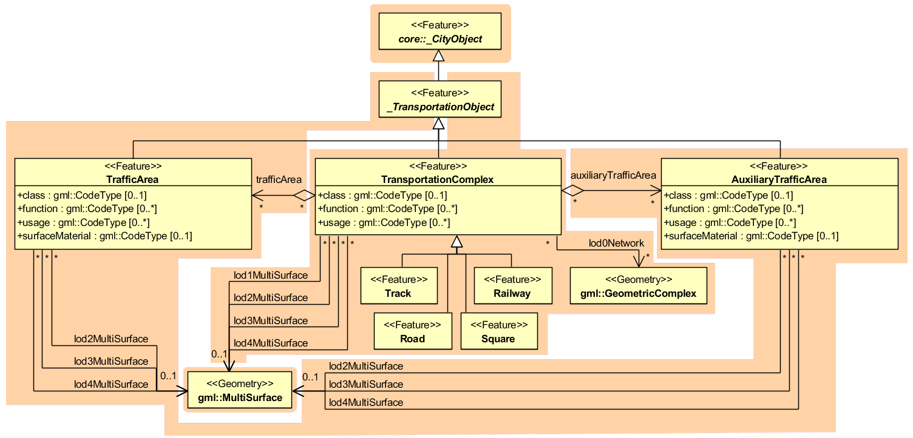


#### 3.1.12 Tunnel model

> 隧道模型与建筑模型密切相关。它支持隧道和隧道部分的主题和空间方面的表示，有四个详细级别，LOD1到LOD4。


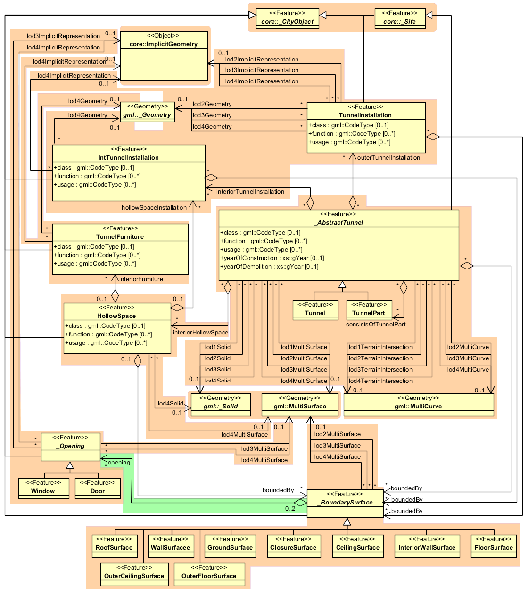

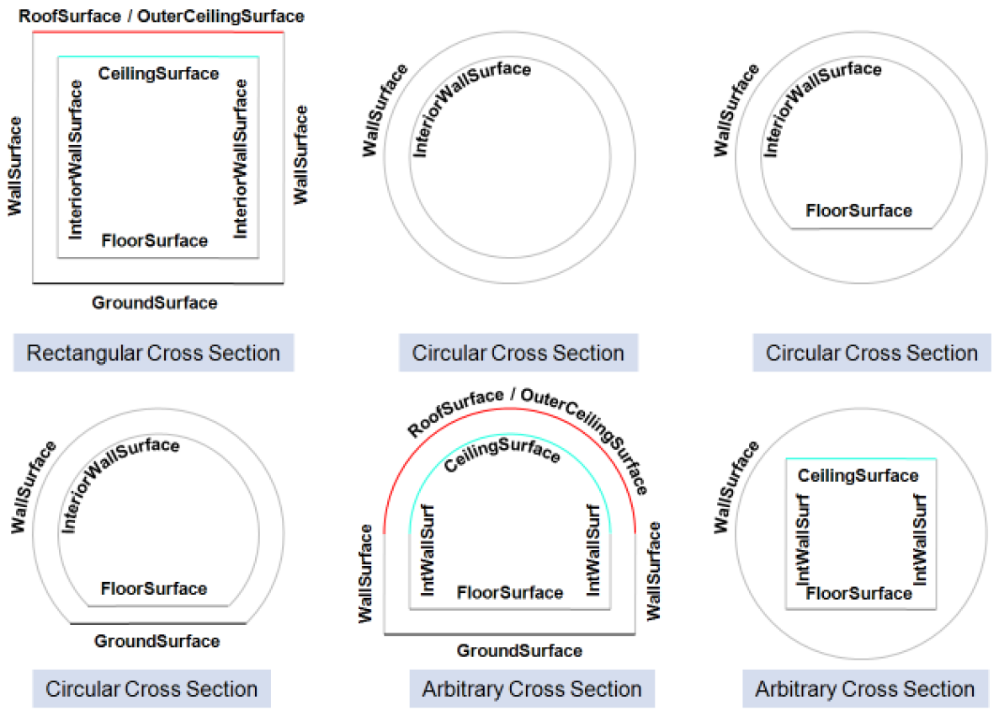


#### 3.1.13 Vegetation model

> 植被模型区分了单独的植被对象（如树木）和植被区域（如森林或其他植物群落）。单个植被对象由SolitaryVegetationObject类建模，而对于充满特定植被的区域，则使用PlantCover类。

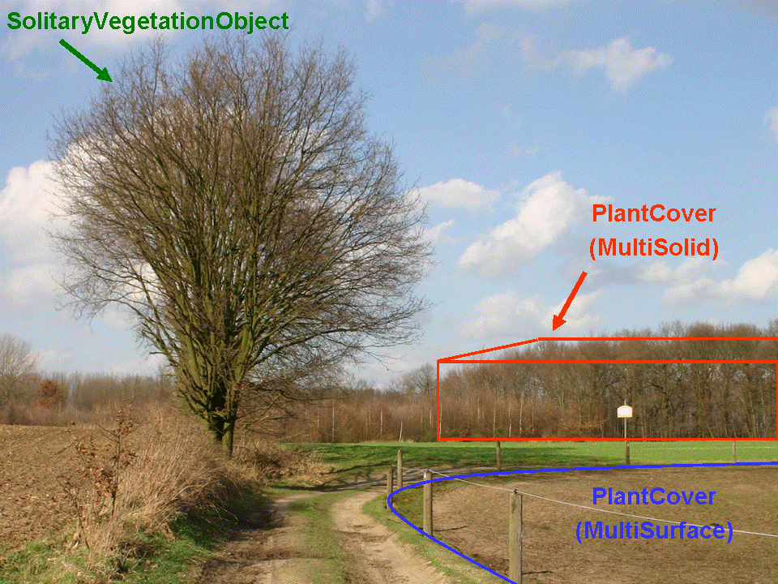

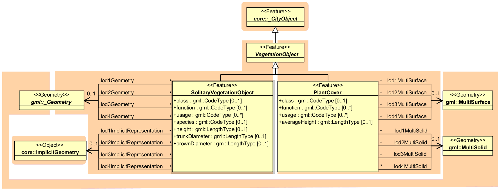


#### 3.1.14 WaterBody model

> 水体模型表示河流、运河、湖泊和盆地的主题方面和三维几何形状。

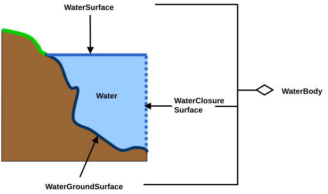

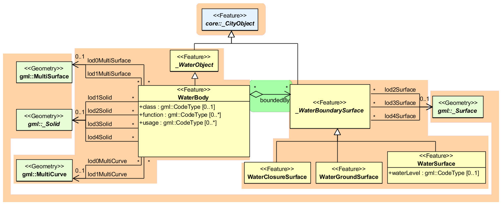


### 3.2 关系型数据库模式

> 上述3.1讨论**了一般的映射规则和惯例**被**映射到一个关系模式**
>
> 本节使用实体关系图详细表明这些关系模式

#### 3.2.1 映射规则和元数据

##### 3.2.1.1. 类到表的映射

- UML图的每个类都映射到一个单独的表上

- 表的名称与类名相同
- 如果UML图中的橙色框中包含多个类，那么这些类将映射到关系模式中的一个表上
- 属性类型根据目标数据库系统PostgreSQL/PostGIS和Oracle的相应数据类型进行定制

| **UML**                                                  | **PostgreSQL / PostGIS**        |
| -------------------------------------------------------- | ------------------------------- |
| String, anyURI                                           | VARCHAR, TEXT                   |
| Integer                                                  | NUMERIC                         |
| Double, gml:LengthType                                   | DOUBLE PRECISION                |
| Boolean                                                  | NUMERIC                         |
| Date                                                     | DATE orTIMESTAMP WITH TIME ZONE |
| Complex Types(Color, TransformationMatrix,CodeType etc.) | VARCHAR                         |
| Enumeration                                              | VARCHAR                         |
| GML Geometry,textureCoordinates                          | GEOMETRY                        |
| GML RectifiedGridCoverage                                | RASTER                          |
| Texture (only referenceof type anyURI in CityGML)        | BYTEA                           |


##### 3.2.1.2  Explicit metadata about feature classes

###### objectclass 表

> 创建的citydb_v4数据库中，citydb架构 > cityobject表

- 该表OBJECTCLASS包含三维城市数据库支持的所有要素类
- ID - 每个CityGML要素类都被分配了一个唯一且稳定的ID
  - Building - 26；Bridge - 64
- classname - 要素类的名称（对应的具体要素种类）
- tablename - 要素类映射到的表名称（该架构下的其他具体表名）
- SUPERCLASS_ID - `指向要素类的直接超类（父类）`
- BASECLASS_ID - `层次结构的根类（顶级类）`
- IS_TOPLEVEL - 要素类是否表示CityGML顶级要素

`3D城市数据库中注册CityGML ADE会导致在OBJECTCLASS表中为ADE中定义的每个类添加额外的条目。OBJECTCLASS表还有两个属性IS_ADE_CLASS和ADE_ID，用于管理和标识ADE类`

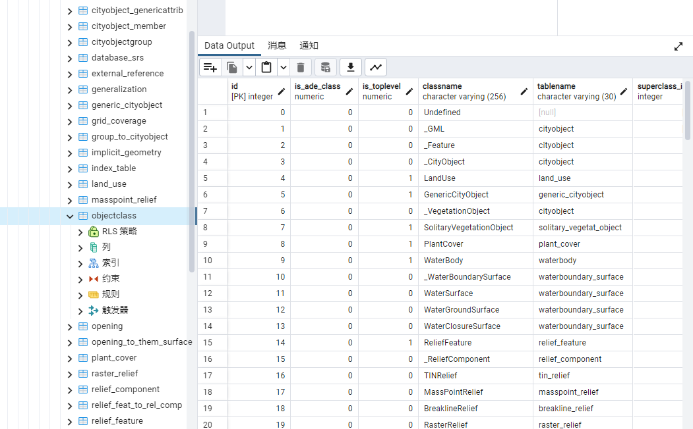

###### cityobject 表

- 存储在三维城市数据库中的所有城市对象都注册在根表CITYOBJECT中，此表具有一个属性OBJECTCLASS_ID，该属性引用了OBJECTCLASS中的一个条目
- 还可以查询它的类名、特性表、是否是顶级特性，甚至它的（可传递的）超类

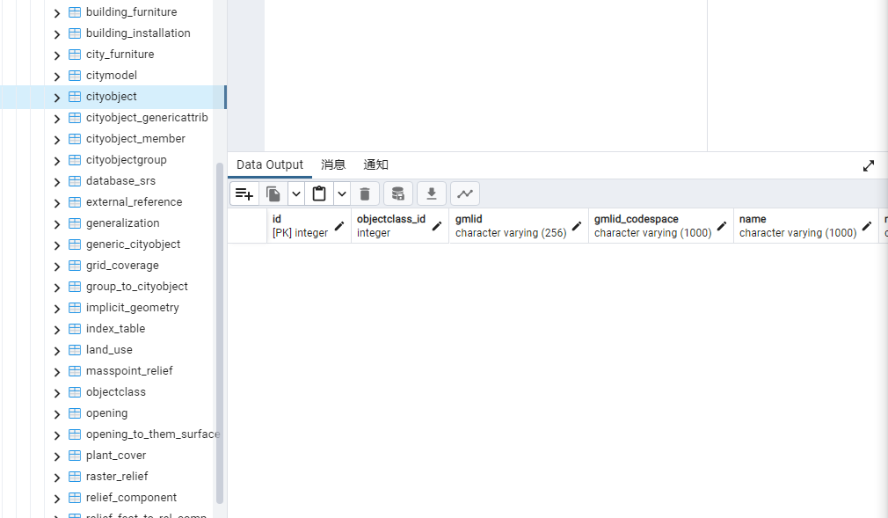

#### 3.2.2 核心架构

#####  cityobject 表

> 所有CityObjects（以及Buildings等子类的实例）都由根表CITYOBJECT中的元组表示。
>
> 表中每一行记录表示一个具体的城市对象，如建筑物、道路、绿地等

- 包围盒bounding box (*gml:**Envelope***) 

  - 使用五个点的矩形几何体，这些点连接边界框的最小和最大x、y和z坐标，并完全定义边界框

  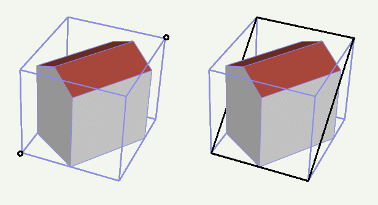

- gmlid & gmlid_codespace

  - 存储每个城市对象的gml:id值,字符串值
  - 由于不能保证gml:id在不同的CityGML文件上是唯一的，因此还提供了GMLID_DESPACE列。例如，它可能包含包含该对象的导入CityGML文件的完整路径。应确保GMLID和GMLID_DESPACE的组合对于每个CityObject都是唯一的

  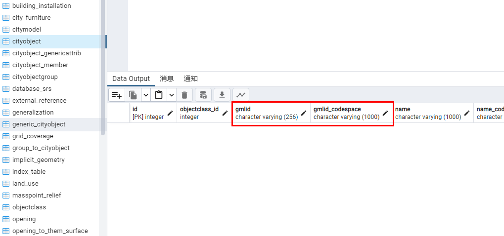

- name & name_codespace

  - 可包含多个gml:NAME属性，在这种情况下，它们必须用字符串'-/-'（不带引号）分隔。CityGML导出器随后将创建多次出现的gml:name元素。

- objectclass_id

  - 存储了关于CityObject类附属关系的信息

- id（也被称为cityobject_seq）

  - 3DCityDB中使用的一个序列（Sequence）或计数器
  - 用于在数据库中标识和区分不同的城市对象。这个标识符通常是一个整数值，由CITYOBJECT_SEQ生成并分配给每个新插入的城市对象
  - 也可用做外键

:book: **CITYOBJECT_SEQ是在数据库级别上用于唯一标识和区分城市对象的整数标识符，而GMLID是在CityGML文档级别上用于唯一标识和引用要素的字符串标识符。它们分别用于不同的目的和层次，一个用于数据库存储和查询，一个用于CityGML文档的标识和交换。**


##### citymodel 表

> "citymodel"表是存储整个城市模型的主表，代表了一个完整的城市模型
>
> 它包含了城市模型的基本信息和元数据，如模型的名称、版本、坐标参考系统等。
>
> Citymodel表只有一行记录，表示整个城市模型的概要。


citymodel 和 cityobject的区别

- Citymodel表存储整个城市模型的概要信息，而Cityobject表存储具体的城市对象的详细信息
- Citymodel表只有一行记录，而Cityobject表有多行记录，每行记录表示一个城市对象

citymodel 和 cityobject的联系

- Citymodel表和Cityobject表通过外键（cityobject_seq）关联，建立了城市对象与城市模型之间的关系。每个Cityobject记录都与Citymodel表中的城市模型关联。
- Citymodel表提供了对整个城市模型的概览和元数据，Cityobject表提供了对每个具体城市对象的详细信息
- 通过Cityobject表中的外键，可以将特定的城市对象与所属的城市模型关联起来，从而组成完整的城市模型


##### external_reference 表

> 用于存储城市对象的外部参考信息，它记录了城市对象与外部数据或资源之间的关联。

- cityobject_id
  - cityobject内具体城市对象的id
- infosys
  - 城市对象的参考坐标系


##### cityobjectgroup 表 & group_to_cityobjet

> 由cityobject中包含的城市对象组成的对象组
>
> 之间的n:m关系由表group_TO_cityobject记录实现，该表将Cityobject 和 cityobjectgroup相关联

**例子**

cityobject表

| **ID** | **OBJECTCLASS****_ID** | **GML_ID** | **ENVELOPE** | **CREATION****_DATE**     | **TERMINATION****_DATE** |
| ------ | ---------------------- | ---------- | ------------ | ------------------------- | ------------------------ |
| 2      | 26                     | Build1632  | GEOMETRY     | 2015-02-0209:26:07.441+01 | NULL                     |
| 4      | 26                     | Build1633  | GEOMETRY     | 2015-02-0209:26:07.441+01 | NULL                     |
| 1      | 23                     | Group1700  | NULL         | 2015-02-0209:26:07.441+01 | NULL                     |

cityobjectgroup表

| **ID** | **CLASS** | **CLASS_****CODESPACE** | **FUNCTION**  | **FUNCTION_****CODESPACE** | **USAGE** | **USAGE_****CODESPACE** |
| ------ | --------- | ----------------------- | ------------- | -------------------------- | --------- | ----------------------- |
| 1      | NULL      | NULL                    | Buildinggroup | NULL                       | Hotel     | NULL                    |

grouptocityobject 表

| **CITYOBJECT_ID** | **CITYOBJECTGROUP_ID** | **ROLE**      |
| ----------------- | ---------------------- | ------------- |
| 2                 | 1                      | Main building |
| 4                 | 1                      | Annex         |


#### 3.2.3 Geometry schema

##### surface_geometry 表

> 在数据库模式中，几何体由平面组成，每个平面对应表 SURFACE_GEOMETRY 中的一条记录

- Geometry
  - 存储地物基于曲面的几何形状
- IMPLICIT_GEOMETRY
  - 存储地物的隐含几何体

:warning:两个字段的限制

- Only POLYGON Z is allowed, i.e. a polygonwith 3D coordinates
- Polygons might have holes
- The IMPLICIT_GEOMETRY column has no SRID defined. Thus, entries in that column will have the SRID 0 automatically


- SOLID_GEOMETRY

> 用于存储城市对象的立体几何数据，通常表示为三维空间中的几何形状

:warning:字段限制

- 具有三维坐标的实体外壳
- 一个简单的多面体可以用几个多边形作为边界


- IS_SOLID
  - 曲面（0）和实体（1）
- IS_COMPOSITE
  - 聚合（0，例如MultiSolid、MultiSurface）还是表示复合（1，例如CompositeSolid、CompositeSurface）

基于这些标志，可以区分下表列出的几何图形类型。要区分多实体和多曲面，必须分析其子元素：如果子元素是实体，则可以将几何体标识为多实体。

|                             | isSolid | **isComposite** | **isTriangulated** | GEOMETRY | **SOLID_****GEOMETRY** |
| --------------------------- | ------- | --------------- | ------------------ | -------- | ---------------------- |
| Polygon, Triangle,Rectangle |         |                 |                    | ✔        | NULL                   |
| MultiSurface                |         |                 |                    | NULL     | NULL                   |
| CompositeSurface            |         | 1               |                    | NULL     | NULL                   |
| TriangulatedSurface         |         |                 | 1                  | NULL     | NULL                   |
| Solid                       | 1       |                 |                    | NULL     | ✔                      |
| MultiSolid                  |         |                 |                    | NULL     | NULL                   |
| CompositeSolid              | 1       | 1               |                    | NULL     | ✔                      |

:book: 为聚合层次结构的每个成员存储ROOT_ID对查询性能有很大影响，因为它允许使用单个查询（WHERE ROOT_ID=x）检索层次结构的所有成员，从而避免递归查询。

**例子**

> - 在surface_geometry 存储一个 体积几何体，构成实体外壳的独立多边形表示为单独的记录，每个记录使用属性Geometry来存储多边形（其中的ID 6 - 10）
> - 将多边形组合成一个复合曲面，因此添加一条记录来表示复合曲面（ID 2）
> - ID 6 - 10 的parent_id 存储复合曲面的ID，并ID2 的is_composite改为1
> - 最终添加一条记录表示最终实体（ID 1），其is_solid 标志设置为1，复合曲面（ID2）使用Parent_id属性引用它

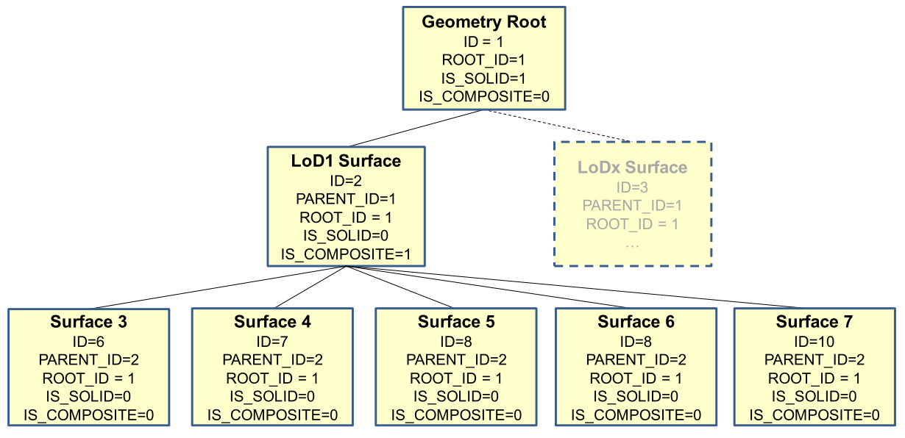

**下图所示的几何体由七个表面组成，这些表面形成了一个体积对象。在表中，它由以下行表示：**

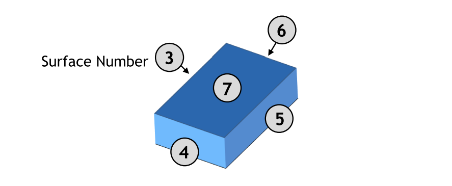

| **ID** | **GMLID**   | **PARENT_****ID** | **ROOT_****ID** | **IS_****SOLID** | **IS_COM****POSITE** | **GEOMETRY**          | **SOLID_****GEOMETRY** |
| ------ | ----------- | ----------------- | --------------- | ---------------- | -------------------- | --------------------- | ---------------------- |
| 1      | UUID_lod1   | NULL              | 1               | 1                | 0                    | NULL                  | GEOMETRYfor Solid      |
| 2      | lod1Surface | 1                 | 1               | 0                | 1                    | NULL                  | NULL                   |
| 3      | Left1       | 2                 | 1               | 0                | 0                    | GEOMETRYfor surface 3 | NULL                   |
| 4      | Front1      | 2                 | 1               | 0                | 0                    | GEOMETRYfor surface 4 | NULL                   |
| 5      | Right1      | 2                 | 1               | 0                | 0                    | GEOMETRYfor surface 5 | NULL                   |
| 6      | Back1       | 2                 | 1               | 0                | 0                    | GEOMETRYfor surface 6 | NULL                   |
| 7      | Roof1       | 2                 | 1               | 0                | 0                    | GEOMETRYfor surface 7 | NULL                   |

- is_xlink

CityGML允许使用GML3的XLink概念在不同几何图形或不同主题特征之间共享几何图形对象。为此，`将为要共享的几何体对象分配一个唯一的gml:id，gml几何体属性元素可以通过其xlink:href属性引用该gml:id`。这一概念允许避免数据冗余。此外，CityGML没有采用GML3的内置拓扑包，而是使用XLink概念对拓扑进行显式建模

尽管XLink可以被视为指向现有几何体对象的指针，但SURFACE_geometry表不提供可用于引用该表中另一个元组的外键属性。其主要原因是，`引用的元组通常属于不同的几何体聚合，例如不同的gml:Solid对象，因此其ROOT_ID和PARENT_ID属性包含不同的值`。因此，外键将违反SURFACE_GEOMETRY表的聚合机制。

将XLink引用解析为几何体对象的推荐方法需要两个步骤：`首先，必须通过在GMLID列中搜索引用的gml:id值来识别SURFACE_geometry表的引用元组。其次，必须将已识别元组的所有属性值复制到新元组中。但是，这个新元组的ROOT_ID和PARENT_ID必须根据引用几何属性元素的上下文进行设置`。

- 导入时：

  - 默认情况下，IS_XLINK标志设置为 "0"。

  - 如果由于XLink引用而必须复制现有的图元，则必须将每个副本的IS_XLINK设置为 "1"（全局XLink）或 "2"（本地XLink）。请注意，该规则包括嵌套元组的所有副本。

  - 此外，IS_XLINK必须在XLink引用所指向的原始元组上设置为 "1 "或 "2"。如果该元组是聚合（子）层次结构的顶层，则所有嵌套元组的IS_XLINK保持为 "0"。

:exclamation: 局部XLink引用同一顶级要素内的几何图形，而全局XLink引用另一顶级要素中的几何图形;  如果导入工具无法区分本地引用和全局引用，则应将值“1”用于所有IS_XLINK属性。

- 导出时：

  - 导出过程只需跟踪那些将IS_XLINK设置为“1”或“2”的几何元组的GMLID值。 

  - 当导出IS_XLINK设置为“1”或“2”的元组时，导出过程必须检查它是否已经遇到了相同的GMLID，因此可以在实例文档中使用XLINK引用。 

  - 对于IS_XLINK=0的每个元组，不需要采取进一步的操作。


- is_reverse

略


#### 3.2.4 Appearance schema

##### appearance 表

- description
  - 存储对象表面数据信息
- theme
  - 存储类别
- CityObject_id
  - 存储外键信息
- CityModel_id
  - 存储外键

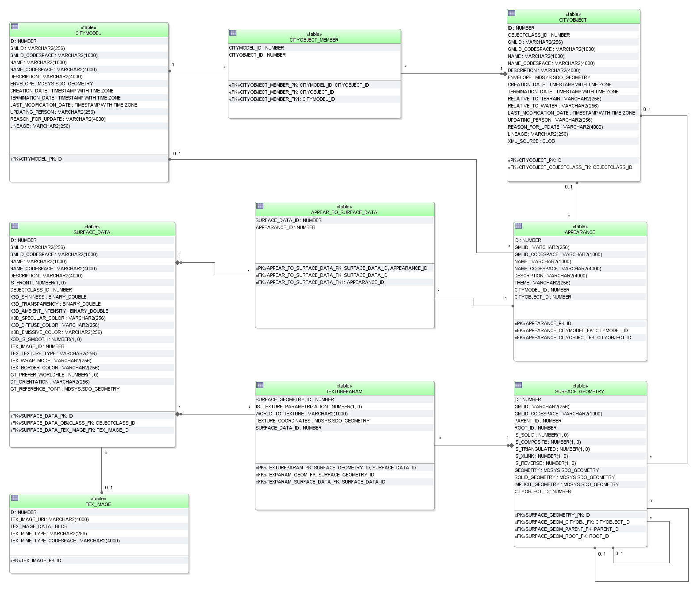

##### surface_data & tex_image & appear_to_surface_data 表

> surface_data外观由每个曲面几何对象的数据组成。数据类型及其外观的信息存储在表 SURFACE_DATA 中。

- IS_FRONT
  - IS_FRONT=1：正面 IS_FRONT=0：几何体的背面
- OBJECTCLASS_ID 
  - 表示特定对象是否使用了材料或纹理（值：X3DMaterial、Texture 或 GeoreferencedTexture）
- X3D_xxx （可扩展三维）
  - 定义了材质的图形表示

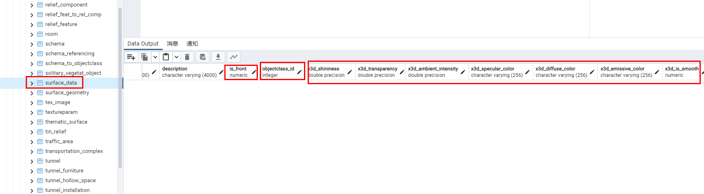


> 基于光栅的二维纹理存储在表 TEX_IMAGE 中

- TEX_IMAGE_URI
  - 存储相应图像的名称 或 URL
- TEX_IMAGE_DATA 
  - 存储纹理图像， `postgre使用bytea二进制数据存储`

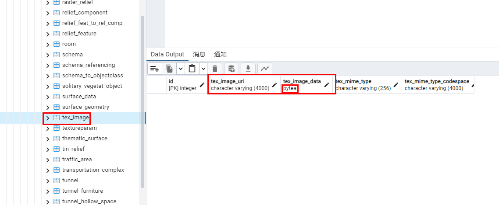

> 表 APPEAR_TO_SURFACE_DATA 表示不同主题的外观和表面之间的相互关系。


##### textureparam 表

> 用于将纹理映射到几何对象

点列表或变换矩阵）的属性由 CityGML 类 _TextureParameterization、TexCoordList 和 TexCoordGen 定义，这些属性存储在表 TEXTUREPARAM 中。

###### 案例

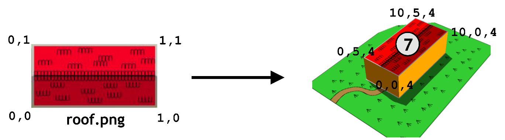


| **SURFACE_****GEOMETRY_ID** | **IS_TEXTURE****_PARAMETRIZATION** | **WORLD_TO****_TEXTURE** | **TEXTURE_****COORDINATES** | **SURFACE_****DATA_ID** |
| --------------------------- | ---------------------------------- | ------------------------ | --------------------------- | ----------------------- |
| 7                           | 1                                  | NULL                     | GEOMETRY                    | 20                      |

:book: 纹理坐标适用于多边形表面，其边界由封闭的线性环描述（最后一个坐标等于第一个坐标）。坐标以几何体数据类型存储。

- WORLD_TO_TEXTURE
  - 定义了从世界空间位置到纹理空间的转换矩阵


##### LOD1 和 LOD2下的存储案例

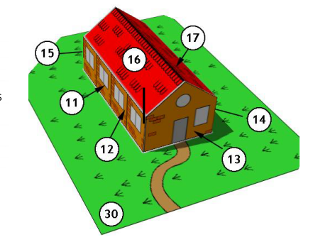

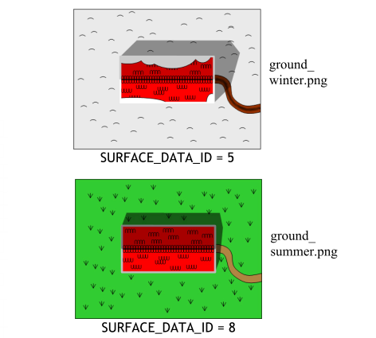

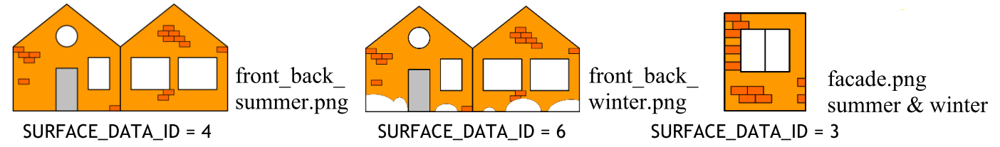

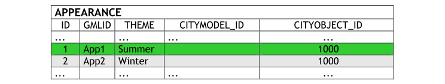

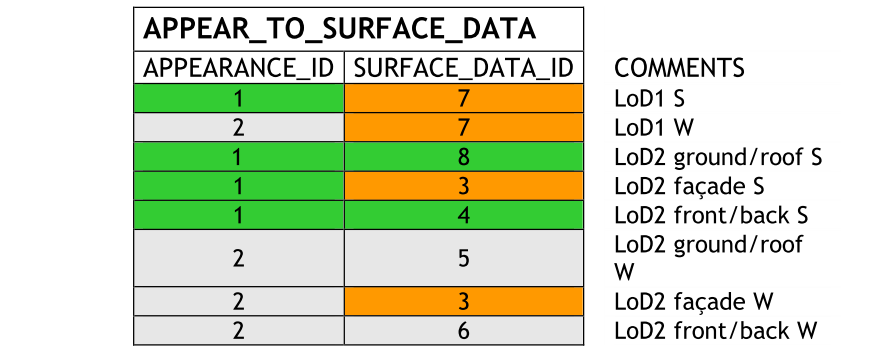

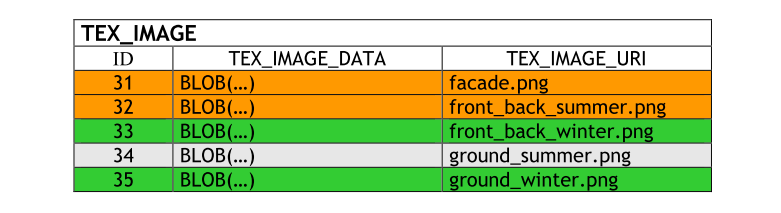

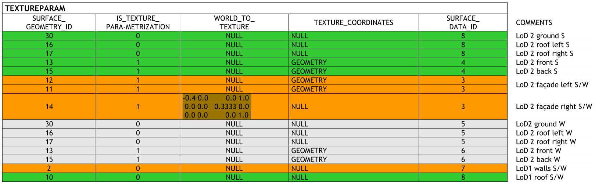

### 


### 3.3 三维城市数据库实例的CRS定义


### 3.4 与多个数据库模式一起工作


### 3.5 存储程序和附加功能


### 3.6 3DCityDB Docker使用方式


## 4、Importer/Exporter

> 用于3D城市数据库的基于Java的客户端，允许高性能加载和提取3D城市模型数据
>
> 提供了一个图形用户界面（GUI），供最终用户在台式计算机上方便使用；也可以通过命令行界面（CLI）在没有GUI的情况下运行。


### 4.1 Launching the Importer/Exporter

> 脚本启动方式
>
> 一：运行安装目录下的3DCityDB-Importer-Exporter.bat脚本（linux下使用.sh）
>
> 二：开始目录下的exe执行文件

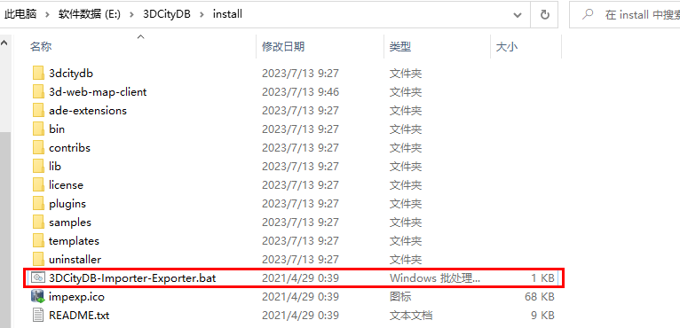

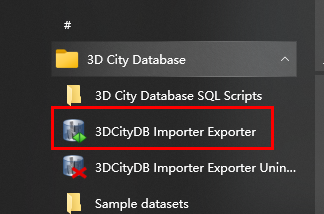

:book: 对应安装目录下有readme.txt文件用于介绍3DCityDB-Importer-Exporter的使用方式

#### 在开始程序中使用环境变量

> 可在环境变量中设置JAVA_OPTS 覆盖默认选项，用于控制导入器/导出器可使用的主内存量，这里不做更改

如需更改将以下代码存于3DCityDB-Importer-Exporter文件内部最后一行前即可。

**windows**

```shell
set JAVA_OPTS="-Xms1G -Xmx8GB"
```

**linux**

```shell
export JAVA_OPTS="-Xms1G -Xmx8GB"
```

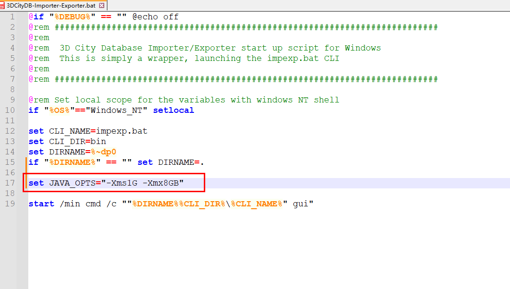

更改详见 https://3dcitydb-docs.readthedocs.io/en/latest/impexp/launching.html

#### 更新CLI 启动脚本

:book: 启动脚本3DCityDB Importer-Exporter只是一个批处理文件，它调用Importer/Exporter的CLI脚本impexp，该脚本位于安装目录的bin文件夹中。要对启动过程进行更细粒度的控制，还可以直接编辑此CLI启动脚本


### 4.2 Using the graphical user interface(GUI)

1. 菜单栏
2. 操作窗口
3. 提供正在运行的进程和数据库连接的信息
4. 后台日志消息

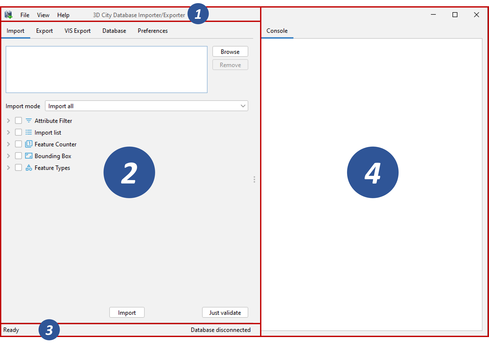

#### 菜单栏

> 提供了条目“文件”、“视图”和“帮助”。“文件”菜单允许用户从配置文件中存储和加载应用程序设置，并关闭应用程序。

| **Open Settings…**           | 加载配置文件，并从该文件恢复所有设置。                       |
| ---------------------------- | ------------------------------------------------------------ |
| **Save Settings**            | 将图形用户界面中的所有设置保存到默认配置文件中。             |
| **Save Settings As…**        | 将图形用户界面中的所有设置保存到单独的配置文件中。           |
| **Restore Default Settings** | 将所有设置设为默认值。                                       |
| **Save Settings XSD As…**    | 将定义配置文件 XML 结构的 XML 模式保存到单独的文件中。XML 模式有助于用户手动编辑配置文件。只有符合 XML 模式定义的配置文件才能被导入/导出程序成功加载。 |
| **Recently Used Settings**   | 最近加载的配置文件列表。                                     |
| **Exit**                     | 退出                                                         |

:book: 每个运行 Importer/Exporter 的操作系统用户使用一个默认配置文件。具体在用户的主目录下，本机为：

```shell
[11:10:37 INFO] Settings successfully saved to file 'C:\Users\小Tiger\3dcitydb\importer-exporter\config\project.xml'
```

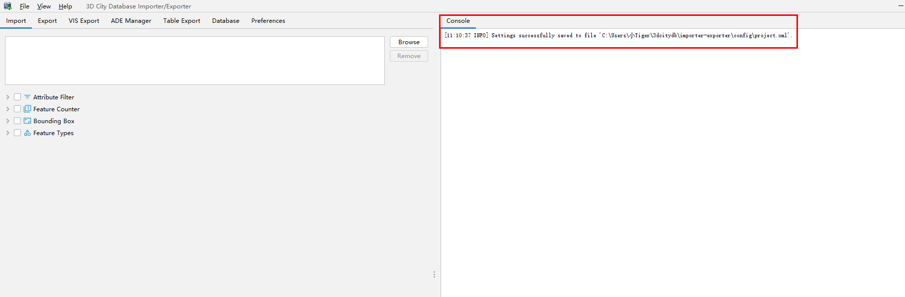


视图菜单会影响导入/导出程序的图形用户界面元素，并提供以下条目

| **Open Map Window**             | 打开二维地图窗口进行边界框选择（4.8节） |
| ------------------------------- | --------------------------------------- |
| **Detach Console**              | 在单独的应用程序窗口中显示控制台窗口。  |
| **Light Mode****Dark Mode**     | 主题色                                  |
| **Restore default perspective** | 恢复默认的出厂设置                      |


帮助菜单提供用户手册链接和有关导入/导出程序的更多信息

| **Online-Documentation…** | 在网络浏览器中打开本用户手册。                              |
| ------------------------- | ----------------------------------------------------------- |
| **Read Me**               | 打开随导入程序/导出程序一起提供的 README.txt 文件。         |
| **About**                 | 显示一般信息，如进口商/出口商和开发合作伙伴的官方*版本号*。 |


#### 操作窗口

##### Importer

​	将CityGML或CityJSON数据集导入数据库

##### Exporter

​	以CityGML或CityJSON格式导出城市模型数据

##### VIS export

​	以KML、COLLADA或glTF格式导出城市模型数据以进行可视化

​	:book: KML（Keyhole Markup Language）补充：

- 用于描述地理空间信息的标记语言使用XML格式表示，如标记和显示地理位置、绘制地理要素、分享地理信息等。
- 可以包含地理位置、标记点、线、面、图像、地形等地理空间数据

​	:book: COLLADA（Collaborative Design Activity）补充：

- 一种用于表示和交换三维图形数据的开放标准，如在不同的三维建模和动画软件之间进行数据交换和共享
- 以XML格式表示，可以包含几何形状、材质、动画、相机设置等三维图形数据
- 使用三维建模软件（如Blender、Autodesk Maya、3ds Max等）创建并导出COLLADA文件，将三维模型保存为COLLADA格式

##### ADE manager

​	 

##### Table exporter

​	

##### Database

​	数据库连接设置和操作

##### Preferences

​	每个操作的首选项设置


### 4.3 Database connections and operations

> 操作窗口的数据库选项卡允许用户管理和建立数据库连接，并执行数据库操作。

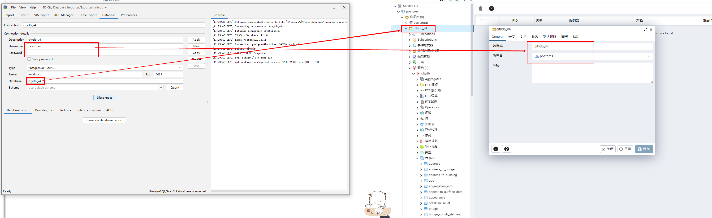

要连接到 3D 城市数据库实例，必须在上述对话框中输入有效的连接参数。必须输入的数据库连接详细信息包括数据库用户的**用户名和密码、数据库类型、数据库服务器的服务器名称（网络名称或 IP 地址）和端口号（默认值：PostgreSQL 为 5432；Oracle 为 1521）以及数据库名称（使用 Oracle 时，请在此处输入数据库 SID 或服务名称）。**


#### 4.3.1 Database report

> 数据库报告是 3D 城市数据库所有表格及其行数的列表。因此，此操作可提供 3D 城市数据库内容的快速概览。报告将打印到控制台窗口。

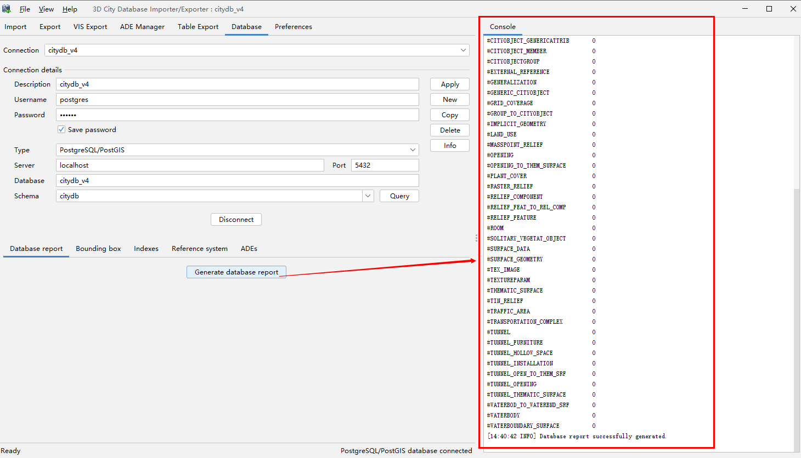


#### 4.3.2 Calcuating/updating bounding boxes

> 通过此对话框可以计算数据库中存储的城市对象的二维边界框。

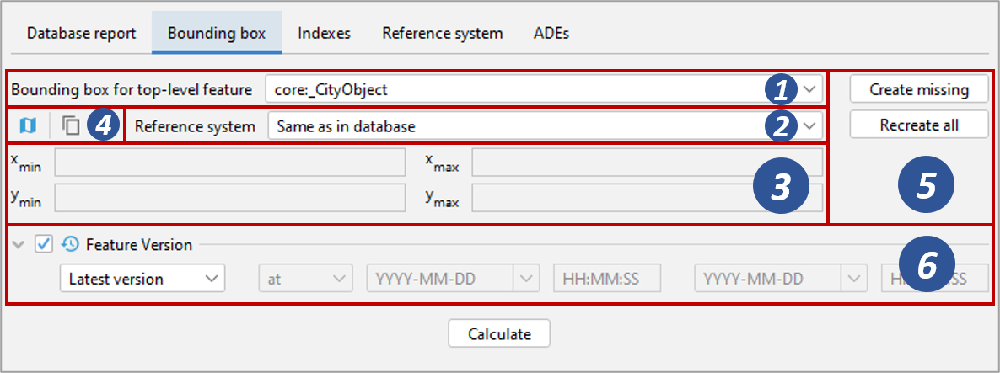

- 选择要计算边界框的顶层地物类型默认选项 core:_CityObject 将对数据库中的所有城市对象进行计算，但您也可以将计算限制为特定类型，如 bldg:Building 或 wtr:WaterBody

- 可以选择将边界框转换为用户定义的坐标参考系。默认情况下，边界框会以与 3D 城市数据库实例在设置过程中指定的参考系相同的方式显示
- 可使用时间筛选来计算中应使用的城市对象版本


要启动计算，请按下计算按钮。计算出的边界框左下角（xmin，ymin）和右上角（xmax，ymax）的坐标将显示在对话框的相应字段中


:warning: 边界框的计算基于 CITYOBJECT 表 ENVELOPE 列中存储的值。如果该列为 NULL 或包含不正确的值（例如，在导入时无法正确填写该值或城市对象的几何表示已更改），那么生成的边界框将是错误的，后续操作可能无法提供预期结果。


#### 4.3.3 Managing indexes

> 通过导入/导出器，用户可手动激活或停用 3D 城市数据库模式中预定义表的索引，并检查其状态

索引操作只影响 3D 城市数据库模式定义的所有索引的以下子集：

| **Index type** | **Column(s)**          | **Table**        |
| -------------- | ---------------------- | ---------------- |
| Spatial        | ENVELOPE               | CITYOBJECT       |
| Spatial        | GEOMETRY               | SURFACE_GEOMETRY |
| Spatial        | SOLID_GEOMETRY         | SURFACE_GEOMETRY |
| Normal         | GMLID, GMLID_CODESPACE | CITYOBJECT       |
| Normal         | LINEAGE                | CITYOBJECT       |
| Normal         | CREATION_DATE          | CITYOBJECT       |
| Normal         | TERMINATION_DATE       | CITYOBJECT       |
| Normal         | LAST_MODIFICATION_DATE | CITYOBJECT       |
| Normal         | GMLID, GMLID_CODESPACE | SURFACE_GEOMETRY |
| Normal         | GMLID, GMLID_CODESPACE | APPEARANCE       |
| Normal         | THEME                  | APPEARANCE       |
| Normal         | GMLID, GMLID_CODESPACE | SURFACE_DATA     |
| Normal         | GMLID, GMLID_CODESPACE | ADDRESS          |

:notebook: 建议对大量数据进行 CityGML/CityJSON 导入之前先停用空间索引，然后再重新激活空间索引。这样导入速度通常会比启用空间索引时快很多。

:warning: 激活和停用索引可能需要很长时间，尤其是在数据库填充级别较高的情况下。请注意，用户不能终止操作，因为这会导致数据库状态不一致。


#### 4.3.4 Managing the spatial reference system

> 在设置 3DCityDB 实例时，必须通过选择数据库支持的空间参照 ID（SRID）和相应的 SRS 名称标识符（gml:srsName）来选择空间参照系统（SRS）

链接数据库后默认读取对应坐标信息

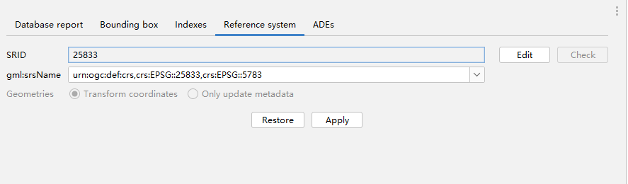

:book: 由于更改 SRID 可能会影响数据库中的所有几何图形，因此可能需要很长时间才能完成，因此 SRID 字段默认为禁用。单击 **编辑** 按钮可启动对该字段的更改

:book: gml:srsName 字段提供了常见 SRS 标识符编码方案。

- transform coordinates
  - 将已存储在数据库中的几何对象坐标转换为新的 SRID
- only update metadata
  - 只更新元数据


#### 4.3.5 Displaying supported CityGML AEDs

> 该选项卡提供在 3DCityDB 实例中注册和/或导入/导出程序支持的所有 CityGML 应用域扩展 (ADE) 的列表

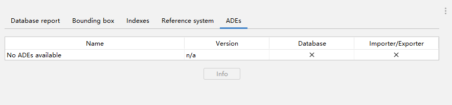

每个条目列出 ADE 的名称和版本，并说明数据库和/或导入/导出程序是否支持该 ADE

如何使用ADE扩展请详见 https://3dcitydb-docs.readthedocs.io/en/latest/impexp/db-operations/db-citygml-ades.html 


### 4.4 Import

要将 3D 城市模型内容加载到 3D 城市数据库实例中，**导入程序/导出程序支持在操作窗口的 "导入 "选项卡上导入 CityGML 和 CityJSON 文件**。

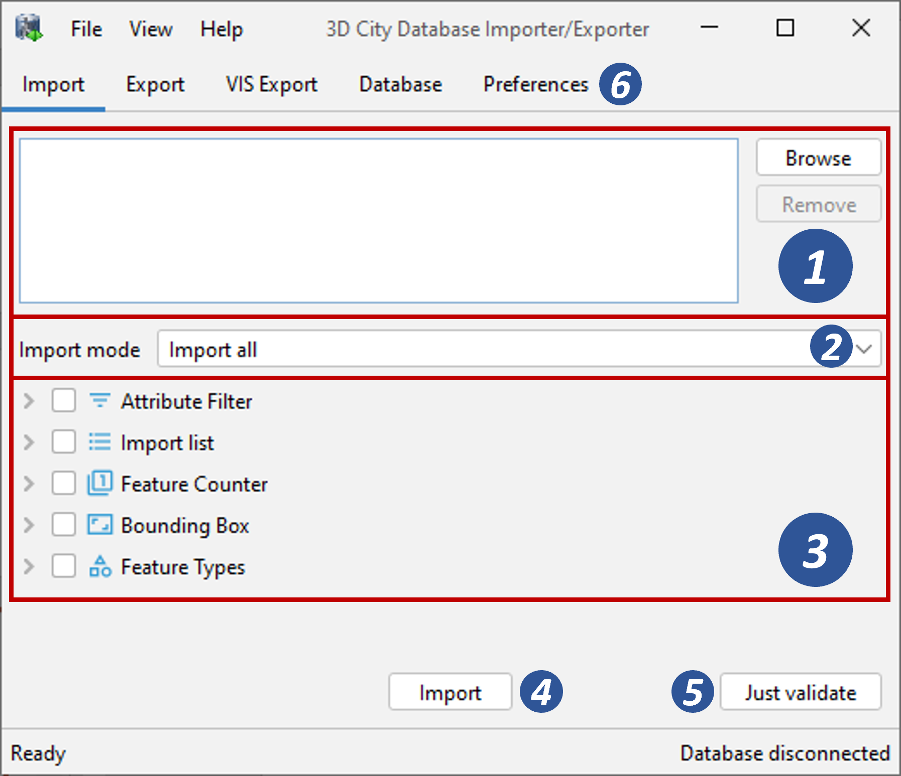


#### 输入文件 和 格式

> 导入操作支持以下文件格式和扩展名

| **格式**                               | **文件扩展名**     |
| -------------------------------------- | ------------------ |
| **CityGML versions 2.0, 1.0, and 0.4** | *.gml, *.xml       |
| **CityJSON version 1.0.x**             | *.json, *.cityjson |
| **GZIP compressed files**              | *.gz, *.gzip       |
| **ZIP archives**                       | *.zip              |

:book: 文件格式严格根据文件扩展名进行检测；**针对压缩文件会递归扫描 ZIP 压缩包中的 CityGML 和 CityJSON 文件。**从 CityGML/CityJSON 文件中引用的附加文件（如纹理图像）也将被导入数据库，前提是在导入过程中能正确解析引用。

:warning: 即使是较大的 CityGML 文件也能以**流式方式读取（即一个接一个地读取顶层特征）**，但在读取整个文件时，**CityJSON 文件的大部分内容必须保留在主内存中。为避免内存问题，请确保 CityJSON 输入文件的大小足够小，否则导入过程将出现异常终止**。您也可以增加导入/导出程序的可用内存（参见第 4.1 节）。


#### 导入模式

> 略，本版本没有该控件


#### 导入筛选

所有导入筛选器只适用于顶层城市对象，而不适用于嵌套的子地物。

#### 4.4.1  Attribute filter属性筛选

> 属性过滤器将对象标识符和/或 gml:name 作为参数，只导入与相应属性值相匹配的顶层特征。

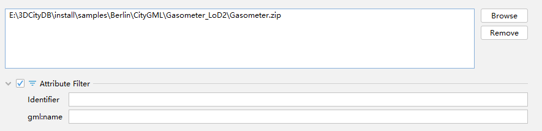

可以用逗号分隔的列表提供多个标识符。但不支持多个 gml:name 值。

:book: gml:name 搜索字符串支持两个通配符： "*"代表零个或多个字符，". "代表单个字符。您可以使用转义字符""来转义通配符。例如，如果您为 gml:name 过滤器提供 *abc，那么 gml:name 为 "xyzabc "和 "abc "的特征都将被导入。如果输入 \*abc，则 gml:name 必须与 "*abc "完全匹配才能导入特征。


#### 4.4.2  Import list filter

> 略，本版本没有该控件


#### 4.4.3  Feature counter

> 特征计数器过滤器限制了要导入的顶级特征的数量

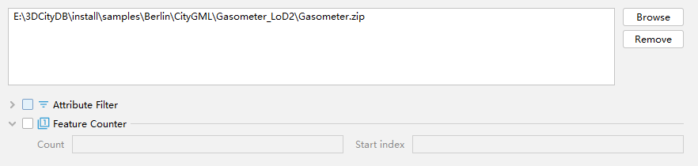

只需在计数字段中输入特征点的数量即可。起始索引参数表示所有输入文件的所有特征集合中的索引，导入应从该索引开始。这些参数可以一起使用，也可以单独使用。

:book: 起始索引使用基于 0 的编号。因此，第一个顶层特征被分配为索引 0，而不是索引 1。


#### 4.4.4  Bounding box filter

> 边界框过滤器以二维边界框为参数，边界框由左下角（xmin, ymin）和右上角（xmax, ymax）的坐标值给出。边界框将分别根据输入特征的 gml:boundedBy 属性（CityGML）和 "geographicalExtent "属性（CityJSON）进行评估。您可以选择是否导入与提供的边界框重叠的地物，或者地物是否必须位于边界框内。

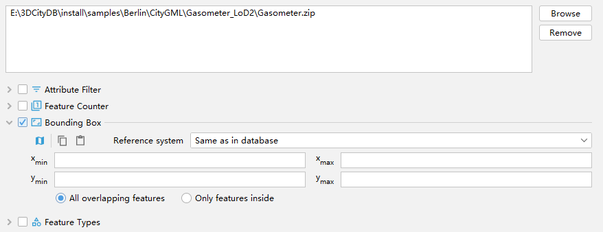


#### 4.4.5  Feature type filter

> 通过特征类型筛选器，您可以启用相应的复选框，将导入限制为一种或多种特征类型。只导入所选类型的特征

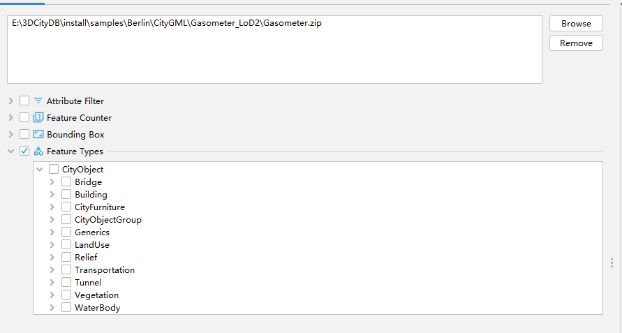

:book: 地物类型过滤器只显示顶级地物类型。如果相应的 ADE 扩展名已在导入/导出程序中正确注册，它将自动包含来自 CityGML ADE 的地物类型


#### 验证模式

> 可以根据官方的 CityGML XML 和 CityJSON 模式对输入文件进行验证


#### 导入高级选项

> 操作窗口[6]的 "首选项 "选项卡上提供了影响导入操作的更精细的首选项设置。请务必在开始导入之前检查这些设置。

| **Preference name**                                          | **描述**                                                     |
| ------------------------------------------------------------ | ------------------------------------------------------------ |
| [General](https://3dcitydb-docs.readthedocs.io/en/latest/impexp/import-preferences/general.html#impexp-preferences-import-general) | General options like behaviour in error situations to be used for imports. |
| [Continuation](https://3dcitydb-docs.readthedocs.io/en/latest/impexp/import-preferences/continuation.html#impexp-import-preference-continuation) | Metadata that is stored for every object in the database such as the data lineage, the updating person or the creationDate property. |
| [Object identifier](https://3dcitydb-docs.readthedocs.io/en/latest/impexp/import-preferences/object-identifier.html#impexp-import-preferences-identifier) | Generates UUIDs where object identifiers are missing on input features or replaces all identifiers with UUIDs. |
| [Appearance](https://3dcitydb-docs.readthedocs.io/en/latest/impexp/import-preferences/appearance.html#impexp-import-preferences-appearance-chapter) | Defines whether appearance information should be imported.   |
| [Geometry](https://3dcitydb-docs.readthedocs.io/en/latest/impexp/import-preferences/geometry.html#impexp-import-preferences-geometry) | Allows for applying an affine transformation to the input geometry. |
| [Address](https://3dcitydb-docs.readthedocs.io/en/latest/impexp/import-preferences/address.html#impexp-import-preferences-address-chapter)(CityGML only) | Controls the way in which xAL address fragments are imported into the database. |
| [XML validation](https://3dcitydb-docs.readthedocs.io/en/latest/impexp/import-preferences/xml-validation.html#impexp-import-preferences-xml-validation)(CityGML only) | Performs XML validation automatically and excludes invalid features from being imported. |
| [XSL Transformation](https://3dcitydb-docs.readthedocs.io/en/latest/impexp/import-preferences/xsl-transformation.html#impexp-import-preferences-xsl-transformation)(CityGML only) | Defines one or more XSLT stylesheets that shall be applied to the city objects in the given order before import. |
| [CityJSON options](https://3dcitydb-docs.readthedocs.io/en/latest/impexp/import-preferences/cityjson.html#impexp-cityjson-import-preferences) | Defines import options for CityJSON input files.             |
| [Indexes](https://3dcitydb-docs.readthedocs.io/en/latest/impexp/import-preferences/indexes.html#impexp-import-preferences-indexes) | Settings for automatically enabling/disabling spatial and normalindexes during imports. |
| [Import logs](https://3dcitydb-docs.readthedocs.io/en/latest/impexp/import-preferences/import-logs.html#impexp-import-preferences-import-logs) | Additional log files for recording successfully imported top-level features and duplicate objects. |
| [Resources](https://3dcitydb-docs.readthedocs.io/en/latest/impexp/import-preferences/resources.html#impexp-import-preferences-resources-chapter) | Allocation of computer resources used in the import operation. |


#### 本机导入及数据库报告

> 数据来源：

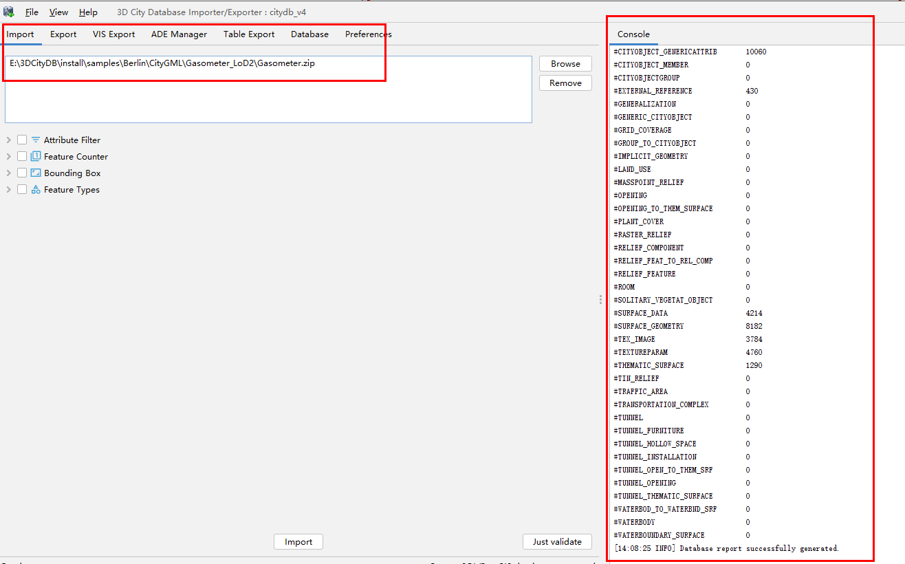

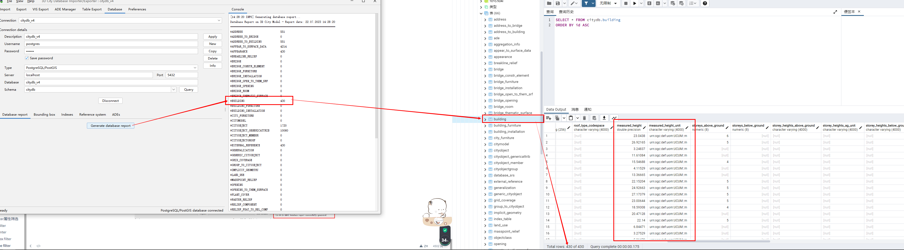

### 4.5 Export

存储在3D城市数据库中的3D城市模型内容可以在操作窗口的“导出”选项卡上导出为CityGML和CityJSON数据集。

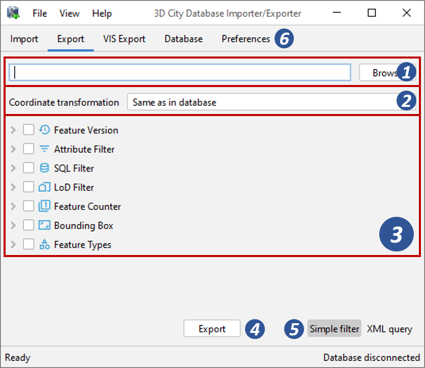

#### 输出文件选择[1]

在导出对话框的顶部，必须指定目标数据集的文件夹和文件名。导出操作支持下面列出的输出文件格式。只需确保输出文件以要导出的格式的文件扩展名结束即可。

| **Format**                       | **File extensions** |
| -------------------------------- | ------------------- |
| **CityGML (version 2.0 or 1.0)** | *.gml, *.xml        |
| **CityJSON (version 1.0)**       | *.json, *.cityjson  |
| **GZIP compressed file**         | *.gz, *.gzip        |
| **ZIP archive**                  | *.zip               |

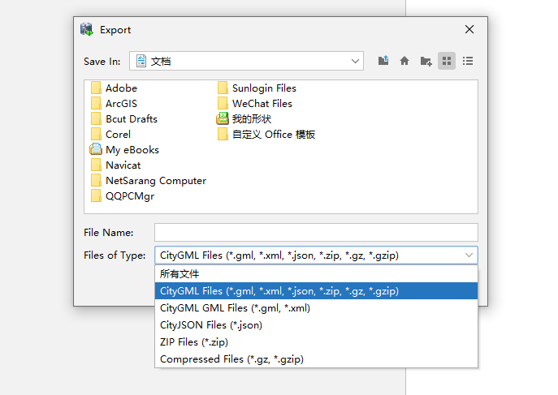

#### 坐标系统[2]

默认联系数据库中使用的坐标系，当然也支持坐标变换应用于另一个参照系

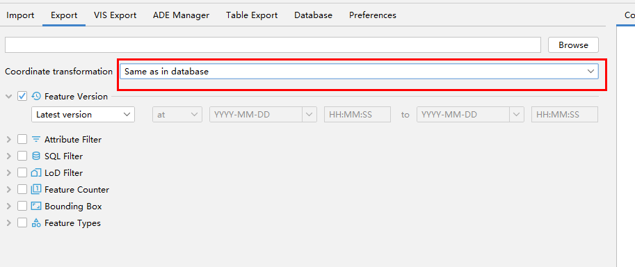

#### 导出筛选[3]

> 与导入过程类似，导出操作提供了主题和空间过滤器，以将导出限制为存储在数据库中的3D城市模型内容的子集

#### 4.5.1 Feature Version Filter

在CityGML 和 CityJson中，临时的*creationDate* 和 *terminationDate* 字段用于表示不同版本的相同要素。具体存储在CITYOBJECT 表中。

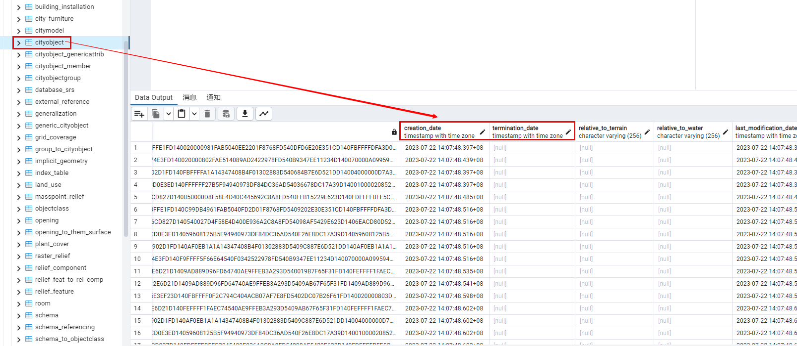

使用Feature Filter可以选出对应时间点的要素

| **Feature Version** | **Description**                                              |
| ------------------- | ------------------------------------------------------------ |
| `Latest version`    | Selects top-level features that are **not** marked as terminated in the database and, thus, whose TERMINATION_DATE attribute is `null`. |
| `Valid version`     | Selects top-level features that were valid *at a given timestamp* or *for a given time range*. The filter is evaluated against the CREATION_DATE and TERMINATION_DATE attributes. |

具体细节及案例请点击右侧链接 [feature version filter](https://3dcitydb-docs.readthedocs.io/en/latest/impexp/export-filters/feature-version.html#impexp-export-feature-version-filter)

##### 案例

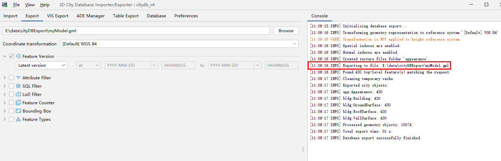

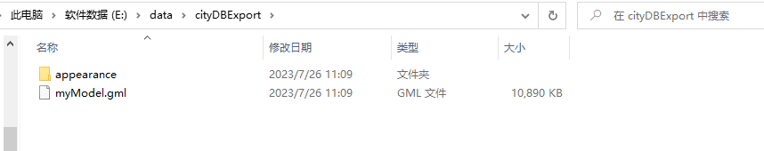


#### 4.5.2 Attribute filter

> 属性过滤器可定义对象标识符、gml:name 和 citydb:lineage 的值，这些值必须与要导出的顶层特征匹配。

更详细使用说明见右侧链接 [使用说明](https://3dcitydb-docs.readthedocs.io/en/latest/impexp/export-filters/attribute.html)

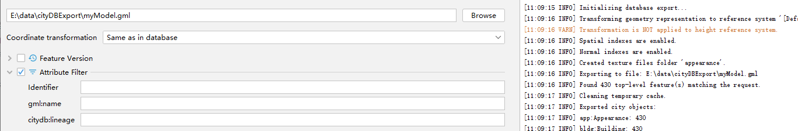


#### 4.5.3 SQL filter

> SQL 过滤器提供了一种基于用户定义的 SELECT 语句查询顶级功能的强大方法。

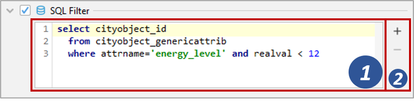

SQL 查询输入在 [1] 中。输入框右侧的 "+"和"-"按钮 [2] 可以增大或缩小输入框的大小。

:book: 底层数据库系统支持的任何 SELECT 语句都可以用作 SQL 过滤器;SQL 筛选器为根据筛选条件从 3DCityDB 查询内容提供了高度的灵活性。

:warning: 唯一的强制性要求是，SQL 查询必须返回所选城市对象的数据库 ID 列表。换句话说，查询返回的结果集只能包含一个引用 CITYOBJECT 表 ID 列的单列。

##### 案例

```sql
# 如下查询选择了所有名称为 energy_level 的通用属性为 double 值小于 12 的城市对象，此外CITYOBJECT_GENERICATTRIB 的 CITYOBJECT_ID 列存储了 CITYOBJECT 的 ID 列的外键。因此，返回集合符合上述要求。
select
    cityobject_id
from
    cityobject_genericattrib
where
    attrname='energy_level' and realval < 12
```

```sql
#下面的示例说明了一个更复杂的查询，它选择了至少有一个门对象的所有建筑物。
select
     t.building_id
from
     thematic_surface t
inner join
     opening_to_them_surface o2t on o2t.thematic_surface_id = t.id
inner join
     opening o on o.id = o2t.opening_id
where
     o.objectclass_id = 39
group by
     t.building_id
having
     count(distinct o.id) > 0
```

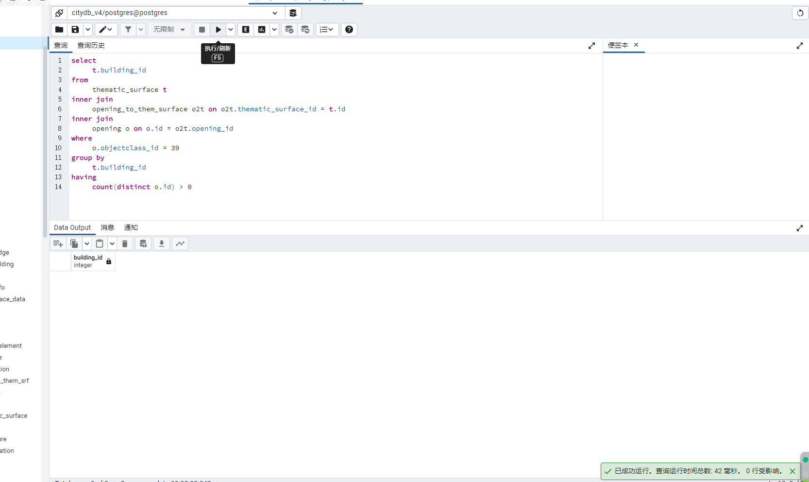


#### 4.5.4 Lod filter


#### 4.5.5 Feature counter filter


#### 4.5.6 Bounding box filter


#### 4.5.7 Feature type filter


#### 高级XML查询


#### 瓦片导出


#### 导出偏好


### 4.6 可视化导出

> - 除了CityGML和CityJSON之外，存储在3D城市数据库中的3D城市模型内容也可以在下面显示的`VIS导出选项卡`上导出为KML（COLLADA），用于可视化并在广泛的应用程序中使用，如Google Earth、ArcGIS Explorer和`Cesium`等地球浏览器

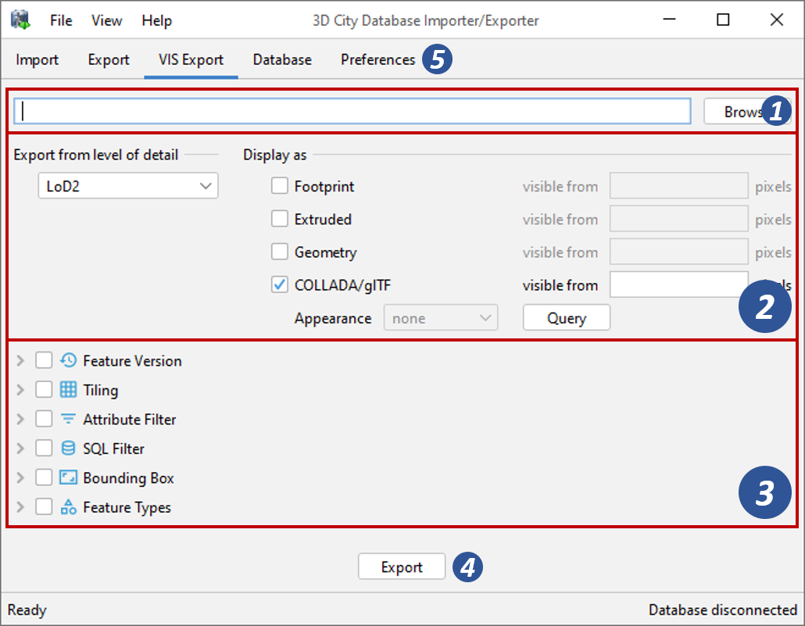

##### 导出等级及格式

- 在VIS导出选项卡上，导出所需的所有参数都必须以类似于CityGML/CityJSON导出的方式输入。强制输入是输出文件[1]、要导出的详细级别（LoD）以及显示表单[2]

- 可选择具体的LOD等级，也可选择最高LOD等级

  - 针对最高等级：该过程将为每个城市对象从LoD4迭代到LoD0，并根据上述方案搜索几何表示。找到的第一个几何体将用于可视化导出。
  - Query后，Appearance内可以添加导出图片

- 除LoD外，还必须指定模型的显示方式（显示形式）[2]。可以选择一个或多个显示形式。每个显示形式都是基于指定LoD中城市对象的几何图形生成的，并且还确定了相应可视化模型的输出格式。以下显示形式可用

  - 

  - | **Display form** | **What is visualized**                                       | **Output format**   |
    | ---------------- | ------------------------------------------------------------ | ------------------- |
    | **Footprint**    | 对象由地面表示，该地面是通过将其几何图形投影到地球表面而衍生的。 | KML                 |
    | **Extruded**     | 通过将Footprint表示拉伸到从三维边界框获取的最高点，对象表示为块模型。 | KML                 |
    | **Geometry**     | 对象以其完整的几何图形表示。                                 | KML                 |
    | **COLLADA/glTF** | 对象以其完整的几何图形表示。与“几何体”不同，此显示形式还支持纹理。 | COLLADA and/or glTF |


##### 使用实例

导出界面

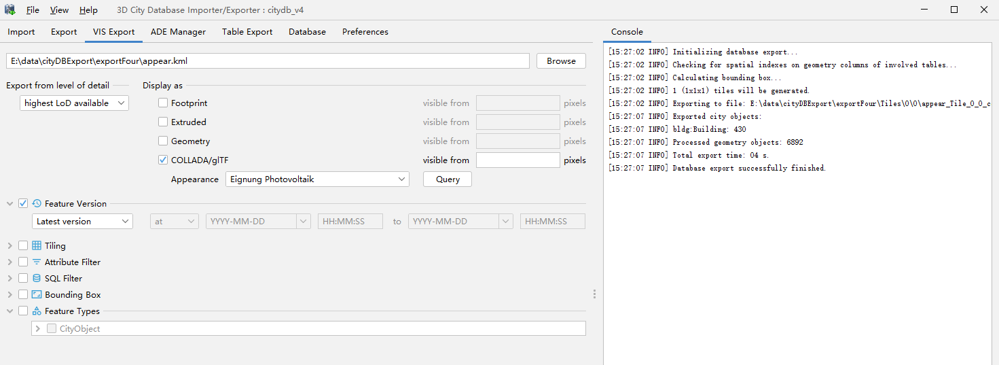

Cesiumion平台

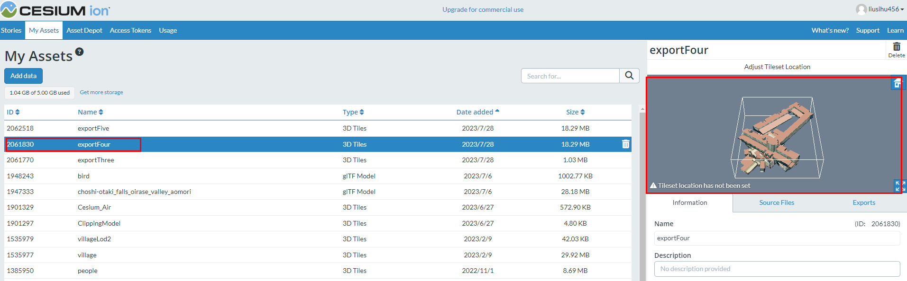

TS

```typescript
HkScrCityDB(){
    try {
      const tileSet = this.HkScrViewer.scene.primitives.add(
         new Cesium.Cesium3DTileset({
           url: Cesium.IonResource.fromAssetId(2061830)
         })
      );
      this.HkScrViewer.flyTo(tileSet)
    } catch (error) {
      console.log(error);
    }
  }
```

平台加载效果

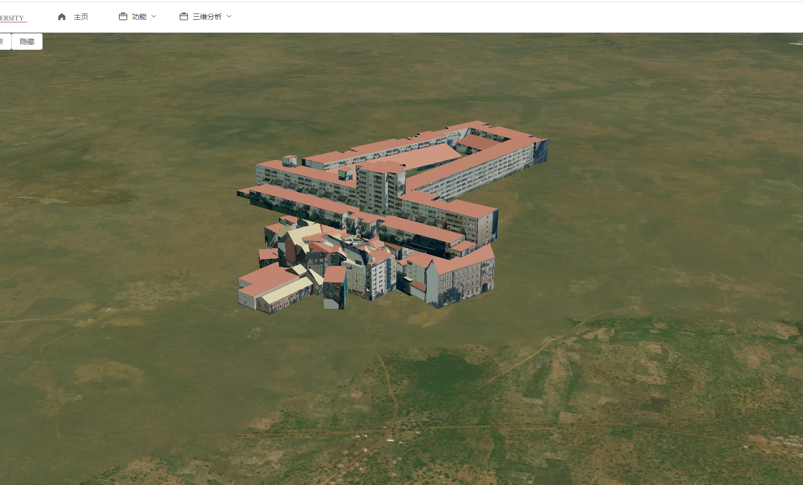


## 5、Importer/Exporter plugins


## 6、3D Web Map Client

> 三维网络客户端是基于Cesium Virtual Globe开发的，这是一个由Analytical Graphics, Inc.（AGI）开发的开源JavaScript库。它利用HTML5和网络图形库（WebGL）作为其硬件加速的核心，并提供跨平台的功能，如在网络上显示3D图形内容而不需要额外的插件。
>
> - 导入/导出工具导出的KML/glTF**模型**现在可以在网络浏览器中使用**3D网络客户端直接查看图像和地形层**
> - KML/glTF**模型**与使用电子表格生成器插件（SPSHG）导出的**表格数据**联系起来，并允许查询每个城市对象的专题数据。

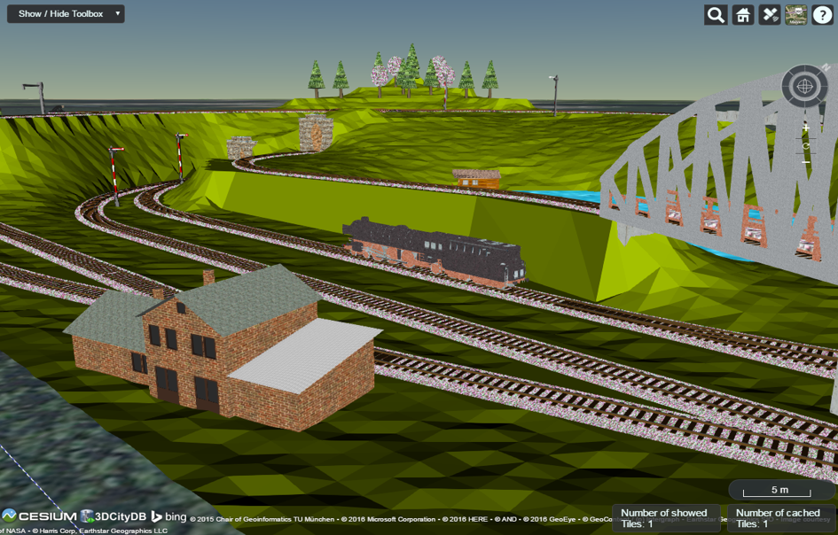

如上图显示了在3D网络客户端中以glTF格式显示不同的CityGML顶层特征（建筑、桥梁、隧道、水、植被、交通等）的例子


### 6.1 系统要求

> 由于3D网络客户端利用基于**WebGL**的Cesium Virtual Globe作为其3D地理可视化引擎，运行3D网络客户端的硬件必须安装支持WebGL的显卡，可通过以下网站查看当前浏览器是否支持WebGL
>
> http://get.webgl.org/ 

:notebook: 为了获得最佳的浏览和互动性能，建议使用谷歌浏览器。


### 6.2 安装 和 配置

通过以下链接可以直接预览官网的 3D Web Map Client

https://www.3dcitydb.org/3dcitydb-web-map/1.9.0/3dwebclient/index.html

本质是一个纯粹用HTML和JavaScript编写的静态网络应用程序，因此可以通过将其文件上传到一个简单的网络服务器来轻松部署。具体资源存放在安装目录下的3d-web-map-client文件夹内

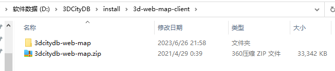

解压后的文件内容（`4.3.0版本`）

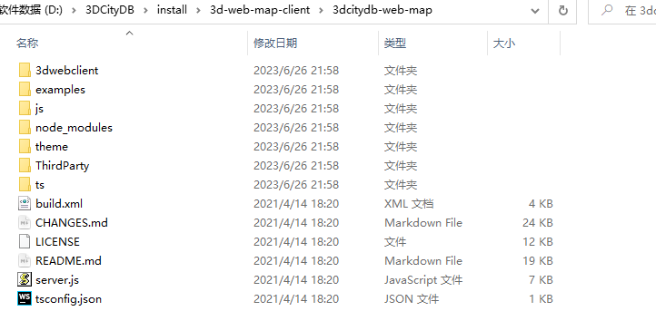

具体可通过NodeJS启动，如本地没有NodeJS，请到如下官网链接下载

https://nodejs.org/en/

启动 server.js，之后可通过URL获取到本地资源服务

```shell
node server.js
```

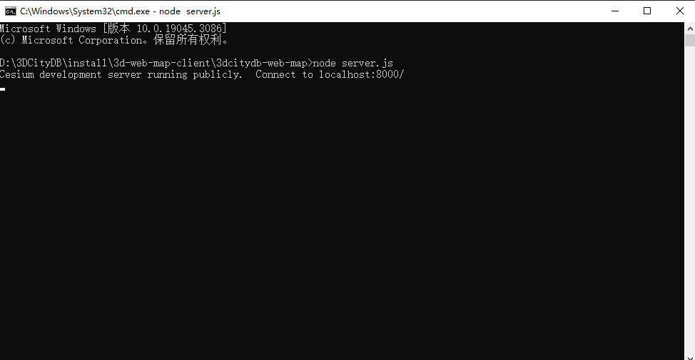

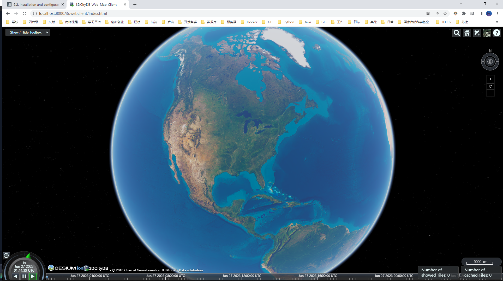


### 6.3 特征简介

> - 针对Cesium内部类Viewer做了扩展定制
> - 从1.6.0版本开始，网络客户端为**移动设备提供了更好的支持，如更紧凑的GUI布局**，以及根据用户的位置实时与网络地图进行第一人称互动的能力

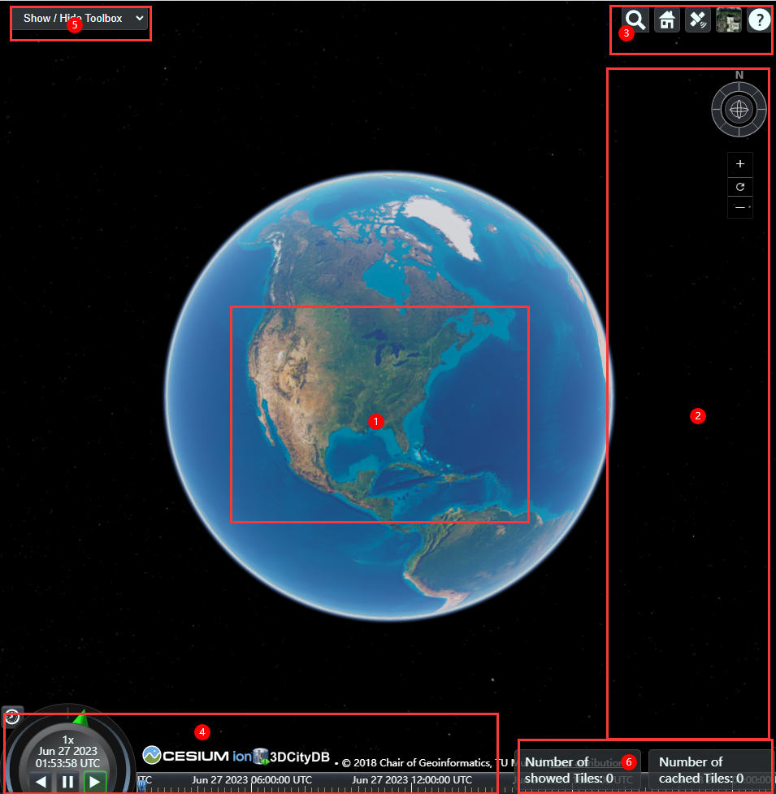

#### 6.4.1 3D Gbloe部分

基本的Cesium部件，它允许用户使用鼠标或触摸屏通过平移、移动、倾斜和旋转相机视角在地球地图上导航。


#### 6.4.2 导航组件

提供了同样的导航可能性，可以用鼠标或触摸屏实现。

1. 控制视角的导航小部件
2. 北箭头小部件
3. 估计地面间两点间距离的刻度尺


#### 6.4.3 Viewer内置工具类

Geocoder、HomeButton、GeolocationButton、BaseLayerPicker和NavigationHelpButton，具体类的说明可见如下链接，在之前的笔记中也有对应说明

https://cesium.com/learn/cesiumjs/ref-doc/Viewer.html#.ConstructorOptions

##### Geocoder

- 用户可以在其中输入"[经度]、[纬度]"形式的明确位置值或地址名称来搜索特定位置。在按下键盘上的 `"Enter "`键或点击`loupe_icon`按钮后，地理编码过程将根据输入的位置信息使用**Bing Maps** Locations API进行。一旦找到目标位置，地球地图将自动调整到返回的位置，并放大到与相机视角最匹配的边界框。例如，如果你想搜索慕尼黑工业大学所在的位置（经度=11.56786，纬度=48.14900），地理编码器的输入字段可以填写 "11.56786，48.14900 "的文本值，结果应该如下图所示

  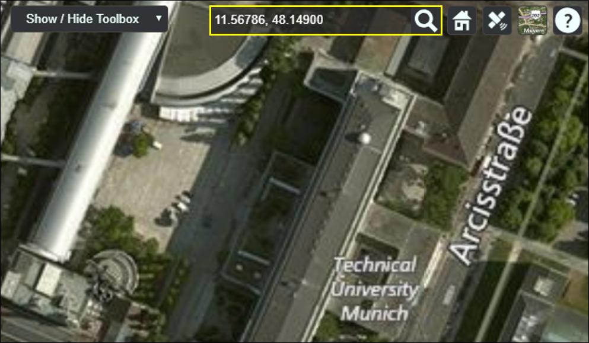

##### HomeButton

- 帮助用户快速将相机视角重置为默认状态
- 提供了一些基于地理位置的功能，比如在3D地图上飞到用户的当前位置，并在移动设备上实时显示第一人称视角
- 底图
  - 卫星图像和地形模型
    - Cesium服务条款的变化，从2018年9月1日开始引入新的商业Cesium ion平台，STK世界地形层被[Cesium ion](https://cesium.com/content/cesium-world-terrain)托管的Cesium世界地形所取代。

##### BaseLayerPicker

- 地形层 和 影像地图都可以由部件BaseLayerPicker部件控制筛选

  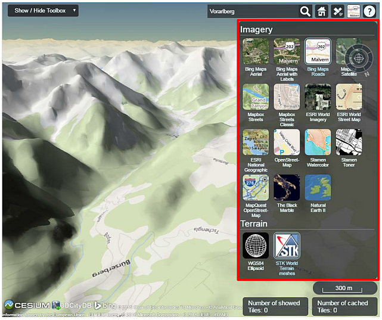

##### NavigationHelpButton

用于显示关于如何使用鼠标（通常用于台式机和笔记本电脑）和触摸屏（通常用于智能手机和平板电脑）导航地球地图的简要说明。点击question_mark_icon按钮，相应的视图面板（参见下图）就会显示在三维网络客户端的右上角。

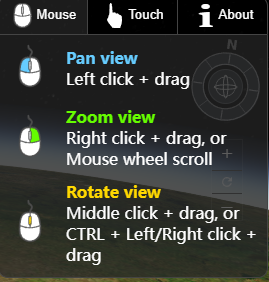

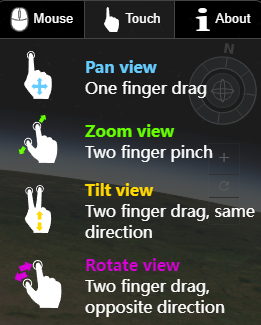

##### Toolbox Widget

- 基于Cesium Viewer的扩展模块，用于整合和控制用户提供的不同格式的数据，如KML/glTF模式、专题数据（在线电子表格）、网络地图服务（WMS）数据和数字地形模型（DTM）
- 用户与三维城市模型的互动也可以通过这个工具箱小部件来帮助
  - 可以取消选择、阴影、隐藏和显示三维物体，以及使用第三方地图服务从不同的视图角度来探索它们

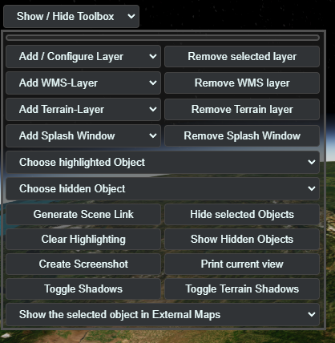

##### Status Indicator

> 在大多数三维网络应用中，**大数据量的三维城市模型的可视化往往会导致显著的性能问题**。为了克服这个麻烦的问题，在三维网络客户端中实施了一个**平铺策略**，以支持有效地显示大型预设的三维可视化模型
>
> - 使用KML/COLLADA/glTF`导出器从3DCityDB导出的平铺数据集`
>
>   - 这种平铺策略利用了HTML5的多线程功能，因此可以将解析多个三维对象等时间成本较高的操作委托给一个并行运行的后台线程。同时，对于数据层，另一个线程监控与虚拟摄像机的交互，并负责根据数据瓦片的当前可见度和屏幕上的显示尺寸来确定应该加载和卸载哪些数据
>
>   - 这种平铺策略支持缓存机制，允许从早期计算中加载的数据瓦片暂时存储在缓存中，从缓存中加载和渲染数据瓦片比从远程服务器重新加载要快得多
>
>     :warning: 大量缓存数据瓦片会消耗更多的内存，并可能导致网络浏览器的内存溢出，`状态指示小部件`可以显示和缓存数据瓦片数量的实时状态，可以用来帮助用户方便地监控和控制3D网络客户端消耗的内存。
>
>     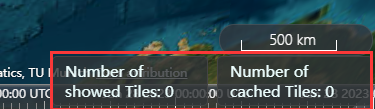
>
>     :notebook: 也可以采用开放规范的Cesium 3D Tiles来流化大量的异质3D地理空间数据集。这在3DCityDB Web Map Client 1.6.0或更高版本中得到支持。


### 6.4 用专题数据充实KML/gltf模型


### 6.5 管理WMS服务数据


### 6.6 管理数字地形模型（DTM）


### 6.7 与3D对象交互


### 6.8 移动支持扩展


### 6.9 Docker


## 7、Web Feature Service


## 8、Appendix


## 9、References


## 10、Changelog

