# Neo4j

> database：urbanWaterlogging
>
> password：jing0406


## 创建节点--CREATE

```CQL
CREATE (dept:Dept { deptno:10,dname:"Accounting",location:"Hyderabad" })
```

- 创建具有一些属性（deptno，dname，位置）的Dept节点，这里的属性名称是deptno，dname，location

  属性值为10，"Accounting","Hyderabad"

- dept节点名称

- Dept节点标签名称`Neo4j中使用标签名访问节点信息`

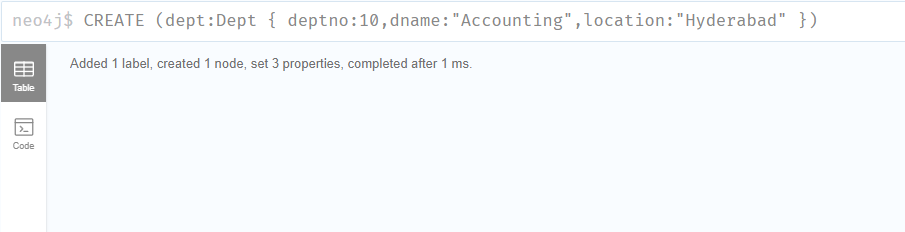


## 匹配节点--MATCH&RETURN

:warning: MATCH不能单独使用，如`MATCH (dept:Dept)`会报错

```CQL
# 查询Dept下的内容
MATCH (dept:Dept) return dept

# 查询Employee标签下 id=123，name="Lokesh"的节点
MATCH (p:Employee {id:123,name:"Lokesh"}) RETURN p

## 查询Employee标签下name="Lokesh"的节点，使用（where命令）
MATCH (p:Employee)
WHERE p.name = "Lokesh"
RETURN p
```

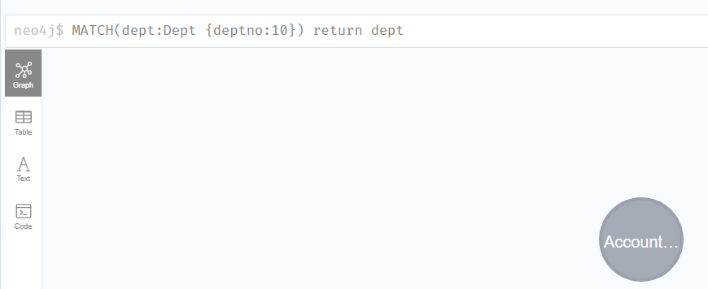


## 创建标签--CREATE

> - 可以创建如下的标签
>   - 为节点创建单个标签
>   - 为节点创建多个标签
>   - 为关系创建单个标签

为节点创建单个标签

```CQL
CREATE (google1:GooglePlusProfile)
```

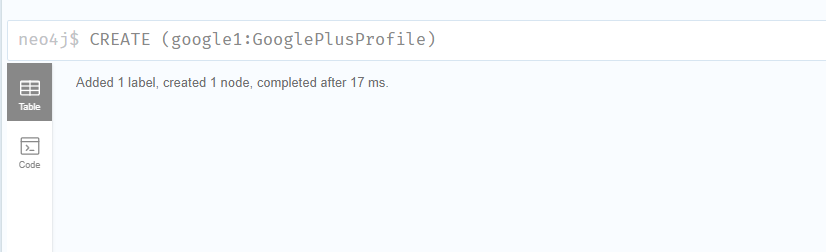

为节点创建多个标签

```CQL
CREATE (m:Movie:Cinema:Film:Picture)
```

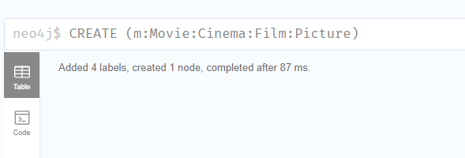

为关系创建单个标签(同时创建节点)

```CQL
CREATE (p1:Profile1)-[r1:LIKES]->(p2:Profile2)
```

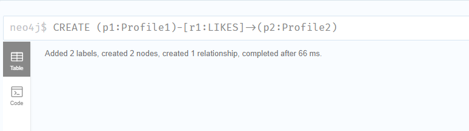


## 语句过滤-WHERE&MATCH

```CQL
match(emp:Employee) where emp.name = 'Lokesh' and emp.id=123  return emp
```

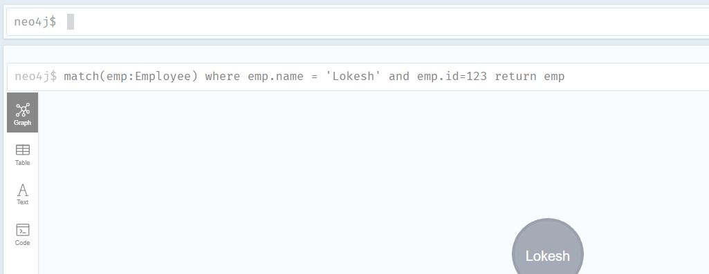


## 现有节点加关系

:bulb: 需要先确保两节点都存在

```CQL
MATCH (cust:Customer),(cc:CreditCard) 
WHERE cust.id = "1001" AND cc.id= "5001" 
CREATE (cust)-[r:DO_SHOPPING_WITH{shopdate:"12/12/2014",price:55000}]->(cc) 
RETURN r
```

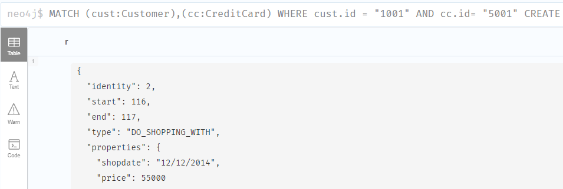


## 删除节点-MATCH&DELETE

```CQL
MATCH (e: Employee) DELETE e
```

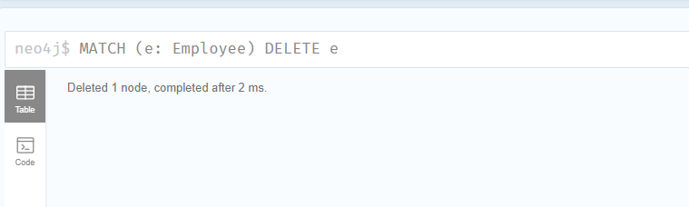


## 删除关系-MATCH&DELETE

先确保两者及关系存在

```CQL
MATCH (cc:CreditCard)-[r]-(c:Customer)RETURN r 
```

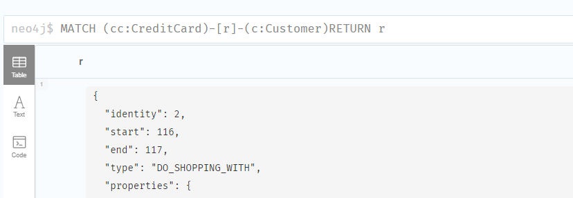

```CQL
MATCH (cc: CreditCard)-[rel]->(c:Customer) 
DELETE cc,c,rel
```

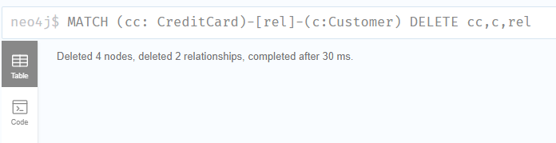

再查询就没有了


## 删除节点属性

:bulb: 确保节点有对应属性

```cql
CREATE (book:Book {id:122,title:"Neo4j Tutorial",pages:340,price:250}) 
```

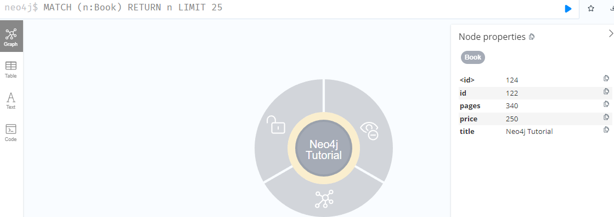

```CQL
match(book:Book{id:122})remove book.price return book
```

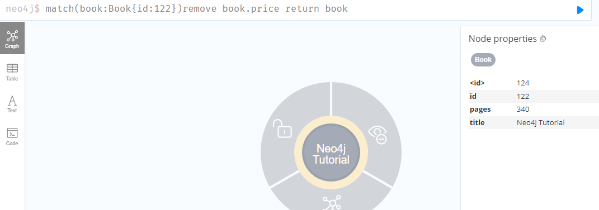


## 删除节点标签

:bulb: 先确保节点有标签

```CQL
MATCH (m:Movie) RETURN m
```

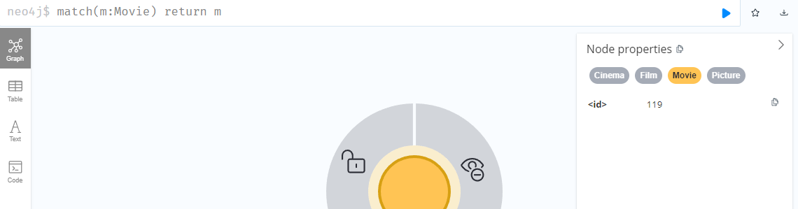

```CQL
match(m:Movie) remove m:Picture
```

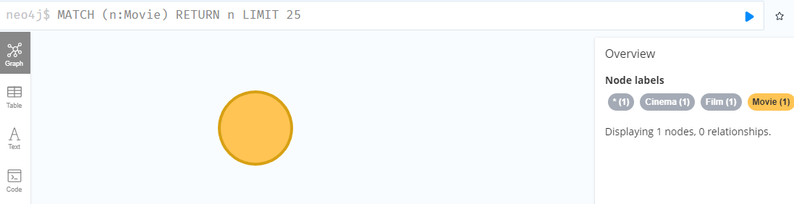


## 添加或修改属性值

```CQL
match(book:Book) set book.title = 'superStar' return book
```

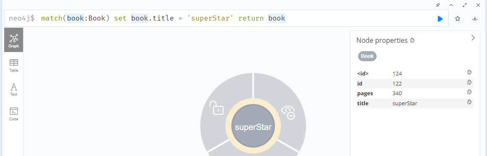

