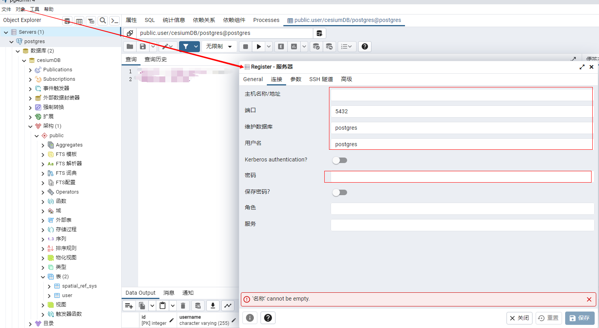

# PostGre

## 1、Publications  &  Subscriptions

> `publications` 和 `subscriptions` 是用于支持逻辑复制（Logical Replication）功能的两个重要概念。

#### Publications（发布）

- `publications` 是指在源数据库中定义的一组对象，用于指定要复制到订阅者数据库的数据。
- 通过创建 `publications`，您可以**选择要复制的表、视图、函数等对象，并将其发布到订阅者数据库，以便订阅者可以接收和同步这些数据**。
- `publications` 是在源数据库中定义的，用于将数据发送到订阅者数据库。


#### Subscriptions（订阅）

- `subscriptions` 是指在订阅者数据库中创建的一组对象，用于订阅并接收源数据库中发布的数据。
- 通过创建 `subscriptions`，您可以连接到源数据库，并订阅特定的 `publications`，以便将发布的数据复制到订阅者数据库。
- `subscriptions` 是在订阅者数据库中创建的，用于接收和同步发布的数据


#### 使用案例

##### 1.创建发布

在源数据库中创建一个 `publication`，指定要发布的表，并将其发送到订阅者数据库。

```sql
CREATE PUBLICATION my_publication FOR TABLE my_table;
```


##### 2.创建订阅

在订阅者数据库中创建一个 `subscription`，连接到源数据库，并订阅指定的 `publication`。

```sql
CREATE SUBSCRIPTION my_subscription CONNECTION 'host=source_host dbname=source_db user=replication_user password=replication_password' PUBLICATION my_publication;
```


## 2、事件触发器

> 在 PostgreSQL 数据库中，触发器（Triggers）是一种用于在数据库中特定事件发生时自动执行的数据库对象。触发器可以用于实现数据完整性约束、日志记录、复杂的数据更新逻辑等。
>
> - **数据完整性约束**： 触发器可以用于在插入、更新或删除数据时执行验证逻辑，以确保数据的完整性。例如，可以使用触发器验证外键关系、检查数据范围或执行其他自定义的数据验证操作
> - **日志记录**：触发器可以用于记录对表的更改，包括谁在何时修改了数据。通过触发器，可以自动捕获数据的变化，并将其记录到日志表中，以便进行审计或跟踪操作历史。
> - **复杂数据更新逻辑**：触发器可以用于执行复杂的数据更新逻辑，例如在数据更新时自动更新其他相关表中的数据，或根据某些条件触发其他操作。

#### 使用案例

##### 1.创建表格

```sql
CREATE TABLE orders (
    id serial PRIMARY KEY,
    order_date date,
    total_amount numeric,
    status text
);

```

##### 2.创建触发器

> 定义一个函数 `update_order_status()`，该函数在每次插入订单前会将状态设置为 "Pending"。然后，将该触发器绑定到 `orders` 表的 `INSERT` 事件。

```sql
CREATE OR REPLACE FUNCTION update_order_status()
RETURNS TRIGGER AS $$
BEGIN
    NEW.status = 'Pending';
    RETURN NEW;
END;
$$ LANGUAGE plpgsql;

CREATE TRIGGER set_order_status
BEFORE INSERT ON orders
FOR EACH ROW
EXECUTE FUNCTION update_order_status();

```

##### 3.插入数据触发Triggers

> 在执行上述插入操作时，触发器会自动将订单的状态设置为 "Pending"

```sql
INSERT INTO orders (order_date, total_amount) VALUES ('2023-05-20', 100.00);

```

:notebook: 触发器可以根据具体需求进行更复杂的配置和操作。您可以根据需要定义不同类型的触发器，如 `BEFORE INSERT`、`AFTER UPDATE` 等，并编写相应的触发器函数来实现所需的逻辑。在实际应用中，触发器可用于实现复杂的数据约束和业务逻辑。


## 3、外部数据封装器

> 一种用于`连接和访问外部数据源的工具`。它们允许 PostgreSQL 数据库通过定义外部数据源的访问接口，以表的形式访问和查询外部数据。

#### 使用案例

##### 1.创建外部数据服务器

创建外部数据服务器，用于连接到远程的 PostgreSQL 数据库。

```sql
CREATE SERVER my_server
FOREIGN DATA WRAPPER postgres_fdw
OPTIONS (host 'remote_host', dbname 'remote_db', port '5432');

```

该示例创建了一个名为 `my_server` 的外部数据服务器，使用了 `postgres_fdw` 数据转换器，并指定了连接到远程数据库的相关参数。


##### 2.创建外部数据表

创建一个外部数据表，该表实际上是在 PostgreSQL 数据库中对远程表的引用。

```sql
CREATE FOREIGN TABLE my_table
(
    id serial,
    name text,
    age integer
)
SERVER my_server
OPTIONS (table_name 'remote_table');

```

该示例创建了一个名为 `my_table` 的外部数据表，它引用了远程数据库中的 `remote_table` 表。定义了表的结构，包括列的名称和数据类型。


##### 3.查询外部数据表

在 PostgreSQL 数据库中像查询本地表一样查询外部数据表

```sql
SELECT * FROM my_table;

```


## 4、强制转换

> 用于在不同数据类型之间进行显式的数据类型转换。它允许将一个数据类型的值转换为另一个数据类型，以满足特定的需求，如下
>
> 1. 数据类型转换： 强制转换工具用于将一个数据类型的值转换为另一个数据类型。这在需要将数据从一种类型转换为另一种类型时非常有用，例如将字符串转换为数字、日期转换、布尔值转换等。
> 2. 数据计算和操作： 强制转换工具可以用于执行数据计算和操作，其中涉及到不同数据类型之间的转换。通过将数据类型转换为适当的类型，可以执行算术运算、字符串操作、日期比较等操作。
> 3. 数据格式化和显示： 强制转换工具可以用于将数据格式化为特定的数据类型，以便在查询结果中以所需的方式显示。这对于日期和时间的格式化、数值的精度和小数位数控制等非常有用


#### 使用案例

> 有一个名为 `my_table` 的表，其中包含一个名为 `amount` 的列，数据类型为 `numeric`。
>
> **现将该列的值转换为整数类型，并计算每个值的平方。**

```sql
-- 创建示例表
CREATE TABLE my_table (
    id serial PRIMARY KEY,
    amount numeric
);

-- 插入示例数据
INSERT INTO my_table (amount) VALUES (10.5), (15.2), (7.8);

-- 查询并转换数据类型
SELECT
    amount,
    CAST(amount AS integer) AS integer_amount,
    POWER(CAST(amount AS integer), 2) AS squared_amount
FROM my_table;

```


## 5、扩展

> 一种用于增加额外功能和功能的机制。通过使用扩展，您可以将第三方模块或自定义功能添加到 PostgreSQL 中，以满足特定的需求。扩展可以提供新的数据类型、函数、操作符、索引类型、语法等，以增强数据库的功能性。
>
> - 增加额外功能： 使用扩展，您可以向 PostgreSQL 数据库添加额外的功能和功能，以满足特定的需求。这可以是与**数据处理、查询优化、空间分析、文本搜索、加密**等相关的功能。
> - 提供新的数据类型和函数： 扩展可以**引入新的数据类型和函数**，以支持特定领域的数据处理需求。例如，PostGIS 扩展引入了地理空间数据类型和相关函数，用于处理地理空间数据。
> - 改进性能和优化： 一些扩展可以**提供性能改进和查询优化**的功能。它们可能提供更高效的索引类型、查询计划优化器、缓存机制等，以加快查询执行速度和提高数据库性能。

#### 使用案例

##### 1.检查扩展是否安装

```sql
SELECT name FROM pg_available_extensions WHERE name = 'postgis';
```


##### 2.安装扩展（可选）

如果PostGIS 扩展未安装，可以执行以下命令进行安装

```sql
CREATE EXTENSION postgis;
```


##### 3.使用扩展

使用 PostGIS 提供的功能，如创建地理空间数据表、执行空间查询等。

```sql
-- 创建示例表
CREATE TABLE my_table (
    id serial PRIMARY KEY,
    geom geometry(Point, 4326)
);

-- 插入示例数据
INSERT INTO my_table (geom) VALUES ('SRID=4326;POINT(10 20)');

-- 查询示例数据
SELECT * FROM my_table;

```

:book: 上述示例创建了一个名为 `my_table` 的表，其中包含一个名为 `geom` 的地理空间数据列。然后，插入了一个包含经纬度坐标的示例数据，并执行了查询以查看结果。


## 6、架构

> 一种组织和管理数据库对象的方式。架构工具用于创建、修改和管理数据库中的不同架构，以实现逻辑和物理分组、权限控制、命名空间隔离等功能。
>
> - **数据分组和隔离**：使用架构，可以将数据库对象（如表、视图、函数等）组织到不同的命名空间中，实现数据的逻辑分组和隔离。这有助于组织大型数据库，并提供更好的可维护性和可扩展性
> - **权限控制**：用于实现对数据库对象的权限控制。可为不同的架构分配不同的访问权限，以限制用户对特定架构中的对象的访问和操作
> - **多租户支持**： 使用架构，可实现多租户的数据隔离。每个租户可以在自己的架构中拥有独立的数据库对象，从而实现数据的物理隔离和安全性

#### 使用案例

##### 1.创建架构

在 PostgreSQL 数据库中，执行以下命令以创建一个名为 `my_schema` 的架构：

```sql
CREATE SCHEMA my_schema;
```


##### 2.架构中创建表

创建架构后，可在该架构中创建表或其他数据库对象。如创建一个在 `my_schema` 架构中的表：

```sql
CREATE TABLE my_schema.my_table (
    id serial PRIMARY KEY,
    name varchar(255)
);
```


##### 3.查询架构中的数据

查询架构中的数据时，需要在表名前加上架构名称。例如：

```sql
SELECT * FROM my_schema.my_table;
```


---------------------------------------------------

> 本周更新了主机，导致pgAdmin4（本质类似Navicat）无法连接到PostGre，补充以下连接方式



填写上表中对应的内容即可链接到本地Postgre服务，当然也可以连接远端服务器
