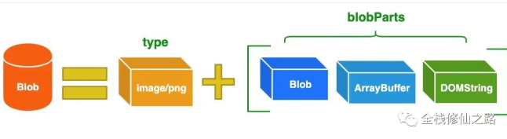
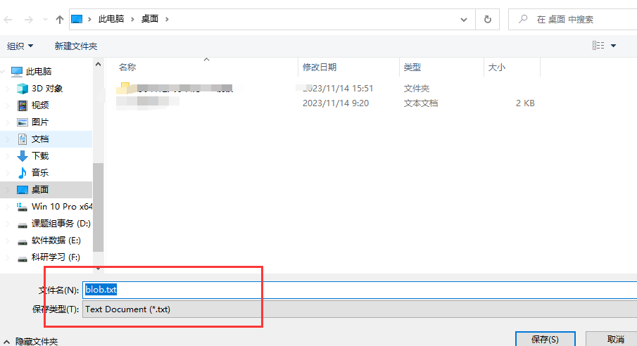
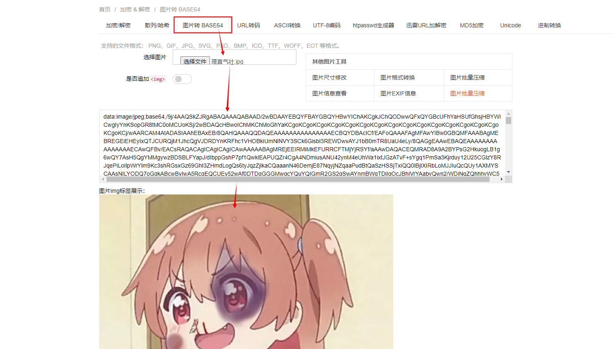

# Blob

## 一、Blob 概念

- Blob（Binary Large Object）表示二进制类型的大对象
- 在数据库管理系统中，将二进制数据存储为一个单一个体的集合。Blob 通常是影像、声音或多媒体文件。
- **在 JavaScript 中 Blob 类型的对象表示不可变的类似文件对象的原始数据。**


## 二、Blob API简介



### 2.1 构造函数

```typescript
var aBlob = new Blob(blobParts, options);
```

- blobParts：它是一个由 ArrayBuffer，ArrayBufferView，Blob，DOMString 等对象构成的数组。DOMStrings 会被编码为 UTF-8。

- options：一个可选的对象，包含以下两个属性：

- - type —— 默认值为 `""`，它代表了将会被放入到 blob 中的数组内容的 MIME 类型。
  - endings —— 默认值为 `"transparent"`，用于指定包含行结束符 `\n` 的字符串如何被写入。它是以下两个值中的一个：`"native"`，代表行结束符会被更改为适合宿主操作系统文件系统的换行符，或者 `"transparent"`，代表会保持 blob 中保存的结束符不变。


### 2.2 使用示例

从字符串创建Blob

```typescript
let myBlobParts = ['<html><h2>Hello Semlinker</h2></html>']; // an array consisting of a single DOMString
let myBlob = new Blob(myBlobParts, {type : 'text/html', endings: "transparent"}); // the blob

console.log(myBlob.size + " bytes size");
// Output: 37 bytes size
console.log(myBlob.type + " is the type");
// Output: text/html is the type
```

从类型化数组和字符串创建 Blob

```typescript
let hello = new Uint8Array([72, 101, 108, 108, 111]); // 二进制格式的 "hello"
let blob = new Blob([hello, ' ', 'semlinker'], {type: 'text/plain'});
```

:bulb: `Uint8Array` 是 JavaScript 中的一种类型化数组（TypedArray）。在这个特定的例子中，`new Uint8Array([72, 101, 108, 108, 111])` 创建了一个包含数字数组 `[72, 101, 108, 108, 111]` 的 `Uint8Array` 实例。

这个数组存储的是 8 位无符号整数值（取值范围是 0 到 255），因此 `Uint8Array` 表示了一个包含 ASCII 值的数组。这些 ASCII 值对应的字符是 `'H', 'e', 'l', 'l', 'o'`，因为 ASCII 中的 `72` 对应 `'H'`，`101` 对应 `'e'`，以此类推。

所以，`let hello = new Uint8Array([72, 101, 108, 108, 111]);` 这行代码创建了一个包含字符串 `'Hello'` 对应 ASCII 码值的 `Uint8Array` 数组。


### 2.3 属性

- size（只读）：表示 `Blob` 对象中所包含数据的大小（以字节为单位）。
- type（只读）：一个字符串，表明该 `Blob` 对象所包含数据的 MIME 类型。如果类型未知，则该值为空字符串。


### 2.4 方法

- slice([start[, end[, contentType]]])：返回一个新的 Blob 对象，包含了源 Blob 对象中指定范围内的数据。
- stream()：返回一个能读取 blob 内容的 `ReadableStream`。
- text()：返回一个 Promise 对象且包含 blob 所有内容的 UTF-8 格式的 `USVString`。
- arrayBuffer()：返回一个 Promise 对象且包含 blob 所有内容的二进制格式的 `ArrayBuffer`。


:bulb: 这里我们需要注意的是，**`Blob` 对象是不可改变的**。我们不能直接在一个 Blob 中更改数据，但是我们可以对一个 Blob 进行分割，从其中创建新的 Blob 对象，将它们混合到一个新的 Blob 中。这种行为类似于 JavaScript 字符串：我们无法更改字符串中的字符，但可以创建新的更正后的字符串。


## 三、Blob使用场景

> Blob  则表示“具有类型的二进制数据”。
>
> 这样可以方便  `Blob` 用于在浏览器中非常常见的上传/下载操作。


### 3.1 文件分片上传

File 对象是特殊类型的 Blob，且可以用在任意的 Blob 类型的上下文中。所以针对大文件传输的场景，可以使用 slice 方法对大文件进行切割，然后分片进行上传，具体示例如下：

```typescript
const file = new File(["a".repeat(1000000)], "test.txt"); //创建了一个名为 test.txt 的文件，内容是由 a 字符串重复组成的 1,000,000 字符串。

const chunkSize = 40000; //定义了每个文件分块的大小为 40,000 字节。
const url = "https://httpbin.org/post"; //声明了上传文件的目标 URL。

async function chunkedUpload() { //定义了一个异步函数 chunkedUpload，它用于将文件分块上传到服务器。
  for (let start = 0; start < file.size; start += chunkSize) {  //循环遍历文件内容，每次迭代都会上传一个文件分块。
      const chunk = file.slice(start, start + chunkSize + 1); //从文件中切割出一个大小为 chunkSize 的文件分块。
      const fd = new FormData();
      fd.append("data", chunk);//创建一个 FormData 对象并将文件分块添加到其中，以便用于 HTTP POST 请求。
      await fetch(url, { method: "post", body: fd }).then((res) =>
        res.text()
      );//使用 Fetch API 发送 POST 请求将文件分块上传到服务器，并使用 res.text() 方法读取服务器响应的文本数据。await 关键字确保每个分块都上传完毕后再继续下一个分块的上传。
  }
}
```


### 3.2 Blob 用作 URL :star: 下载互联网数据

:bulb: **Blob URL/Object URL**

Blob URL/Object URL 是一种伪协议，允许 Blob 和 File 对象用作图像，下载二进制数据链接等的 URL 源。在浏览器中，我们使用 `URL.createObjectURL` 方法来创建 Blob URL，该方法接收一个 `Blob` 对象，并为其创建一个唯一的 URL，其形式为 `blob:<origin>/<uuid>`，对应的示例如下：

```
blob:https://example.org/40a5fb5a-d56d-4a33-b4e2-0acf6a8e5f641
```

当 fetch 请求成功的时候，我们调用 response 对象的 `blob()` 方法，从 response 对象中读取一个 Blob 对象，然后使用 `createObjectURL()` 方法创建一个 objectURL，然后把它赋值给 `img` 元素的 `src` 属性从而显示这张图片。

浏览器内部为每个通过 `URL.createObjectURL` 生成的 URL 存储了一个 URL → Blob 映射。因此，此类 URL 较短，但可以访问 `Blob`。生成的 URL 仅在当前文档打开的状态下才有效。它允许引用 ``、`<a>` 中的 `Blob`，但如果你访问的 Blob URL 不再存在，则会从浏览器中收到 404 错误。

上述的 Blob URL 看似很不错，但实际上它也有副作用。虽然存储了 URL → Blob 的映射，但 Blob 本身仍驻留在内存中，浏览器无法释放它。映射在文档卸载时自动清除，因此 Blob 对象随后被释放。

但是，如果应用程序寿命很长，那不会很快发生。因此，如果我们创建一个 Blob URL，即使不再需要该 Blob，它也会存在内存中。

针对这个问题，我们可以调用 `URL.revokeObjectURL(url)` 方法，从内部映射中删除引用，从而允许删除 Blob（如果没有其他引用），并释放内存。接下来，我们来看一下 Blob 文件下载的具体示例。


blob文件下载示例

**index.html**

```typescript
<!DOCTYPE html>
<html>
  <head>
    <meta charset="UTF-8" />
    <title>Blob 文件下载示例</title>
  </head>

  <body>
    <button id="downloadBtn">文件下载</button>
    <script src="index.js"></script>
  </body>
</html>
```

**index.js**

```typescript
const download = (fileName, blob) => {
  const link = document.createElement("a");
  link.href = URL.createObjectURL(blob);
  link.download = fileName;
  link.click();
  link.remove();
  URL.revokeObjectURL(link.href);
};

const downloadBtn = document.querySelector("#downloadBtn");
downloadBtn.addEventListener("click", (event) => {
  const fileName = "blob.txt";
  const myBlob = new Blob(["一文彻底掌握 Blob Web API"], { type: "text/plain" });
  download(fileName, myBlob);
});
```

在示例中，通过调用 Blob 的构造函数来创建类型为 **"text/plain"** 的 Blob 对象，然后通过动态创建 `a` 标签来实现文件的下载。





### 3.3 Blob 转换为 Base64 :star: 上传

在编写 HTML 网页时，对于一些简单图片，通常会选择将图片内容直接内嵌在网页中，从而减少不必要的网络请求，但是图片数据是二进制数据，该怎么嵌入呢？绝大多数现代浏览器都支持一种名为 `Data URLs` 的特性，允许使用 base64 对图片或其他文件的二进制数据进行编码，将其作为文本字符串嵌入网页中。

:bulb: Data URLs 由四个部分组成：前缀（`data:`）、指示数据类型的 MIME 类型、如果非文本则为可选的 `base64` 标记、数据本身：

```
data:[<mediatype>][;base64],<data>
```

`mediatype` 是个 MIME 类型的字符串，例如 "`image/jpeg`" 表示 JPEG 图像文件。如果被省略，则默认值为 `text/plain;charset=US-ASCII`。如果数据是文本类型，你可以直接将文本嵌入（根据文档类型，使用合适的实体字符或转义字符）。如果是二进制数据，你可以将数据进行 base64 编码之后再进行嵌入。比如嵌入一张图片：

```html

```



:warning: **如果图片较大，图片的色彩层次比较丰富，则不适合使用这种方式，因为该图片经过 base64 编码后的字符串非常大，会明显增大 HTML 页面的大小，从而影响加载速度。**


文件上传示例

```html
<input type="file" accept="image/*" onchange="loadFile(event)">


<script>
  const loadFile = function(event) {
    const reader = new FileReader();
    reader.onload = function(){
      const output = document.querySelector('output');
      output.src = reader.result;
    };
    reader.readAsDataURL(event.target.files[0]);
  };
</script>
```

在以上示例中，为 file 类型输入框绑定 `onchange` 事件处理函数 `loadFile`，在该函数中，我们创建了一个 FileReader 对象并为该对象绑定 `onload` 相应的事件处理函数，然后调用 FileReader 对象的 `readAsDataURL()` 方法，把本地图片对应的 File 对象转换为 Data URL。

在完成本地图片预览之后，我们可以直接把图片对应的 Data URLs 数据提交到服务器。针对这种情形，服务端需要做一些相关处理，才能正常保存上传的图片，这里以 Express 为例，具体处理代码如下：

```javascript
const app = require('express')();

app.post('/upload', function(req, res){
    let imgData = req.body.imgData; // 获取POST请求中的base64图片数据
    let base64Data = imgData.replace(/^data:image\/\w+;base64,/, "");
    let dataBuffer = Buffer.from(base64Data, 'base64');
    fs.writeFile("image.png", dataBuffer, function(err) {
        if(err){
          res.send(err);
        }else{
          res.send("图片上传成功！");
        }
    });
});
```

