# GeoServer User Manual

## 一、Introduction

> 本节主要概述了GeoServer项目、其背景以及对应的功能作用。

1. overview
2. history
3. Getting involved
4. License

`以上内容不重要，这里略`

## 二、Installation

> Geoserver 的多种安装方法，使用不同的操作系统

:notebook: 可以将GeoServer以war包的形式通过Tomcat等现有servlet容器来运行

:warning:Geoserver需要提前安装Java8、Java11 或者 Java17（需要用到对应的jre，运行时环境，如下图本机有8 和 17，当然可以根据实际情况自行切换版本）

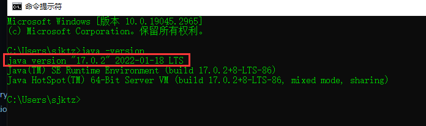

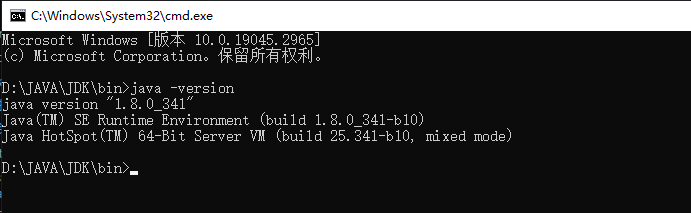

### 1、支持的安装方式

> 官方：https://docs.geoserver.org/latest/en/user/installation/index.html#installation
>
> **根据实际情况选择不同安装方式**

- linux 二进制
- windows 二进制
- windows installer（`本次使用`）
- web archive
- Docker Container
- Upgrading extising version

### 2、安装过程

具体安装过程略，注意五点即可

1. 更改默认安装位置
2. 更改默认data位置
3. 确保能找到环境变量中的JAVA_HOME
4. 记住用户名 和 密码
5. 设置端口号，避免与本机已有端口重叠

:warning: 经过测试，`如果选择手动安装，不能通过开始菜单中Start GeoServer启动`，需到对应安装路径bin下，双击startup.bat文件。

| 用户名 | 密码      | 端口 |
| ------ | --------- | ---- |
| admin  | geoserver | 7080 |

## 三、Getting started

> 常见任务的简短教程

### 1、[Using the web administration interface](https://docs.geoserver.org/latest/en/user/gettingstarted/web-admin-quickstart/index.html)

#### 管理界面

可通过如下链接访问入口

```shell
# host: 一般是localhost，如果是服务器，可通过公网ip等
# port：默认是80端口，也可自行设置
http://<host>:<port>/geoserver
```

本机为：`http://localhost:7080/geoserver/`

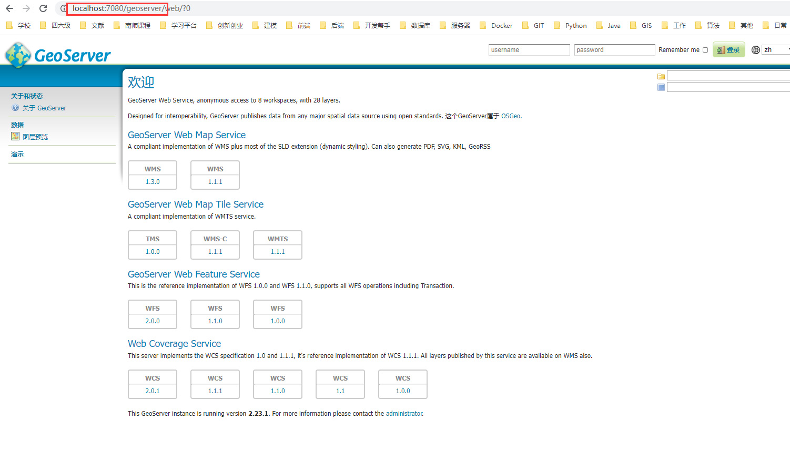

#### 登录

通过已有的账号密码登录

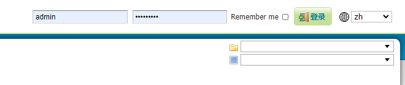

#### 图层预览

1. 从layer preview图层预览界面可以快速查看已经发布的图层
2. 可通过点击后面的openLayers来查看对应的图层
3. 要按字母顺序对列进行排序，可以单击列标题
4. 支持搜索图层


### 2、[Publishing a GeoPackage](https://docs.geoserver.org/latest/en/user/gettingstarted/geopkg-quickstart/index.html)

> 介绍使用GeoServer发布GeoPackage的步骤
>
> 补充GeoPackage概念：`一种开放的地理数据格式和规范，它结合了矢量数据、栅格数据和属性数据，并将其存储为一个单一的文件`（通常是SQLite数据库文件）。GeoPackage旨在提供一种跨平台、开放和可互操作的方式来存储和传输地理空间数据。

#### 数据准备

数据路径：`data/ne/natural_earth.gpkg`

#### 创建新工作空间workspace

- 导航到**Data‣workSpace**

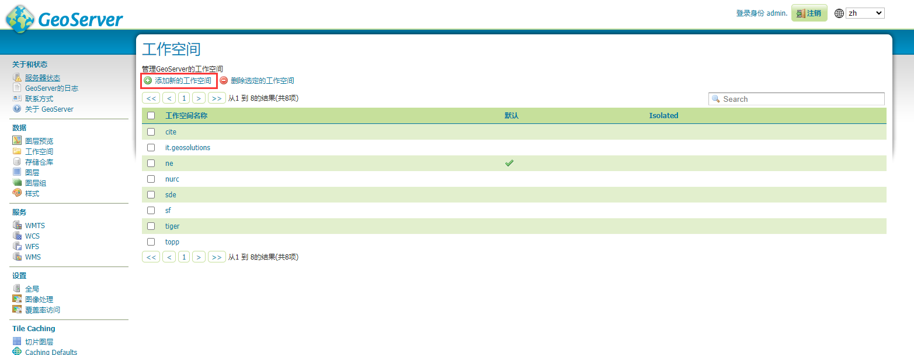

- 根据系统需求添加自定义Name 和 Namespace URL，点击 **Submit** 

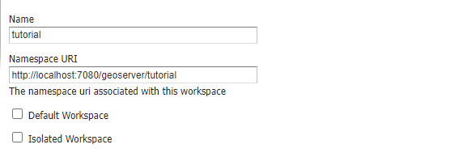

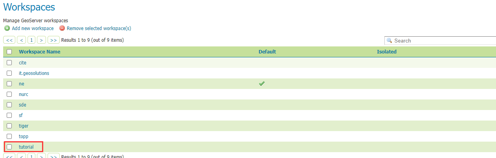

#### 创建仓库store

- 导航到**Data‣Stores**

> 这个页面展示了`所有的仓库，包含仓库的类型 和 仓库所属的工作空间`

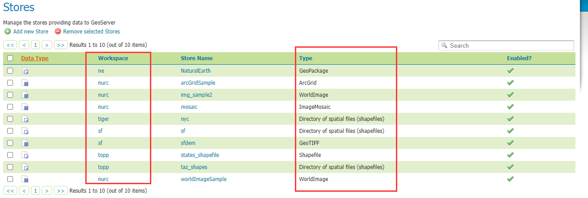

- 点击 **Add new Store**（新建仓库的界面可能略有不同，取决于安装了哪些扩展插件）

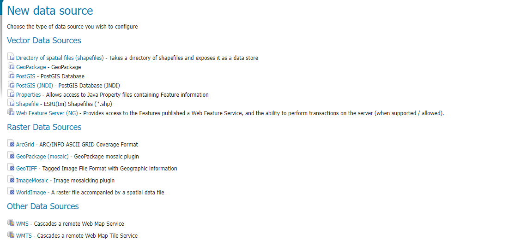

- 在矢量数据源区域，点击**GeoPackage**，工作空间选择刚才创建的`tutorial`，DataSourceNmae尽量写的**简单易懂**，因为会在对应的数据目录中形成文件夹。之后配置仓库的基本信息，如下图

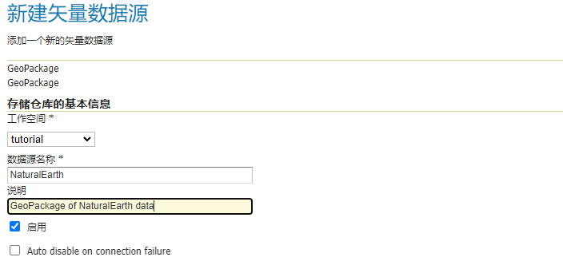

> 补充：连接参数用于建立与数据库的关系
>
> - 点击浏览，查找前期准备好的数据，选择`data/ne.shp`
> - 勾选**read_only**表示不会对此GeoPackage进行写入，这使GeoServer在访问此内容时可以避免管理写入锁定，以获得更高的性能
> - 点击保存

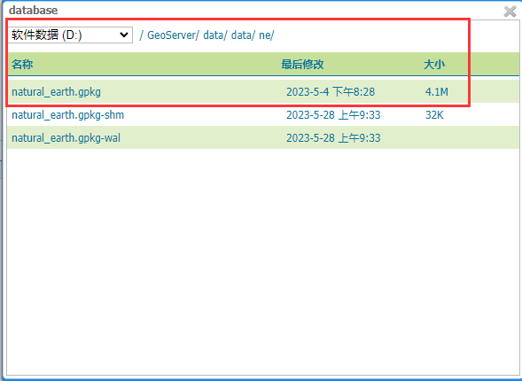


#### 创建图层

- 在新建图层界面，将Countries图层发布，**点击countries后面的发布publish**

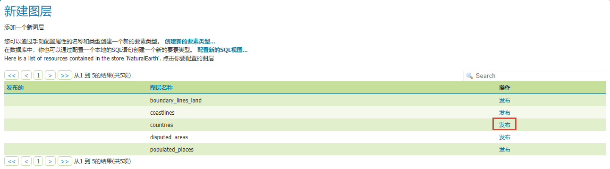

- 在编辑图层界面，设置基础信息，数据选项卡下，设置名称、标题 和 概述如下图（命名对应图层预览界面的Name，标题对应图层预览界面的Title）

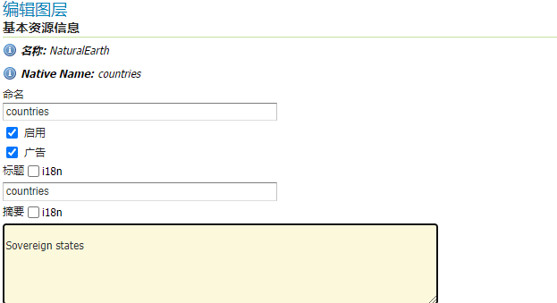

- 再次检查坐标系是否正确

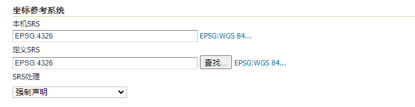

- 在边界框位置，**单击“从数据计算”和“从本机边界计算”链接生成层的边界框**

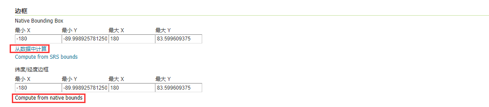

- 点击**Apply**，`如果此时有信息不完整，GeoServer将会提供警告`

- 滑动到顶部，点击发布选项卡，找到WMS设置，根据实际情况设定默认样式，`这里是国家，所以为面，即Polygon`，最后点击**Save**

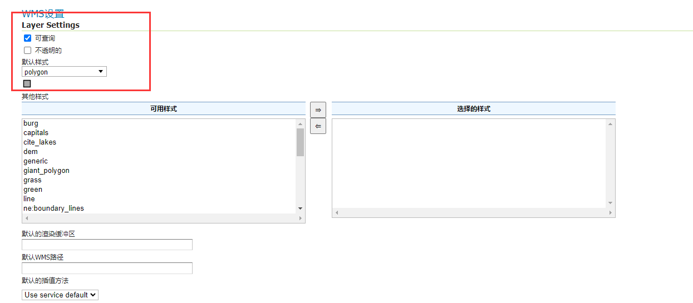

#### 预览图层

导航到**Data > Layer Preview**界面，找到刚刚发布的`tutorial:countries` 图层，点击右侧的**OpenLayers**，**即可查看发布图层效果，同时可缩放和查看图层属性**

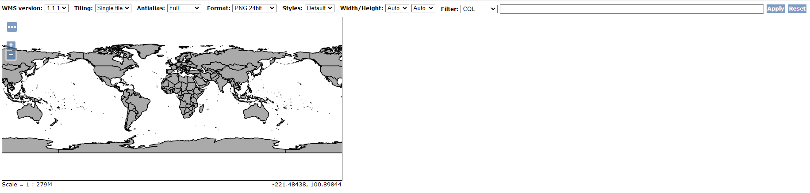

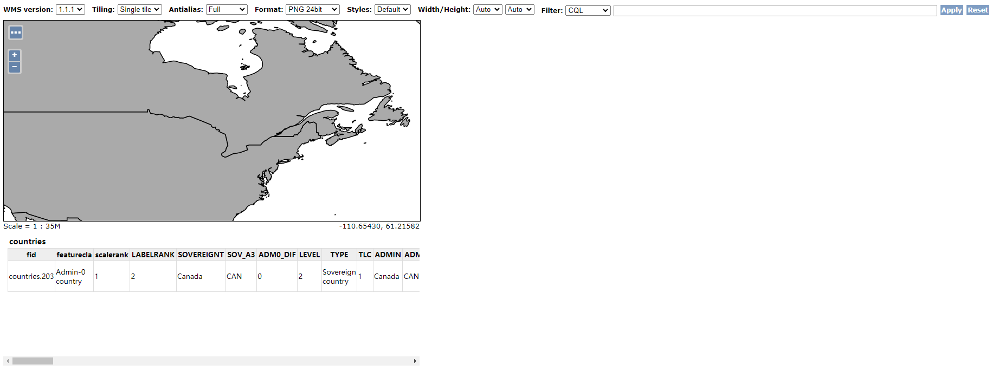

### 3、[Publishing a Image](https://docs.geoserver.org/latest/en/user/gettingstarted/image-quickstart/index.html)

#### 数据准备

下载[该链接](https://www.naturalearthdata.com/downloads/50m-raster-data/50m-shaded-relief/)中的 1:50m Shaded Relief raster，解压后并移动到 `data/ne`文件夹，解压文件如下

- `SR_50M.prj`
- `SR_50M.README.html`
- `SR_50M.tfw`
- `SR_50M.tif`
- `SR_50M.VERSION.txt`

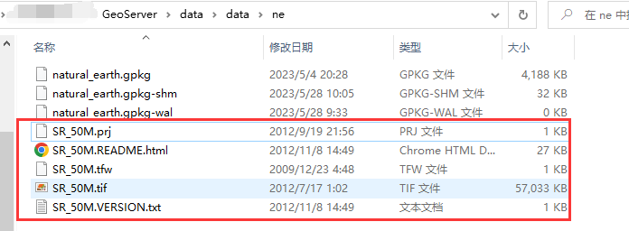

#### 创建新工作空间

> 补充：该步骤可选，一般一个工作空间对应一个项目（一个文件夹），内部包含仓库 和 图层

这里采用上次的`tutorial`仓库

#### 创建仓库

- 导航到**Data‣Stores**，点击**Add new Store**，`因为本次是发布一张影像，所以对应Raster Data Source`，点击**WorldImage**

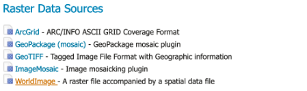

- 设置仓库所在的工作空间、数据源名称 和 简要说明

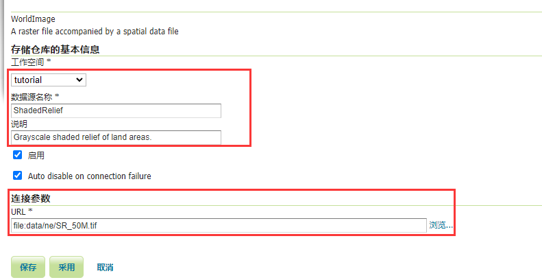

- 浏览文件位置，`data/ne/SR_50M.tif`，点击保存后重定向到新建图层页

#### 创建图层

- 基本资源信息填写，同上，设置名称、标题 和 概述

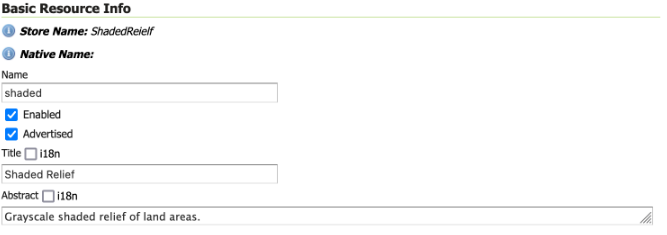

> 使用GeoServer内部EPSG数据库对WGS84的定义优于与同一图像一起提供的prj文件

- 坐标系统，这里可以选择`Force declared`

> 经过检查，该SR_50M.prj 内部坐标系也为WGS84，即4326

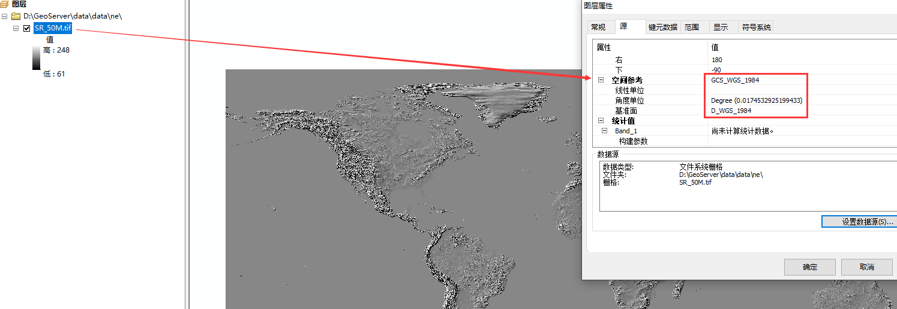

- 边框，点击**Compute from SRS bounds**和**Compute from native bounds**链接，生成该层的边界框

  > 这种情况下，要选择一个稍大的边界框，完全包含图像

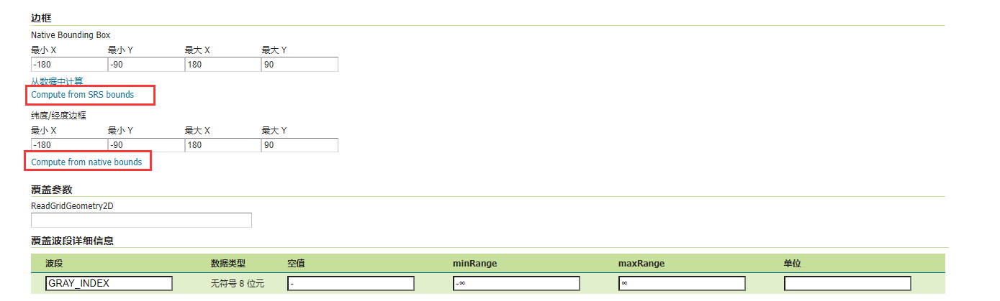

- 切换到发布界面，配置WMS，确保默认样式为**Raster**，点击**save**

#### **预览图层**

导航到**Data > Layer Preview**界面，找到刚刚发布的`tutorial:shaded` 图层，点击右侧的**OpenLayers**，**即可查看发布图层效果，同时可缩放和查看图层属性**

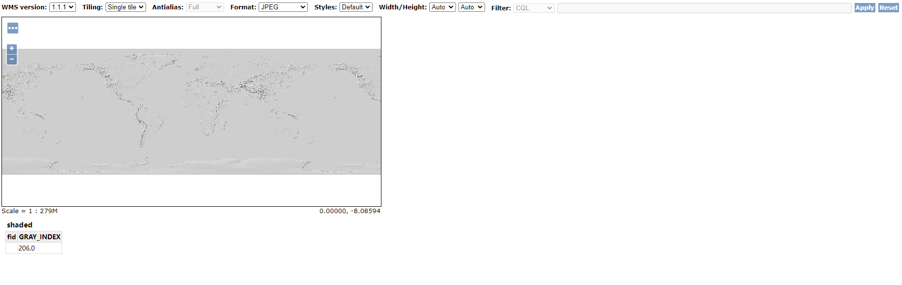

### 4、[Publishing a Layer Group](https://docs.geoserver.org/latest/en/user/gettingstarted/group-quickstart/index.html)

#### 数据准备

完成上述Publishing a GeoPackage 和 Publishing a Image

#### 创建一个图层组

> 图层组可以是 "全局的"，允许将几个工作区的图层组合成一张地图

- 找到**Data > Layer Group**，点击**Add new layer group**

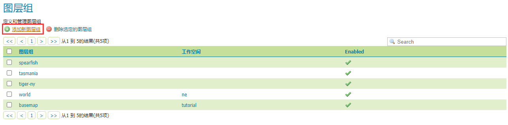

- 设置基本信息，`Name对应图层预览界面的Name，Title对应图层预览界面的Title，工作空间选择之前创建的tutorial`

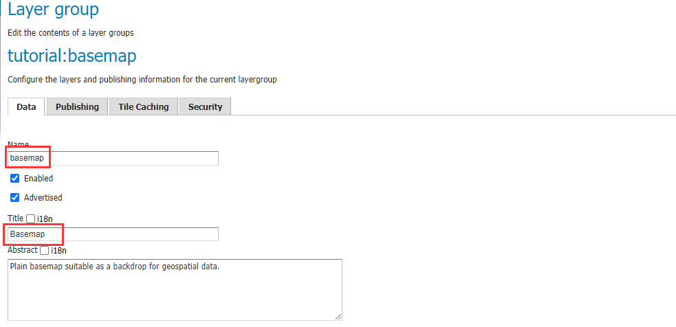

- 找到图层界面，点击**Add Layer**，先选择`tutorial:shaded`，因为其他图层将在这个图层之上
- 再点击**Add Layer**，选择`tutorial:countries`
- 设置`tutorial:countries`图层的样式，由面改为先，用以勾勒出这些国家的边界

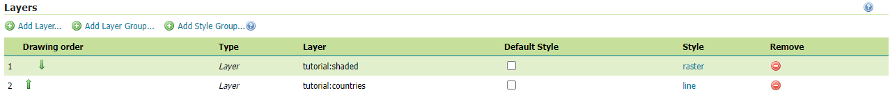

- 定位到坐标参考系统，点击**Generate Bounds**，最后点击保存

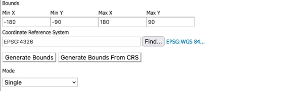

#### 预览图层

导航到**Data > Layer Preview**界面，找到刚才发布的`tutorial:basemap`图层，点击**OpenLayers**查看效果。

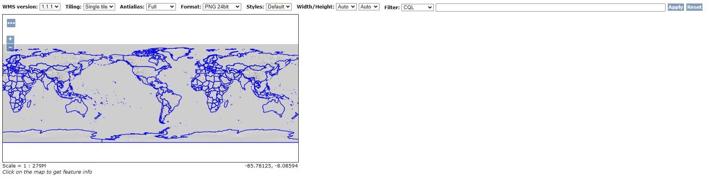


### 5、[Publishing a style](https://docs.geoserver.org/latest/en/user/gettingstarted/style-quickstart/index.html)

#### 数据准备

上述已经发布的三个图层，`tutorial:countries、tutorial:shaded和 tutorial:basemap`

#### 创建样式

##### 创建样式

导航到**Data > Style**，这个页面显示一个样式的列表，包括该样式所属的工作区

- 在样式列表顶部，点击**Add a new style**
- 设定样式的基本信息

| Name      | background |
| :-------- | ---------- |
| Workspace | `tutorial` |
| Format    | `SLD`      |

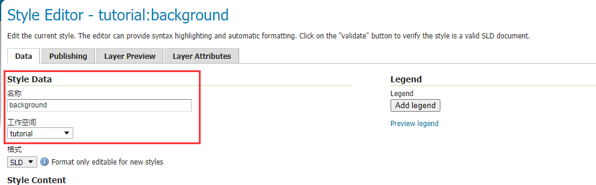

- 设定样式内容，生成一个默认样式选择`Polygon`

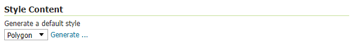

- 点击**Generate**生成一个默认样式，用生成的多边形样式的轮廓来填充样式编辑器

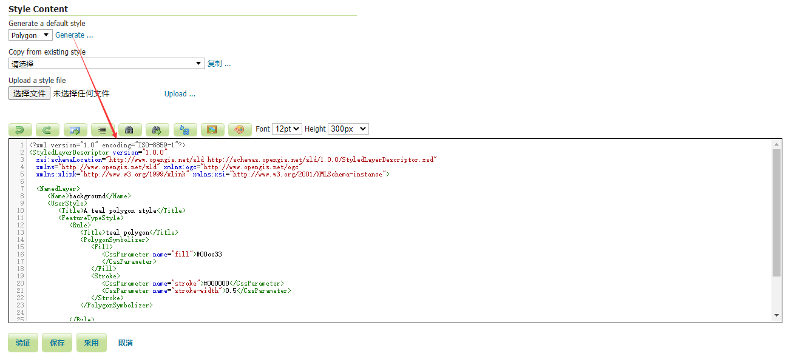

- 点击**Apply**采用
- 切换到发布栏，找到之前发布的`tutorial:countries`，勾选**Default**复选框，使用`tutorial:background`风格作为该层的默认样式

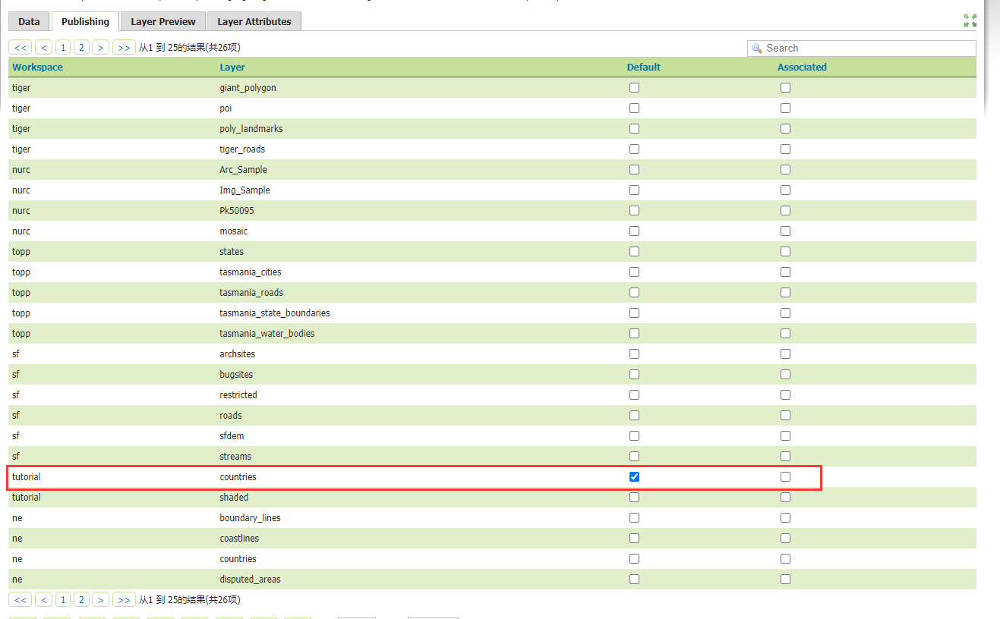

- 切换到顶部的图层预览栏，点击链接，选择`tutorial:country`作为编辑样式时使用的数据集，当然此处可以切换其他的数据集，可查看对应应用效果

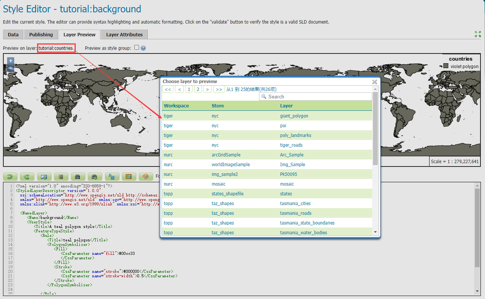

- 编辑样式设定`fill-opacity`为`0.25`，点击**Apply**，即可查看新的渲染结果

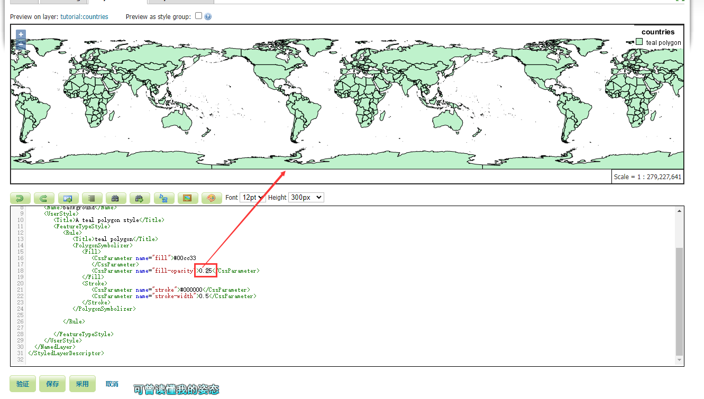

- 切换到全屏模式，可通过更改内部源码进而调整显示效果，如更改`Title`标签内的值，右侧的图例会同步更新

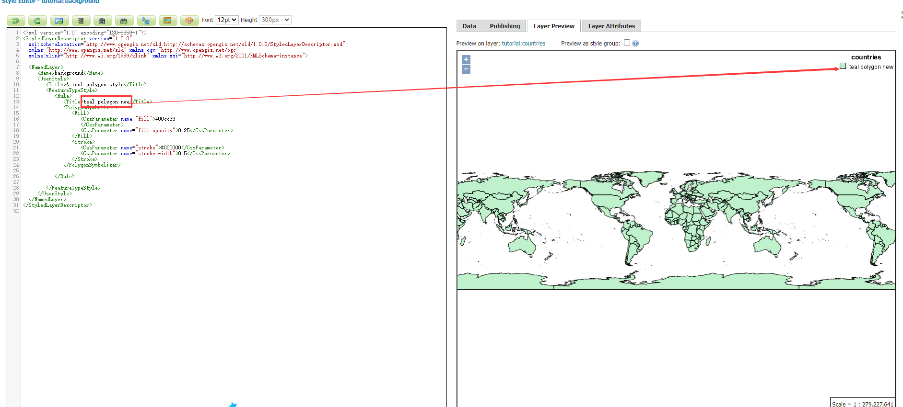


### 6、[Publishing a shapefile](https://docs.geoserver.org/latest/en/user/gettingstarted/shapefile-quickstart/index.html)

##### 数据准备

- 下载[压缩包](https://docs.geoserver.org/latest/en/user/_downloads/30e405b790e068c43354367cb08e71bc/nyc_roads.zip)，该包是纽约市的道路shp
  - nyc_roads.shp
  - nyc_roads.prj
  - nyc_roads.shx
  - nyc_roads.dbf
- 将解压后的`nyc_roads`文件夹移动到`GeoServer的安装目录data目录`下

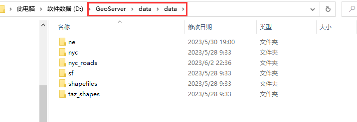

##### 创建新工作空间

> 如果有之前创建的工作空间，这里可以不创建

这里略，和之前创建是相似的，具体工作空间见下图

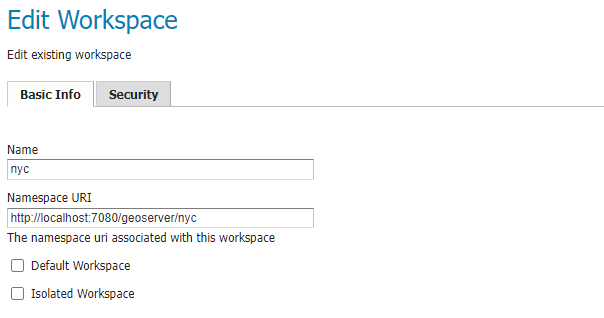

##### 创建仓库

- 导航到**Data‣Stores**，点击**Add new Store**
- 点击**Shapefile**，`新建矢量数据源`页面会自动显示

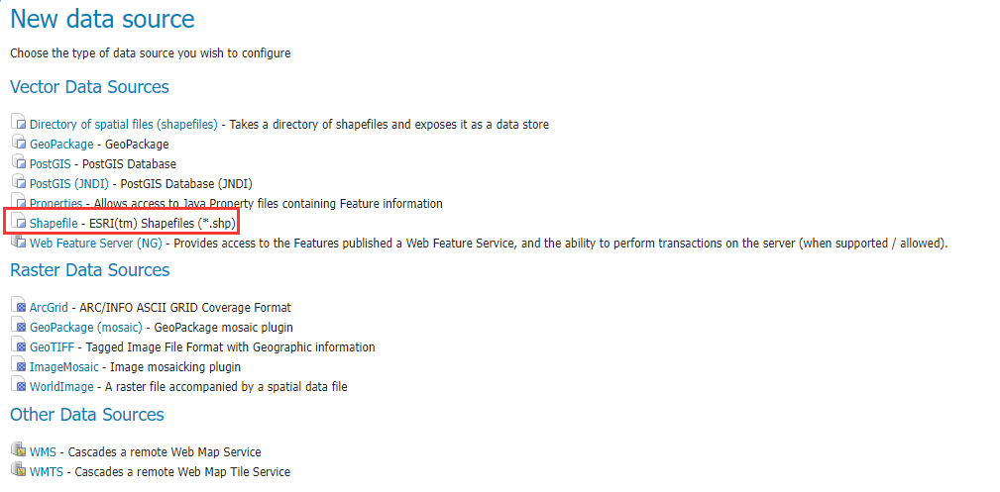

- 填写仓库信息，包括`基本信息参数 和 连接参数`，具体如下图

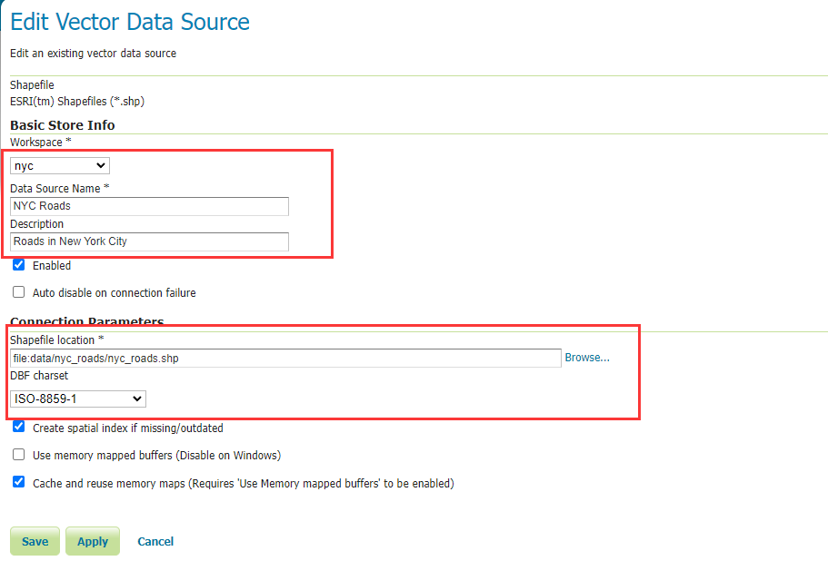

> 补充DBF charset: 指DBF文件的字符集设置，用于存储地理空间数据的属性信息 和 指定DBF文件中字符数据的编码方式
>
> 通过设置正确的DBF charset，可以确保字符数据在不同系统和软件之间的兼容性。不同的操作系统和软件可能使用不同的字符编码方式，如UTF-8、GBK、ISO-8859-1等。设置正确的DBF charset可以保证字符数据正确地显示和解析

##### 创建图层

- 点击**Publish**
- 编辑图层页设置一些`基本信息参数`，如下图

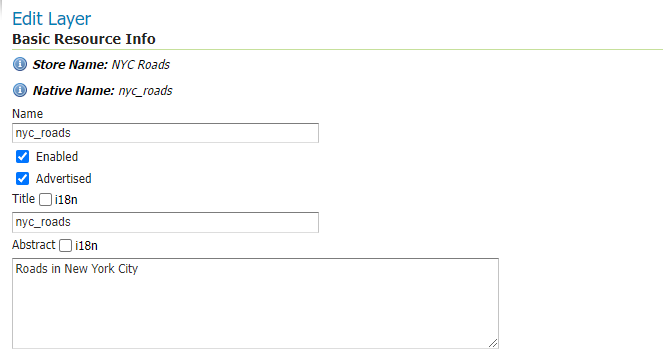

- 点击**Compute from data** 和 **Compute from native bounds**，用来生成图层边界

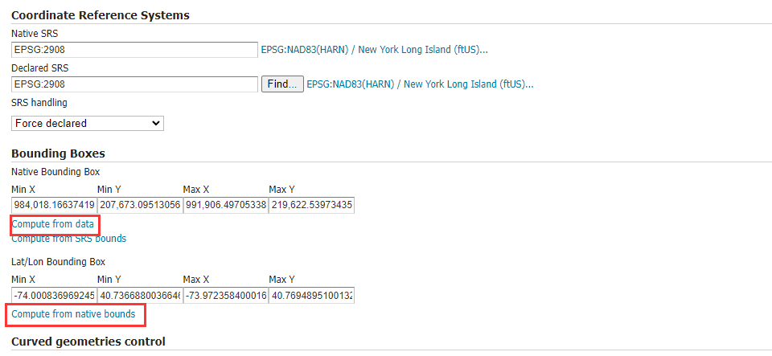

> 补充一：`在GeoServer中，SRS Handling（空间参考系统处理）下拉框提供了三个选项`，分别是：
>
> 1. Native SRS：
>    - 该选项表示GeoServer将使用数据源（例如数据库表、Shapefile等）原始的空间参考系统（SRS）。GeoServer不会对数据源的SRS进行任何变换或重投影。
>    - 适用场景：适用于数据源已经使用了正确的空间参考系统，并且你希望GeoServer直接使用数据源的SRS，而不进行任何坐标转换或重投影。
> 2. Force declared：
>    - 该选项表示GeoServer将强制使用数据源声明的空间参考系统。如果数据源没有明确声明SRS，GeoServer将无法处理该数据源。
>    - 适用场景：适用于你要求数据源必须明确声明SRS，而不接受任何未声明SRS的数据源。这有助于确保数据源的一致性和正确性。
> 3. Reproject to declared：
>    - 该选项表示GeoServer将根据数据源声明的SRS，将所有数据进行重投影。即使数据源本身使用了不同的SRS，GeoServer也会将其重投影为声明的SRS。
>    - 适用场景：适用于你希望所有数据都以相同的SRS进行显示和分析。这样可以确保在不同数据源之间实现一致的空间参考系统，并使它们能够在地图上正确地叠加和显示。
>
> 选择合适的SRS Handling选项取决于你的数据源和需求。如果你的数据源已经使用了正确的SRS，并且你希望GeoServer直接使用它们，那么选择"Native SRS"选项。如果你要求数据源必须明确声明SRS，那么选择"Force declared"选项。如果你希望所有数据都以相同的SRS进行显示和分析，那么选择"Reproject to declared"选项。
>
> 请注意，在使用"Reproject to declared"选项时，GeoServer需要进行坐标转换和重投影操作，可能会影响性能。如果你的数据源包含大量数据或复杂的几何对象，这可能会对性能产生影响。在这种情况下，你可能需要考虑对数据源进行预处理，以确保它们已经在所需的SRS中，减少GeoServer的重投影工作
>
> 补充二：在GeoServer中，图层发布界面中的坐标参考系统设置中，`"从数据中计算"和"从本地边界计算"`是两种不同的选项，用于确定图层的坐标参考系统（CRS）。
>
> 1. 从数据中计算：
>    - 这个选项会自动从你上传的数据中提取坐标参考系统信息。当你选择这个选项时，GeoServer会解析数据文件的元数据，例如Shapefile的.prj文件或者GeoTIFF的地理信息（georeferencing）数据，从中提取CRS信息。
>    - 这个选项适用于你的数据文件包含了正确的坐标参考系统信息，并且你希望GeoServer根据数据自动设置CRS。
> 2. 从本地边界计算：
>    - 这个选项允许你手动定义图层的坐标参考系统，而不依赖于数据文件中的信息。
>    - 当你选择这个选项时，你需要手动输入图层的坐标参考系统信息，包括坐标系统的名称、坐标系统的EPSG代码等。通常你可以在相关的地理空间数据提供商、地理信息机构或者地图投影库中找到这些信息。
>    - 这个选项适用于你的数据文件没有正确的CRS信息或者你想要手动指定不同于数据文件的CRS。

- 切换到发布栏，设定WMS的默认样式为`line`
- 点击**SAVE**

##### 预览图层

- 导航到**Layer Preview**界面，找到`nyc_roads`并点击**openLayers**进行预览

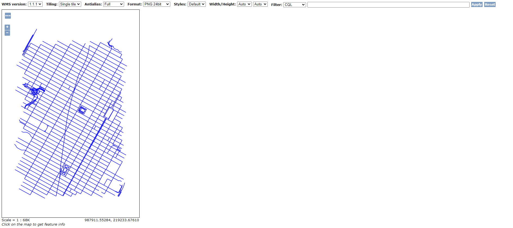


### 7、[Publishing a PostGIS table](https://docs.geoserver.org/latest/en/user/gettingstarted/postgis-quickstart/index.html)

> 本教程需要连接PostGIS，所以这里先给出本机 PostGre和 PostGIS的版本信息
>
> PostGre：13.8； PostGis：3.0.3；具体见下图

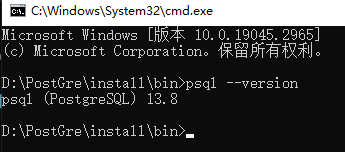

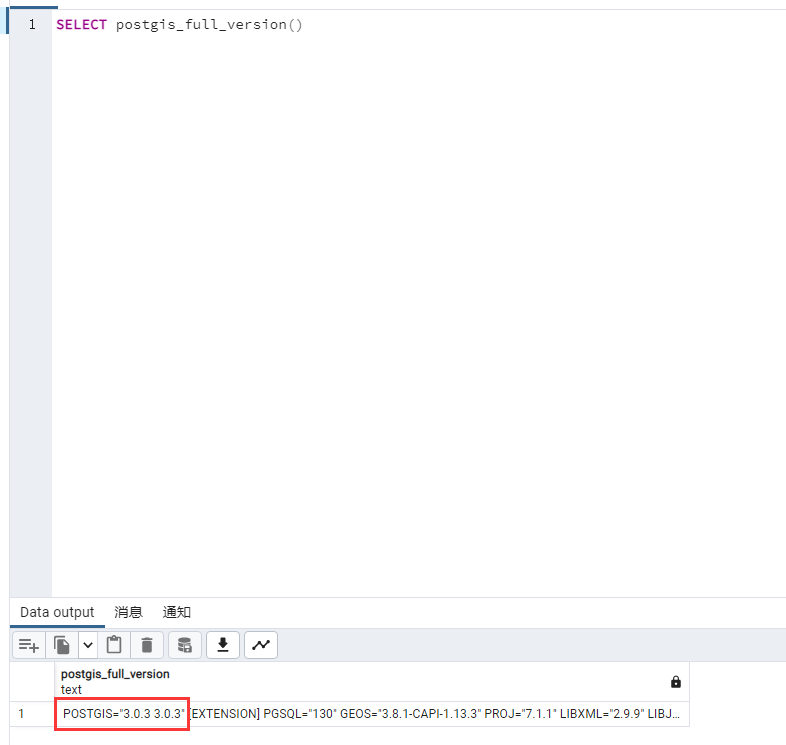

##### 创建PostGre数据库nyc

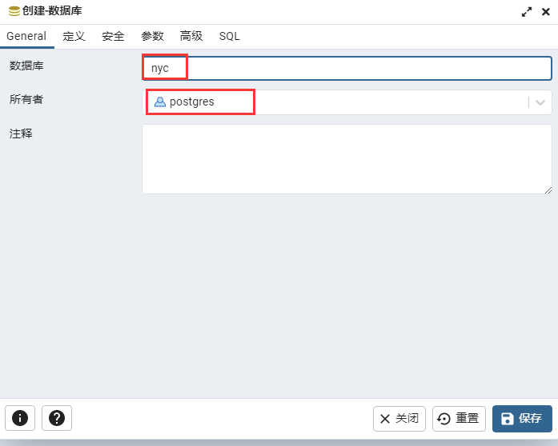

##### 添加PostGis插件

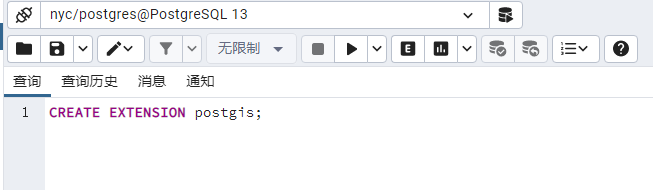

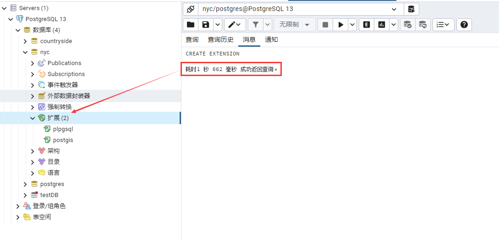

##### 导入sql文件并创建表格nyc_buildings

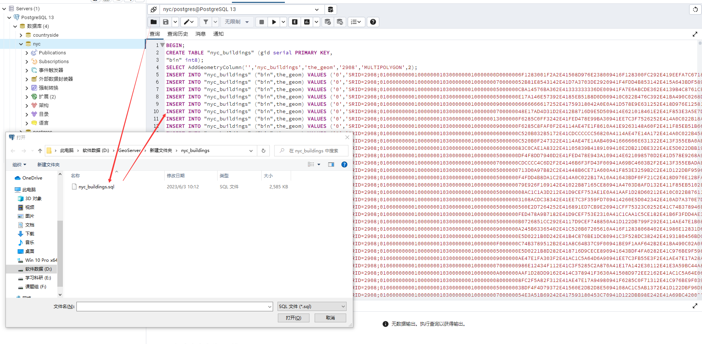

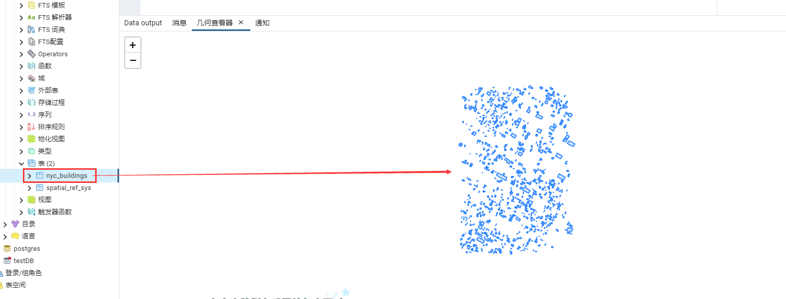

##### 创建新工作空间

> 本步骤略，采用上次的`nyc`

##### 创建仓库

- 导航到**Data‣Stores**
- 点击**PostGIS**，填写`基本信息`如下图

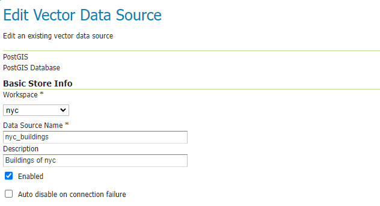

- 填写`PostGis数据库连接参数`，具体参数内容由实际确定

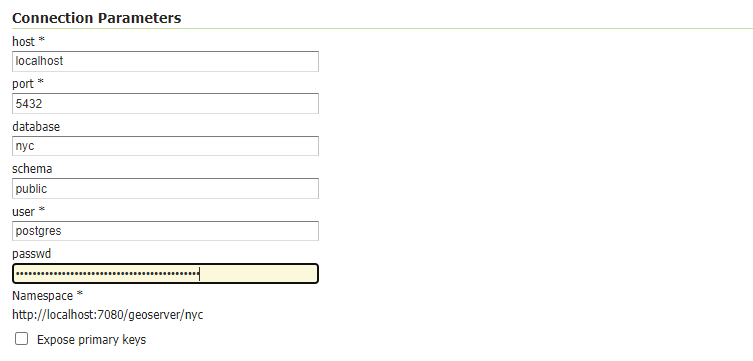

- 点击**Save**，自动跳转到图层发布界面

##### 创建图层

- 填充`Data栏基本信息`，如下图

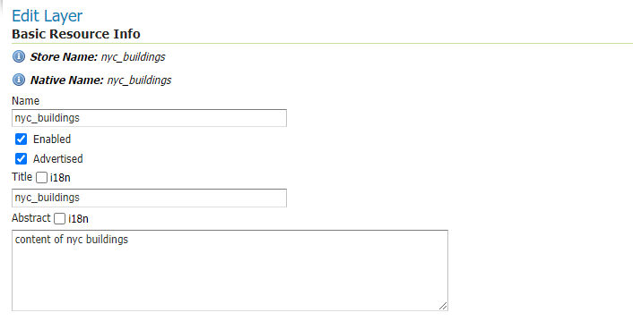

- 图层边界点击**Compute from data** 和 **Compute from native bounds**

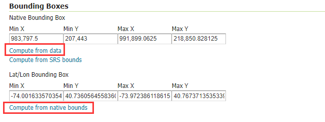

- 切换到**Publishing**栏，设置**Default Style**为**polygon**，最后点击**Save**

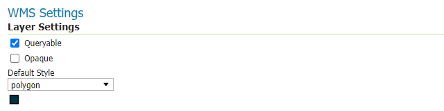

##### 预览图层

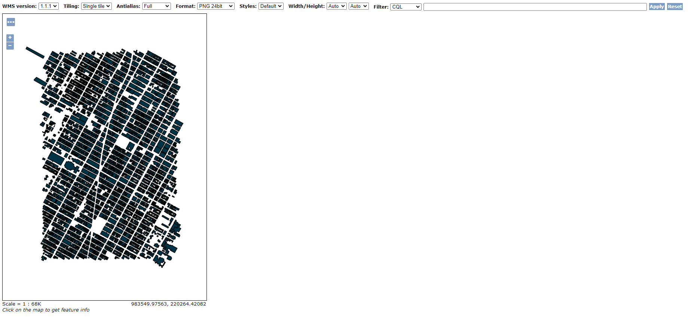


## 四、Using the web administration interface


> 浏览GeoServer图形界面

### 1、Welcome

#### Web 服务

欢迎界面列出了由GeoServer发布的网络服务，分WMS、WMTS、WFS和WCS

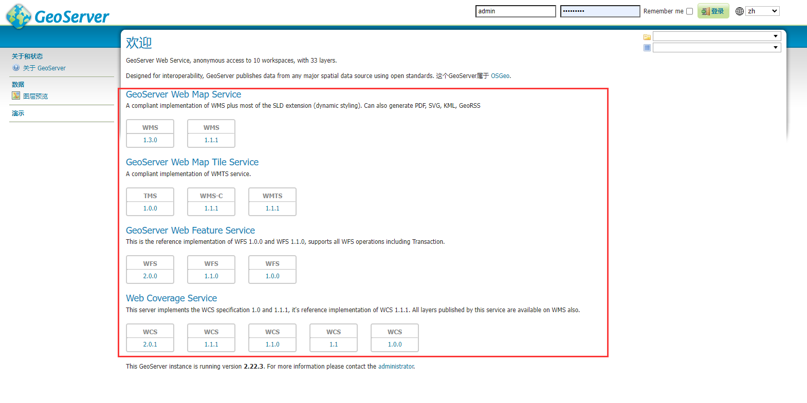

> 点击任意一个服务，即可查看该服务链接，服务该链接可在其他GIS软件中查看效果，下图如QGIS可加载查看

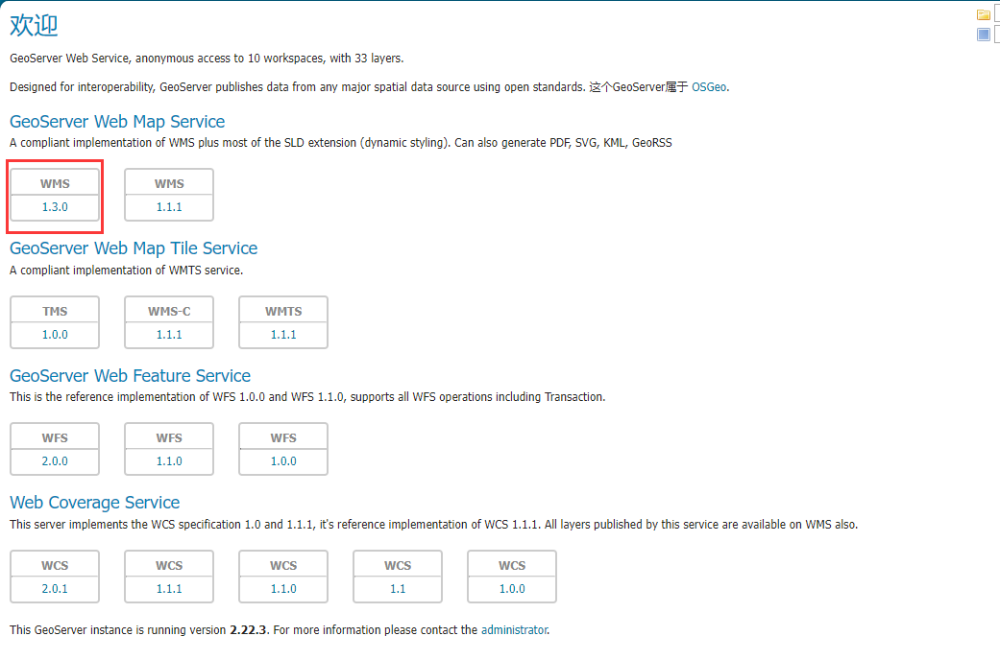

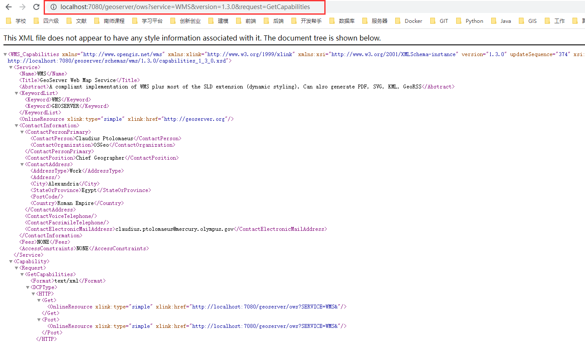

**QGIS数据加载**

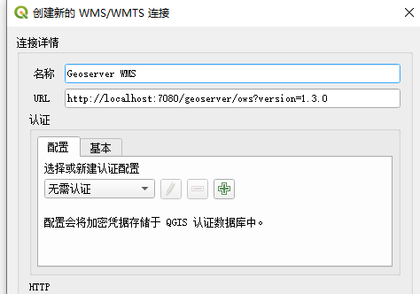

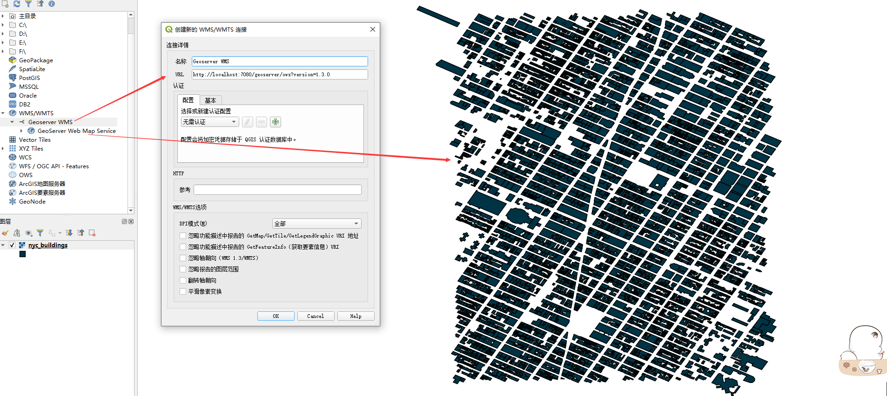

#### 工作空间 Web 服务

> - **使用欢迎页面顶部的工作区选择来选择一个工作区。欢迎页面的联系信息和网络服务将被更新，以匹配所选择的工作区**，比如切换到之前的`tutorial`工作区，就会更改空间内的图层
> - 所提供的网络服务链接可以在你的桌面GIS或网络地图应用程序中使用，以访问工作区的图层。

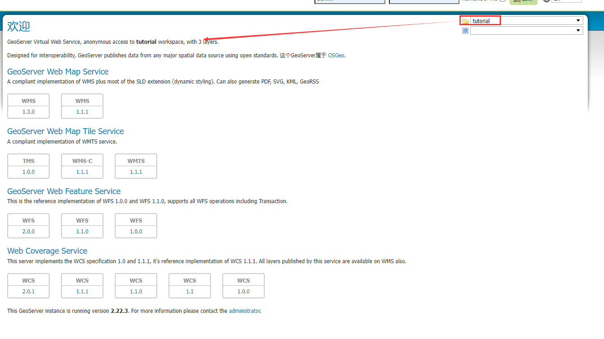

#### 图层 Web 服务

> 使用欢迎页顶部的图层选择来选择一个图层或图层组，页面的服务数目和内容也会同步更新

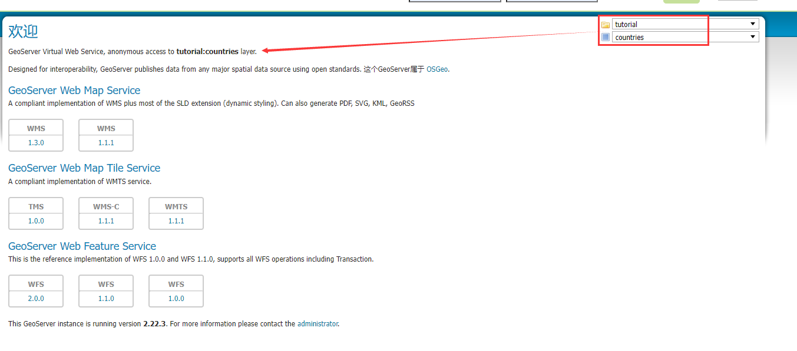

#### 服务器概述（管理员）

> 1. GeoServer的状态信息消息提供了对正常操作的反馈。
> 2. 警告描述了需要解决的配置问题，通常带有用于解决该问题的配置页面的捷径。


### 2、About & Status

> 关于和状态部分提供了对GeoServer诊断和配置工具的访问，对于调试特别有用。

#### 服务器状态

> 显示了服务器配置参数和运行状态的摘要

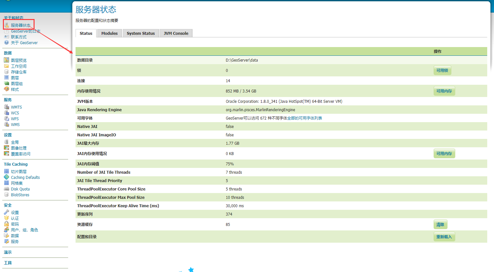

#### GeoServer 日志

> 显示了GeoServer的日志输出。这对确定错误非常有用，而不必离开浏览器

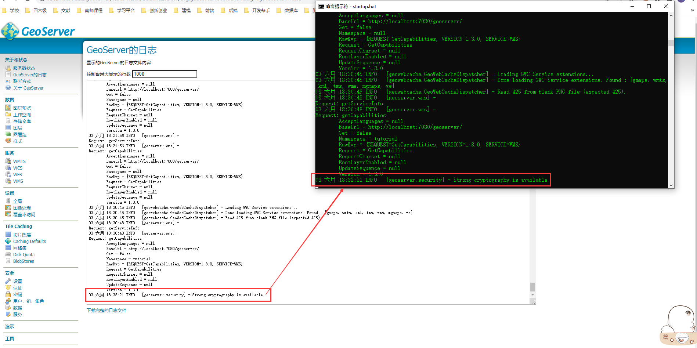


#### 联系信息

> 联系信息页面的目的是为用户提供与使用 GeoServer 相关的组织或机构进行联系的方式。如果用户有关于 GeoServer 的问题、反馈、合作或支持需求，他们可以使用联系信息页面上提供的信息与相关组织进行沟通。这有助于建立用户和组织之间的有效沟通渠道，并促进问题解决、技术支持和合作交流等方面的交流
>
> 1. 组织名称：列出了使用 GeoServer 的组织或机构的名称。这可以是一个企业、政府机构、学术机构或其他类型的组织。
> 2. 地址：提供了组织的物理地址，包括街道、城市、州/省、邮政编码和国家/地区等详细信息。
> 3. 电话号码：提供了组织的联系电话号码，用于与组织进行电话沟通或咨询。
> 4. 电子邮件地址：提供了组织的电子邮件地址，用于与组织进行电子邮件交流或咨询。
> 5. 网站链接：提供了组织的网站链接，通常是组织的官方网站，用户可以通过点击链接访问该网站以获取更多信息。

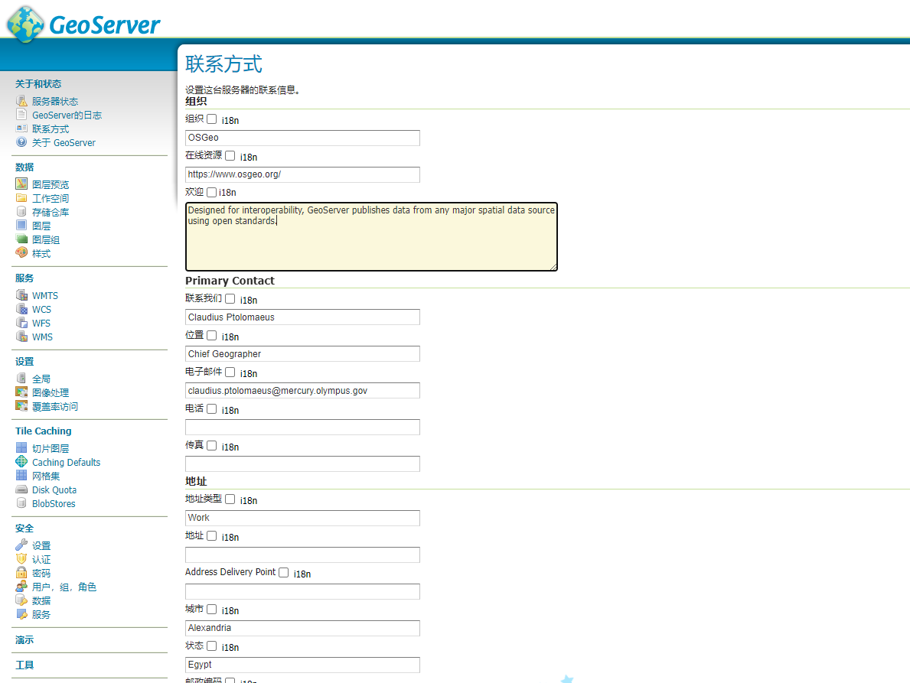

#### 关于 GeoServer 页面

> 提供关于Geoserver的版本信息，同时包含文档、主页 和 错误跟踪器
>
> - 文档：官方教学文档
> - 主页：OSGEO的GITHUB项目地址
> - 错误追踪器：提供了一些有关已知错误和问题的信息，这些问题也有对应的解决方案
>   - 提供了关于当前版本的 GeoServer 已知问题和错误的列表
>   - 提供了一些用户提交的错误报告
>   - 提供了一些已经修复的错误或发布的补丁

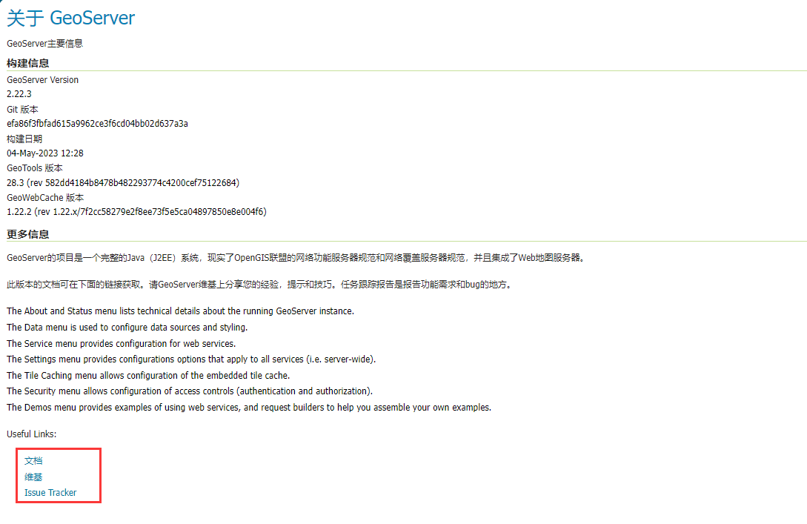


### 3、Data

#### 图层预览

> 图层预览页面提供各种输出格式的图层预览链接，包括常见的OpenLayers和KML格式。该页面有助于直观地验证和探索某一特定图层的配置

:warning: 图层必须被发布了才能被预览

每个图层行由类型、名称、标题和可供查看的格式组成。

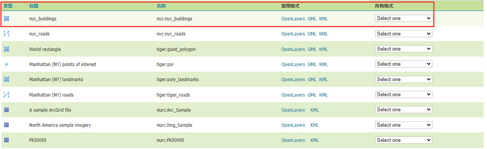

#### 输出格式

> 图层预览页面支持多种输出格式，以便进一步使用或分享数据。常见的OpenLayers和KML格式预览所有三种图层类型。同样，使用 "所有格式 "菜单，可用另外七种输出格式预览所有图层类型--AtomPub、GIF、GeoRss、JPEG、KML（压缩）、PDF、PNG、SVG和TIFF。只有矢量图层提供WFS输出预览，包括常见的GML以及CSV、GML3、GeoJSON和shapefile格式。下表提供了所有支持的输出格式的简要说明，按输出类型（图像、文本或数据）排列

##### Image Outputs

> 所有的图像输出都可以从WMS的getMap请求中启动，该请求可以是光栅、矢量或覆盖数据。

| 格式       | 描述                                                         |
| :--------- | :----------------------------------------------------------- |
| KML        | KML（Keyhole Markup Language）是一种基于XML的语言模式，用于在地球浏览器中表达地理数据，如谷歌地球或谷歌地图。KML使用一种基于标签的结构，具有嵌套元素和属性。对于GeoServer来说，KML文件是以KMZ的形式分发的，它是一个压缩的KML文件。 |
| JPEG       | 栅格格式的WMS输出。JPEG是一种压缩的图形文件格式，由于压缩，质量会有一些损失。它最好用于照片，不建议用于数据的精确复制。 |
| GIF        | 栅格格式的WMS输出。GIF（图形交换格式）是一种位图图像格式，最适合于具有有限颜色的锋利边缘的线条艺术。这利用了该格式的无损压缩的优势，它偏向于具有明确边缘的统一颜色的平面区域（与JPEG相反，它偏向于平滑的渐变和较柔和的图像）。GIF被限制在8位调色板上，即256种颜色。 |
| SVG        | 矢量格式的WMS输出。SVG（可扩展矢量图）是一种在XML中为二维图形建模的语言。它与GIF和JPEG的不同之处在于，它使用图形对象而不是单个的点。 |
| TIFF       | 栅格格式的WMS输出。TIFF（标签图像文件格式）是一种灵活、适应性强的格式，用于处理单个文件中的多种数据。GeoTIFF包含作为标签嵌入TIFF文件的地理数据。 |
| PNG        | 栅格格式的WMS输出。PNG（便携式网络图形）文件格式是作为GIF的免费、开源的继任者而创建的。PNG文件格式支持真彩色（1600万色），而GIF只支持256色。当图像有大面积的、均匀的彩色区域时，PNG文件就很出色。 |
| OpenLayers | WMS GetMap请求输出一个简单的OpenLayers预览窗口。[OpenLayers](http://openlayers.org/)是一个开源的JavaScript库，用于在网络浏览器中显示地图数据。OpenLayers输出有一些高级过滤器，这些过滤器在使用OpenLayers的独立版本时是不可用的。此外，生成的预览包含一个标题，其中包含用于显示的简单配置选项。OpenLayers库的第3版被默认使用。版本3可以通过ENABLE_OL3（真/假）格式选项或系统属性禁用。对于OpenLayers 3不支持的旧浏览器，无论设置如何，都会使用版本2。 |
| PDF        | PDF（便携式文档格式）封装了对固定布局的二维文档的完整描述，包括任何文本、字体、光栅图像和二维矢量图形。 |

##### Text Outputs

| 格式    | 描述                                                         |
| :------ | :----------------------------------------------------------- |
| AtomPub | 以XML格式输出空间数据的WMS。AtomPub（Atom Publishing Protocol）是一个应用级协议，用于使用HTTP和XML发布和编辑网络资源。作为内容联合的RSS系列标准的替代品，Atom允许订阅地理数据。 |
| GeoRss  | WMS GetMap请求输出XML格式的矢量数据。RSS（Rich Site Summary）是一种XML格式，用于传递定期变化的网络内容。[GeoRss](http://www.georss.org/)是一个编码位置的标准，作为RSS提要的一部分。支持Layers Preview产生一个RSS 2.0文件，使用Atom的GeoRSS简单几何图形。 |
| GeoJSON | [JavaScript Object Notation](http://json.org/) (JSON)是一种基于JavaScript编程语言的轻量级数据交换格式。这使得它成为基于浏览器的应用程序的理想交换格式，因为它可以直接和容易地被解析到javascript中。GeoJSON是一种纯文本输出格式，将地理类型添加到JSON中。 |
| CSV     | WFS GetFeature输出为以逗号分隔的文本。CSV（Comma Separated Values）文件是包含数据行的文本文件。每行的数据值都由逗号分隔。CSV文件还包含一个逗号分隔的标题行，解释每一行的数值排序。GeoServer的CSV是完全流式的，对可输出的数据量没有限制。 |

##### Data Outputs

| 格式      | 描述                                                         |
| :-------- | :----------------------------------------------------------- |
| GML2/3    | GML（地理标记语言）是由[开放地理空间联盟](http://en.wikipedia.org/wiki/Open_Geospatial_Consortium)（OGC）定义的XML语法，用于表达地理特征。GML作为地理系统的建模语言，也是地理数据共享的开放交换格式。GML2是默认的（通用）输出格式，而GML3可以从 "所有格式 "菜单中获得。 |
| Shapefile | ESRI Shapefile，或简称shapefile，是最常用的GIS数据交换格式。GeoServer以Zip格式输出shapefile，目录中包括.cst、.dbf、.prg、.shp和.shx文件。 |

#### 工作空间

> 工作区是一个组织其他项目的容器。在GeoServer中，工作区经常被用来将类似的图层组合在一起。图层可以通过其工作空间名称、冒号、图层名称（例如topp:states）来提及。两个不同的图层可以有相同的名称，只要它们属于不同的工作空间（例如sf:states和topp:states）
>
> 显示工作区的列表，可以添加、编辑和删除。

#### 工作空间的服务

- 一旦启用（相当于只对当前工作空间生效），点击服务链接将打开该服务的设置页面，允许提供服务标题、摘要和其他细节的默认值`和直接点开各个服务后选中某个工作空间是相同的界面`
- 如果不启用，默认使用全局的WMS、WCS、WFS 和 WMTS

##### 设置

- 启动设置后，会覆盖全局的基本联系信息（即覆盖`关于与状态`中的`联系方式`）

##### 安全栏

- 略，和后续的用户，组和角色有关；此外更多的访问规则在Data一章中（后续补充）


#### 存储仓库

> 显示一个仓库的列表，可以添加、编辑和删除。细节包括与仓库相关的工作区，仓库的类型（数据格式），以及该仓库是否被启用

##### 基础仓库信息

- **Workspace** - 所在的工作空间
- **Data Source Name** - 数据集的名字
- **Description** - (optional) 简单描述
- **Enabled** - 是否可用
- **Auto disable on connection failure** - `一般不勾选` 如果geoserver尝试获取对存储的访问权限时出现任何问题，则auto将禁用对该存储的访问


#### 图层

> 图层 "页面显示图层的列表，可以添加、编辑和删除。细节包括与图层相关的工作空间和存储，图层是否被启用，以及图层的空间参考系统（SRS）

##### Data

坐标参考系统

- Native SRS

  - 图层自带的坐标系统，会被自动读取

- Declared SRS

  - 可以给当前图层指定一个具体的坐标系统

- SRS handing

  - **Force declared**：使用用户指定的
  - **Reproject from native** ：用于根据图层数据的原始投影进行动态转换
  - **Keep native**：使用原声的

- **Bounding Boxes**边界盒

  - Native Bounding Box
    - compute from data 从当前图层中读取边界
    - compute from SRS bounds  从OGC公布的EPSG坐标指定边界范围
  - Lat/Lon Bounding Box
    - compute from native bounds 从本地边界读取

  Native Bounding Box 是根据数据源的原始投影表示边界框，而 Lat/Lon Bounding Box 则是使用经纬度表示边界框。具体选择哪种边界框取决于数据源的投影和所需的坐标系统。如果需要基于经纬度进行操作或与其他图层进行对比，使用 Lat/Lon Bounding Box 可能更方便；如果需要与原始数据的投影一致或使用其他投影进行分析，使用 Native Bounding Box 可能更合适

- **Curved geometries control** 弯曲几何形状控制

  - **Linear geometries can contain circular arcs**
    - 当选中该选项时，表示允许线性几何对象包含圆弧（曲线段）。通常，线性几何对象由直线段组成，而不包含曲线段。但某些数据格式（如GML）支持将曲线段（如圆弧）作为线性几何的一部分。如果数据中包含了圆弧，选择此选项可以在 GeoServer 中正确解析和呈现这些线性几何对象
  - **Linearization tolerance (useful only if your data contains curved geometries)**
    - 该选项用于指定在线性化曲线几何时所允许的容差值。当数据中包含曲线几何（如圆弧）时，GeoServer 需要将其线性化为直线段以进行呈现和分析。线性化容差指定了在曲线线性化过程中所允许的最大偏差。较小的容差值会更准确地保留曲线的形状，但可能增加数据的存储和传输量。较大的容差值会在保留曲线大致形状的同时减少数据量。根据数据的几何复杂性和精确性要求，可以调整线性化容差的值

- Feature Type Details (Vector)

  - `默认读取矢量数据中所有属性信息`
    - **Type**类型中，会有一个the_geom属性，该属性会存储该矢量文件的要素类型
    - **Nillable**属性会存储该值是否可空
    - **Min/Max Occurrences** 出现的最少 和 最大次数
  - `勾选Customize attributes后，可以做自定义调整`
    - 使用向上/向下箭头或拖动属性行更改属性的顺序
    - 使用属性行末尾的“移除”图标移除属性
    - 添加一个新属性，该属性将基于源CQL表达式进行计算
    - 重命名属性
    - 添加属性的说明，该说明在描述特征类型的任何位置都可见
    - 使用“类型”列更改属性的类型。最常见的类型可以在编辑时的下拉列表中找到，但可以指示任何有效的Java类，只要GeoServer有一个从Source表达式产生的值到目标类型的转换器

##### publish发布

- Caching Settings
  - Response Cache Headers 勾选，则如果同一请求，会在下面的Cache Time时间范围内从缓存中读取
  - Cache Time (seconds) 
- layer settings
  - 设定该图层支持哪些OGC服务
- WMS settings
  - **Queryable**：控制该层是否可以通过WMS GetFeatureInfo请求进行查询
  - **Default style**：当客户端没有在GetMap请求中指定一个命名的样式时，将使用该样式
  - **Additional styles**：可与该层相关联的其他样式。一些客户端（以及GeoServer图层预览）会将这些样式作为该图层的备选样式呈现给用户
  - **Default rendering buffer**：默认的缓冲区参数默认值
  - **Default Interpolation Method**： 默认插值方式
- WMS Attribution
  - **Attribution Text**：数据提供者默认文本信息
  - **Attribution Link**：数据提供者默认链接
  - **Logo URL**：提供者的默认使用Logo图标
  - **Logo Content Type, Width, and Height**：Logo图标的相关信息
- WFS Settings
  - **Per-Request Feature Limit（每个请求要素限制**）
    - 定义了每个请求返回的要素数量的限制。当使用 WFS 服务或进行图层查询时，可以通过设置此参数来限制每个请求返回的要素数量。这对于控制数据传输量和服务器负载很有用。例如，如果将此参数设置为 1000，那么每个请求最多只会返回 1000 个要素。如果结果集中的要素数量超过该限制，只会返回部分结果。可以根据需要调整此参数的值。
  - **Maximum number of decimals（最大小数位数）**
    - 用于控制图层属性值的小数位数限制。在 GeoServer 中，属性值可以包含小数。通过设置此参数，可以限制属性值的小数位数，以控制其精度和数据大小。例如，如果将此参数设置为 2，那么属性值中的小数部分将被截断为最多两位小数。这对于在呈现和传输数据时减少数据量很有用。可以根据数据的精确度和需求，调整此参数的值。

##### Dimensions维度

略，如果需要添加其他维度 https://docs.geoserver.org/maintain/en/user/data/webadmin/layers.html#data-webadmin-layers

##### Security 安全性

要创建/编辑层的数据访问规则，只需根据所需的访问模式和角色选中/不选中复选框。授予任何角色的访问权复选框为每个访问模式授予每个角色


#### 图层组

> 显示一个图层组的列表，可以添加、编辑和删除。细节包括相关的工作区（如果有的话）

- 图层组的模式

  | Layer Group Mode       | Named | Contains Children | Lists Children | Details        |
  | :--------------------- | :---- | :---------------- | :------------- | :------------- |
  | Single                 | named |                   | no             |                |
  | Opaque Container       | named | yes               | no             | hides children |
  | Named Tree             | named | yes               | lists children |                |
  | Container Tree         |       | yes               | lists children |                |
  | Earth Observation Tree | named | yes               | lists children | has root layer |

  - **single**: 图层组作为一个具有名称的单一图层暴露出来，作为一个图层列表的别名。这些图层仍然显示为WMS能力文件中的顶层条目（除非明确由树形组引用）。
  - **opaque container**: 图层组作为一个具有名称的单一图层暴露出来，作为一个图层列表的别名。然而，它所包含的图层和子组不会显示在能力文件中（除非由树形组明确引用），并且在WMS调用中和WMS能力文件中不能单独使用，而只能作为组的一部分。
  - **named tree**: 层组可以用一个名字来指代，但也会在能力文件中公开其嵌套的层和组。
  - **container tree**: 层组在能力文件中被暴露出来，但没有名称，因此无法单独呈现。这在WMS规范中被称为 "包含类别"。
  - **Earth Observation tree**: 是为管理WMS地球观测要求而创建的一种特殊类型的组。这个组不渲染其嵌套的图层和组，而只渲染一个叫做根层的 "预览层"。当选择这种模式时，一个新的字段 "根层 "将在配置用户界面中暴露出来。

- Enabled 复选框

  - 用于启用或禁用图层或图层组。如果选中 Enabled 复选框，表示该图层或图层组是启用状态，可以在服务中访问和使用。如果未选中 Enabled 复选框，表示该图层或图层组是禁用状态，将无法在服务中访问和使用。通过启用或禁用图层或图层组，可以灵活地控制哪些图层或图层组在服务中可见和可用。

- Advertised 复选框

  - 用于决定是否在 GetCapabilities 请求中公开该图层或图层组的信息。如果选中 Advertised 复选框，表示该图层或图层组将包含在 GetCapabilities 响应中，客户端可以获取到该图层或图层组的元数据和相关信息。如果未选中 Advertised 复选框，表示该图层或图层组在 GetCapabilities 响应中不会被公开，客户端将无法获知该图层或图层组的存在。通过设置 Advertised 复选框，可以选择性地展示或隐藏特定图层或图层组的信息

- 图层组表格

  - 页面底部的表格列出了当前图层组内包含的图层和组。我们把图层和图层组称为可发布元素。当一个图层组被处理时，图层将按照所提供的顺序被渲染，`所以列表底部的可发布元素将被最后渲染，并将显示在其他可发布元素的上面。`
  - 一个可发布的元素可以通过点击绿色的向上或向下箭头，分别在这个列表中定位到更高或更低的位置，或者可以简单地拖动到目标位置。列表顶部的图层是第一个被涂抹的，它下面的图层将被涂抹在第二个，以此类推，最后一个图层将被涂抹在所有其他图层之上（这就是所谓的 "画家模式"）
  - 风格栏显示了与每个层相关的风格。要改变与某一图层相关的样式，点击适当的样式链接。启用的样式的列表将被显示。点击一个样式名称，就可以重新分配该层的样式。
  - 要从图层组中删除一个可发布的元素，选择删除栏中的按钮。现在会提示你确认或取消这一删除。
  - 通过点击表格顶部的添加图层...按钮，可以将一个图层添加到列表中。从图层列表中，通过点击图层名称选择要添加的图层。选定的图层将被附加到可发布列表的底部

  :notes: 默认情况下，当至少有一个子层是可查询的，一个图层组就是可查询的。如果你想明确表示它不能被查询，而不考虑子层是如何配置的，请取消勾选 "可查询 "框。

  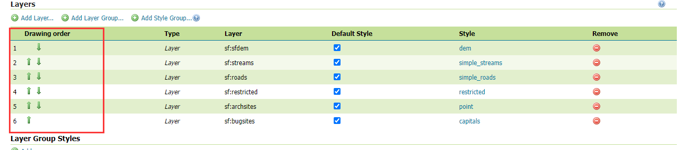

- 安全选项卡允许在层组层面设置数据访问规则。


#### 样式

> 样式是用来控制地理空间数据的外观的。GeoServer的样式是以多种不同格式编写的：
>
> 样式化图层描述符（SLD）： 一种OGC地理空间风格化标准。默认情况下是可用的。
>
> 层叠样式表（CSS）： 一种类似于CSS的语法。可通过扩展获得。
>
> YSLD：一种基于YAML的SLD等价物，用于改进创作。可通过 ysld 扩展获得。
>
> MBStyle： 一种基于JSON的语法，以提高互操作性。可通过mbstyle扩展获得。

- [Data](https://docs.geoserver.org/maintain/en/user/styling/webadmin/index.html#styling-webadmin-edit-data): 包括基本的样式信息、生成样式的能力和图例细节
- [Publishing](https://docs.geoserver.org/maintain/en/user/styling/webadmin/index.html#styling-webadmin-edit-publishing): 显示哪些图层在使用这种风格
- [Layer Preview](https://docs.geoserver.org/maintain/en/user/styling/webadmin/index.html#styling-webadmin-edit-preview): 在编辑时预览具有关联层的样式
- [Layer Attributes](https://docs.geoserver.org/maintain/en/user/styling/webadmin/index.html#styling-webadmin-edit-attributes): 显示相关层的属性列表
- 底部的四个按钮

| Option       | Description                                                  |
| :----------- | :----------------------------------------------------------- |
| **Validate** | 将根据选择的**格式**选项测试当前样式的正确性。对于SLD样式，它将根据SLD模式检查其合规性 |
| **Save**     | 对样式进行修改，并返回到样式页面。                           |
| **Apply**    | 对样式进行修改并保留在样式编辑器页面上。这对更新[图层预览](https://docs.geoserver.org/maintain/en/user/styling/webadmin/index.html#styling-webadmin-edit-preview)标签很有用。 |
| **Cancel**   | 取消对样式的所有修改，并返回到样式页面。                     |

- Style definition

  - 在所有选项卡上，风格编辑器将在底部显示风格定义，允许直接编辑风格。在选项卡之间切换，以方便创建和编辑样式
  - 样式编辑器的按钮解释

  | Button                                                       | Description                                                  |
  | :----------------------------------------------------------- | :----------------------------------------------------------- |
  |  | 撤销                                                         |
  |  | 重做                                                         |
  |  | 转到线                                                       |
  |  | 在样式文本中查找（CTRL-F）。                                 |
  |  | 在样式文本中查找下一个出现的内容（CTRL-G/Cmd-G）。           |
  |  | 在样式文本中查找和替换（CTRL-SHIFT-F/Cmd-Option-F）。首先输入搜索词，按ENTER，然后输入替换词，再按ENTER。也可以用CTRL-SHIFT-R/Cmd-Shift-Option-F来运行 "全部替换"。 |
  |  | 段落对齐                                                     |
  | 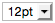 | 改变字体大小                                                 |
  |  | 在样式中插入图片（选择现有的或上传）。                       |
  | 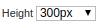 | 改变风格编辑器的高度（在全屏模式下禁用）。                   |

- 在编辑过程中，特别是在编辑完成后，检查语法的有效性。这可以通过点击底部的 "验证 "按钮来完成，如果发现任何验证错误，将显示这些错误：

  

- Style Editor: Publishing tab

  - 发布选项卡显示服务器上所有图层的列表，目的是显示哪些图层与当前样式相关。

- Style Editor: Layer Preview tab

  - 迭代样式并测试可视化如何随时间变化是非常常见的。图层预览选项卡允许对样式进行修改，并看到它们，而不需要从页面上导航。
  - 图层预览选项卡显示的是一张图片。GeoServer会尝试识别应该显示哪个图层（例如，这个样式是默认的图层），但如果正在预览的图层不是所需的图层，请点击预览框上方的图层名称并选择一个图层。

- Style Editor: Layer Attributes tab

  - 大多数样式利用相关层的某些属性的特定值，以创建更详细和有用的样式。(例如：根据一个特定的属性，对所有大城市和小城市进行造型。）
  - 图层属性 "选项卡将显示给定关联图层的属性列表。GeoServer会尝试识别应该显示哪个图层（例如，这个样式是默认的图层），但如果正在预览的图层不是所需的图层，请点击表格上方的图层名称并选择一个图层

  | Option           | Description                                                  |
  | :--------------- | :----------------------------------------------------------- |
  | **name**         | 属性的名称                                                   |
  | **type**         | 属性的类型。可以是一个数字（如 "Long"），一个字符串（"String"），或一个几何图形（如 "Point"）。 |
  | **sample**       | 从数据中提取的属性的样本值                                   |
  | **min**          | 数据集中该属性的最小值，如果适用的话                         |
  | **max**          | 数据集中该属性的最大值，如果适用的话                         |
  | **computeStats** | 点击**计算**来计算该属性的**最小**和**最大**值（如果适用）。 |


### 4、Services

> 服务部分用于配置由GeoServer发布的服务。
>
> 补充：WCS、WFS、WMS、WMTS和WPS是地理空间服务的不同类型，它们在功能和用途上有所区别，但它们可以相互补充和配合使用
>
> `GeoServer提供了丰富的高级参数设置，使得可以在服务器端完成图层的相关变换和处理，并将变换后的结果返回给客户端整个过程可以按照以下步骤进行：`
>
> 1. 数据预处理和准备：在发布图层之前，可以使用其他工具或软件对原始数据进行处理和变换。这可能包括投影转换、数据剪裁、数据过滤、符号化设置等。目标是将数据准备成适合在 GeoServer 中发布的格式和样式。
> 2. 创建数据存储和图层：在 GeoServer 中，需要创建相应的数据存储并将数据加载到存储中。这可以通过 GeoServer 的管理界面或 API 进行操作。在创建图层时，可以指定图层的样式和参数设置，以定义数据的展示方式。
> 3. 应用高级参数设置：在 GeoServer 的管理界面中，可以使用高级参数设置来对图层进行进一步的处理和变换。这包括投影转换、坐标系处理、数据过滤、样式转换、符号化设置等。可以根据需求选择适当的参数并配置其值。
> 4. 客户端请求：当客户端发出地图请求时（如WMS请求），GeoServer 将根据请求参数和配置的高级参数进行图层的处理和变换。这可能涉及投影转换、数据过滤、样式应用、符号化处理等。GeoServer 使用设置好的高级参数对数据进行相应的操作。
> 5. 返回处理结果：经过处理和变换后，GeoServer 将生成相应的地图图像或地理要素数据，并将其返回给客户端。客户端可以使用获取到的数据进行地图显示、分析、查询等操作。
>
> 通过在 GeoServer 中进行高级参数设置，可以在服务器端对图层进行灵活的处理和变换，而不需要依赖客户端进行复杂的数据操作和转换。这使得 GeoServer 成为一个强大的地理数据处理和发布平台，可以提供符合特定需求的地图服务。同时，客户端只需要发送简单的请求，而无需处理复杂的数据操作，从而提高了应用的性能和易用性。
>
> 1. **服务栏中的各个 OGC 服务设置**：在 GeoServer 的界面中，可以通过服务栏访问各个 OGC 服务的设置，如 WMS、WFS、WCS、WMTS、WPS 等。这些设置是全局的，对于每个服务来说都是通用的。在这些设置中，可以配置服务级别的参数，如工作空间、版本、描述、支持的输出格式、数据存储等。这些设置影响整个服务的行为和功能。例如，在 WMS 设置中，您可以定义服务的坐标参考系统、图像格式、样式等。这些设置会应用于整个 WMS 服务，而不仅仅是单个图层。
> 2. **单独每个图层里的发布栏的服务设置**：在 GeoServer 中，每个图层都有一个发布栏，用于配置该图层的服务设置。这些设置是针对特定图层的，只影响该图层的行为和功能。在发布栏的服务设置中，可以定义图层特定的参数，如图层名称、描述、样式、过滤器、SRS（坐标参考系统）等。这些设置会覆盖全局服务设置中的相应参数。例如，在 WMS 发布栏的服务设置中，可以为该图层指定不同的样式，或者限制图层的可性。
>
> 举例来说，假设在 GeoServer 中发布了一个包含多个图层的地图服务。在服务栏的 WMS 设置中，可以配置全局的坐标参考系统、图像格式和样式。然后，在每个图层的发布栏的 WMS 服务设置中，可以为每个图层定义不同的样式，设置过滤器或指定特定的坐标参考系统。这样，全局设置将应用于整个服务，而每个图层的设置将覆盖全局设置以提供图层级别的自定义功能。

#### WCS界面设置

> 提供连续空间数据的访问和操作功能

- 工作空间

  - 用于指定哪些工作空间有各自的参数

- 管理WCS的元数据

  | Field                  | Description                                                  |
  | :--------------------- | :----------------------------------------------------------- |
  | Enabled                | 指定各自的服务--WCS、WFS或WMS--是否应该被启用或禁用。当禁用时，相应的服务请求将不被处理。 |
  | Strict CITE compliance | 当选择时，严格执行OGC合规性和互操作性测试倡议（CITE）的一致性。建议在运行一致性测试时使用。` 一般不启用` |
  | Maintainer             | Name of the responsible party (organization, company, or person) that maintains the service instance. |
  | Online Resource        | 一般为官网                                                   |
  | Title                  | 一个可供人阅读的标题，以便在菜单中向客户简要地识别这项服务。 |
  | Abstract               | 关于数据的简单摘要                                           |
  | Fees                   | 表示服务提供者对使用该服务所征收的任何费用。关键字NONE是保留的，表示没有费用，适合大多数情况。 |
  | Access Constraints     | 描述服务提供者对服务施加的任何约束。关键字NONE是保留的，表示没有施加访问限制，适合大多数情况。 |
  | Keywords               | List of terms that are associated with the service to aid in cataloging and searching. |

- SRS可用性

  - 允许限制 WCS 服务支持的坐标参考系统（SRS）。在受限坐标参考系统列表中，可以指定一组允许的坐标参考系统，而不是提供全部支持的坐标参考系统。这可以用来减少服务器负担和减少响应数据的大小，仅提供特定的坐标参考系统。对于只需要特定坐标参考系统的应用，限制 SRS 列表可以提高性能和减少网络传输数据量。

- Compression Settings压缩等级

  - Deflate 是一种通用的压缩算法，常用于数据压缩和传输。级别通常介于 1 到 9 之间，其中 1 表示最低的压缩级别，9 表示最高的压缩级别。
  - 常用于tiff影像的请求

#### WFS界面设置

> 提供矢量地理数据的查询和编辑功能

- 工作空间同上

- Maximum number of features最大特征数

  - 一个WFS请求有可能包含一个大的数据集，而这个数据集下载到客户端是不现实的，并且/或者对于客户端的渲染器来说太大。最大特征限制也适用于特征类型。默认数字是1000000

- Maximum number of features for preview用于预览的最大特征数

  - 用于限制在预览功能中显示的要素数量。当数据源中包含大量要素时，将所有要素都显示在预览界面上可能会导致性能下降或加载时间过长。为了避免这种情况，可以使用这个参数来限制要素的数量，仅显示指定数量的要素

- Return bounding box with every feature返回每个要素的边界框

  - 在每个要素上添加一个自动计算的边界元素。通常不启用，因为包括边界框会占用额外的带宽。

- Ignore maximum number of features when calculating hits

  - "true" ，无论查询结果中实际返回的要素数量是否超过了最大要素数量限制，GeoServer 都会返回查询命中的准确数目
  - "false" ，如果查询结果超过了最大要素数量限制，GeoServer 将返回最大要素数量作为查询命中的数目。这个参数可以影响在查询时返回的元数据中的命中数信息。

- Activate complex to simple features conversion

  - "true"，如果查询结果包含复杂要素，GeoServer 将尝试将这些复杂要素（如多边形、线条等）转换为简单要素（如点）
  - "false" ，查询结果中的要素将保持原始的复杂要素形式。这个参数的设置影响了查询结果的数据格式和大小。

- Extra SRS codes for WFS capabilities generation

  - 当客户端请求GeoServer 的 WFS服务时，GeoServer 返回的包含有关服务支持的功能和配置信息的 XML 文档。这个文档通常包括可用的 SRS 信息。`而该参数的作用`是允许在WFS 服务的能力生成中包含额外的 SRS 信息。
  - 例如，如果 GeoServer 实例需要支持一些非标准的或自定义的 SRS，可以将这些 SRS 代码添加到 "Extra SRS codes for WFS capabilities generation" 参数中。这样，在生成 WFS 服务能力文档时，这些额外的 SRS 信息将包含在其中，以便客户端知道这些 SRS 是受支持的

- Allowed Output Format types for a GetFeature request

  - 对GetFeature请求的可用输出格式启用限制
  - 勾选情况下，只有Allowed output types内的格式可以被访问使用

- GML数据交换的格式

  - 当客户端通过 WFS 请求获取地理要素数据时，GeoServer 会将数据以 GML 格式进行编码和传输。客户端可以解析和处理返回的 GML 数据，以获取地理要素的几何形状、属性信息和空间参考系统等
    - WFS2.0.0对应 GML3.2
    - WFS1.1.0对应 GML3
    - WFS1.0.0对应 GML2

- Encode response with编码响应

  - 一个FeatureMembers元素

    - 选择此选项后，返回的 WFS 响应中会使用一个包含所有要素的 "featureMembers" 元素。该元素包含了多个嵌套的 "featureMember" 元素，每个 "featureMember" 元素代表一个要素对象。这种组织方式更紧凑，适合包含大量要素的响应

      ```xml
      <wfs:FeatureCollection xmlns:wfs="http://www.opengis.net/wfs/2.0">
        <wfs:member>
          <!-- 第一个要素 -->
        </wfs:member>
        <wfs:member>
          <!-- 第二个要素 -->
        </wfs:member>
        <!-- 其他要素 -->
      </wfs:FeatureCollection>
      
      ```

  - 多个FeatureMembers元素

    - 选择此选项后，返回的 WFS 响应中会使用多个独立的 "featureMember" 元素，每个 "featureMember" 元素代表一个要素对象。这种组织方式更灵活，每个要素都是独立的节点，方便对单个要素进行处理

      ```xml
      <wfs:FeatureCollection xmlns:wfs="http://www.opengis.net/wfs/2.0">
        <wfs:featureMember>
          <!-- 第一个要素 -->
        </wfs:featureMember>
        <wfs:featureMember>
          <!-- 第二个要素 -->
        </wfs:featureMember>
        <!-- 其他要素 -->
      </wfs:FeatureCollection>
      
      ```

- SHAPE-ZIP output format

  - Use ESRI WKT format for SHAPE-ZIP generated .prj files
    - 选中该框后，在生成的shape压缩包中，投影文件将采用Esri制定的ESRI WKT（Well-Known Text）格式来表示空间参考系统；否则将会使用OGC的WKT
  - Include WFS request dump file
    - 选中该框后，生成的 SHAPE-ZIP 文件中将包含一个 WFS 请求转储文件。这个转储文件记录了 WFS 请求的详细信息，包括请求的 URL、请求参数等。这对于调试和故障排除非常有用，可以帮助了解请求是如何被处理和响应的。

#### WMS界面设置

> 提供地图图像的展示和浏览功能

- 工作空间同上

- 栅格渲染选项（插值方式）

  - 最近邻法
    - 一种简单的插值方法，它使用最近邻像素的值作为目标像素的值。它在渲染过程中不对像素值进行平滑处理，因此适用于具有离散值的栅格数据，如分类数据
  - 双线性
    - 通过对目标像素周围的四个最近像素进行加权平均来估算目标像素的值。它考虑了目标像素周围像素的权重，可以在一定程度上提供平滑的渲染效果。它适用于连续变量的栅格数据，如高程模型
  - 双三次
    - 一种更高阶的插值方法，它通过对目标像素周围的16个最近像素进行加权平均来估算目标像素的值。相比双线性插值，它提供了更平滑的渲染效果，但计算开销也更大。它适用于需要更精确和平滑的渲染结果的栅格数据

- 水印设置

  - 是否启用水印
  - 水印的URL
  - 水印的透明度
  - 水印的位置

- SVG Options

  - GeoServer目前支持两种SVG渲染器
    - *Simple* -Simple SVG renderer（对SLD样式的支持有限，但速度非常快）
    - *Batik* -Batik renderer （完全支持SLD样式，但速度较慢）
  - Enable Anti-aliasing启用抗锯齿
    - 一种使边缘看起来更平滑的技术，它通过用介于物体颜色和背景颜色之间的像素来填充物体的边缘。抗锯齿创造了更平滑的线条和更平滑的选择的幻觉。

- 限制的SRS列表

  - 限制客户端请求仅返回指定的SRS，而不是支持的所有SRS
  - 例子：假设GeoServer 上有一个包含世界地图的 WMS 服务，支持多种坐标参考系统，如 EPSG:4326、EPSG:3857 等。但目前只希望客户端在请求时能够获取 EPSG:3857 坐标参考系统的地图数据。则可以在 "Limited SRS list" 设置中指定仅包含 EPSG:3857，然后保存配置。这样，在客户端请求时，响应中将仅包含 EPSG:3857 的地图数据，其他坐标参考系统的数据将被忽略

- 投影管理选项

  - Enable advanced projection handling: 启用高级投影处理。当此选项被选中时，GeoServer 将采用更复杂的算法来处理不同投影之间的转换和坐标变换。这包括在地图投影之间进行适当的转换，并根据需要进行投影重新投影。启用此选项可提高投影转换的准确性和灵活性
  - Enable continuous map wrapping: 启用连续地图包裹。当地图上的要素跨越地球表面时，启用此选项可以使地图的显示在跨越日期变更线（Date Line）时保持连续。通常在包含多个时区的地图中使用，以避免在跨越日期变更线时出现视觉中断
  - Enable automatic densification of geometries: 启用几何图形的自动密集化。当启用此选项时，GeoServer 在渲染地图时会自动增加几何图形的节点数，以提高图形的平滑性和细节展示。这对于绘制曲线和弧线等复杂几何图形特别有用
  - Disable dateline wrapping heuristic: 禁用日期变更线包裹启发式算法。当启用连续地图包裹时，GeoServer 默认会应用一种启发式算法来确定何时在日期变更线处进行地图包裹。选中此选项将禁用此算法，使得地图显示在日期变更线处有一个明确的切换点

- 在一个 GetMap 请求中允许 MIME 类型 和 在一个 GetFeatureInfo 请求中允许 MIME 类型

  - 勾选状态下，只有指定的请求类型才可以得到返回结果

  - 下图显示了MIME类型限制的示例。MIME类型为image/png和text/html；subtype＝openlayers允许用于GetMap请求，MIME类型text/html和text/plain允许用于GetFeatureInfo请求。不允许MIME类型的GetMap/GetFeatureInfo请求将导致报告错误的服务异常。

    :warning:不允许勾选状态下，允许MIME 类型中为空值

  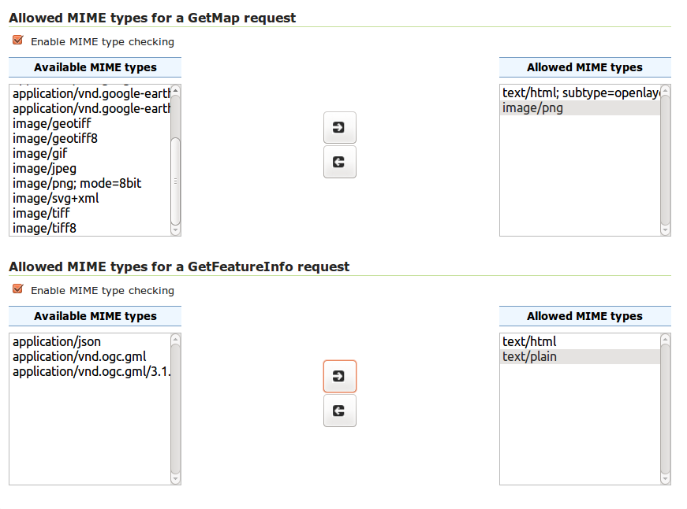

- Dynamic styling

  - 默认不勾选，即允许客户端可以通过请求参数来动态修改地图的样式，而无需重新加载整个地图

  - 假设你有一个名为 "mylayer" 的地图图层，在 GeoServer 中发布为 WMS 服务。该图层具有一些基本样式，如默认的颜色和线宽。

    如果启用了动态样式功能，你可以使用以下方式修改图层的样式：

    1. 默认样式：

       ```bash
       http://localhost:8080/geoserver/wms?service=WMS&version=1.1.0&request=GetMap&layers=mylayer&styles=&format=image/png
       ```

    2. 修改样式：

       ```bash
       http://localhost:8080/geoserver/wms?service=WMS&version=1.1.0&request=GetMap&layers=mylayer&styles=redline&format=image/png
       ```

    在第二个示例中，通过在请求参数中指定 `styles=redline`，客户端请求将使用名为 "redline" 的样式来渲染图层。这样就实现了在不重新加载整个地图的情况下，动态修改图层样式的效果。

    启用动态样式功能可以使客户端根据需求实时修改地图的外观，而无需为每个样式创建不同的地图图层。这提供了更灵活和交互性的地图展示和样式修改方式。

- GetFeatureInfo results reprojection

  - 默认不勾选禁用，当不被禁用时，GeoServer 将在获取要素信息时，将结果重投影到与请求指定的坐标参考系统（CRS）相同的坐标参考系统。这样可以确保返回的要素信息与请求的坐标参考系统一致。

  - 勾选状态，即被禁用。GeoServer 不会对获取的要素信息进行重投影。结果将保持在存储数据的原始坐标参考系统中。

  - 假设GeoServer 发布了一个名为 "mylayer" 的地图图层，它使用了一个特定的坐标参考系统（CRS）。

    当在地图上点击某个位置，并发出 "GetFeatureInfo" 请求时，可以通过以下两种设置获得不同的结果：

    1. "Reproject to requested CRS" 设置为选中： 请求示例：

       ```bash
       http://localhost:8080/geoserver/wms?service=WMS&version=1.1.0&request=GetFeatureInfo&layers=mylayer&styles=&format=image/png&transparent=true&query_layers=mylayer&info_format=text/plain&feature_count=5&srs=EPSG:4326&bbox=...
       ```

       在这种设置下，GeoServer 将根据请求中的 `srs=EPSG:4326` 参数，将获取到的要素信息重投影到 EPSG:4326 坐标参考系统。

    2. "Do not reproject" 设置为选中： 请求示例：

       ```bash
       http://localhost:8080/geoserver/wms?service=WMS&version=1.1.0&request=GetFeatureInfo&layers=mylayer&styles=&format=image/png&transparent=true&query_layers=mylayer&info_format=text/plain&feature_count=5&srs=EPSG:4326&bbox=...&reproject=false
       ```

       在这种设置下，GeoServer 将保持获取到的要素信息在原始坐标参考系统中，不进行重投影。

- GetFeatureInfo results auto-escaping

  - 默认不勾选，建议勾选

    - 勾选时：GeoServer 将自动转义要素信息中的特殊字符。这样可以确保返回的要素信息在显示时不会被解释为 HTML 标签或其他特殊字符，而是作为纯文本进行显示
    - 未勾选：选择此选项时，GeoServer 不会对获取的要素信息进行自动转义。结果将按原样返回，包括其中的特殊字符

  - 假设 GeoServer 发布了一个名为 "mylayer" 的地图图层，它包含一些要素信息，其中包含特殊字符如 `<`, `>`, `&`。

    当在地图上点击某个位置，并发出 "GetFeatureInfo" 请求时，可以通过以下两种设置获得不同的结果：

    1. "Enable auto-escaping" 设置为选中： 请求示例：

       ```bash
       http://localhost:8080/geoserver/wms?service=WMS&version=1.1.0&request=GetFeatureInfo&layers=mylayer&styles=&format=image/png&transparent=true&query_layers=mylayer&info_format=text/html&feature_count=5&...
       ```

       在这种设置下，GeoServer 将自动转义要素信息中的特殊字符，以确保它们在 HTML 页面中正确显示。例如，`<` 转义为 `<`，`>` 转义为 `>`，`&` 转义为 `&`。

    2. "Disable auto-escaping" 设置为选中： 请求示例：

       ```bash
       http://localhost:8080/geoserver/wms?service=WMS&version=1.1.0&request=GetFeatureInfo&layers=mylayer&styles=&format=image/png&transparent=true&query_layers=mylayer&info_format=text/html&feature_count=5&escape=false&...
       ```

       在这种设置下，GeoServer 不会对获取到的要素信息进行自动转义，结果将按原样返回。


## 五、Data Management

> 


## 六、Styling

> 


## 七、Services

> 


## 八、Filtering

> 


## 九、Server configuration

> 


## 十、GeoServer data directory

> 


## 十一、Running in a production environment

> 


## 十二、REST

> 


## 十三、Security

> 


## 十四、GeoWebCache

> 


## 十五、Extensions

> 


## 十六、Community modules

> 


## 十七、Tutorials

> 
