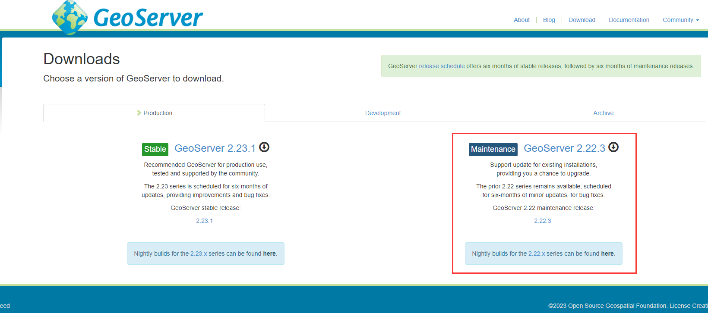
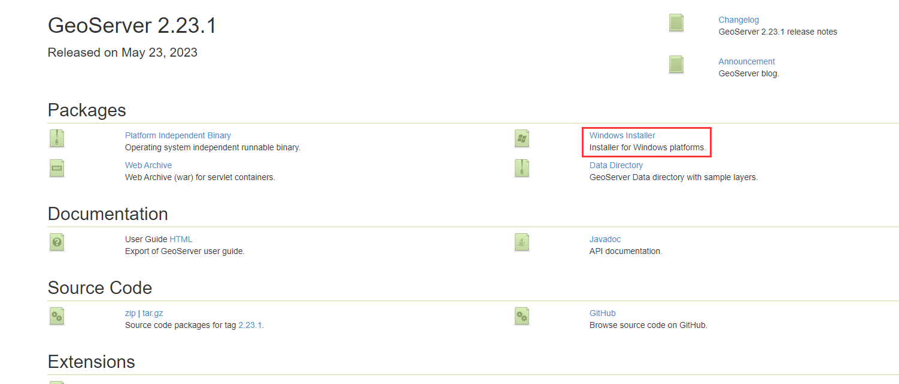
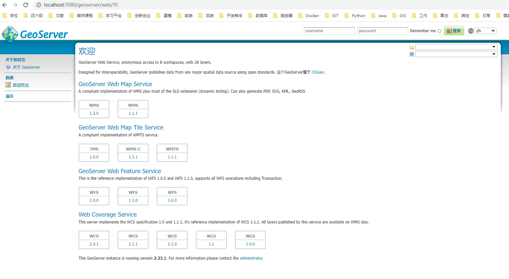

# GeoServer入门

> 官方链接：https://docs.geoserver.org/ 

## 一、官网介绍

### About

提供了关于GeoServer项目的概述和背景信息。它包括GeoServer的简介、其开源性质、支持的功能和标准，以及与其他地理空间技术的集成等内容。这里还提供了关于GeoServer团队、项目历史和发展的信息。

### Blog

提供了有关GeoServer的最新动态、新功能、版本发布和其他相关新闻的文章。在博客上，你可以找到各种有关GeoServer的实际应用案例、技术教程、插件介绍以及开发者社区的贡献等内容。

### Download

可以找到不同版本的GeoServer，包括稳定版本和开发版本。还提供了各种不同操作系统和平台的安装包和二进制文件，以及与GeoServer相关的扩展和插件的下载链接。

### Documentation

`详细的GeoServer用户文档和开发者文档。用户文档包括有关GeoServer的安装、配置、数据发布、样式设计、WMS和WFS服务的使用等方面的详细指南和教程。开发者文档则提供了有关GeoServer的API文档、扩展开发指南、数据存储集成等更深入的技术资料`。

### Community

GeoServer的社区页面，提供了与GeoServer相关的社区交流和支持渠道。包括用户邮件列表、开发者邮件列表、IRC聊天室、用户组、开发者文档和代码库等资源。`可以与其他GeoServer用户和开发者交流、提问问题、分享经验和参与贡献。`

## 二、Documentation

### User Manual

> 提供安装说明和应用参考的用户手册。

`本部分内容较多，且重要，请详见GeoServer User Manual说明文档`

### Developer Manual

> 开发者手册

不是重点，略

### Documentation Manual

> 探索GeoServer功能的分步教程。

不是重点，略

### Release Versions

> 向新用户介绍常见任务的快速教程。

不是重点，略

## 三、Download

### Production

> 适用于生产环境的稳定版本

- Stable

  - 推荐用于生产的GeoServer， 受到社区的测试和支持。 2.23系列计划于 更新，提供改进和错误修复。 GeoServer稳定版本（**具体情况要看自己的操作系统**）

  :warning: 最新版本2.23.1是 2023年5月23日发行的，需借助JAVA17的JDK，暂不推荐使用，存在BUG

  详细安装教程 https://docs.geoserver.org/latest/en/user/installation/win_installer.html

- Maintenance`采用这个`

  - 支持现有安装的更新， 提供升级的机会。最新版本的前一个版本

    

    

    

### Development

> 这是GeoServer正在积极开发的版本，包含了最新的功能和改进，但可能会存在一些未经验证的功能或潜在的问题

