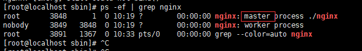
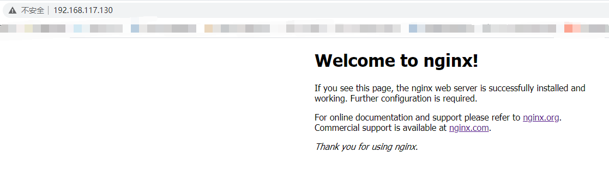
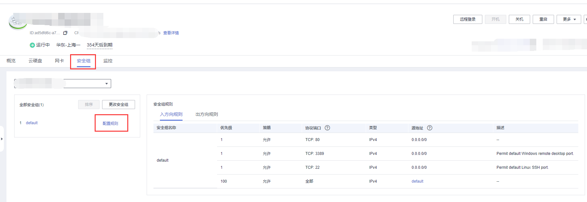
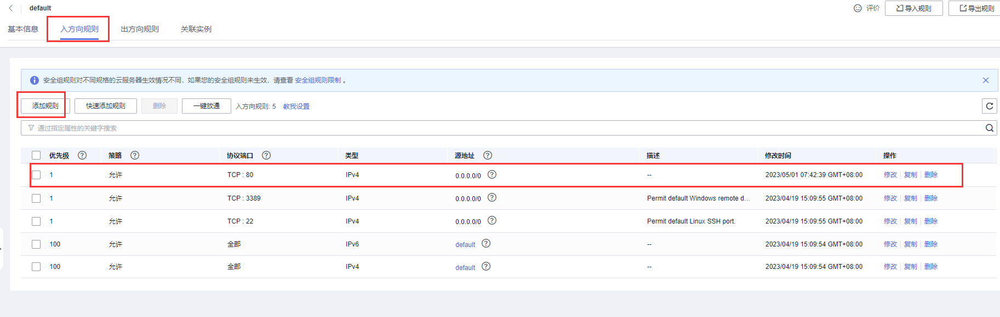
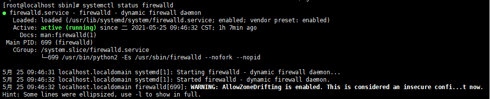
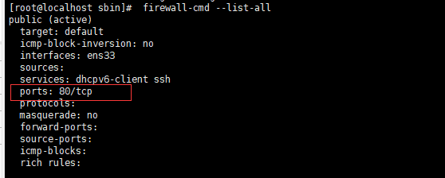

# linux服务器

## yum

### 定义

“yum,是Yellow dog Updater Modified的简称,起初是由yellow dog这一发行版的开发者Terra Soft研发,用python写成,那时还叫做yup(yellow dog updater),后经杜克大学的Linux@Duke开发团队进行改进,遂有此名。

### 作用

添加/删除/更新RPM/rpm包，能自动解决包的依赖性问题

- RPM管理支持事务机制。增强了程序安装卸载的管理。
- RPM的功能：打包、安装、查询、升级、卸载、校验、数据库管理。


## wget

### 定义

Wget是一个从网络上自动下载文件的自由工具,它支持HTTP,HTTPS和FTP协议,可以使用HTTP代理;Wget主要用于成批量地下载Internet网站上的文件,或制作远程网站的镜像。


## tar

### 作用：压缩解压命令

tar xzvf 压缩文件名称.tar.gz 文件或者目录名称

x是解压

**如果文件后缀是.tar 用tar xvf来解压**

**如果文件后缀是.tar.gz 用tar xzvf来解压**

**如果文件后缀是.tar.bz 用tar xjvf来解压**


## ./文件名，如./nginx

作用： 执行文件


### Linux安装nginx

> **在linux下安装nginx，首先需要安装 gcc-c++编译器。然后安装nginx依赖的pcre和zlib包。最后安装nginx即可。**
>
> **ls查看当前文件夹**

1.先安装gcc-c++编译器

```java
yum install gcc-c++
yum install -y openssl openssl-devel
```

2.再安装pcre包

```java
yum install -y pcre pcre-devel
```

3.再安装zlib包

```java
yum install -y zlib zlib-devel
```

> **下面进行nginx的安装**

1.在/usr/local/下创建文件nginx文件

```java
mkdir /usr/local/nginx
```

2.在网上下nginx包上传至Linux（https://nginx.org/download/），也可以直接下载

```java
wget https://nginx.org/download/nginx-1.19.9.tar.gz
```

3.解压并进入nginx目录

```java
tar -zxvf nginx-1.19.9.tar.gz
cd nginx-1.19.9
```

4.使用nginx默认配置

```java
./configure
```

5.编译安装

```java
make
make install
```

6.查找安装路径

```java
whereis nginx
```

7.进入sbin目录，可以看到有一个可执行文件nginx，直接**./nginx**执行就OK了。

```bash
./nginx
```

9.查看是否启动成功

```java
ps -ef | grep nginx
```



10.然后在网页上访问自己的IP就可以了默认端口为80（出现如下欢迎界面就成功了！）



> 如果此时无法访问部署的页面，可能是ECS没有将安全组的80协议端口打开，如下操作步骤打开即可





> **注意问题**

如以上步骤都完成且没有问题的话，就做如下操作

> 防火墙

```java
查看防火墙是否开启
systemctl status firewalld
```



启动防火墙后，默认没有开启任何端口，需要手动开启端口。**nginx默认是80端口**

```Java
手动开启端口命令
firewall-cmd --zone=public --add-port=80/tcp --permanent
命令含义： --zone #作用域 --add-port=80/tcp #添加端口，格式为：端口/通讯协议 --permanent #永久生效，没有此参数重启后失效
```

开启后需要重启防火墙才生效

```java
systemctl restart firewalld.service
```

查看防火墙是否开启了80端口的访问

```java
 firewall-cmd --list-all
```



> **开启后再次访问！！**

