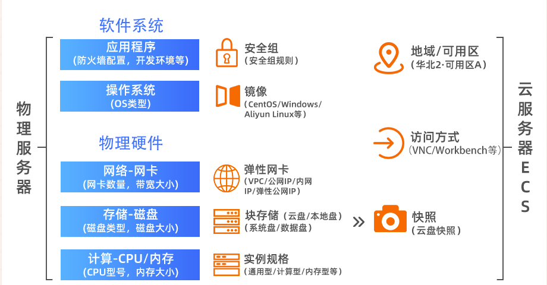

# 阿里云

## 一、云服务器ECS

### 1、组成

1. 实例
   - 等同于一台虚拟服务器，内含vCPU、内存、操作系统、网络配置、磁盘等基础计算组件
     - vCPU: virtual central processing unit 虚拟处理器
2. 镜像
   - 等同于”装机盘“，为ECS实例提供了操作系统和预装的软件
3. 块存储
   - 分布式数据存储设备，用于数据存储，可随机读写
4. 安全组
   - 虚拟防火墙，划分安全隔离区域，实现网络访问控制`【在线网站必开】`
5. 快照
   - 某一时间点云盘的实时副本，常用于数据备份或恢复，制作镜像
6. 网络
   - 专有网络VPC
     - VPC: virtual private cloud

### 2、ECS常用操作导航 

https://help.aliyun.com/document_detail/25429.html?spm=a2c4g.11186623.0.0.654c28f8bcCMTh