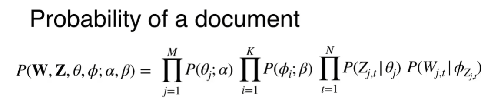
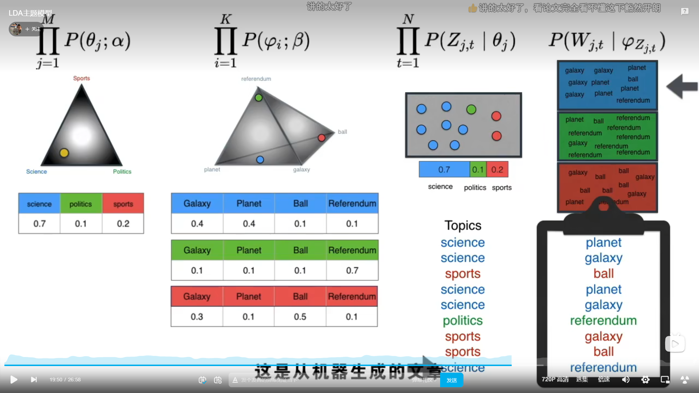
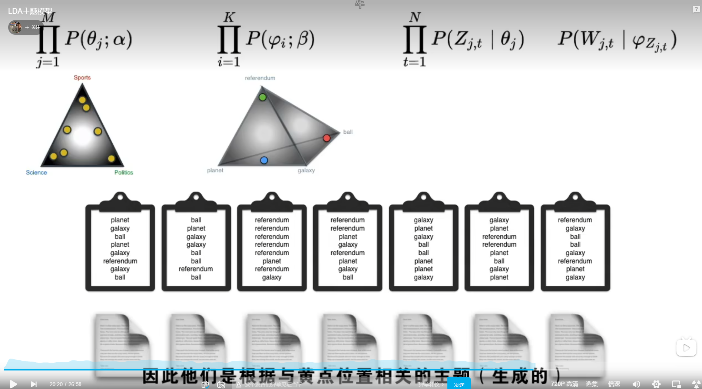
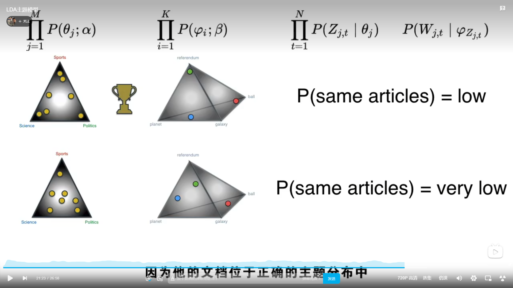
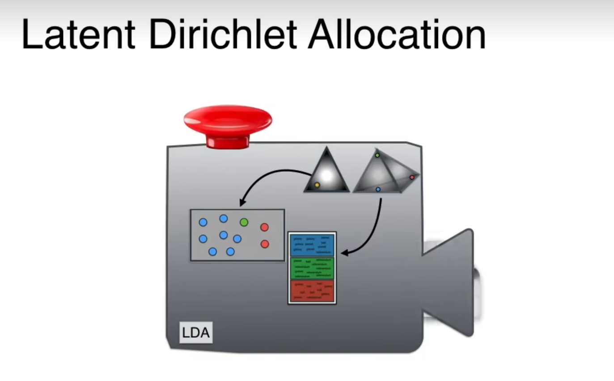
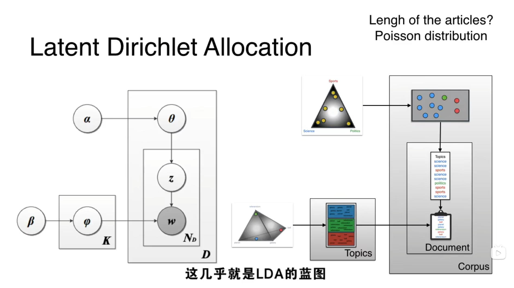
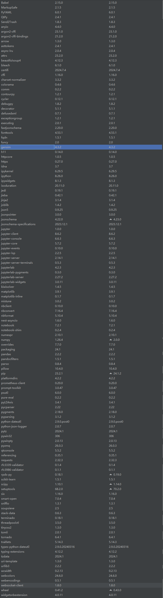
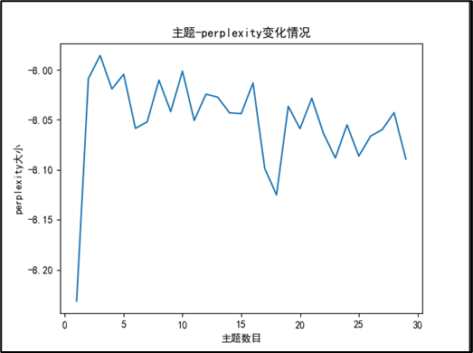
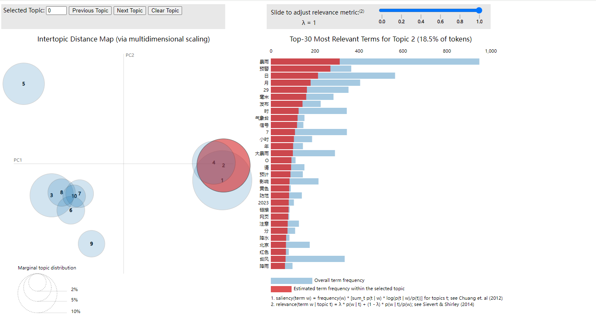

# LDA

> https://www.bilibili.com/video/BV1wB4y18724/?spm_id_from=333.880.my_history.page.click&vd_source=c3aed98126d5ffa7b2c72cf011d9383c
>

## 一、原理步骤

> 步骤总结：
>
> 1、自行确定主题个数
>
> 2、所有文章放进第一个狄利克雷图形中，则每篇文章都有一个最大概率偏向一个主题
>
> 3、每篇文章偏向特定主题表示：该文章内容中的词语大多数和这个主题相关，只是目前不知道这些词具体是哪些
>
> 4、探寻这些词的具体内容：把所有文章所有词放进一个N维空间，之后把主题点放进该空间，则每个词属于特定空间会有一个概率值，该概率值受该词与主题点的距离，因此会得到一个二维矩阵——矩阵的每个主题，所有词都有一个概率值（大概率不同）
>
> 5、再回到原文章，因为词内容不确定。针对内部词语的概率分布，从上述二维矩阵中取最大概率词填充。指导最终填充出一个新文章。
>
> 6、判定新文章与原文章是否相同/相似，如果相同/相似，则两个狄利克雷分布合适。否则继续划分。














## 二、应用过程-gensim

> 原文章：[https://blog.csdn.net/weixin_41168304/article/details/122389948?ops_request_misc=%257B%2522request%255Fid%2522%253A%2522172016325616800215045691%2522%252C%2522scm%2522%253A%252220140713.130102334..%2522%257D&request_id=172016325616800215045691&biz_id=0&utm_medium=distribute.pc_search_result.none-task-blog-2~all~top_positive~default-1-122389948-null-null.142](https://blog.csdn.net/weixin_41168304/article/details/122389948?ops_request_misc=%7B%22request%5Fid%22%3A%22172016325616800215045691%22%2C%22scm%22%3A%2220140713.130102334..%22%7D&request_id=172016325616800215045691&biz_id=0&utm_medium=distribute.pc_search_result.none-task-blog-2~all~top_positive~default-1-122389948-null-null.142)^v100^control&utm_term=LDA&spm=1018.2226.3001.4187

### 2.1 简介


### 2.2 使用



```python
import gensim
from gensim import corpora
import matplotlib.pyplot as plt
import matplotlib
import numpy as np
import warnings
from gensim.models.coherencemodel import CoherenceModel
from gensim.models.ldamodel import LdaModel
warnings.filterwarnings('ignore')  # To ignore all warnings that arise here to enhance clarity


def readFile(file):
    file_object2 = open(file, encoding='utf-8', errors='ignore').read().split('\n')  # 一行行的读取内容
    data_set = []  # 建立存储分词的列表
    for i in range(len(file_object2)):
        result = []
        seg_list = file_object2[i].split()
        for w in seg_list:  # 读取每一行分词
            result.append(w)
        data_set.append(result)
    return data_set


# 计算困惑度
def perplexity(num_topics):
    ldamodel = LdaModel(corpus, num_topics=num_topics, id2word=dictionary, passes=30)
    print(ldamodel.print_topics(num_topics=num_topics, num_words=15))
    print(ldamodel.log_perplexity(corpus))
    return ldamodel.log_perplexity(corpus)


# 计算coherence
def coherence(num_topics):
    ldamodel = LdaModel(corpus, num_topics=num_topics, id2word=dictionary, passes=30, random_state=1)
    print(ldamodel.print_topics(num_topics=num_topics, num_words=10))
    ldacm = CoherenceModel(model=ldamodel, texts=fileContent, dictionary=dictionary, coherence='c_v')
    print(ldacm.get_coherence())
    return ldacm.get_coherence()


if __name__ == '__main__':
    PATH = "F:/毕业设计/2、硕士毕业设计/6、Project/jieba/分词结果/0729_output.csv"
    fileContent = readFile(PATH)
    dictionary = corpora.Dictionary(fileContent)  # 构建词典
    corpus = [dictionary.doc2bow(text) for text in fileContent]  # 表示为第几个单词出现了几次

    # 困惑度
    # x = range(1, 30)
    # z = [perplexity(i) for i in x]  #如果想用困惑度就选这个
    # # y = [coherence(i) for i in x]
    # plt.plot(x, z)
    # plt.xlabel('主题数目')
    # plt.ylabel('perplexity大小')
    # plt.rcParams['font.sans-serif'] = ['SimHei']
    # matplotlib.rcParams['axes.unicode_minus'] = False
    # plt.title('主题-perplexity变化情况')
    # plt.show()

    # 查看具体主题最靠前的关键词
    lda = LdaModel(corpus=corpus, id2word=dictionary, num_topics=10, passes=30, random_state=1)
    # print(lda.print_topics(num_topics=10, num_words=15))

    # 导出网页
    # import pyLDAvis.gensim
    # data = pyLDAvis.gensim.prepare(lda, corpus, dictionary, n_jobs=1)
    # pyLDAvis.display(data, local=True)
    # pyLDAvis.save_html(data, 'F:/毕业设计/2、硕士毕业设计/6、Project/jieba/分词结果/0728_topic.html')
    # pyLDAvis.save_html(data, 'F:/毕业设计/2、硕士毕业设计/6、Project/jieba/分词结果/0728_other_topic.html')

```

困惑度曲线



导出网页截图


