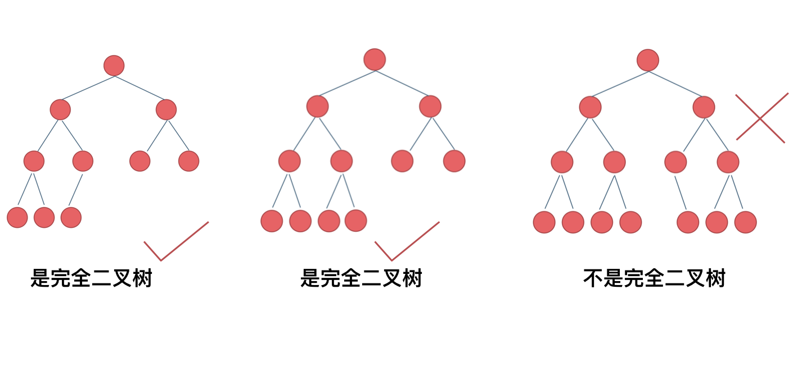
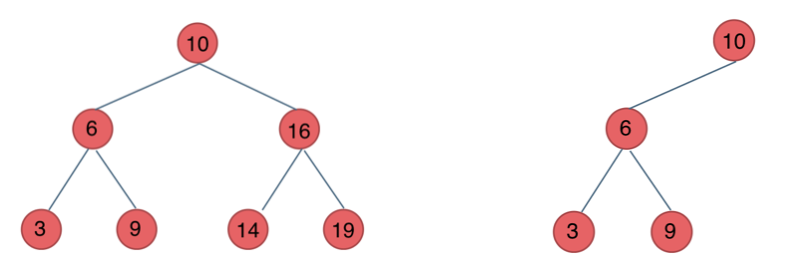
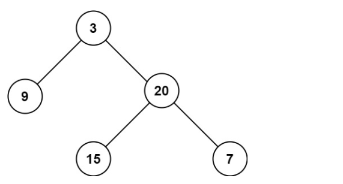

# 二叉树

## 一、主要类型

### 1.1 满二叉树

概念：若一棵二叉树只有度为0的结点和度为2的结点，并且度为0的结点在同一层上，则这棵二叉树为满二叉树。

特点：

- 深度为k，则有2^k - 1 个节点


### 1.2 完全二叉树

概念：在完全二叉树中，除了最底层节点可能没填满外，其余每层节点数都达到最大值，并且最下面一层的节点都集中在该层最左边的若干位置。若最底层为第 h 层（h从1开始），则该层包含 1~ 2^(h-1) 个节点。



### 1.3 二叉搜索树

**二叉搜索树是一个有序树**。

特点：

- 若它的左子树不空，则左子树上所有结点的值均小于它的根结点的值；
- 若它的右子树不空，则右子树上所有结点的值均大于它的根结点的值；
- 它的左、右子树也分别为二叉排序树



### 1.4 平衡二叉搜索数

概念：是一棵空树或它的左右两个子树的高度差的绝对值不超过1，并且左右两个子树都是一棵平衡二叉树。


## 二、存储方式

### 2.1 链式存储（常用）

通过指针把分布在各个地址的节点串联一起


```javascript
function TreeNode(val, left, right) {
    this.val = (val===undefined ? 0 : val)
    this.left = (left===undefined ? null : left)
    this.right = (right===undefined ? null : right)
}
```

### 2.2 数组存储

如果父节点的数组下标是 i，那么它的左孩子就是 i \* 2 + 1，右孩子就是 i \* 2 + 2。


## 三、遍历方式

### 3.1 深度优先遍历

先往深走，遇到叶子节点再往回走。

- 前序遍历--中左右
- 中序遍历--左中右
- 后序遍历--左右中


#### 3.1.1 [前序遍历--中左右](https://leetcode.cn/problems/binary-tree-preorder-traversal/description/)

给你二叉树的根节点 `root` ，返回它节点值的 **前序** 遍历。

**输入：**root = [1,null,2,3]

**输出：**[1,2,3]

**解释：**


**示例 2：**

**输入：**root = [1,2,3,4,5,null,8,null,null,6,7,9]

**输出：**[1,2,4,5,6,7,3,8,9]

**解释：**


思路

- 中左右，递归遍历
- val   `不是value`  :bulb:

```javascript
/**
 * Definition for a binary tree node.
 * function TreeNode(val, left, right) {
 *     this.val = (val===undefined ? 0 : val)
 *     this.left = (left===undefined ? null : left)
 *     this.right = (right===undefined ? null : right)
 * }
 */
/**
 * @param {TreeNode} root
 * @return {number[]}
 */
var preorderTraversal = function(root) {
    let res = []
    const deepFirstTraversal = function(node){
        if(!node) return []
        res.push(node.val)
        deepFirstTraversal(node.left)
        deepFirstTraversal(node.right)
    }
    deepFirstTraversal(root)
    return res
};
```


#### 3.1.2 [中序遍历--左中右](https://leetcode.cn/problems/binary-tree-inorder-traversal/description/)


**输入：**root = [1,null,2,3]

**输出：**[1,2,3]

**解释：**


**示例 2：**

**输入：**root = [1,2,3,4,5,null,8,null,null,6,7,9]

**输出：**[1,2,4,5,6,7,3,8,9]

**解释：**


思路

- 左中右，递归遍历

```javascript
/**
 * Definition for a binary tree node.
 * function TreeNode(val, left, right) {
 *     this.val = (val===undefined ? 0 : val)
 *     this.left = (left===undefined ? null : left)
 *     this.right = (right===undefined ? null : right)
 * }
 */
/**
 * @param {TreeNode} root
 * @return {number[]}
 */
var inorderTraversal = function(root) {
    let res = []
    const deepFirstTraversal = function(node){
        if(!node) return res
        deepFirstTraversal(node.left)
        res.push(node.val)
        deepFirstTraversal(node.right)
    }
    deepFirstTraversal(root)
    return res
};
```


#### 3.1.3 [后序遍历--左右中](https://leetcode.cn/problems/binary-tree-postorder-traversal/description/)

给定二叉树的根节点，返回其节点值的后序遍历

**输入：**root = [1,null,2,3]

**输出：**[1,2,3]

**解释：**


**示例 2：**

**输入：**root = [1,2,3,4,5,null,8,null,null,6,7,9]

**输出：**[1,2,4,5,6,7,3,8,9]

**解释：**


思路

- 左右中，递归遍历

```javascript
/**
 * Definition for a binary tree node.
 * function TreeNode(val, left, right) {
 *     this.val = (val===undefined ? 0 : val)
 *     this.left = (left===undefined ? null : left)
 *     this.right = (right===undefined ? null : right)
 * }
 */
/**
 * @param {TreeNode} root
 * @return {number[]}
 */
var postorderTraversal = function(root) {
    let res = []
    const deepFirstTraversal = function(node){
        if(!node) return []
        deepFirstTraversal(node.left)
        deepFirstTraversal(node.right)
        res.push(node.val)
    }
    deepFirstTraversal(root)
    return res
};
```

#### 3.1.4 最大深度值

##### 题目描述

返回给定二叉树的最大深度

##### 示例

输入：root = [3,9,20,null,null,15,7]

输出：3



```javascript
/**
 * @param {TreeNode} root
 * @return {number}
 */
var maxDepth = function(root) {
    if(!root){
        return 0
    } else{
        const left = maxDepth(root.left)
        const right = maxDepth(root.right)
        return Math.max(left, right) + 1
    }
};
```


### 3.2 广度优先遍历

- 层次遍历（迭代法）

