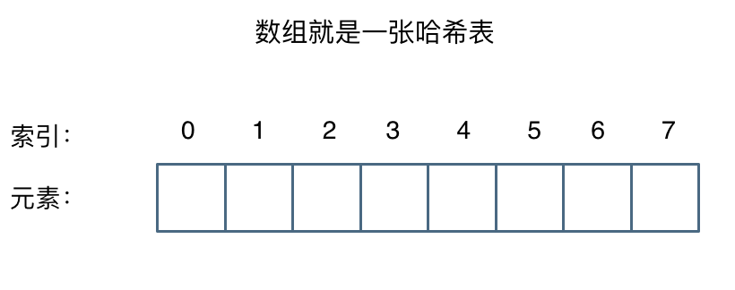

# 哈希表

## 一、哈希表概论

> - 建立 key-value 映射
> - 在 O(1) 时间查找

其实数组就是一张哈希表。哈希表中`关键码`就是`数组的索引下标`，然后通过下标直接访问数组中的元素，如下图所示：



:bulb: 哈希表也称为散列表


## 二、例题

### 2.1 [有效的字母异位词](https://leetcode.cn/problems/valid-anagram/description/)

给定两个字符串 `s` 和 `t` ，编写一个函数来判断 `t` 是否是 `s` 的 字母异位词

:bulb: 字母异位词：字母异位词是通过重新排列不同单词或短语的字母而形成的单词或短语，并使用所有原字母一次。

**示例 1:**

```
输入: s = "anagram", t = "nagaram"
输出: true
```

思路

- 首先判断两者长度, 不同返回 false
- 遍历 s, 哈希表存储字符出现数量
- 遍历 t, 减去对应字符出现数量
  - map里面键值是否为0，是则false，否则挨个减
  - 如果都判断存在且大于0，最终返回true

```typescript
//用数组存储26个字符及数量
var isAnagram = function(s, t) {
    if(s.length !== t.length) return false
    let arr = new Array(26).fill(0)
    for(let item of s){
        arr[item.charCodeAt() - 'a'.charCodeAt()]++
    }
    for(let item of t){
        if(!arr[item.charCodeAt() - 'a'.charCodeAt()]) return false
        arr[item.charCodeAt() - 'a'.charCodeAt()]--
    }
    return true
};

//哈希表存储字符及数量，更优
var isAnagram = function(s, t) {
  if(s.length !== t.length) return false //保证字符串数量一致
    let map = new Map()
    for(let item of s){
        map.set(item, (map.get(item) || 0) + 1)
    }
    for(let item of t){
        if(!map.get(item)) return false
        map.set(item, map.get(item)-1)
    }
    return true
};
```


### 2.2 [两个数组的交集](https://leetcode.cn/problems/intersection-of-two-arrays/description/)

给定两个数组 `nums1` 和 `nums2` ，返回 它们的 交集。输出结果中的每个元素一定是 **唯一** 的。我们可以 **不考虑输出结果的顺序** 。

**示例 1：**

```
输入：nums1 = [1,2,2,1], nums2 = [2,2]
输出：[2]
```

**示例 2：**

```
输入：nums1 = [4,9,5], nums2 = [9,4,9,8,4]
输出：[9,4]
解释：[4,9] 也是可通过的
```


思路

- set去重
- 判断是否存在并添加到new resSet
- Array.from(resSet)

```javascript
var intersection = function(nums1, nums2) {
    if(nums1.length < nums2.length){
        const _ = nums1
        nums1 = nums2
        nums2 = _
    }
    let nums1Set = new Set(nums1)
    let resSet = new Set()
    for(let i = 0; i < nums2.length; i++){
        nums1Set.has(nums2[i]) && resSet.add(nums2[i])
    }
    return Array.from(resSet)
};
```

