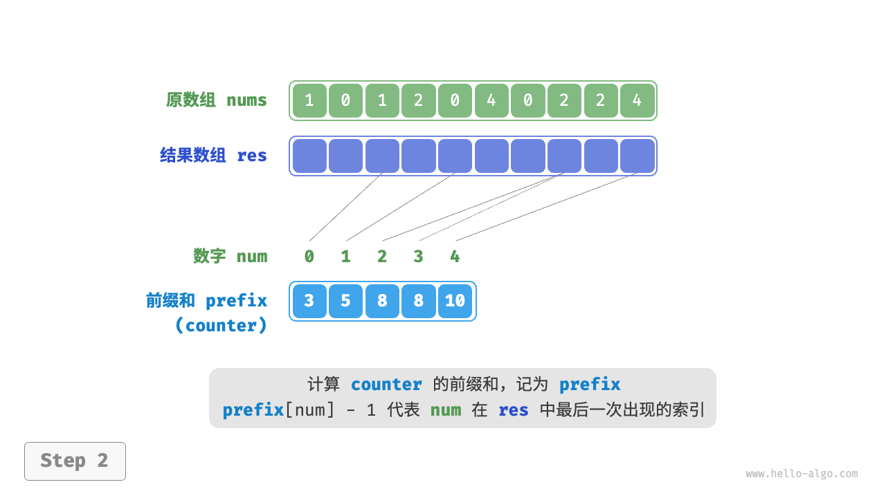
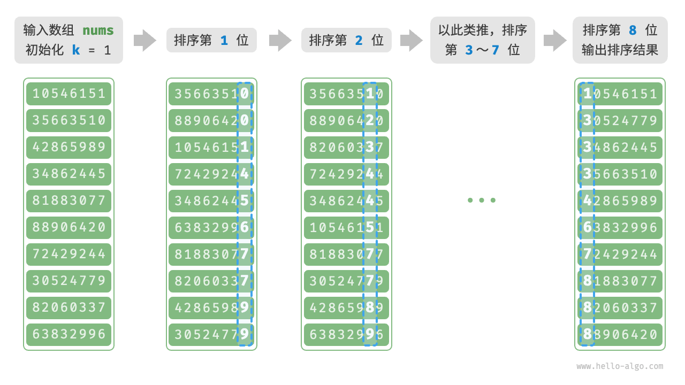
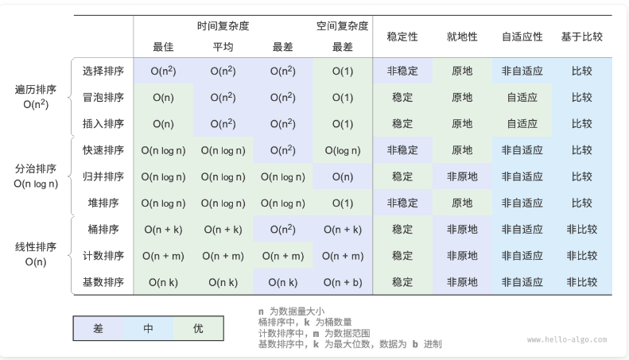

# 数组理论基础

## 一、概论

一维数组

- 相同类型元素
- 线性数据结构
  - **数组下标都是从0开始的。**


优点：

查询时间复杂度O(1)


缺点：

插入删除时间复杂度高，O(n)

## 二、基础题目

### 轮转数组

场景： [189](https://leetcode.cn/problems/rotate-array/description/)

```
输入 nums = [1,2,3,4,5,6,7], k = 3
输出 [5,6,7,1,2,3,4]
```


思路：

- 数组元素向右移动 k 次后;
- 尾部 k mod n 个元素移动至头部, 其余后移 k mod n 个位置;
- 翻转思路;
  - 首先反转数组;
  - 其次反转 `[0, k % n - 1]`;
  - 最后反转 `[k % n, n - 1]`;

```javascript
const reverse = (nums, start, end) => {
  while (start < end) {
    const temp = nums[start];
    nums[start] = nums[end];
    nums[end] = temp;
    start += 1;
    end -= 1;
  }
};

const rotate = function (nums, k) {
  k %= nums.length;
  reverse(nums, 0, nums.length - 1);
  reverse(nums, 0, k - 1);
  reverse(nums, k, nums.length - 1);
};
```

- 时间: O(n);
- 空间: O(1);


### 只出现1次的元素

场景：


思路：

- 基于位运算中的异或操作;
- 遍历数组, 递归进行异或操作, 最终值即只出现一次的元素
  - 一个数和 0 做 XOR 运算等于本身：a⊕0 = a
  - 一个数和其本身做 XOR 运算等于 0：a⊕a = 0
  - XOR 运算满足交换律和结合律：a⊕b⊕a = (a⊕a)⊕b = 0⊕b = b

```javascript
/**
 * @param {number[]} nums
 * @return {number}
 */
var singleNumber = function (nums) {
  let ans = nums[0];
  for (let i = 1; i < nums.length; i++) {
    ans ^= nums[i];
  }
  return ans;
};
```

- 时间: O(n);
- 空间: O(1);

## 二、数组排序

以下排序方式   都可变数组为有序排列

### 选择排序

[场景](https://leetcode.cn/problems/sort-an-array/description/)

给你一个整数数组 `nums`，请你将该数组升序排列

原理

- 数组长度为 n;
- 选择 [0, n-1] 中最小的元素, 与 0 处元素交换;
- 选择 [1, n-1] 中最小的元素, 与 1 处元素交换;
- 依次类推, 重复 n - 1 轮;

```javascript
/* 选择排序 */
function selectionSort(nums: number[]): void {
  let n = nums.length;
  // 外循环: 未排序区间为 [i, n-1]
  for (let i = 0; i < n - 1; i++) {
    // 内循环: 找到未排序区间内的最小元素
    let k = i;
    for (let j = i + 1; j < n; j++) {
      if (nums[j] < nums[k]) {
        k = j; // 记录最小元素的索引
      }
    }
    // 将该最小元素与未排序区间的首个元素交换
    [nums[i], nums[k]] = [nums[k], nums[i]];
  }
  return nums
}
```

- 时间: O(n^2);
- 空间: O(1);


### 冒泡排序

场景

[912](https://leetcode.cn/problems/sort-an-array/description/)

工作原理

- 从数组最左端开始向右遍历, 若'左元素>右元素', 交换两者;
- 数组长度为 n;
- 首先对 n 个元素进行冒泡, 最大元素交换至最后位置;
- 其次对 n -1 个元素进行冒泡, 第二大元素交换至倒数第二位置;
- 依次类推, 重复 n - 1 轮;

```javascript
/* 冒泡排序 */
function bubbleSort(nums: number[]): void {
  // 外循环: 未排序区间为 [0, i]
  for (let i = nums.length - 1; i > 0; i--) {
    // 内循环: 将未排序区间 [0, i] 中的最大元素交换至该区间的最右端
    for (let j = 0; j < i; j++) {
      if (nums[j] > nums[j + 1]) {
        // 交换 nums[j] 与 nums[j + 1]
        let tmp = nums[j];
        nums[j] = nums[j + 1];
        nums[j + 1] = tmp;
      }
    }
  }
}
```

- 时间：O(n^2)
- 空间：O(1)

### 插入排序

- 数组长度为 n;
- 数组第 1 个元素已完成排序;
- 选取数组第 2 个元素, 与排序部分 (第 1 个元素) 比较, 插入正确位置;
- 选取数组第 3 个元素, 与排序部分 (前 2 个元素) 比较, 插入正确位置;
- 依次类推, 重复 n - 1 次;

```javascript
/* 插入排序 */
function insertionSort(nums: number[]): void {
  // 外循环: 已排序元素数量为 1, 2, ..., n
  for (let i = 1; i < nums.length; i++) {
    const base = nums[i];
    let j = i - 1;
    // 内循环: 将 base 插入到已排序部分的正确位置
    while (j >= 0 && nums[j] > base) {
      nums[j + 1] = nums[j]; // 将 nums[j] 向右移动一位
      j--;
    }
    nums[j + 1] = base; // 将 base 赋值到正确位置
  }
}
```


### 希尔排序

- 插入排序的改进;
- 按照一定间隔, 划分为若干数组, 对子数组进行插入排序;
- 不断缩小间隔, 递归执行上一步, 直至间隔为 1;

```javascript
const shellSort = (nums) => {
  let gap = Math.floor(nums.length / 2);

  while (gap > 0) {
    for (let i = gap; i < nums.length; i++) {
      const base = nums[i];
      let j = i - gap;
      while (j >= 0 && nums[j] > base) {
        nums[j + gap] = nums[j];
        j -= gap;
      }
      nums[j + gap] = base;
    }
    gap = Math.floor(gap / 2);
  }
};
```

- 时间: n*log2n - n^2;
- 空间: 1


### 快速排序

哨兵划分

- 选取数组最左端作为 base, 两个标识符 start, end 执行数组两端;
- 首先 end 向左寻找第一个小于 base 的元素;
- 其次 start 向右寻找第一个大于 base 的元素;
- 交换两个元素;
- 重复以上步骤, 直至 start 和 end 相遇;
- base 设置为 start;
- 哨兵划分完成后, 数组被划分成三部分, 左子数组, 基准数, 右子数组, 且左子数组 < 基准数 < 右子数组;

快排

- 对原数组进行哨兵排序;
- 对左子数组和右子数组递归执行哨兵排序, 直至所有子数组长度为 1;

```javascript
/* 元素交换 */
swap(nums: number[], i: number, j: number): void {
    let tmp = nums[i];
    nums[i] = nums[j];
    nums[j] = tmp;
}

/* 哨兵划分 */
partition(nums: number[], left: number, right: number): number {
    // 以 nums[left] 为基准数
    let i = left,
        j = right;
    while (i < j) {
        while (i < j && nums[j] >= nums[left]) {
            j -= 1; // 从右向左找首个小于基准数的元素
        }
        while (i < j && nums[i] <= nums[left]) {
            i += 1; // 从左向右找首个大于基准数的元素
        }
        // 元素交换
        this.swap(nums, i, j); // 交换这两个元素
    }
    this.swap(nums, i, left); // 将基准数交换至两子数组的分界线
    return i; // 返回基准数的索引
}

/* 快速排序 */
quickSort(nums: number[], left: number, right: number): void {
    // 子数组长度为 1 时终止递归
    if (left >= right) {
        return;
    }
    // 哨兵划分
    const pivot = this.partition(nums, left, right);
    // 递归左子数组, 右子数组
    this.quickSort(nums, left, pivot - 1);
    this.quickSort(nums, pivot + 1, right);
}
```

时间：O(nlogn), 最差为 O(n^2);

空间：O(n)

### 归并排序

原理：

- 划分阶段;
  - 通过递归从中点划分数组;
  - 首先递归左子数组, 其次右子数组, 最后合并;
- 合并阶段;
  - 当子数组长度为 1 时终止递归;
  - 持续的将左右较短的有序数组排序并合并为较长的有序数组;

```javascript
/* 合并左子数组和右子数组 */
function merge(nums, left, mid, right) {
  // 左子数组区间为 [left, mid], 右子数组区间为 [mid+1, right]
  const tmp = new Array(right - left + 1);
  // 初始化左子数组和右子数组的起始索引
  let i = left;
  let j = mid + 1;
  let k = 0;
  // 当左右子数组都还有元素时, 进行比较并将较小的元素复制到临时数组中
  while (i <= mid && j <= right) {
    if (nums[i] <= nums[j]) {
      tmp[k++] = nums[i++];
    } else {
      tmp[k++] = nums[j++];
    }
  }
  // 将左子数组和右子数组的剩余元素复制到临时数组中
  while (i <= mid) {
    tmp[k++] = nums[i++];
  }
  while (j <= right) {
    tmp[k++] = nums[j++];
  }
  // 将临时数组 tmp 中的元素复制回原数组 nums 的对应区间
  for (k = 0; k < tmp.length; k++) {
    nums[left + k] = tmp[k];
  }
}

/* 归并排序 */
function mergeSort(nums, left, right) {
  // 终止条件
  if (left >= right) return; // 当子数组长度为 1 时终止递归
  // 划分阶段
  let mid = Math.floor((left + right) / 2); // 计算中点
  mergeSort(nums, left, mid); // 递归左子数组
  mergeSort(nums, mid + 1, right); // 递归右子数组
  // 合并阶段
  merge(nums, left, mid, right);
}
```

时间：O(nlongn)

空间：O(n)

### 堆排序

原理：

- 基于输入数组建立大顶堆;
- 堆顶元素和堆底元素交换, 交换完成后, 堆长度 -1, 排序元素长度 +1;
- 从顶到底执行自顶向下的交换操作, 重新建立堆;
- 循环执行以上 2 步, n-1 轮后完成数组排序;

```javascript
/* 堆的长度为 n , 从节点 i 开始, 从顶至底堆化 */
function siftDown(nums, n, i) {
  while (true) {
    // 判断节点 i, l, r 中值最大的节点, 记为 ma
    let l = 2 * i + 1;
    let r = 2 * i + 2;
    let ma = i;
    if (l < n && nums[l] > nums[ma]) {
      ma = l;
    }
    if (r < n && nums[r] > nums[ma]) {
      ma = r;
    }
    // 若节点 i 最大或索引 l, r 越界, 则无须继续堆化, 跳出
    if (ma === i) {
      break;
    }
    // 交换两节点
    [nums[i], nums[ma]] = [nums[ma], nums[i]];
    // 循环向下堆化
    i = ma;
  }
}

/* 堆排序 */
function heapSort(nums) {
  // 建堆操作: 堆化除叶节点以外的其他所有节点
  for (let i = Math.floor(nums.length / 2) - 1; i >= 0; i--) {
    siftDown(nums, nums.length, i);
  }
  // 从堆中提取最大元素, 循环 n-1 轮
  for (let i = nums.length - 1; i > 0; i--) {
    // 交换根节点与最右叶节点 (交换首元素与尾元素)
    [nums[0], nums[i]] = [nums[i], nums[0]];
    // 以根节点为起点, 从顶至底进行堆化
    siftDown(nums, i, 0);
  }
}
```

时间：O(nlongn)

空间：O(1)

### 桶排序

原理：

- 长度为 n 的整数数组;
- 初始化 k 个桶, 将 n 个元素分配到 k 个桶中;
- 对每个桶分别进行排序;
- 根据桶的大小合并结果;

```javascript
/* 桶排序 */
function bucketSort(nums, size) {
  // 初始化 k 个桶
  const k = Math.floor(nums.length / size);
  const buckets = [];
  for (let i = 0; i < k; i++) {
    buckets.push([]);
  }
  // 1. 将数组元素分配到各个桶中
  const min = Math.min(...nums);
  const range = Math.max(...nums) - min;
  // 判断数组长度或者数组是否都是一个值
  if (range === 0) return;
  for (const num of nums) {
    const i = Math.floor(((num - min) / range) * (k - 1));
    buckets[i].push(num);
  }
  // 2. 对各个桶执行排序
  for (const bucket of buckets) {
    // 使用内置排序函数, 也可以替换成其他排序算法
    bucket.sort((a, b) => a - b);
  }
  // 3. 遍历桶合并结果
  let i = 0;
  for (const bucket of buckets) {
    for (const num of bucket) {
      nums[i++] = num;
    }
  }
  return nums;
}
```

时间：O(n + k)

- 排序需要n
- 合并需要k

空间：O(n + k)

- k个桶
- n个元素

应用场景：针对有限范围内的数字, 或通过 hash 转换为数字;

### 计数排序

原理

- 给定长度 n 为整数数组 nums;
- 遍历数组, 找出最大数字 m, 创建一个 m + 1 的数组 counter;
- 统计 nums 中个数字出现的次数, counter[num] 对应 num 的出现次数;
- 基于 counter 生成前缀和 prefix;
  - prefix[i] = ∑j=1icounter[j]∑*j*=1*i**co**u**n**t**er*[*j*];
- 倒序遍历 nums;
  - `res[prefix[num]-1]=num`;
  - prefix[num] -= 1;





```javascript
/**
 * @param {number[]} nums
 * @return {number[]}
 */
var sortArray = function (nums) {
  const countingSort = (nums) => {
    const max = Math.max(...nums);
    const min = Math.min(...nums);

    const counters = new Array(max - min + 1).fill(0);
    for (const num of nums) {
      counters[num - min]++;
    }
    for (let i = 0; i < counters.length - 1; i++) {
      counters[i + 1] += counters[i];
    }

    const res = new Array(nums.length);
    for (let i = 0; i < nums.length; i++) {
      const value = nums[i];
      res[counters[value - min] - 1] = value;
      counters[value - min]--;
    }
    for (let i = 0; i < nums.length; i++) {
      nums[i] = res[i];
    }
  };

  countingSort(nums);

  return nums;
};
```

时间：O(n + m)

空间：O(n + m)

应用场景：正整数数组，数据量大但数据范围小

### 基数排序

原理：

- 核心原理同计数排序, 在计数排序的基础上, 理由数字各位的递进关系, 依次对每一位进行排序;
- 初始化 k = 1;
- 对数字第 k 位进行计数排序;
- k + 1, 重复上一步骤, 直至所有为排序完成



```javascript
/* 获取元素 num 的第 k 位, 其中 exp = 10^(k-1) */
function digit(num, exp) {
  // 传入 exp 而非 k 可以避免在此重复执行昂贵的次方计算
  return Math.floor(num / exp) % 10;
}

/* 计数排序 (根据 nums 第 k 位排序)  */
function countingSortDigit(nums, exp) {
  // 十进制的位范围为 0~9 , 因此需要长度为 10 的桶数组
  const counter = new Array(10).fill(0);
  const n = nums.length;
  // 统计 0~9 各数字的出现次数
  for (let i = 0; i < n; i++) {
    const d = digit(nums[i], exp); // 获取 nums[i] 第 k 位, 记为 d
    counter[d]++; // 统计数字 d 的出现次数
  }
  // 求前缀和, 将 "出现个数" 转换为 "数组索引"
  for (let i = 1; i < 10; i++) {
    counter[i] += counter[i - 1];
  }
  // 倒序遍历, 根据桶内统计结果, 将各元素填入 res
  const res = new Array(n).fill(0);
  for (let i = n - 1; i >= 0; i--) {
    const d = digit(nums[i], exp);
    const j = counter[d] - 1; // 获取 d 在数组中的索引 j
    res[j] = nums[i]; // 将当前元素填入索引 j
    counter[d]--; // 将 d 的数量减 1
  }
  // 使用结果覆盖原数组 nums
  for (let i = 0; i < n; i++) {
    nums[i] = res[i];
  }
}

/* 基数排序 */
function radixSort(nums) {
  // 获取数组的最大元素, 用于判断最大位数
  let m = Number.MIN_VALUE;
  for (const num of nums) {
    if (num > m) {
      m = num;
    }
  }
  // 按照从低位到高位的顺序遍历
  for (let exp = 1; exp <= m; exp *= 10) {
    // 对数组元素的第 k 位执行计数排序
    // k = 1 -> exp = 1
    // k = 2 -> exp = 10
    // 即 exp = 10^(k-1)
    countingSortDigit(nums, exp);
  }
}
```

时间：O(nk)

空间：O(n + d)

### 排序算法优劣

- 冒泡, 选择, 插入排序稳定;
  - 时间 n^2,空间 1;
  - 插入排序适合小数据量;
- 快速, 归并, 堆排序;
  - 时间 nlogn;
  - 快速: 存在基准值劣化风险;
  - 堆排序: 空间复杂度低 1;
- 桶, 计数排序;
  - 时间 m+n, 空间 m+n;
  - 桶排序: 适合大数据量;
  - 计数排序: 适合大数据量且取值范围有限;
- 基数排序: 时间 nk, 空间 n+b




数组排序题目


## 三、二分查找

> 前提：数组有序、无重复元素
>
> - 中间值：mid = Math.floor(left + (right-left) >> 1) //避免极大值超出 int 的影响
> - 等于号问题
>   - 一律使用 left <= right;
>
> - 区间问题
>
>   - 由于使用 left <= right, 此时区间为 [left, right]
>
>   - right 为闭区间, 所以初始 right 从 nums.length - 1 开始
>
> - mid 问题
>
>   - 由于 left 为闭区间, right 为闭区间, 基于 mid 缩小范围时
>
>   - left 往往是 mid + 1, right 往往是 mid - 1

#### 2.1 [基础二分查找](https://leetcode.cn/problems/binary-search/submissions/578964996/)

给定一个 n 个元素有序的（升序）整型数组 nums 和一个目标值 target  ，写一个函数搜索 nums 中的 target，如果目标值存在返回下标，否则返回 -1。

示例 1:

```text
输入: nums = [-1,0,3,5,9,12], target = 9     
输出: 4       
解释: 9 出现在 nums 中并且下标为 4     
```

示例 2:

```text
输入: nums = [-1,0,3,5,9,12], target = 2     
输出: -1        
解释: 2 不存在 nums 中因此返回 -1
```


```javascript
//写法一  左闭右闭
const search = function(nums, target) {
    let mid, left = 0, right = nums.length - 1
    while(left <= right){
        mid = Math.floor(left + ((right - left) >> 1))
        if(nums[mid] > target){
            right = mid - 1
        } else if(nums[mid] < target){
            left = mid + 1
        } else{
            return mid
        }
    }
    return -1
}

//写法二  左闭右开
const search = function(nums, target){
    let mid, left = 0, right = nums.length
    while(left < right){
        mid = Math.floor(left + ((right - left) >> 1))
        if(nums[mid] > target){
            right = mid
        } else if(nums[mid] < target){
            left = mid + 1
        } else{
            return mid
        }
    }
    return -1
}
```

复杂度

- 时间复杂度：O(log n)
- 空间复杂度：O(1)


#### 2.2 [搜索插入位置](https://leetcode.cn/problems/search-insert-position/)

给定一个排序数组和一个目标值，在数组中找到目标值，并返回其索引。如果目标值不存在于数组中，返回它将会被按顺序插入的位置。

请必须使用时间复杂度为 `O(log n)` 的算法。

**示例 1:**

```
输入: nums = [1,3,5,6], target = 5
输出: 2
```

**示例 2:**

```
输入: nums = [1,3,5,6], target = 2
输出: 1
```

思路

同上二分法，但加一个判断条件 `nums[mid - 1] < target && nums[mid] > target`

```javascript
/**
 * @param {number[]} nums
 * @param {number} target
 * @return {number}
 */
var searchInsert = function(nums, target) {
    let mid, left = 0, right = nums.length - 1
    if(target > nums[nums.length -1]){
        return nums.length
    } else if(target < nums[0]){
        return 0
    } else{
        while(left <= right){
            mid = left + ((right - left) >> 1)
            if(nums[mid] > target){
                if(nums[mid - 1] < target){
                    return mid
                }
                right = mid - 1
            } else if(nums[mid] < target){
                if(nums[mid + 1] > target){
                    return mid + 1
                }
                left = mid + 1
            } else{
                return mid
            }
        }
    }
};
```


#### 2.3 [在排序数组中查找元素的第一个和最后一个位置](https://leetcode.cn/problems/find-first-and-last-position-of-element-in-sorted-array/description/)

给你一个按照非递减顺序排列的整数数组 `nums`，和一个目标值 `target`。请你找出给定目标值在数组中的开始位置和结束位置。

如果数组中不存在目标值 `target`，返回 `[-1, -1]`。你必须设计并实现时间复杂度为 `O(log n)` 的算法解决此问题。

**示例 1：**

```
输入：nums = [5,7,7,8,8,10], target = 8
输出：[3,4]
```

**示例 2：**

```
输入：nums = [5,7,7,8,8,10], target = 6
输出：[-1,-1]
```

思路

- 情况一：target 在数组范围的右边或者左边，例如数组{3, 4, 5}，target为2或者数组{3, 4, 5},target为6，此时应该返回{-1, -1}
- 情况二：target 在数组范围中，且数组中不存在target，例如数组{3,6,7},target为5，此时应该返回{-1, -1}
- 情况三：target 在数组范围中，且数组中存在target，例如数组{3,6,7},target为6，此时应该返回{1, 1}

```javascript
var searchRange = function(nums, target) {
    const getLeftBorder = (nums, target) => {
        let left = 0, right = nums.length - 1;
        let leftBorder = -2;// 记录一下leftBorder没有被赋值的情况
        while(left <= right){
            let middle = left + ((right - left) >> 1);
            if(nums[middle] >= target){ // 寻找左边界，nums[middle] == target的时候更新right
                right = middle - 1;
                leftBorder = right;
            } else {
                left = middle + 1;
            }
        }
        return leftBorder;
    }

    const getRightBorder = (nums, target) => {
        let left = 0, right = nums.length - 1;
        let rightBorder = -2; // 记录一下rightBorder没有被赋值的情况
        while (left <= right) {
            let middle = left + ((right - left) >> 1);
            if (nums[middle] > target) {
                right = middle - 1;
            } else { // 寻找右边界，nums[middle] == target的时候更新left
                left = middle + 1;
                rightBorder = left;
            }
        }
        return rightBorder;
    }

    let leftBorder = getLeftBorder(nums, target);
    let rightBorder = getRightBorder(nums, target);
    // 情况一
    if(leftBorder === -2 || rightBorder === -2) return [-1,-1];
    // 情况三
    if (rightBorder - leftBorder > 1) return [leftBorder + 1, rightBorder - 1];
    // 情况二
    return [-1, -1];
};
```


## 四、双指针法

### 4.1 [移除元素](https://leetcode.cn/problems/remove-element/description/)

给你一个数组 `nums` 和一个值 `val`，你需要 **[原地](https://baike.baidu.com/item/原地算法)** 移除所有数值等于 `val` 的元素。元素的顺序可能发生改变。然后返回 `nums` 中与 `val` 不同的元素的数量。

假设 `nums` 中不等于 `val` 的元素数量为 `k`，要通过此题，您需要执行以下操作：

- 更改 `nums` 数组，使 `nums` 的前 `k` 个元素包含不等于 `val` 的元素。`nums` 的其余元素和 `nums` 的大小并不重要。
- 返回 `k`。

思路

- 内部循环过程中，保留外部指针k
- 如有k个不相等的，则剩余的nums.length - k去掉即可
- 最后返回k

```javascript
/**
 * @param {number[]} nums
 * @param {number} val
 * @return {number}
 */
var removeElement = function(nums, val) {
    let k = 0
    for(let i = 0; i < nums.length; i++){
        if(nums[i] !== val){
            nums[k++] = nums[i] 
        }
    }
    nums.splice(k, nums.length - k)
    return k
};
```

### 4.2 [移除排序数组中的重复项](https://leetcode.cn/problems/remove-duplicates-from-sorted-array/description/)

给你一个 **非严格递增排列** 的数组 `nums` ，请你**[ 原地](http://baike.baidu.com/item/原地算法)** 删除重复出现的元素，使每个元素 **只出现一次** ，返回删除后数组的新长度。元素的 **相对顺序** 应该保持 **一致** 。然后返回 `nums` 中唯一元素的个数。

**示例 1：**

```
输入：nums = [0,0,1,1,1,2,2,3,3,4]
输出：5, nums = [0,1,2,3,4]
解释：函数应该返回新的长度 5 ， 并且原数组 nums 的前五个元素被修改为 0, 1, 2, 3, 4 。不需要考虑数组中超出新长度后面的元素。
```

思路

- 内外指针
- 从数组下标1开始遍历，如果等于0下标，则先k + 1，再nums[外] = nums[内]
- 最后返回k + 1， 因为k是从0开始

```javascript
/**
 * @param {number[]} nums
 * @return {number}
 */
var removeDuplicates = function(nums) {
    let k = 0
    for(let i = 1; i < nums.length; i++){
        if(nums[i] !== nums[k]){
            nums[++k] = nums[i]
        }
    }
    nums.splice(k + 1)
    return k + 1
};
```


### 4.3 [移动零](https://leetcode.cn/problems/move-zeroes/description/)

给定一个数组 `nums`，编写一个函数将所有 `0` 移动到数组的末尾，同时保持非零元素的相对顺序。

**请注意** ，必须在不复制数组的情况下原地对数组进行操作。

**示例 1:**

```
输入: nums = [0,1,0,3,12]
输出: [1,3,12,0,0]
```

**示例 2:**

```
输入: nums = [0]
输出: [0]
```

思路

- 快慢指针 -- `不为0的依次赋值慢指针数组下标`
- [ 慢指针位置, nums.length) 

```javascript
/**
 * @param {number[]} nums
 * @return {void} Do not return anything, modify nums in-place instead.
 */
var moveZeroes = function(nums) {
    let slowNumber = 0
    for(let faseNumber = 0; faseNumber < nums.length; faseNumber++){
        if(nums[faseNumber] !== 0) {
            nums[slowNumber] = nums[faseNumber]
            slowNumber++
        }
    }
    nums.fill(0, slowNumber,nums.length)
};
```


### 4.4 有序数组的平方

给你一个按 **非递减顺序** 排序的整数数组 `nums`，返回 **每个数字的平方** 组成的新数组，要求也按 **非递减顺序** 排序。

**示例 1：**

```
输入：nums = [-4,-1,0,3,10]
输出：[0,1,9,16,100]
解释：平方后，数组变为 [16,1,0,9,100]
排序后，数组变为 [0,1,9,16,100]
```

```javascript
/**
 * @param {number[]} nums
 * @return {number[]}
 */
var sortedSquares = function(nums) {
    return nums.map(x => Math.pow(x, 2)).sort((a,b) => a-b)
};

//解法二
/**
 * @param {number[]} nums
 * @return {number[]}
 */
var sortedSquares = function(nums) {
    let n = nums.length
    let i = 0, j = n - 1, k = n - 1
    const res = []
    while(i <= j){
        let left = nums[i] * nums[i], right = nums[j] * nums[j]
        if(left < right){
            res[k--] = right
            j--
        } else{
            res[k--] = left
            i++
        }
    }
    return res
};
```


## 五、滑动窗口


## 六、前缀和


