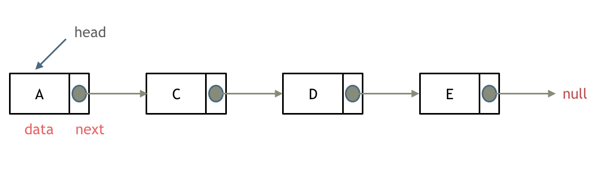
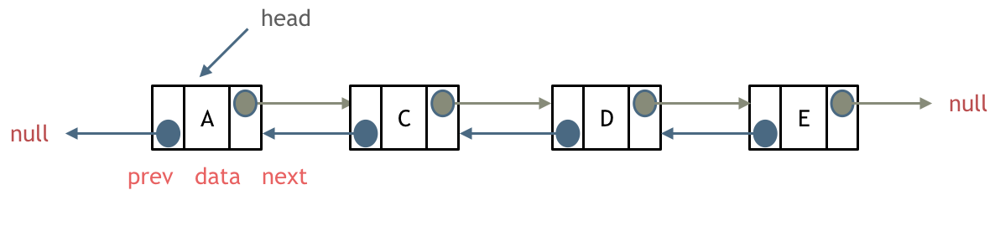
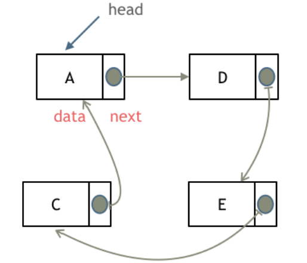
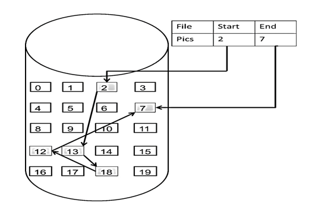
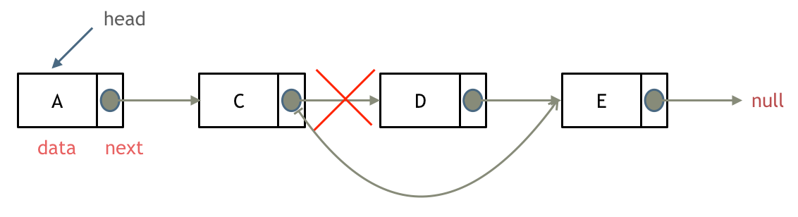
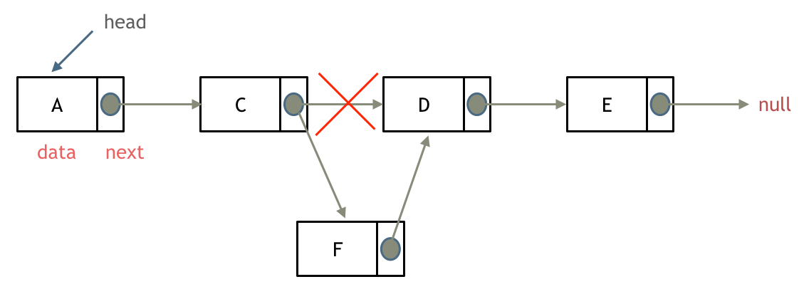
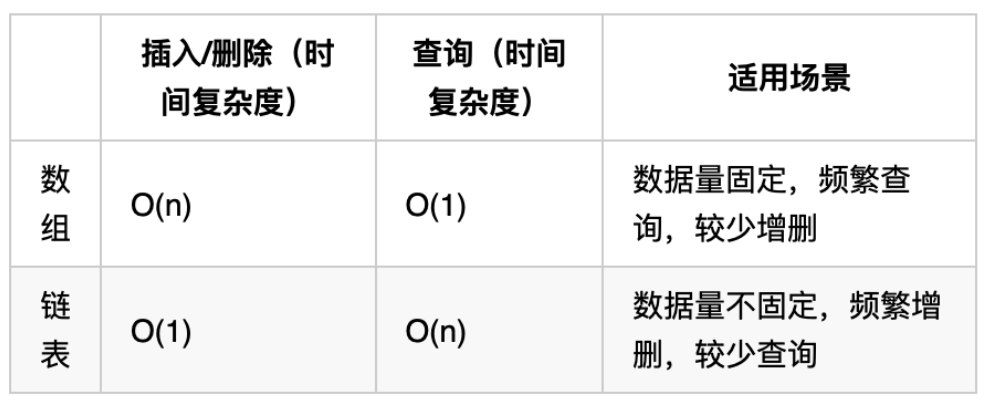
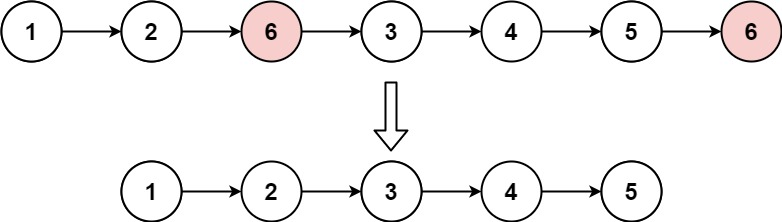
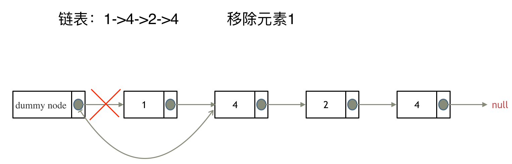

# 链表理论基础

## 一、概论

### 1.1 链表类型

单链表

每一个节点由两部分组成，一个是数据域一个是指针域（存放指向下一个节点的指针），最后一个节点的指针域指向null（空指针的意思）。链表的入口节点称为链表的头结点也就是head。




双链表

每一个节点有两个指针域，一个指向下一个节点，一个指向上一个节点。`既可以向前查询也可以向后查询`




循环链表

链表首尾相连，可以用来解决约瑟夫环问题。




### 1.2 链表存储方式

数组是连续分布存储，但链表是散乱分布。



这个链表起始节点为2， 终止节点为7， 各个节点分布在内存的不同地址空间上，通过指针串联在一起。


### 1.3 链表操作

删除节点

只要将C节点的next指针 指向E节点就可以了。




添加节点



可以看出链表的增添和删除都是O(1)操作，也不会影响到其他节点。

但是要注意，要是删除第五个节点，需要从头节点查找到第四个节点通过next指针进行删除操作，查找的时间复杂度是O(n)


### 1.4 性能对比




### 1.5 例题

#### 1.5.1 [移除链表元素](https://leetcode.cn/problems/remove-linked-list-elements/description/)

给你一个链表的头节点 `head` 和一个整数 `val` ，请你删除链表中所有满足 `Node.val == val` 的节点，并返回 **新的头节点** 。

**示例 1：**



```
输入：head = [1,2,6,3,4,5,6], val = 6
输出：[1,2,3,4,5]
```


思路：设置一个虚拟头结点进行删除，这样原链表的所有节点就都可以按照统一的方式进行移除了。最后return dummyNode->next



```javascript
var removeElements = function(head, val) {
    let dummyNode = new ListNode(0, head)
    let cursor = dummyNode
    while(cursor.next){
        if(cursor.next.val === val){  //目的是终端val节点，所以从该val节点的上一个节点开始截断
            cursor.next = cursor.next.next
            continue
        }
        cursor = cursor.next
    }
    return dummyNode.next
};
```


#### 1.5.2 [设计链表](https://leetcode.cn/problems/design-linked-list/description/)

你可以选择使用单链表或者双链表，设计并实现自己的链表。

单链表中的节点应该具备两个属性：`val` 和 `next` 。`val` 是当前节点的值，`next` 是指向下一个节点的指针/引用。

如果是双向链表，则还需要属性 `prev` 以指示链表中的上一个节点。假设链表中的所有节点下标从 **0** 开始。

实现 `MyLinkedList` 类：

- `MyLinkedList()` 初始化 `MyLinkedList` 对象。
- `int get(int index)` 获取链表中下标为 `index` 的节点的值。如果下标无效，则返回 `-1` 。
- `void addAtHead(int val)` 将一个值为 `val` 的节点插入到链表中第一个元素之前。在插入完成后，新节点会成为链表的第一个节点。
- `void addAtTail(int val)` 将一个值为 `val` 的节点追加到链表中作为链表的最后一个元素。
- `void addAtIndex(int index, int val)` 将一个值为 `val` 的节点插入到链表中下标为 `index` 的节点之前。如果 `index` 等于链表的长度，那么该节点会被追加到链表的末尾。如果 `index` 比长度更大，该节点将 **不会插入** 到链表中。
- `void deleteAtIndex(int index)` 如果下标有效，则删除链表中下标为 `index` 的节点。

**示例：**

```
输入
["MyLinkedList", "addAtHead", "addAtTail", "addAtIndex", "get", "deleteAtIndex", "get"]
[[], [1], [3], [1, 2], [1], [1], [1]]
输出
[null, null, null, null, 2, null, 3]

解释
MyLinkedList myLinkedList = new MyLinkedList();
myLinkedList.addAtHead(1);
myLinkedList.addAtTail(3);
myLinkedList.addAtIndex(1, 2);    // 链表变为 1->2->3
myLinkedList.get(1);              // 返回 2
myLinkedList.deleteAtIndex(1);    // 现在，链表变为 1->3
myLinkedList.get(1);              // 返回 3
```


思路

这道题目设计链表的五个接口：

- 获取链表第index个节点的数值
- 在链表的最前面插入一个节点
- 在链表的最后面插入一个节点
- 在链表第index个节点前面插入一个节点
- 删除链表的第index个节点

```javascript
class LinkNode {
    constructor(val, next) {
        this.val = val;
        this.next = next;
    }
}

var MyLinkedList = function() {
    this.size = 0
    this.tail = null
    this.head = null
};

MyLinkedList.prototype.getNode = function(index){
    if(index < 0 || index >= this.size) return null
    let cursor = new LinkNode(0, this.head)
    while(index-- >= 0){
        cursor = cursor.next
    }
    return cursor
}

/** 
 * @param {number} index
 * @return {number}
 */
MyLinkedList.prototype.get = function(index) {
    if(index < 0 || index >= this.size) return -1
    return this.getNode(index).val 
};

/** 
 * @param {number} val
 * @return {void}
 */
MyLinkedList.prototype.addAtHead = function(val) {
    const node = new LinkNode(val, this.head)
    this.head = node
    //考虑链表本身为空，则表尾也是该节点
    if(!this.tail){
        this.tail = node
    }
    this.size++
};

/** 
 * @param {number} val
 * @return {void}
 */
MyLinkedList.prototype.addAtTail = function(val) {
    const node = new LinkNode(val, null)
    this.size++
    if(this.tail){
        //如果tail本身为null 则null不存在next属性
        this.tail.next = node
        this.tail = node
        return
    }
    this.tail = node
    this.head = node
    
};

/** 
 * @param {number} index 
 * @param {number} val
 * @return {void}
 */
MyLinkedList.prototype.addAtIndex = function(index, val) {
    if(index > this.size) return 
    if(index <= 0){
        this.addAtHead(val)
        return
    }
    if(index === this.size){
        this.addAtTail(val)
        return
    }
    const node = this.getNode(index - 1)
    node.next = new LinkNode(val, node.next)
    this.size++
};

/** 
 * @param {number} index
 * @return {void}
 */
MyLinkedList.prototype.deleteAtIndex = function(index) {
    if(index < 0 || index >= this.size) return
    //如果是删除头结点
    if(index === 0){
        if(this.head){
            this.head = this.head.next
            this.size--
        }
        if(this.size === 1){
            this.tail = this.head
        }
        return
    }
    const node = this.getNode(index - 1)
    node.next = node.next.next
    //如果是删除尾节点
    if(index === this.size - 1){
        this.tail = node
    }
    this.size--
};
```

#### 1.5.3 [反转链表](https://leetcode.cn/problems/reverse-linked-list/?envType=study-plan-v2&envId=top-100-liked)

给你单链表的头节点 `head` ，请你反转链表，并返回反转后的链表。

**示例 1：**


```
输入：head = [1,2,3,4,5]
输出：[5,4,3,2,1]
```

```javascript
/**
 * Definition for singly-linked list.
 * function ListNode(val, next) {
 *     this.val = (val===undefined ? 0 : val)
 *     this.next = (next===undefined ? null : next)
 * }
 */
/**
 * @param {ListNode} head
 * @return {ListNode}
 */
var reverseList = function(head) {
    let pre = null, cur = head
    while(cur){
        const next = cur.next
        cur.next = pre
        pre = cur
        cur = next
    }
    return pre
};
```

