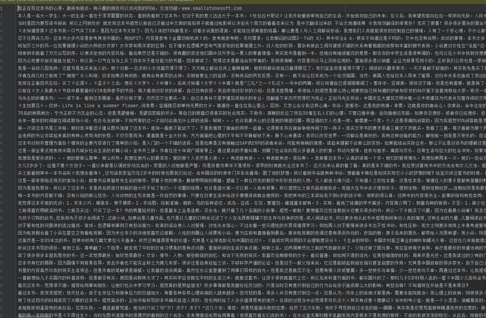
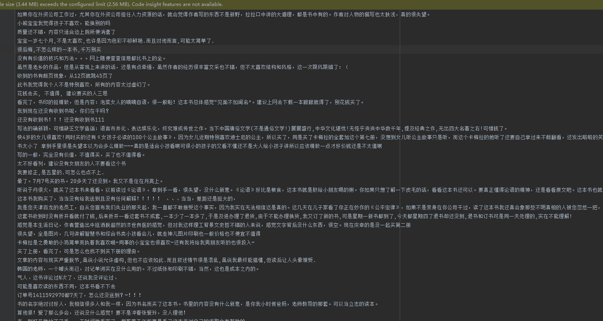
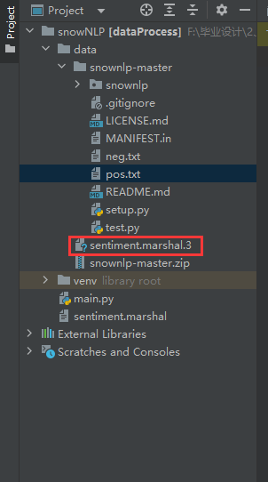

# snowNLP --情感分析

> https://github.com/isnowfy/snownlp
>
> blog = 'https://blog.csdn.net/BIT_666/article/details/135604736'

## 一、概述


## 二、使用

### 2.1 测试

```python
from snownlp import SnowNLP
 
def sentiment_analysis(text):
    # 使用SnowNLP对中文文本进行情感分析
    s = SnowNLP(text)
    # SnowNLP的sentiments方法返回情感倾向分数，越接近1表明情感越积极，越接近0表明情感越消极
    sentiment_score = s.sentiments
    return sentiment_score
```

直接调用 SnowNLP 方法获取中文文本情感，这里返回 sentiment_score，以 0.5 为界限，越接近于 1 越积极，反之越消极。

```python
text = "角色塑造太单调，毫无震撼力！"

score = sentiment_analysis(text)
print(f"情感分数: {score}")

if score > 0.5:
    print("该语句是积极的。")
else:
    print("该语句是消极的。")
```

### 2.2 自定义训练集

自定义 训练数据集 主要在原生 SnowNLP 无法满足自己场景的情况下，可以`自定义积极、消极的文本`，按行放置到 txt 文件中，供 sentiment 进行调整。下面以影视评价为例，pos 和 neg 各添加 100 条影评信息。

 **pos.txt**



neg.txt



```python
from snownlp import sentiment
 
def train_self_model():
    pos = "./pos.txt"
    neg = "./neg.txt"
    sentiment.train(neg, pos)
    sentiment.save("sentiment.marshal")
```

训练结束后会在输出目录得到一个 .marshal.3 的文件:



### 2.3 模型替换

要使用自己生成的 marshal 模型需要到 python site-package 库里把 SnowNLP sentiment 原始的 mershal.3 模型文件替换掉。

### 2.4 重新测试

略


## 三、SnowNLP原理

