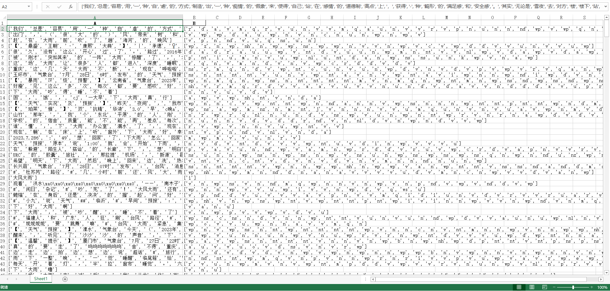

# LTP

> https://ltp.ai/
>
> https://www.bilibili.com/video/BV1RM411F7XA/?spm_id_from=333.880.my_history.page.click&vd_source=c3aed98126d5ffa7b2c72cf011d9383c

## 一、官网文档测试代码如下

```python
from ltp import StnSplit
from ltp import LTP


# 句子分词
# 返回的sents是数组
def split_sentence(name):
    sents = StnSplit().split(name)
    print(sents)
    # ['汤姆生病了。', '他去了医院。']


# 数组句子分词：如果句子过长，可以将一章内容分段落存储，并依次分句
def split_arr_sentence(arr: []):
    sents = StnSplit().batch_split(arr)
    print(sents)
    # ['他叫汤姆去拿外衣。', '汤姆生病了。', '他去了医院。']


# 单词分词
# pipeline 会返回元祖对象，对象每个要素为二维数组，分词结果标注r v nh等含义见附录-词性标注集
def split_arr_word():
    words = ltp.pipeline(
        [
            "全省天气预报#辽宁#28日早晨到傍晚，大连、抚顺、本溪、丹东、阜新、朝阳地区及康平、法库、岫岩、昌图、建昌有中雨到大雨，局部有暴雨，个别乡镇（街道）有大暴雨，其他地区有阵雨或雷阵雨，上述地区局部伴有短时强降水、雷暴大风、冰雹等强对流天气，最大小时降水量为40到80毫米，雷雨时最大瞬时风力8级到9级；全省最高气温27度到31度。28日夜间到29日白天，大连、丹东地区及岫岩有暴雨，局部有大暴雨，抚顺、本溪、营口、辽阳地区及鞍山市区、海城有中雨到大雨，局部有暴雨，其他地区有阵雨或雷阵雨，上述地区局部伴有短时强降水、雷暴大风、冰雹等强对流天气，最大小时降水量为40到80毫米，雷雨时最大瞬时风力8级到9级；全省最低气温22度到25度。29日夜间到30日白天，大连、本溪、丹东、营口、葫芦岛地区及岫岩有中雨到大雨，个别乡镇（街道）有暴雨，其他地区有阵雨或雷阵雨，上述地区局部伴有短时强降水、雷暴大风、冰雹等强对流天气。30日夜间，葫芦岛地区有中雨到大雨，大连、鞍山、锦州、营口、辽阳、朝阳、盘锦地区有阵雨或雷阵雨，其他地区多云。地质灾害风险预警信息：辽宁省自然资源厅与辽宁省气象局联合发布地质灾害气象风险预警信息。07月28日08时至07月28日20时"],
        tasks=["cws"], return_dict=False)
    print(words)
    # ([['全省', '天气', '预报', '#', '辽宁', '#', '28日', '早晨', '到', '傍晚', '，', '大连', '、', '抚顺', '、', '本溪', '、', '丹东', '、', '阜新', '、', '朝阳', '地区', '及康平', '、', '法库', '、', '岫岩', '、', '昌图', '、', '建昌', '有', '中雨', '到', '大雨', '，', '局部', '有', '暴雨', '，', '个别', '乡', '镇', '（', '街道', '）', '有', '大暴雨', '，', '其他', '地区', '有', '阵雨', '或', '雷阵雨', '，', '上述', '地区', '局部', '伴', '有', '短', '时', '强', '降水', '、', '雷暴', '大风', '、', '冰雹', '等', '强', '对流', '天气', '，', '最', '大', '小时', '降水量', '为', '40', '到', '80', '毫米', '，', '雷雨', '时', '最', '大', '瞬时', '风力', '8', '级', '到', '9', '级', '；', '全省', '最高', '气温', '27', '度', '到', '31', '度', '。', '28日', '夜间', '到', '29日', '白天', '，', '大连', '、', '丹东', '地区', '及', '岫岩', '有', '暴雨', '，', '局部', '有', '大暴雨', '，', '抚顺', '、', '本溪', '、', '营口', '、', '辽阳', '地区', '及', '鞍山', '市区', '、', '海城', '有', '中雨', '到', '大雨', '，', '局部', '有', '暴雨', '，', '其他', '地区', '有', '阵雨', '或', '雷阵雨', '，', '上述', '地区', '局部', '伴', '有', '短', '时', '强', '降水', '、', '雷暴', '大风', '、', '冰雹', '等', '强', '对流', '天气', '，', '最', '大小时', '降水量', '为', '40', '到', '80', '毫米', '，', '雷雨', '时', '最', '大瞬', '时', '风力', '8', '级', '到', '9', '级', '；', '全省', '最低', '气温', '22', '度', '到', '25', '度', '。', '29日', '夜间', '到', '30日', '白天', '，', '大连', '、', '本溪', '、', '丹东', '、营口', '、', '葫', '芦岛', '地区', '及', '岫岩', '有', '中雨', '到', '大雨', '，', '个别乡镇', '（', '街道', '）', '有暴雨', '，', '其他', '地区', '有', '阵雨', '或', '雷阵雨', '，', '上述', '地区', '局部', '伴', '有', '短时', '强', '降水', '、', '雷暴', '大风', '、', '冰雹', '等', '强', '对流', '天气', '。', '30日', '夜间', '，', '葫芦岛', '地区', '有', '中雨', '到', '大雨', '，', '大连', '、', '鞍山', '、', '锦州', '、', '营口', '、', '辽阳', '、', '朝阳', '、', '盘', '锦', '地区', '有', '阵雨', '或', '雷阵雨', '，', '其他', '地区', '多', '云', '。', '地质', '灾害', '风险', '预警', '信息', '：', '辽宁省', '自然', '资源厅', '与', '辽宁省气象局', '联合', '发布', '地质', '灾害', '气象风险', '预警', '信息', '。', '07月', '28日', '08时', '至', '07月', '28日', '20', '时']],)


# 词性标注
def split_arr_word_lab():
    result = ltp.pipeline(
        [
            "全省天气预报#辽宁#28日早晨到傍晚，大连、抚顺、本溪、丹东、阜新、朝阳地区及康平、法库、岫岩、昌图、建昌有中雨到大雨，局部有暴雨，个别乡镇（街道）有大暴雨，其他地区有阵雨或雷阵雨，上述地区局部伴有短时强降水、雷暴大风、冰雹等强对流天气，最大小时降水量为40到80毫米，雷雨时最大瞬时风力8级到9级；全省最高气温27度到31度。28日夜间到29日白天，大连、丹东地区及岫岩有暴雨，局部有大暴雨，抚顺、本溪、营口、辽阳地区及鞍山市区、海城有中雨到大雨，局部有暴雨，其他地区有阵雨或雷阵雨，上述地区局部伴有短时强降水、雷暴大风、冰雹等强对流天气，最大小时降水量为40到80毫米，雷雨时最大瞬时风力8级到9级；全省最低气温22度到25度。29日夜间到30日白天，大连、本溪、丹东、营口、葫芦岛地区及岫岩有中雨到大雨，个别乡镇（街道）有暴雨，其他地区有阵雨或雷阵雨，上述地区局部伴有短时强降水、雷暴大风、冰雹等强对流天气。30日夜间，葫芦岛地区有中雨到大雨，大连、鞍山、锦州、营口、辽阳、朝阳、盘锦地区有阵雨或雷阵雨，其他地区多云。地质灾害风险预警信息：辽宁省自然资源厅与辽宁省气象局联合发布地质灾害气象风险预警信息。07月28日08时至07月28日20时"],
        tasks=["cws", "pos"])
    print(result.pos)
    # [['n', 'n', 'v', 'wp', 'ns', 'wp', 'nt', 'nt', 'p', 'nt', 'wp', 'ns', 'wp', 'ns', 'wp', 'ns', 'wp', 'ns', 'wp', 'ns', 'wp', 'ns', 'n', 'c', 'wp', 'j', 'wp', 'ns', 'wp', 'ns', 'wp', 'v', 'v', 'n', 'p', 'n', 'wp', 'n', 'v', 'n', 'wp', 'a', 'n', 'n', 'wp', 'n', 'wp', 'v', 'n', 'wp', 'r', 'n', 'v', 'n', 'c', 'n', 'wp', 'b', 'n', 'n', 'v', 'v', 'a', 'n', 'a', 'n', 'wp', 'n', 'n', 'wp', 'n', 'u', 'a', 'v', 'n', 'wp', 'd', 'n', 'n', 'n', 'v', 'm', 'p', 'm', 'q', 'wp', 'n', 'n', 'd', 'a', 'nt', 'n', 'm', 'q', 'p', 'm', 'q', 'wp', 'n', 'a', 'n', 'm', 'q', 'v', 'm', 'q', 'wp', 'nt', 'nt', 'p', 'nt', 'nt', 'wp', 'ns', 'wp', 'ns', 'n', 'c', 'ns', 'v', 'n', 'wp', 'n', 'v', 'n', 'wp', 'ns', 'wp', 'ns', 'wp', 'ns', 'wp', 'ns', 'n', 'c', 'ns', 'n', 'wp', 'ns', 'v', 'n', 'v', 'n', 'wp', 'n', 'v', 'n', 'wp', 'r', 'n', 'v', 'n', 'c', 'n', 'wp', 'b', 'n', 'n', 'v', 'v', 'a', 'n', 'a', 'n', 'wp', 'n', 'n', 'wp', 'n', 'u', 'a', 'n', 'n', 'wp', 'd', 'a', 'n', 'v', 'm', 'p', 'm', 'q', 'wp', 'n', 'n', 'd', 'n', 'n', 'n', 'm', 'q', 'v', 'm', 'q', 'wp', 'n', 'a', 'n', 'm', 'q', 'p', 'm', 'q', 'wp', 'nt', 'nt', 'v', 'nt', 'nt', 'wp', 'ns', 'wp', 'ns', 'wp', 'ns', 'wp', 'wp', 'ns', 'ns', 'n', 'c', 'ns', 'v', 'n', 'v', 'n', 'wp', 'n', 'wp', 'n', 'wp', 'v', 'wp', 'r', 'n', 'v', 'n', 'c', 'n', 'wp', 'b', 'n', 'n', 'v', 'v', 'a', 'a', 'n', 'wp', 'n', 'n', 'wp', 'n', 'u', 'a', 'n', 'n', 'wp', 'nt', 'nt', 'wp', 'ns', 'n', 'v', 'n', 'v', 'n', 'wp', 'ns', 'wp', 'ns', 'wp', 'ns', 'wp', 'ns', 'wp', 'ns', 'wp', 'ns', 'wp', 'ns', 'ns', 'n', 'v', 'n', 'c', 'n', 'wp', 'r', 'n', 'a', 'n', 'wp', 'n', 'n', 'n', 'v', 'n', 'wp', 'ns', 'b', 'n', 'c', 'ns', 'v', 'v', 'n', 'n', 'n', 'v', 'n', 'wp', 'nt', 'm', 'm', 'p', 'nt', 'm', 'm', 'n']]


# 命名实体识别
def entity_identify():
    result = ltp.pipeline(["杜甫和李白在南京买辣条吃。"], tasks=["cws", "ner"])
    print(result.ner[0])
    # [[('Nh', '王阳明', 0, 0), ('Nh', '李白', 2, 2), ('Ns', '北京', 4, 4)]]
    # for item in result.ner[0]:
    #     if item[0] == 'Ns':
    #         print(item[1])

#


# Press the green button in the gutter to run the script.
if __name__ == '__main__':
    ltp = LTP()
    # split_sentence('汤姆生病了。他去了医院。')
    # split_arr_sentence(["他叫汤姆去拿外衣。", "汤姆生病了。他去了医院。"])
    # split_arr_word()
    # split_arr_word_lab()
    entity_identify()

```

:bulb: 最终反馈的结果内容含义
https://ltp.ai/docs/appendix.html


## 二、分词及词性标注

```python
import pandas as pd
from ltp import LTP
from tqdm import tqdm

# 读取Excel文件
def read_excel_file(file_path, sheet_name=0):
    return pd.read_excel(file_path, sheet_name=sheet_name)


# 使用LTP进行分词和词性标注
def process_text(text):
    ltp = LTP()
    result = ltp.pipeline([text], tasks=["cws", "pos"])
    return result


# 将处理结果写入新文件
def write_results_to_file(results):
    df = pd.DataFrame(columns=['A', 'B'])
    for index, sentence in enumerate(results):
        df.loc[index, 'A'] = sentence.cws[0]
        df.loc[index, 'B'] = sentence.pos[0]
    df.to_excel('0803_other_output.xlsx', index=False)

# 主函数
def main():
    # 读取Excel文件
    excel_file = '0803_其他区域8245.xlsx'  # Excel文件路径
    df = read_excel_file(excel_file)

    # 提取source列
    source_texts = df['微博正文'].tolist()

    # 存储处理结果
    processed_results = []

    # 使用LTP进行处理
    for text in tqdm(source_texts):
        pos_result = process_text(text)
        processed_results.append(pos_result)

    write_results_to_file(processed_results)


if __name__ == "__main__":
    main()

```



:bulb: 后续可用这些词性如Ns 、 Ni 适当提取地名

