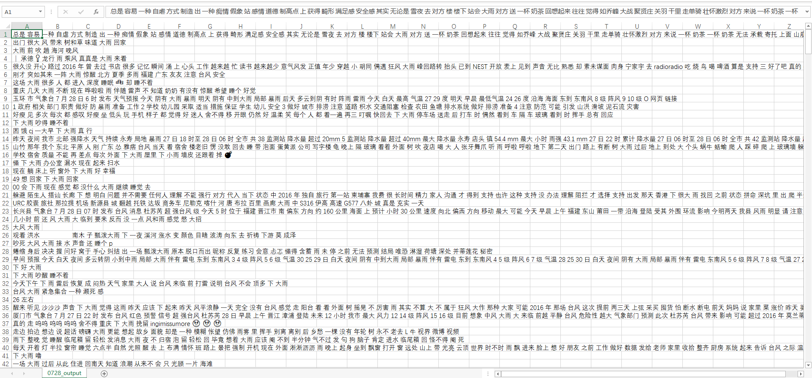

# jieba

> https://blog.csdn.net/weixin_41168304/article/details/121707533?spm=1001.2014.3001.5501
>


```python
import jieba
import re
import csv


# 创建停用词列表
def stopwordslist():
    stopwords = [line.strip() for line in open('F:/毕业设计/2、硕士毕业设计/6、Project/jieba/Chinese_stop_words.txt', encoding='UTF-8').readlines()]
    return stopwords


def processing(text):
    """
    数据清洗, 可以根据自己的需求进行重载
    """
    # 去除 @的用户名 这行代码使用正则表达式 @.+?( |$) 匹配以 @ 开始，后跟任意字符（懒惰匹配，即尽可能少的字符），直到遇到空格或字符串结束。这通常用于去除文本中的用户名，例如 @username。
    text = re.sub("@.+?( |$)", "", text)
    # 去除 【xx】 匹配以中文括号 【 开始和结束的任意字符（懒惰匹配），用于去除文本中的特定格式内容，如 【内容】。
    text = re.sub("【.+?】", "", text)
    # 去除微博用户的名字
    text = re.sub(".*?:", "", text)
    # 去除话题 使用正则表达式 #.*# 匹配以 # 开始和结束的任意字符序列。这通常用于去除话题引用
    text = re.sub("#.*#", "", text)
    # 去除换行符 将文本中的所有换行符 \n 替换为空字符串，即删除所有换行符。
    text = re.sub("\n", "", text)
    return text


# 对句子进行中文分词
def seg_depart(sentence):
    jieba.load_userdict('F:/毕业设计/2、硕士毕业设计/6、Project/jieba/保留词.txt')
    sentence_depart = jieba.cut(sentence.strip())
    print(sentence_depart)
    stopwords = stopwordslist()  # 创建一个停用词列表
    outstr = ''  # 输出结果为outstr
    for word in sentence_depart:  # 去停用词
        if word not in stopwords:
            if word != '\t':  # 制表符
                outstr += word
                outstr += " "
    return outstr


if __name__ == '__main__':
    # 给出文档路径
    filename = "F:/毕业设计/2、硕士毕业设计/6、Project/jieba/0803_其他区域8245.csv"  # 原文档路径
    outputs = open("F:/毕业设计/2、硕士毕业设计/6、Project/jieba/分词结果/0803_other_output.csv", 'w', encoding='utf-8')  # 输出文档路径
    with open(filename, 'r', encoding='utf-8') as csvfile:
        reader = csv.reader(csvfile, delimiter=',', quotechar='"', doublequote=False)
        for line in reader:
            print(line[0])  # 微博在文档的第一列
            line = processing(line[0])
            line_seg = seg_depart(line)
            outputs.write(line_seg + '\n')
    outputs.close()
    print("分词成功！！！")

```


