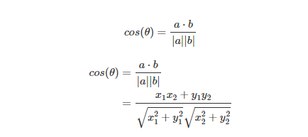
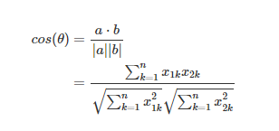

# word2Vec

> 用特征向量表示单词的技术，且每两个词向量可计算余弦相似度表示他们之间的关系。
>
> 实现方法
>
> - Skip-Gram（跳元模型） -- 中心词预测周围词
> - CBOW（Continues Bag of Words）-- 周围词预测中心词
>
> 算法优化方法
>
> - 负例采样
> - 层序Softmax（Hierarchical Softmax）


二维平面的两个向量余弦相似度

A(x1,y1)、B(x2,y2)，则相似度计算公式如下 cosine_similarity(A,B) = 



n维空间的两个向量余弦相似度

A(x11,x12,...,x1n)，B(x21,x22,...,x2n)，则相似度计算公式如下 cosine_similarity(A,B) = 



:bulb: 余弦相似度的取值范围为 [−1,1]，余弦越大表示两个向量的夹角越小，余弦越小表示两向量的夹角越大。当两个向量的方向重合时余弦取最大值 1，当两个向量的方向完全相反余弦取最小值 -1


```

```

